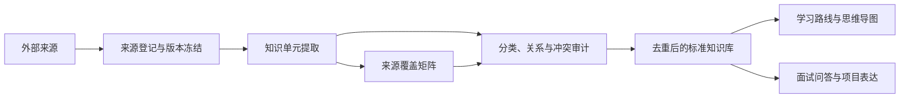

# AI-Learn

面向 AI 应用开发、系统学习与面试复习的结构化知识库。

本项目不把外部文章简单堆在一起，而是按照“来源可追踪、知识可去重、结论可审计、内容可复习”的方式，将 LLM、Prompt、RAG、Agent、Tools、协议、框架与工程实践整理成统一知识体系。

## 当前阶段

RAG 是第一套端到端试点，用来验证整个知识整理流程。

- [x] 建立仓库目录和公开发布边界
- [x] 固定首批来源及 Commit
- [x] 建立 AI 一级分类
- [x] 建立标准知识文档模板
- [x] 建立 RAG 一级知识分类和验收规则
- [x] 完成 RAG 来源单元全量盘点（658 个来源单元）
- [x] 建立 RAG 原子知识目录（183 个待审计原子）
- [ ] 完成 RAG 知识原子化、去重和冲突审计
- [ ] 完成 RAG 标准知识正文
- [ ] 生成 RAG 学习路线、思维导图和复习资料
- [ ] 生成 RAG 面试题、追问和项目场景

## 知识生产流程



## 目录

| 目录 | 作用 |
|---|---|
| `sources/` | 来源、Commit、许可状态和纳管范围 |
| `taxonomy/` | AI 领域分类、知识点 ID 和关系规范 |
| `knowledge/` | 经过去重和审计的标准知识正文 |
| `learning/` | 学习路线、思维导图、速查与复习资料 |
| `interview/` | 面试题、追问、口述模板和项目场景 |
| `audits/` | 来源覆盖、去重、冲突、版本和遗漏检查 |
| `templates/` | 标准知识文档与来源审计模板 |
| `scripts/` | 来源盘点、索引生成和仓库校验脚本 |

## 首批来源

1. [SodaWWater/xiaolin-ai-learning](https://github.com/SodaWWater/xiaolin-ai-learning)
2. [bcefghj/ai-agent-interview-guide](https://github.com/bcefghj/ai-agent-interview-guide)
3. [adongwanai/AgentGuide](https://github.com/adongwanai/AgentGuide)

具体版本和纳管策略见 [`sources/registry.json`](sources/registry.json)。

RAG 当前盘点见 [`audits/rag/source-units.md`](audits/rag/source-units.md)，原子知识目录见 [`knowledge/rag/catalog.md`](knowledge/rag/catalog.md)。

## 内容边界

- 原始来源与自己的标准知识正文分开管理。
- 不直接镜像未明确授权的整篇文章、图片或 PDF。
- 标准知识正文使用自己的组织和表述，并保留来源定位。
- 只有语义完全等价的知识单元才标记为 `duplicate` 并合并。
- 补充、实现、比较、冲突和版本差异不得作为重复内容删除。
- 变化较快的内容必须记录审核日期、适用版本和一手资料。

## 本地校验

```bash
python scripts/validate_repo.py
```

RAG 全量整理完成后使用严格验收：

```bash
python scripts/validate_repo.py --strict-rag
```

## 发布说明

本仓库计划公开发布。外部资料仍归各自作者所有；未明确许可的来源只登记链接、版本和知识映射，不重新发布完整原文。仓库级许可证将在原创内容与第三方材料边界完成审计后再决定。
