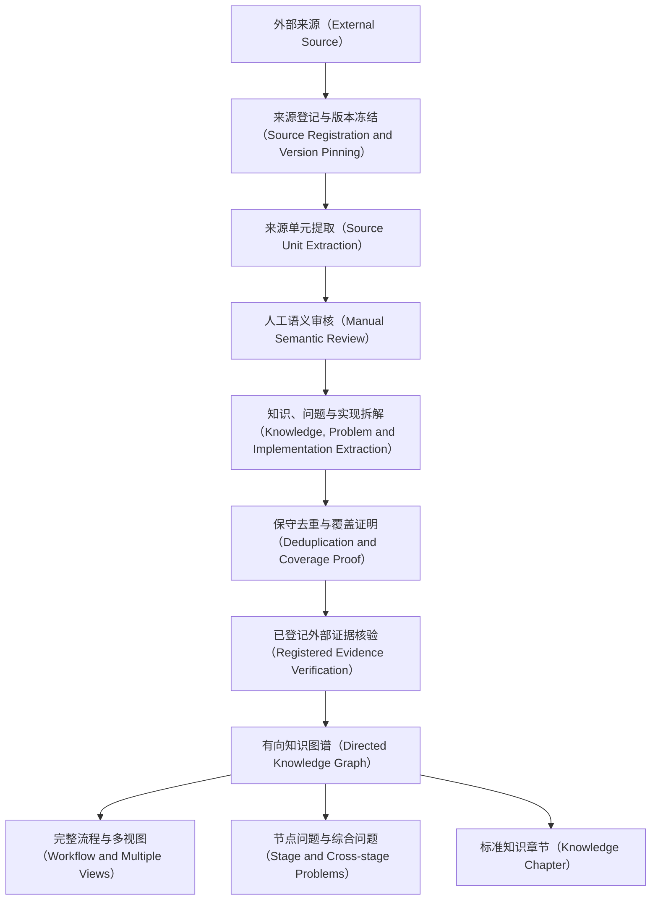

# AI-Learn

面向 AI 应用开发、系统学习与面试复习的结构化知识库。

本项目不把外部文章简单堆在一起，而是按照“来源可追踪、知识可去重、结论可审计、内容可复习”的方式，将 LLM、Prompt、RAG、Agent、Tools、协议、框架与工程实践整理成统一知识体系。

## 当前阶段

RAG 是第一套端到端试点，用来验证整个知识整理流程。

项目目标、信息架构、阶段规划和验收标准见 [`docs/PROJECT_PLAN.md`](docs/PROJECT_PLAN.md)。其他 Agent 开始工作前必须先阅读 [`AGENTS.md`](AGENTS.md)、机器可读状态 [`audits/rag/work-status.json`](audits/rag/work-status.json) 和 [`docs/LOCAL_AGENT_HANDOFF.md`](docs/LOCAL_AGENT_HANDOFF.md)。

- [x] 建立仓库目录和公开发布边界
- [x] 固定首批来源及 Commit
- [x] 建立 AI 一级分类
- [x] 建立标准知识文档模板
- [x] 建立 RAG 一级知识分类和验收规则
- [x] 完成 RAG 来源单元全量盘点（695 个来源单元）
- [x] 建立 RAG 原子知识目录（当前 190 个待审计原子，审核中可保守新增）
- [x] 完成 18 个流程节点的三轮外部检索（第四轮 4/18 作为历史检查点）
- [ ] 完成 653 个语义单元的人工审核（已完成 189 个，剩余 464 个）
- [ ] 完成 RAG 知识原子化、去重和冲突审计
- [x] 完成新版项目规划、双语术语规范、图模型和协作基线
- [x] 按当前用户确认范围扩充 RAG 公开面试题、工程问题和一手技术来源
- [ ] 建立底层有向知识图谱（Directed Knowledge Graph）
- [ ] 重写 RAG 标准知识正文（旧 RAG-01 至 RAG-03 已标记为待重写草稿）
- [ ] 生成完整流程、全局地铁图和多种局部学习视图
- [ ] 生成 RAG 面试题、追问和项目场景

## 知识生产流程



## 目录

| 目录 | 作用 |
|---|---|
| `sources/` | 来源、Commit、许可状态和纳管范围 |
| `taxonomy/` | AI 领域分类、知识点 ID 和关系规范 |
| `knowledge/` | 经过去重和审计的标准知识正文 |
| `learning/` | 学习路线、思维导图、速查与复习资料 |
| `interview/` | 有公开出处的面试题、追问和项目场景映射 |
| `audits/` | 来源覆盖、去重、冲突、版本和遗漏检查 |
| `templates/` | 标准知识文档与来源审计模板 |
| `scripts/` | 来源盘点、索引生成和仓库校验脚本 |
| `docs/` | 项目整体规划、协作和交接说明 |

## 首批来源

1. [SodaWWater/xiaolin-ai-learning](https://github.com/SodaWWater/xiaolin-ai-learning)
2. [bcefghj/ai-agent-interview-guide](https://github.com/bcefghj/ai-agent-interview-guide)
3. [adongwanai/AgentGuide](https://github.com/adongwanai/AgentGuide)

具体版本和纳管策略见 [`sources/registry.json`](sources/registry.json)。

RAG 当前盘点见 [`audits/rag/source-units.md`](audits/rag/source-units.md)，原子知识目录见 [`knowledge/rag/catalog.md`](knowledge/rag/catalog.md)。

当前统一术语见 [`knowledge/rag/TERMINOLOGY.md`](knowledge/rag/TERMINOLOGY.md)，知识图谱受控模型见 [`taxonomy/rag-graph-model.json`](taxonomy/rag-graph-model.json)。

## 内容边界

- 原始来源与自己的标准知识正文分开管理。
- 不直接镜像未明确授权的整篇文章、图片或 PDF。
- 标准知识正文使用自己的组织和表述，并保留来源定位。
- 只有语义完全等价的知识单元才标记为 `duplicate` 并合并。
- 补充、实现、比较、冲突和版本差异不得作为重复内容删除。
- 变化较快的内容必须记录审核日期、适用版本和一手资料。

## 本地校验

```bash
python scripts/validate_repo.py
```

RAG 全量整理完成后使用严格验收：

```bash
python scripts/validate_repo.py --strict-rag
```

## 发布说明

本仓库计划公开发布。外部资料仍归各自作者所有；未明确许可的来源只登记链接、版本和知识映射，不重新发布完整原文。仓库级许可证将在原创内容与第三方材料边界完成审计后再决定。
