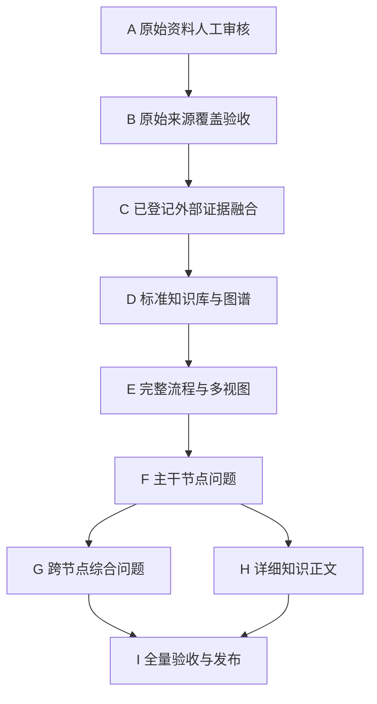

# 检索增强生成（Retrieval-Augmented Generation，RAG）完整执行路线图

> 状态：`authoritative / direction_locked`
> 更新日期：2026-09-03
> 用途：锁定从来源审核到正式学习资料发布的完整顺序，防止执行 Agent 因局部任务而改变方向。

## 1. 最终交付目标

本试点最终交付的不是题目拼接或单张超大图，而是一套来源可追踪、信息不丢失、可沿工程问题学习的检索增强生成（Retrieval-Augmented Generation，RAG）知识网络，包括：

1. 去重后的标准知识库（Canonical Knowledge Base）；
2. 当前完整检索增强生成流程（RAG Workflow）前置学习内容；
3. 一张全局地铁图（Global Metro Map）；
4. 多张主干图、跨主干重叠图、节点局部图和问题路径图；
5. 按 18 个主干节点排列的工程问题/公开面试题（Engineering Problem / Public Interview Question）；
6. 跨节点综合问题和系统设计问题；
7. 每个知识点的“概要 → 原理 → 实际开发位置和使用方式 → 具体技术或框架实现”详细正文；
8. 来源覆盖、知识覆盖、问题覆盖、图关系、冲突和时效审计报告。

## 2. 不可跳跃的阶段状态机

后继阶段只有在前置质量门通过后才能开始。允许修正上一阶段证据，不允许跳过质量门后用正文反推来源。

## 3. 阶段与工作包

| 阶段 | 工作包 | 核心工作 | 进入条件 | 完成条件 |
|---|---|---|---|---|
| A | `WP-P2-003` | 依次审核阶段起始的 522 个原始来源语义单元 | 三轮外部搜索已完成并暂停 | 653/653 语义单元均有显式人工判断 |
| B | `WP-P2-004` | 生成双向来源覆盖、排除、重复、部分重叠和跨节点报告 | `WP-P2-003` 完成 | 原始来源覆盖率 100%，无无去向单元 |
| C | `WP-P2-005` | 用现有 170 个外部来源核验事实、版本、冲突和时效，整理 26 条公开题目线索 | `WP-P2-004` 完成 | 每条待发布技术结论有合适证据等级，题目来源类型明确 |
| D1 | `WP-P3-001` | 形成去重后的标准知识原子、方案、实现、评估和问题节点 | `WP-P2-005` 完成 | 只过滤完全重复信息，独有条件全部保留 |
| D2 | `WP-P3-002` | 建立有向知识图谱（Directed Knowledge Graph）节点和关系 | `WP-P3-001` 完成 | 来源、知识、问题、方案、实现和评估形成可追踪关系 |
| D3 | `WP-P3-003` | 执行孤立节点、无来源节点、冲突和反向映射审计 | `WP-P3-002` 完成 | 不存在未说明的孤立或无来源正式节点 |
| E1 | `WP-P4-001` | 编写完整流程前置学习内容 | `WP-P3-003` 完成 | 离线、在线、评估反馈和生产治理主干完整 |
| E2 | `WP-P4-002` | 生成全局、主干、重叠、执行路径和节点局部图 | `WP-P4-001` 完成 | 多张图均来自同一图数据，节点关系方向明确 |
| F | `WP-P5-001` | 按 18 个主干节点生成工程问题和公开面试题页面 | `WP-P4-002` 完成 | 每题可追踪来源，并连接现象、根因、方案、实现、验证和知识 |
| G | `WP-P6-001` | 生成跨节点综合问题和系统设计问题 | `WP-P5-001` 完成 | 每题明确连接多个节点，不复制底层知识正文 |
| H | `WP-P7-001` | 按四段式标准重写和补全详细知识章节 | `WP-P3-003`、`WP-P5-001` 完成 | 原理与实际开发自然结合，并可双向跳转相关问题 |
| I | `WP-P8-001` | 执行全部严格验收并发布当前版本 | `WP-P6-001`、`WP-P7-001` 完成 | 全部质量门通过，未完成项清零或明确进入下一版本 |

## 4. 当前阶段 A 的固定审核顺序

| 顺序 | 来源 | 阶段 A 起始待审语义单元 | 说明 |
|---:|---|---:|---|
| 1 | `xiaolin-ai-learning` | 110 | 用户当前主要学习来源，优先完整吸收 |
| 2 | `ai-agent-interview-guide` | 66 | 补充系统化知识和面试题结构 |
| 3 | `agent-guide` | 346 | 补充智能体（Agent）、评估（Evaluation）、框架和跨主干内容 |
| 4 | `user-rag-experience-pdf` | 0 | 37/37 已完成，不重复审核 |

每批目标为 20～30 个来源单元，但按问题或章节完整边界调整。每批完成后立即更新机器状态、覆盖报告、下一游标、校验结果和 Git Commit（Git 提交）。

实时剩余数量和当前游标以 `audits/rag/manual-review-status.json` 为准，本表只保留阶段 A 的起始基线。

## 5. 阶段 C 的证据融合规则

阶段 C 不重新开启无边界搜索，只使用已经登记在 `sources/rag-current-sources.json` 的 170 个来源：

- 官方文档、官方代码仓库和原始论文用于技术事实；
- 工程实践用于特定环境下的实现与失败边界；
- 第一人称面经用于证明题目真实出现过；
- 公开题库和二次索引只作为题目线索，不充当技术结论的唯一证据；
- 发现原始来源结论过时、冲突或过度概括时，保留原始说法的来源关系，同时在规范知识中写明校正和适用范围。

只有用户再次明确授权时，才能恢复新的外部搜索。

## 6. 阶段 E 的多图产出清单

不得只生成一张覆盖全部细节的图。至少包含：

1. 全局地铁图（Global Metro Map）：只展示主干和换乘节点；
2. 离线知识构建主干图（Offline Knowledge Construction Map）；
3. 在线查询与生成主干图（Online Query and Answering Map）；
4. 评估反馈主干图（Evaluation and Feedback Map）；
5. 生产治理主干图（Production Governance Map）；
6. 向量数据库（Vector Database）、智能体（Agent）、提示工程（Prompt Engineering）与检索增强生成（Retrieval-Augmented Generation，RAG）的重叠图；
7. 用户问题执行路径图（User Query Execution Path）；
8. 每个复杂节点的一至两跳局部图（Local Node Map）；
9. 典型工程问题的反向定位路径图（Engineering Problem Diagnosis Path）。

每张图必须表达关系类型或方向，不能只把名词排列成树。

## 7. 阶段 F 的固定问题顺序

节点问题严格按以下顺序生产：

1. 数据摄取（Data Ingestion）；
2. 文档解析（Document Parsing）；
3. 数据治理（Data Governance）；
4. 文本切分（Chunking）；
5. 向量嵌入（Embedding）；
6. 存储与索引（Storage and Indexing）；
7. 查询理解（Query Understanding）；
8. 查询改写（Query Rewrite）；
9. 查询路由（Query Routing）；
10. 检索（Retrieval）；
11. 结果融合（Result Fusion）；
12. 重排（Reranking）；
13. 上下文组装（Context Assembly）；
14. 答案生成（Answer Generation）；
15. 引用与验证（Citation and Verification）；
16. 评估（Evaluation）；
17. 生产治理（Production Governance）；
18. 高级检索增强生成（Advanced RAG）。

主干节点题全部完成后，才能进入跨节点综合问题。

## 8. 防跑偏控制

每次开始工作前：

1. 读取 `audits/rag/work-status.json` 的 `next_action`；
2. 确认依赖工作包已经完成；
3. 确认没有其他工作包同时处于 `in_progress`；
4. 只修改本工作包允许的文件；
5. 不扩大来源范围，不改变内容结构，不调整术语规则。

每次结束工作前：

1. 更新当前工作包实际产出；
2. 更新机器状态和人类可读覆盖报告；
3. 写明尚未验证的假设和冲突；
4. 运行普通校验和差异检查；
5. 创建小型恢复检查点；
6. 只有满足完成条件时才把 `next_action` 切换到下一工作包。

如果任何临时想法与本路线图冲突，先停止执行并更新规划；不得在内容文件中暗中改变方向。

## 9. 最终验收顺序

1. 原始来源覆盖验收；
2. 外部事实和时效证据验收；
3. 保守去重与冲突验收；
4. 知识图谱（Knowledge Graph）节点和关系验收；
5. 多图覆盖和可读性验收；
6. 主干节点问题和跨节点问题验收；
7. 详细知识章节的原理、开发位置、实现和双向链接验收；
8. 双语术语、来源许可、本地链接和严格脚本验收；
9. 生成当前版本发布说明，并明确以后需要按日期更新的动态知识。
