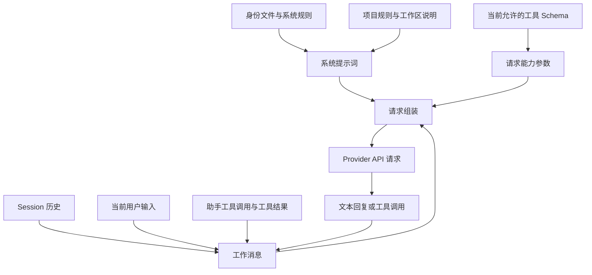
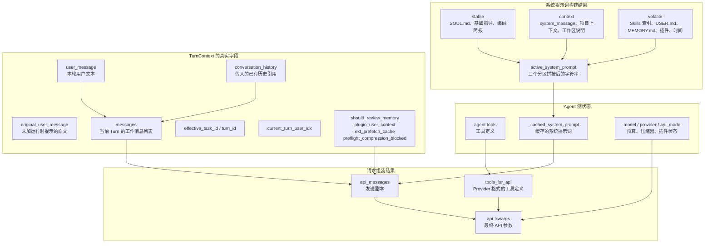
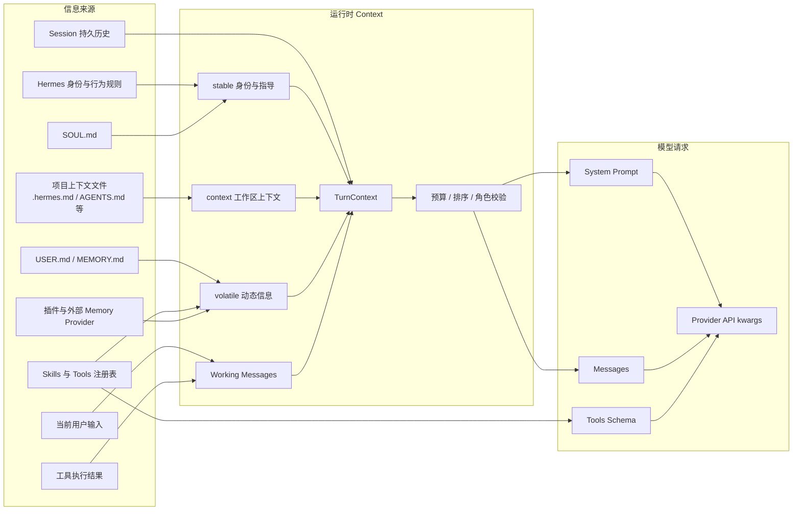
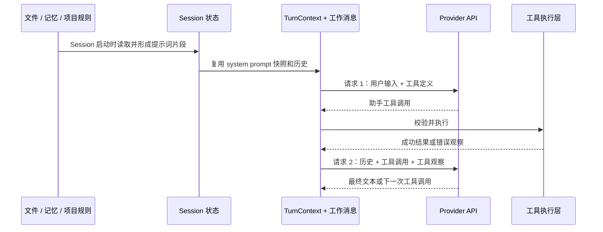
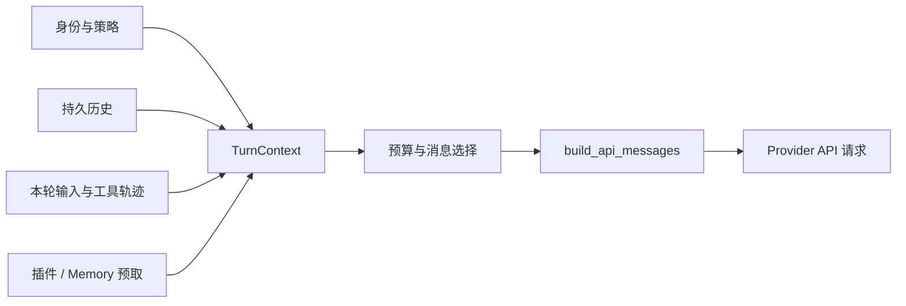
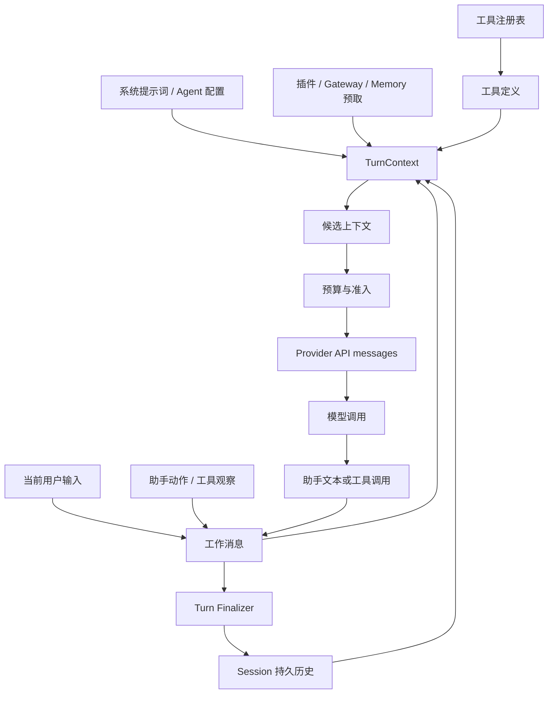
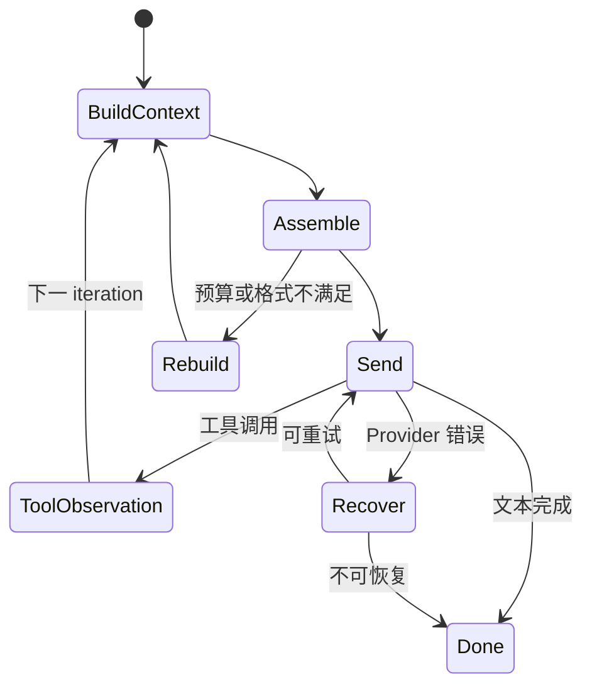

# 第 4 章：上下文工程与请求组装

## 1. 问题与边界

模型每次调用只看到一次请求消息。Hermes 必须在调用前把系统身份、持久会话历史、本轮输入、工具轨迹、动态插件信息和输出约束组合起来，再转换成 Provider API 能接受的消息结构。本章解释这条组装链。

本章研究“本次请求发送什么”。上下文压缩、会话轮换和恢复属于第 5 章；长期记忆的存储、同步和审查属于第 6 章；工具注册和执行属于第 7 章。第一组材料中的 `04-完整轨迹与概念校正` 作为前三章综合案例，不占用本章编号。

## 2. 先建立一个可以反复使用的整体模型

先把 Context 理解成一次“准备模型工作材料”的过程，而不是一个神秘的大对象。Hermes 每次准备请求时，依次回答四个问题：

1. **模型应该遵守什么规则？** 读取身份、行为规则和项目规则，形成系统提示词。
2. **模型需要知道之前发生过什么？** 读取 Session 历史，并加入本轮用户消息和已经发生的工具轨迹。
3. **模型现在可以做什么？** 把当前允许使用的工具 Schema 和 Skills 索引交给模型。
4. **这次请求怎样发送？** 按 Provider 要求复制、清理和转换，形成最终 API 请求。

用一个具体例子看：用户说“读取 notes.txt 并总结”。模型第一次请求只知道这句话和 `read_file` 工具的使用说明；模型返回工具调用后，Hermes 执行文件读取；文件内容进入工作消息；第二次请求才把“用户要求 + 工具调用 + 工具结果”一起发送给模型。模型看到的每一次请求，都是当时状态重新组装出的副本。



后文每个模块都用同一套问题解释：它从哪里来、装的是什么、什么时候加入、模型能否看到、是否写入历史、下一次请求是否还能恢复。

### 本章先记住的术语

| 术语 | 中文理解 | 作用 |
|---|---|---|
| Context | 本次模型调用前准备的全部工作材料 | 决定模型这一次能看到什么 |
| System prompt | 系统提示词 | 规定身份、规则和工作环境 |
| History | 已保存的会话历史 | 提供过去发生过的事实 |
| Working messages | 当前 Turn 的工作消息 | 记录本轮不断增加的工具轨迹 |
| Tool Schema | 工具接口说明 | 告诉模型可以调用哪个工具、参数怎么写 |
| Provider request | 发给模型服务的请求副本 | 把内部状态转换成具体 API 格式 |

其中 `Context` 是一个工程过程和概念集合；`TurnContext` 是源码里的一个 Python 数据对象；最终发给模型的是 Provider request。三者相关，但名称不能互换。

## 3. Context 里面究竟有什么

Context 不是一个“把所有文本放进去的变量”，而是一组来源不同、生命周期不同的输入。学习时先不要从类名背起，而要问五个问题：这条信息由谁产生？服务哪个决策？在哪个阶段加入？是否会写入历史？下一次请求还能不能看到？

### 3.1 Context 本身的内部组成

下面先把三个层次分开，再看它们怎样汇合。这样可以避免把“Context 工程”“`TurnContext` 类”和“最终 API 请求”误看成同一个对象。



这张图中的对应关系是：`TurnContext` 只有图中 Turn 区域列出的真实字段；`stable/context/volatile` 是系统提示词内部的三个文本分区；`agent.tools`、缓存和模型配置主要属于 Agent 侧状态；`api_messages`、`tools_for_api`、`api_kwargs` 是请求组装阶段的发送副本。它们通过函数连接，但不是一棵官方对象字段树。

```text
本次请求的 Context（工程过程 / 概念集合，不是一个源码类）
│
├── 1. 指令文本 → 最终成为 Provider 的 system
│   ├── active_system_prompt（源码产物：一个字符串）
│   ├── stable：SOUL.md、基础指导、编码简报
│   ├── context：system_message、项目上下文、工作区说明
│   ├── volatile：Skills 索引、USER.md 快照、MEMORY.md 快照、插件段、时间行
│   └── 缓存：_cached_system_prompt / _cached_system_prompt_static
│
├── 2. 对话轨迹 → 最终成为 Provider 的 messages
│   ├── 「对话轨迹」是教学模块名，不是 TurnContext 字段
│   ├── conversation_history：本轮开始时的已落盘基线，不单独发给模型
│   ├── messages：历史拷贝 + 本轮 user + 后续 tool 轮的工作稿
│   └── SessionDB messages 表：active=1 活动行；active=0、compacted=1 已归档行
│
├── 3. 能力与环境 → 最终成为 Provider 的 tools + api_kwargs
│   ├── agent.tools / tools_for_api：read_file、skill_view、terminal 等函数 Schema
│   ├── 工作区快照 / cwd
│   ├── Provider 配置：model / api_mode / …
│   └── Skills 索引不在这里；这里只有 skill_view 等函数定义
│
├── 4. 运行控制 → 通常不发给模型
│   ├── turn_id / effective_task_id / current_turn_user_idx
│   ├── 预算、压缩器、preflight_compression_blocked
│   └── plugin_user_context / ext_prefetch_cache
│
└── 组装结果（不是 TurnContext 字段）
    ├── api_messages：messages 的发送副本
    ├── tools_for_api：Schema 的 Provider 格式
    └── api_kwargs：最终 API 参数
```

`Context` ≠ `TurnContext` ≠ Provider request。树中带源码标识符的是真字段或真实文件；“对话轨迹”和“活动行”是教学名称。Skills 索引、工具定义和 `SKILL.md` 正文分别位于 system、tools 和后续 tool result 三条路径。

从学习角度，Context 的“内部组成”应当按用途分成四类：

| 类别 | 实际承载物 | 主要作用 | 最终去向 |
|---|---|---|---|
| 指令文本 | `stable`、`context`、`volatile`、`active_system_prompt` | 告诉模型身份、规则、工作区和可用能力 | `system` 消息 |
| 对话轨迹 | `conversation_history`、`messages` | 让模型看到用户、助手和工具之间已经发生的内容 | `messages` |
| 能力与环境 | `agent.tools`、工作区快照、Provider 配置 | 决定模型能请求什么以及请求如何发送 | `tools` 和 API 参数；Skills 索引属于 `volatile` |
| 运行控制 | Turn 标识、预算、压缩标志、插件预取、钩子数据 | 决定本次请求如何构造、校验和恢复 | 可能只留在运行时，不一定发给模型 |

因此，前面出现的 `history_snapshot`、`working_messages`、`runtime_controls` 等词只能作为解释用的类别名，不能再当作源码字段使用。正文以下统一以真实字段名为准。

### 一个可读的 Context 实例：JSON 只是教学快照

`TurnContext` 是 Python `dataclass`，Hermes 不会把下面这整个对象原样序列化后发送给模型。为了让字段、来源和最终去向一一对应，下面给出一个“组装中间态”的教学快照；其中 `system_prompt_parts`、`tools` 和 `runtime_controls` 是旁边的运行时信息，不是假定的 `TurnContext` 字段。

```json
{
  "turn_context": {
    "user_message": "读取 notes.txt，并总结其中的发布步骤",
    "original_user_message": "读取 notes.txt，并总结其中的发布步骤",
    "messages": [
      {"role": "user", "content": "读取 notes.txt，并总结其中的发布步骤"},
      {"role": "assistant", "tool_calls": [{"id": "call_01", "function": {"name": "read_file", "arguments": "{\\"path\\":\\"notes.txt\\"}"}}]},
      {"role": "tool", "tool_call_id": "call_01", "content": "发布前先备份数据库；完成迁移后重启服务。"}
    ],
    "conversation_history": "由 SessionDB 恢复的历史列表（本例只展示当前可见部分）",
    "active_system_prompt": "stable + context + volatile 拼接后的完整字符串",
    "effective_task_id": "task_20260912_001",
    "turn_id": "turn_0007",
    "current_turn_user_idx": 0,
    "should_review_memory": false,
    "plugin_user_context": "本轮插件 pre_llm_call 没有追加内容",
    "ext_prefetch_cache": "外部 Memory 返回：用户偏好先给结论再给步骤",
    "preflight_compression_blocked": false
  },
  "system_prompt_parts": {
    "stable": "身份：Hermes Agent。规则：使用工具前说明目的；不要伪造文件内容。编码简报：先检查再修改。",
    "context": "项目上下文（AGENTS.md）：运行 Python 测试使用 pytest；不要修改 audits/ 下的历史证据。",
    "volatile": "## Skills\n- hermes-agent: …\n- file-tools: …\n\n## USER.md\n用户偏好：先给结论再给步骤。\n\n## MEMORY.md\n本项目的部署脚本位于 deploy/。\n\n当前时间：2026-09-12"
  },
  "source_files": {
    "SOUL.md": "你是一个谨慎的工程 Agent；不把未经验证的内容当作事实。",
    "AGENTS.md": "本仓库必须运行 pytest；禁止提交构建缓存。",
    "USER.md": "回答先给结论，再给可执行步骤。",
    "MEMORY.md": "staging 部署前必须备份数据库。"
  },
  "tools_for_api": [
    {"type": "function", "function": {"name": "read_file", "description": "读取工作区文件", "parameters": {"type": "object", "properties": {"path": {"type": "string"}}, "required": ["path"]}}}
  ],
  "runtime_controls": {
    "provider": "anthropic",
    "model": "claude-sonnet-4",
    "estimated_prompt_tokens": 1830,
    "compression_enabled": true,
    "prompt_cache_scope": "session-lineage-root"
  }
}
```

阅读这个例子时要沿着字段追踪：`SOUL.md` 的正文进入 `stable`，`AGENTS.md` 进入 `context`，`USER.md`/`MEMORY.md` 和 Skills 索引进入 `volatile`；`tools_for_api` 不在 `messages` 中，而是在 Provider 请求的 `tools` 参数；`read_file` 返回的内容才作为 `tool` 消息出现在 `messages`。真正调用 Provider 时，`build_api_messages` 会复制并清理 `messages`，`build_api_request` 再把 system、messages、tools 和模型参数放进 Provider-specific `api_kwargs`。因此这个 JSON 是“可审计的组装快照”，不是 Hermes 的官方 wire 格式，也不是一个持久化文件。

先看全局关系图。左侧是信息来源，中间是 Hermes 在 Session 和 Turn 中维护的内部状态，右侧是模型实际收到的请求。图中上下方向表示层级，横向箭头表示数据流；同一个内容可能只经过其中一条路径，并不会全部进入最终请求。



这张图先解决“谁和谁是什么关系”：`SOUL.md` 与项目文件都是来源，但分别进入身份层和工作区层；`USER.md`、`MEMORY.md` 与外部 Provider 都属于动态信息，但进入方式不同；Session 历史和当前工具轨迹共同参与 `TurnContext`，最终再被拆成 system prompt、messages 和 tools 参数。

再看时间关系。稳定身份通常跨多个 Turn 复用；项目上下文以工作区或 Session 为边界；工作消息只服务当前 Turn，但可包含多个 iteration；Provider 请求则是每次 API 调用重新生成的副本。

```mermaid
gantt
  title Context 各部分的典型生命周期
  dateFormat  X
  axisFormat %s
  section 跨 Session
  SOUL.md / 身份规则       :0, 10
  项目上下文候选           :0, 8
  section Session
  system prompt 快照       :1, 8
  USER.md / MEMORY.md 快照 :1, 8
  Skills 索引与插件段      :1, 8
  section 当前 Turn
  用户输入                 :3, 5
  工具调用与观察           :4, 7
  section 单次 API 调用
  Provider messages 副本   :4, 4.5
  Provider 响应            :4.5, 5
```



最后看一次工具轮如何回到请求。模型第一次看到的是工具定义，不是文件内容；工具执行完成后，观察结果进入工作消息，下一次请求才把它作为 `tool` 相关消息发送给模型。



### 2.1 身份层：模型应该以谁的身份工作

身份层通常包括系统提示词（System Prompt）、Agent 的角色设定、运行模式、用户或渠道配置、工具使用政策和安全边界。它回答“模型可以做什么、应该怎样表达、哪些行为必须拒绝”。

这一层不是用户消息，也不是历史对话。它通常由系统提示词构建器和 Agent 配置产生，在每次 Provider 请求中作为高优先级消息出现。身份层的内容可能随配置、渠道或能力集合变化，因此不能简单当成永远固定的字符串。

典型组成如下：

| 子模块 | 作用 | 常见来源 | 生命周期 |
|---|---|---|---|
| 角色与任务身份 | 定义 Agent 的职责和表达边界 | Agent 配置、系统模板 | 跨 Turn 或按配置变化 |
| 行为规则 | 规定安全、格式、工具使用约束 | 系统提示词、策略配置 | 当前运行配置 |
| 平台上下文 | 告诉模型当前渠道、宿主能力和限制 | Gateway、运行环境 | 当前 Turn 或当前请求 |
| 工具说明 | 描述可用工具、参数和调用规则 | Tool Registry | 当前请求，工具集合变化时重建 |
| 输出约束 | 规定文本、结构化结果或终止条件 | 调用方、Provider 适配层 | 当前请求 |

身份层的关键边界是：它规定“如何处理信息”，不提供具体事实。把动态检索内容或用户偏好直接拼进系统规则，会让事实、控制指令和权限边界混在一起。

### 2.2 会话历史层：过去发生过什么

持久历史（Persisted History）是已经写入 Session 存储、可在后续 Turn 恢复的消息记录。它可能包含用户消息、助手文本、工具调用和工具结果，但最终是否保留每一种轨迹由收尾和持久化逻辑决定。

Session 的数据库记录和内存中的历史列表不是一回事：前者是可恢复事实，后者是本次运行读取后的工作副本。读取历史后，系统仍可能根据压缩、轮换、权限或渠道策略决定只取其中一部分进入当前 Context。

历史层主要解决连续性：用户刚刚说过的约束、上一轮已经完成的动作、工具返回的事实，都可能需要被模型再次看到。但历史并不天然正确，也不代表所有历史都应再次发送。过期配置、旧工具结果和过长的重复内容都可能需要裁剪或摘要；这些动作属于第 5 章。

### 2.3 当前 Turn 层：这一轮正在发生什么

工作消息（Working Messages）是当前 Turn 内不断增长的轨迹。它至少包含当前用户输入、模型已经产生的助手消息、工具调用请求和工具观察。Agent Loop 每完成一轮工具交互，就会把新的事实写入这条工作轨迹，再准备下一次 Provider 请求。

工作消息的特点是“可变”和“面向当前执行”：

- 工具调用已经记录，但工具结果可能尚未返回；
- 工具错误也属于观察，不应被误当成成功事实；
- 当前 Turn 的中间控制信息可能只用于调度，不应进入用户可见历史；
- 工作消息可以在多次 API 调用之间继续累积。

因此，`working_messages` 不能直接等同于 `persisted_history`。前者回答“当前执行已经知道什么”，后者回答“系统承诺下次还能恢复什么”。

### 2.4 能力层：模型能调用什么

工具定义（Tool Definitions）是给 Provider 的结构化能力描述，通常包括工具名称、参数 Schema、描述和调用约束。它与工具执行结果是两种不同的数据：定义告诉模型“可以请求什么”，结果告诉模型“刚才发生了什么”。

工具定义还不是工具注册表本身。注册表属于运行时能力管理，负责命名、查找、权限和实际函数；Context 只负责把当前允许暴露的工具转换成 Provider 能理解的格式。一个工具可以注册但不在本次请求中暴露，原因可能是权限、环境、渠道或当前阶段限制。

### 2.5 动态注入层：本轮临时加入的信息

动态上下文来自插件、Gateway、Memory 预取、环境状态、审批结果、当前时间或其他运行时组件。它们通常不是用户显式输入，却可能影响模型下一步选择。

动态信息必须附带来源和用途。Memory 预取是候选上下文，不是事实保证；环境状态是当前执行条件，不等于持久偏好；审批结果是准入信号，不等于业务知识。若动态注入没有清晰标签，模型可能把控制信息当作用户事实，或者把外部文本中的指令当成系统指令。

### 2.6 预算层：不是内容，而是内容的准入规则

上下文预算（Context Budget）决定哪些内容有资格进入本次 Provider 请求。预算至少要考虑系统提示词、历史、当前输入、工具定义、工具观察、模型输出预留和安全余量。它不是简单计算字符数，也不是只看 `max_iterations`。

预算层可能产生三种结果：全部保留、按优先级裁剪、触发压缩或会话轮换。真正的 token 使用量仍由 Provider 返回的 usage 决定；本章只解释请求组装如何准备候选内容，第 5 章再详细讨论超限处理。

### 2.7 Provider 适配层：把内部对象变成 API 消息

Provider API 消息是发送给模型服务的序列化副本。它可能把内部的角色、工具调用、工具结果、附件和控制参数转换为某个 Provider 的字段格式。这个副本不应被当成 Hermes 的唯一真相，因为它可能经过裁剪、重排、字段归一化或适配器特有转换。

## 2.8 Hermes 的三段式系统提示词：stable、context、volatile

固定版本的系统提示词构建器把系统提示词拆成 `stable`、`context` 和 `volatile` 三个语义区域。它们不是三个 Python 对象，也不是三个 Provider 消息角色，而是为了说明“哪些前缀尽量不变化、哪些内容由项目环境决定、哪些内容会随会话状态变化”。

| 区域 | 主要内容 | 变化频率 | 设计目的 |
|---|---|---:|---|
| `stable` | 身份、指导规则、环境提示和编码工作简报 | 低 | 保持前缀稳定，利于 Prompt Caching |
| `context` | 工作区和项目上下文文件 | 中 | 描述当前工作空间和项目边界 |
| `volatile` | Skills 索引、Memory、用户画像、外部 Memory、插件段和时间行 | 高 | 携带运行时可变化的信息 |

这三个标签是系统提示词内部的组织方式，最终仍可能被合并成一个 system prompt 字符串。阅读源码时不能看到 `stable` 就推断它一定永不变化：工具集合、Skills 快照、配置和压缩边界都可能触发重建。准确的说法是“尽量保持稳定，并在明确边界重建”。

### `stable` 区域具体装什么

`stable` 通常包含基础身份、行为规则、环境提示、编码工作简报和较稳定的工具指导。工具说明属于能力目录，不是工具执行结果。当前固定版本把 Skills 索引放入 `volatile` 的前端，而不是简单归入 `stable`：Skills 可以在运行时改变，索引变化会影响提示词尾部而尽量不破坏稳定前缀。这样安排既让模型知道“有哪些能力可以请求”，又减少动态索引对缓存前缀的影响。

### `context` 区域具体装什么

`context` 是项目或工作区上下文的槽位。课程材料提到的 `.hermes.md`、`AGENTS.md`、`CLAUDE.md`、`.cursorrules` 等文件属于这一类候选来源，但具体是否发现、优先级如何、当前运行是否跳过，必须以官方版本的 `system_prompt.py` 和初始化参数为准。它们不是 Hermes 家目录中的 `SOUL.md` 的替代品。

项目上下文回答的是“当前代码库或工作区有什么约定”。它可以影响文件操作、代码风格和验证命令，却不应被误称为用户人格或长期记忆。一个 Session 只选用适用的项目上下文来源，避免多个项目规则文件互相覆盖；没有项目文件时，`context` 为空是正常状态。

### `volatile` 区域具体装什么

`volatile` 携带 Skills 索引、会话启动时读取的用户与记忆快照、可选外部 Memory 召回、插件段、时间信息和 Session 状态行。它们变化比稳定前缀更频繁，因此放在提示词后段可以减少缓存失效；这不是说它们永远每轮重建，而是说它们在需要变化时不会迫使整个稳定前缀改变。

课程仓库把 `SOUL.md`、`USER.md`、`MEMORY.md` 分开讨论，这种区分很重要：

| 文件或数据 | 语义 | 常见维护者 | 进入提示词的时机 | 当前 Session 中途写入后是否自动刷新 |
|---|---|---|---|---|
| `SOUL.md` | Agent 的人格、长期行为和身份设定 | 用户或管理员 | Session 建立时作为身份内容加载 | 通常不会自动刷新 |
| `USER.md` | 对用户的画像、偏好和沟通方式 | Agent 或用户 | Session 建立时形成快照 | 不刷新当前快照 |
| `MEMORY.md` | 可复用事实、项目知识和经验 | Agent 或用户 | Session 建立时形成快照 | 不刷新当前快照 |
| 外部 Memory | Provider 生成的召回候选 | Memory Provider | 按 prefetch 契约动态加入 | 取决于 Provider 生命周期 |

`SOUL.md` 是身份来源，不是普通会话历史；`USER.md` 是用户画像，不等于用户在本轮说过的话；`MEMORY.md` 是可复用知识，不等于每条工具观察。三者都可能在 system prompt 中出现，但语义、写入路径和安全风险不同。

### 2.9 文件型上下文的发现、加载和冻结

文件型上下文一般经历四步：发现候选路径、读取正文、按优先级组合、在 Session 范围内缓存。发现失败和文件为空必须区分：文件不存在可能触发默认行为，文件存在但为空则通常表示用户明确没有提供内容。读取时还要处理编码、大小、路径权限和恶意指令。

固定版本初始化代码明确保留 `_cached_system_prompt` 和 `_cached_system_prompt_static` 两类缓存。前者是当前 Session 使用的系统提示词，后者用于缓存相关的稳定前缀。压缩或能力表面发生边界变化时可以重建；普通 Turn 不应因为每次消息到达就重新读所有 Markdown 文件。

因此“写入 `MEMORY.md`”和“模型马上看到新记忆”是两件事：磁盘内容可能已经改变，但当前 Session 的冻结 system prompt 仍可能保持旧快照；活数据如果要在当前 Turn 生效，通常通过 Memory tool 的返回或动态 prefetch 进入工作上下文，下一 Session 才会重新加载文件快照。

### 2.10 Context 中容易混淆的其他来源

除文件和历史外，还要识别以下来源：

- 当前平台提示：Desktop、CLI 或 Gateway 可能注入不同的宿主信息；
- 工作区快照：当前目录、可用路径、代码模式或环境能力；
- Skills：稳定索引和按需加载的具体 Skill 内容是两层数据；
- 插件提示：插件可以追加 system prompt 部分，但需要遵守稳定前缀和权限边界；
- Memory Provider：外部 Provider 的 `prefetch` 结果属于候选事实，不能自动升级为系统规则；
- 工具结果：来自实际执行，可能是成功数据、错误或截断输出；
- 临时控制消息：重试、压缩、审批或 steer 标记，很多只服务运行时，不应写入用户历史。

这些来源的差别不是“都放在 prompt 里所以没有区别”。它们的可信度、可写入性、权限边界和恢复方式不同，教材必须逐项说明。

## 2.11 稳定身份模块（Stable Identity）

稳定身份模块是 Agent 每次工作都需要的基础约束。它回答“我是谁、遵守什么规则、使用哪些能力、面对哪些环境限制”。在官方实现中，身份片段由系统提示词构建流程产生，随后和其他 stable 片段拼接，而不是由用户每轮消息临时决定。

该模块可以再分为四部分：

1. 基础身份：Hermes 的角色、基本行为和回答边界。
2. 操作指导：如何处理工具、文件、代码和失败结果。
3. 环境提示：当前运行平台、工作目录和可用执行能力。
4. 编码工作简报：面向代码任务的稳定工作姿态和约束。

稳定身份不应包含本轮文件内容、一次性审批结果或用户刚刚提出的临时要求。把这些信息写进 stable 区域会同时造成两个问题：系统规则被事实污染，Prompt Cache 的稳定前缀频繁失效。

源码上，`agent/system_prompt.py::build_system_prompt_parts` 返回分段结果；`agent/coding_context.py::system_prompt_parts` 负责编码工作区相关的稳定片段。实际发送前，`build_system_prompt` 再按 `stable → context → volatile` 顺序连接。验证时应记录每一段的来源，而不是只打印最终长字符串。

## 2.12 项目与工作区上下文模块（Project Context）

项目上下文让 Agent 遵守当前仓库的局部规则。它和 `SOUL.md` 的区别是：`SOUL.md` 描述 Agent 身份，项目上下文描述“在这个工作区做事的规则”。例如，项目文件可能规定测试命令、代码风格、目录边界或不可修改的文件。

课程材料列出 `.hermes.md`、`AGENTS.md`、`CLAUDE.md` 和 `.cursorrules` 等候选文件。它们不是同时无条件注入：官方实现会根据工作目录、开关和文件发现结果选择适用内容；`skip_context_files` 可以跳过项目上下文文件，而 `load_soul_identity` 单独控制 `SOUL.md` 身份加载。

项目上下文模块的生命周期通常与 Session 工作区快照绑定：Session 建立时确定工作目录和适用文件，后续普通 Turn 复用这份结果。若工作目录、配置或压缩边界发生变化，系统才可能重建提示词。文件修改不会自动意味着当前 system prompt 已经刷新。

## 2.13 SOUL.md 身份文件模块

`SOUL.md` 是 Hermes 家目录下的身份文件。它适合放置长期人格、表达方式和稳定的行为偏好。它不等于项目规则，也不等于 Memory：项目规则约束工作区，Memory 保存可复用事实，而 SOUL 定义 Agent 的身份。

固定版本初始化参数中可以看到 `load_soul_identity` 和 `skip_context_files` 被分开处理。这说明“跳过项目上下文文件”并不必然等于“跳过 SOUL 身份”。加载函数位于提示词构建相关模块；文件缺失时可以使用默认身份或空内容，文件为空时则不应凭空补写用户设定。

SOUL 的安全边界尤其重要：它会影响未来 Session 的 system prompt，因此不能把未经审查的工具输出、网页指令或用户误贴内容自动写入。任何允许 Agent 修改 SOUL 的功能都必须采用显式操作、权限控制和内容检查；普通 Memory Update 不应默默改写它。

## 2.14 用户画像与 Memory 快照模块

Hermes 把用户画像和一般记忆拆成 `USER.md` 与 `MEMORY.md`。用户画像保存“用户是谁、偏好什么、希望怎样沟通”；一般记忆保存项目事实、经验教训和可复用知识。两者都可能在 Session 启动时渲染进 volatile 区域，但含义不同，写入策略也不同。

启动时，MemoryStore 从磁盘读取内容并形成 frozen snapshot。当前 Turn 中调用 Memory tool 修改磁盘，只能说明持久文件已经更新；同一个 Session 的 system prompt 仍可能使用旧快照。若当前执行必须立刻使用新内容，应通过工具返回或动态 Memory 结果进入工作消息，而不是假设 system prompt 自动重载。

这一设计同时服务一致性和缓存：每轮重读 Markdown 会使提示词前缀不断变化，也会让同一 Turn 的模型请求看到不一致的身份信息。代价是写入和读取存在时间差，教材必须明确“磁盘活数据”和“当前提示词快照”是两条不同路径。

## 2.15 Skills 与 Tools 能力索引模块

Skills 和 Tools 在 Context 中至少有两种形态：能力索引和能力内容。能力索引告诉模型“有哪些能力可以请求、名称是什么、用途是什么”；具体 Skill 文件、工具参数 Schema 和执行结果则在需要时加载或回流。

固定版本把 Skills 索引放在 volatile 端的前部，因为已安装 Skills 可能运行时变化。索引变化时，系统可以更新动态尾部，同时保留稳定前缀。工具定义则通过模型工具参数发送给 Provider；它描述可调用接口，不代表工具已经执行，也不代表工具结果已经写入历史。

学习这个模块时要区分三个对象：

| 对象 | 作用 | 何时进入模型请求 |
|---|---|---|
| Skill 索引 | 告诉模型可用能力名称和简述 | 系统提示词动态区域 |
| Tool Schema | 约束工具名称、参数和调用格式 | Provider 的 tools 参数或等价字段 |
| Tool Result | 描述实际执行结果或错误 | 下一次工作消息和 API messages |

## 2.16 插件与外部 Memory Provider 模块

插件可以向系统提示词追加段落，也可以提供 Memory Provider、工具或渠道能力。外部 Memory Provider 通常有初始化、prefetch、sync_turn 和 session-end 等生命周期方法。它们的结果不能无条件提升为 stable 身份或持久事实。

官方代码把插件段集中放在提示词的动态尾部，并保留可重建的冻结副本。这样做的目的，是在进程恢复或压缩边界重建时重新放置插件内容，同时尽量保持稳定前缀不变。外部 Provider 失败时，Agent 初始化和普通 Turn 不应因此全部崩溃；应记录失败并按可用能力降级。

外部 Memory 的 prefetch 是候选信息，不等于检索增强生成（RAG）证据，也不等于用户明确确认的事实。使用时应记录 Provider、召回时间、作用域和是否进入最终请求；同步失败则不能假装已经写入。

## 2.17 Session 历史与工作消息模块

Session 历史是连续对话的持久轨迹，工作消息是当前 Turn 的可变执行轨迹。历史通常由数据库读取，工作消息在 Loop 中增加助手动作和工具观察；请求组装再从二者构造 Provider messages。

必须保留以下顺序：用户消息 → 助手工具调用 → 工具观察 → 下一次助手请求。工具观察缺失时，模型无法知道动作结果；把工具结果直接拼成用户消息会破坏角色语义，也会影响 Provider 对工具调用的校验。

历史持久化通常由 Turn finalizer 完成。中途发生 API 重试并不意味着写入一条新的用户 Turn；发生工具调用也不代表工具结果已经安全落盘。恢复能力取决于持久化时点、调用记录和工具幂等性，这些问题与第 2、3 章的 Turn 和 Loop 边界相连。

## 2.18 上下文预算、排序与 Provider 适配模块

预算模块先估算系统提示词、工具定义、历史、工作消息和输出预留的大小，再决定是否发送、裁剪或触发压缩。它不能只根据字符数，也不能把迭代预算当成上下文窗口。Provider 返回的真实 usage 用于后续校准，估算只是发送前的准入信号。

排序模块维护角色顺序和工具调用配对，必要时在浅拷贝上做归一化，避免改变持久历史的字节内容。适配模块再根据 Provider 类型把 system prompt、messages、tools、模型和采样参数转换成具体 API 结构。不同 Provider 对 system 字段、工具调用和缓存断点的要求可能不同，因此“内部消息列表”和“线上的 API JSON”不能画成同一个对象。

```mermaid
sequenceDiagram
  participant Loop as Agent Loop
  participant Ctx as TurnContext
  participant Budget as Budget Gate
  participant Asm as Request Assembly
  participant Provider as Provider API
  Loop->>Ctx: 当前 Turn 输入、历史、工具轨迹
  Ctx->>Budget: 候选上下文与估算大小
  Budget-->>Ctx: 保留 / 裁剪 / 压缩信号
  Ctx->>Asm: system + messages + tools
  Asm->>Provider: Provider-specific request
  Provider-->>Loop: 文本或工具调用响应
  Loop->>Ctx: 写入下一轮工作观察
```

这些层不是同一个列表。持久历史可以被读取但本轮不一定全部发送；工作消息可以参与本轮多次请求，但不等于已经写入数据库；动态上下文可能只在本轮有效；Provider 消息是序列化后的副本。



`TurnContext` 的职责是承载一次 Turn 的上下文状态，不是数据库 Session，也不是 Provider 请求对象。固定提交中的定义位于 [`agent/turn_context.py:381`](https://github.com/NousResearch/hermes-agent/blob/f97a4102dd3864eed0c85132850ce7e06f13e09a/agent/turn_context.py#L381)。

## 4. Context 的分层关系和生命周期

把上述模块放在一起，可以看到它们不是平行的六个盒子，而是从“来源”经过“选择”再到“传输”的链条：



同一条信息在不同阶段的身份会变化。例如用户输入先是 Gateway 接收的原始文本，随后成为 Turn 的输入字段，再成为工作消息中的 `user` 消息，最后成为 Provider 消息副本；它是否写入持久历史要等收尾逻辑决定。学习 Context 时，必须把这几个阶段分开。

## 4. 源码地图

### 短代码片段：真实 `TurnContext` 定义

以下片段来自固定提交的 `agent/turn_context.py`，省略了字段注释以外的实现；它展示了“真实字段”和“解释性分类名”的差别：

```python
@dataclass
class TurnContext:
    user_message: str
    original_user_message: Any
    messages: List[Dict[str, Any]]
    conversation_history: Optional[List[Dict[str, Any]]]
    active_system_prompt: Optional[str]
    effective_task_id: str
    turn_id: str
    current_turn_user_idx: int
```

源码中没有 `system_prompt_parts`、`history_snapshot` 或 `working_messages` 这些字段；它们只是本章帮助理解的分组名。

| 责任 | 固定版本入口 |
|---|---|
| Turn 上下文对象 | [`agent/turn_context.py:381`](https://github.com/NousResearch/hermes-agent/blob/f97a4102dd3864eed0c85132850ce7e06f13e09a/agent/turn_context.py#L381) `TurnContext` |
| 构建上下文 | [`agent/turn_context.py:841`](https://github.com/NousResearch/hermes-agent/blob/f97a4102dd3864eed0c85132850ce7e06f13e09a/agent/turn_context.py#L841) `build_turn_context` |
| 系统提示词分段 | [`agent/system_prompt.py:605`](https://github.com/NousResearch/hermes-agent/blob/f97a4102dd3864eed0c85132850ce7e06f13e09a/agent/system_prompt.py#L605) `build_system_prompt_parts`、文件加载和 `stable/context/volatile` 区域 |
| 工作区上下文 | [`agent/coding_context.py`](https://github.com/NousResearch/hermes-agent/blob/f97a4102dd3864eed0c85132850ce7e06f13e09a/agent/coding_context.py) `system_prompt_parts` |
| 系统提示词缓存 | [`agent/agent_init.py:576`](https://github.com/NousResearch/hermes-agent/blob/f97a4102dd3864eed0c85132850ce7e06f13e09a/agent/agent_init.py#L576) `_cached_system_prompt` 与静态缓存 |
| Session 首次恢复或构建提示词 | [`agent/conversation_loop.py:649`](https://github.com/NousResearch/hermes-agent/blob/f97a4102dd3864eed0c85132850ce7e06f13e09a/agent/conversation_loop.py#L649) `_restore_or_build_system_prompt` |
| 组装 API 请求 | [`agent/turn_request_assembly.py:106`](https://github.com/NousResearch/hermes-agent/blob/f97a4102dd3864eed0c85132850ce7e06f13e09a/agent/turn_request_assembly.py#L106) `assemble_api_request` |
| 构建 Provider 请求 | [`agent/turn_api_request.py:94`](https://github.com/NousResearch/hermes-agent/blob/f97a4102dd3864eed0c85132850ce7e06f13e09a/agent/turn_api_request.py#L94) `build_api_request` |
| 每圈准备 | [`agent/turn_iteration_prep.py:95`](https://github.com/NousResearch/hermes-agent/blob/f97a4102dd3864eed0c85132850ce7e06f13e09a/agent/turn_iteration_prep.py#L95) `prepare_iteration` |
| Loop 调用边界 | [`agent/conversation_loop.py:1420`](https://github.com/NousResearch/hermes-agent/blob/f97a4102dd3864eed0c85132850ce7e06f13e09a/agent/conversation_loop.py#L1420) `_run_conversation_turn` |

源码索引中的行号来自 `f97a4102dd3864eed0c85132850ce7e06f13e09a`。课程补充材料主要参考 `08-hermes-agent/01-arch.md`、`02-memory.md` 和 `01-memory/README.md`；课程中的分类和默认值只作为教学线索，若与官方源码冲突，以源码为准。若切换到其他提交，必须重新定位并记录差异。

## 5. 调用链与数据流

一次典型请求的逻辑顺序如下。注意：压缩预检有两个位置，`TurnContext` 构造一次，工作消息则在同一个 Turn 内持续变化。

```text
_run_conversation_turn
  → build_turn_context
      → 读取历史、接上本轮 user、恢复 system
      → run_turn_start_compaction（Turn 开头预检）
      → return TurnContext（此时对象才出现）
  → 将字段交给 _LoopState
  → while：prepare_iteration
      → assemble_api_request（抽出即将发送的整包）
      → run_preflight_gate（每次发送前，第一圈也执行）
      → _run_api_retry_loop → Provider API
      → 有 tool_calls：run_tool_round → append_message 加入 s.messages → 下一圈
      → 纯文本：finish_text_response
  → finalize_turn
```

预算检查测量的是即将寄出的完整请求：system prompt、messages、tools Schema、动态注入和输出预留，而不是 `TurnContext` 字段数量。`conversation_history` 是内存中的已落盘基线，不单独进入这包；删掉它不会让压缩更少触发。`TurnContext` 只在 Turn 开头构造一次；后续工具轮由 `run_tool_round` 对 `_LoopState.messages` 调用 `append_message`，再由下一圈重新组装请求。

### 字段追踪案例

假设用户输入“读取 `notes.txt` 并总结”。

| 时间 | 数据所在层 | 内容 | 是否持久化 |
|---|---|---|---|
| t0 | 本轮输入 | 用户文本和会话标识 | 由 Turn 收尾策略决定 |
| t1 | TurnContext | 系统策略、历史、用户文本和可用工具描述 | Context 本身不是数据库记录 |
| t2 | 工作消息 | 助手请求 `read_file` | 先作为轨迹记录，再交给执行层 |
| t3 | 工作消息 | 工具返回的文件内容或错误 | 供下一 iteration 使用 |
| t4 | Provider 消息 | system/user/assistant/tool 消息副本 | 只是本次 API 输入 |
| t5 | 收尾历史 | 最终助手文本及必要轨迹 | 由 finalizer 决定写回 |

文件内容在 t3 进入工作轨迹，并不意味着它自动成为长期记忆；Provider 收到的 t4 也不等于完整持久历史。

## 6. 外部交互契约

- Session 提供历史和持久标识；它不负责替代 TurnContext。
- Agent Loop 提供当前 iteration、工具轨迹和停止条件；上下文组装向 Loop 返回可发送请求。
- Provider 适配器接收规范化消息、模型参数和工具定义；它不应自行猜测缺失的历史。
- Memory 或插件可以提供动态候选信息；候选内容必须经过边界和权限判断，不能默认是事实。
- 工具执行层返回观察结果；上下文层负责决定观察结果是否进入下一次请求以及以何种消息角色表示。

## 7. 正常、并发、异常与恢复

正常路径是“读取状态 → 形成 Context → 预算检查 → 生成 API 副本 → 调用 Provider”。工具轮结束后重新组装，保证模型看到最新观察。

并发场景下，租约保护的是同一会话的 Turn 协调；它不保证两个不相关会话共享 Context。忙碌输入的 queue、steer 和 interrupt 由 Gateway 决定，不能在本章把它们简化为“追加到同一个列表”。



Provider 请求失败时，重试属于 API 调用层；它不自动等于新的 Loop iteration。若进程在请求前退出，未发送的 Provider 副本可以重建；若工具已经执行但持久化尚未完成，是否能安全重放要看工具幂等性和收尾记录，不能由上下文组装本身保证。

## 8. 具体案例：读取文件后总结

第一次请求只包含用户意图和可用工具描述，模型尚不知道文件内容，于是返回工具调用。运行时验证并执行读取，产生成功内容或错误观察。第二次请求把原始用户输入、此前助手动作和工具观察按 Provider 要求重新排列，模型据此生成总结。最终文本经过收尾流程决定是否写入会话历史并交付渠道。

这条轨迹体现三个边界：模型选择动作，运行时执行动作；工作消息携带事实，持久历史保存可恢复记录；上下文工程负责组织信息，不能把它描述成独立的意图分类器或 RAG 检索器。

## 9. 概念辨析

| 概念 | 本章中的准确表述 |
|---|---|
| Context Engineering | 信息选择、排序、压缩前后的格式化和预算控制；是 Hermes 的工程链 |
| Memory | 可提供候选上下文，但存储、召回和一致性属于第 6 章 |
| RAG | 只有实际存在检索器、索引和证据注入时才可称为 RAG；上下文组装本身不等于 RAG |
| ReAct | 工具调用和观察形成结构相似的回边，但不等于暴露思维链 |
| Plan-and-Execute | 请求组装没有证明存在独立计划、执行器和重规划状态 |

## 10. 验证练习

在固定源码副本中执行：

```bash
git rev-parse HEAD
rg -n "class TurnContext|def build_turn_context|def assemble_api_request|def build_api_request" agent
rg -n "working|history|prefetch|build_api_messages" agent/turn_context.py agent/turn_request_assembly.py
```

预期结果是提交号为 `f97a4102dd3864eed0c85132850ce7e06f13e09a`，并能定位本章源码地图中的符号。继续阅读 `conversation_loop.py` 时，记录同一个 `_LoopState` 在工具轮前后哪些字段改变，再对照本章字段追踪表。

## 11. 小结与误区

| 正确理解 | 常见误区 |
|---|---|
| TurnContext 是一次 Turn 的上下文状态 | 把它当成数据库 Session |
| Provider 消息是请求副本 | 把 API `messages` 当成持久历史 |
| 工具观察可进入下一 iteration | 认为工具输出天然成为长期记忆 |
| API 重试与 Loop iteration 分开 | 把一次网络重试计成新一轮推理 |
| 上下文组装可包含动态候选信息 | 把所有动态信息都当成可信事实 |

下一章将处理上下文超限后的压缩、Session 轮换与恢复。
