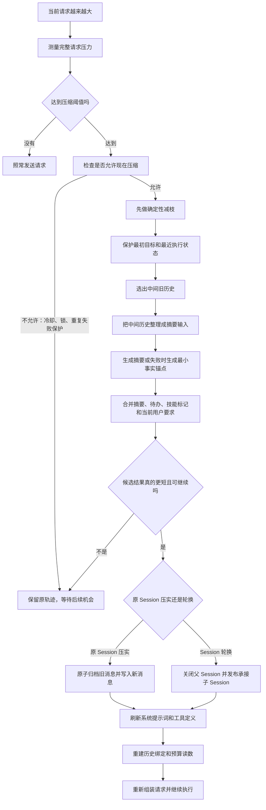
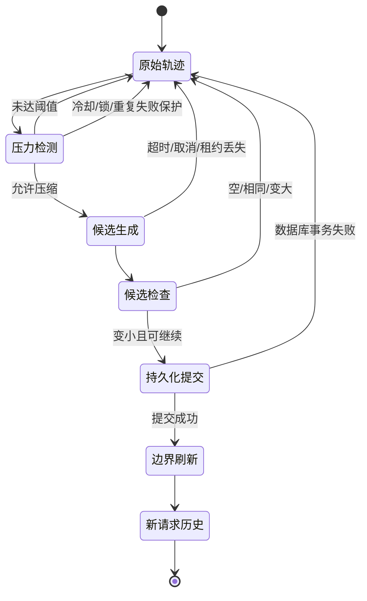

# 第 5 章：压缩、Session 轮换与恢复

## 1. 先从一个实际问题开始

假设你让 Hermes 完成下面的任务：

> 读取一个部署项目，检查配置，运行测试，修复失败，部署到 staging，并保留完整的回滚步骤。

在执行过程中，Hermes 可能已经产生：

- 多条用户要求；
- 多次 `read_file` 读取结果；
- 很长的脚本正文；
- 测试日志；
- 助手发出的工具调用；
- 工具返回的错误和成功结果；
- 已经完成的中间步骤；
- 尚未完成的 Todo；
- 最近一条“先修复失败再部署”的用户要求。

这些内容都会逐渐进入当前请求的历史。当它们接近模型的上下文上限时，Hermes 不能简单地“删掉最前面一半”。因为最前面可能有任务目标，最后面可能有当前阻塞，中间还可能有唯一的文件路径或错误信息。

因此，第 5 章要解决的不是“怎样少放几段文字”，而是：

> 在尽量保留任务连续性的前提下，找出可以安全减少的内容，把旧过程整理成更短的可继续执行状态，并且确保这个新状态能够可靠写入、恢复和继续发送给模型。

这就是 Hermes 的上下文压缩流程。

## 2. 先建立三个最重要的区别

### 2.1 减枝不是摘要

**减枝（Pruning）**是确定性的内容裁剪：程序可以根据角色、长度、重复内容和新旧顺序直接判断。例如：

- 两次工具调用返回了完全相同的文件内容，只保留最新全文，旧的改成“与较新结果相同”；
- 一个旧工具结果有 42,000 个字符，把它换成一行工具结果摘要；
- 一个工具调用的参数过长，只保留合法 JSON 中有用的部分；
- 旧的截图或图片 payload 已经没有继续追问价值，换成占位符。

减枝的特点是：规则明确、结果可预测、不需要摘要模型理解任务。但减枝不能把十几轮历史组织成一段完整的任务状态。

**摘要（Summarization）**是语义压缩：让摘要模型阅读一段旧历史，提取目标、约束、已完成动作、关键文件、失败原因和下一步。摘要可以理解“这些消息之间的关系”，但会有模型失败、遗漏或生成过长文本的风险。

### 2.2 压缩不是 Memory

上下文压缩处理的是“当前请求还能不能继续带着历史工作”。它的产物是下一次请求使用的较短消息轨迹。

Memory（记忆）处理的是“哪些事实值得跨 Session 长期保存”。一次压缩可能触发 Memory extraction（记忆提取），但压缩摘要本身不等于长期记忆，工具日志也不会因为被摘要就自动写进 `MEMORY.md`。

### 2.3 Session 轮换不是普通新建会话

**原 Session 压实（In-place compaction）**：保留同一个 `session_id`，把旧的活动消息软归档，再插入压实后的消息。

**Session 轮换（Session rotation）**：结束父 Session，创建一个承接压实结果的子 Session，并迁移必要的目标、心跳、循环状态和标题来源。

普通 `/new` 是用户主动开始新会话；轮换是系统为了让同一项工作跨过上下文边界而进行的内部连续迁移。

### 2.4 第四章中的哪些部分会被压缩

压缩主要改写 `TurnContext.messages`，因为它是“历史拷贝加本轮工作轨迹”的实际工作稿。`conversation_history` 只是已经落盘的基线、flush 指针和失败回滚参照；它不会和 `messages` 一起发给模型，也不是第二份请求全文。

| 第四章的分类 | 是否直接压缩 | 说明 |
|---|---|---|
| 指令文本 system | 不把 system prompt 拿去做历史摘要 | 它计入请求压力；提交成功后在边界重建快照 |
| 对话轨迹 `messages` | 是，主要改写对象 | 减枝旧工具结果，摘要 middle，保留必要 head/tail |
| 能力与环境 tools Schema | 不做语义摘要 | 它计入压力；压缩边界可以刷新工具定义 |
| 运行控制 | 不发给模型，也不压缩 | 只决定是否压缩、如何提交和如何恢复 |

`TurnContext` 构造时通常执行 `messages = list(conversation_history)`，再追加本轮 user；压缩器处理的是这份已经包含历史的 `messages`。提交成功后，`conversation_history_after_compression` 会换掉历史绑定：原地压实指向新的活动列表，轮换路径交给新 Session，失败则保留旧基线。

Skill 的 `SKILL.md` 正文只有在通过 `skill_view` 变成 `messages` 中的 tool result 后，才可能被减枝；Skills 索引本身仍是 system prompt 的动态内容。`MEMORY.md` 不是压缩产物。

## 3. 一张先看懂、暂时不看源码的算法总图

先只看中文，不要把它和代码文件名联系起来：



这张图中最容易漏掉的是 **F：先做确定性减枝**。减枝不是摘要的附属说明，而是压缩算法中的独立阶段：它先用低风险规则回收明显重复和过大的工具内容，再把仍然重要但已经很旧的中间历史交给摘要模型。

## 4. 读图方法：每一步到底拿什么、产出什么

| 阶段 | 输入 | 处理 | 输出 | 失败时的安全结果 |
|---|---|---|---|---|
| 压力测量 | system、messages、tools、输出预留 | 估算或读取 token | 当前请求大小 | 使用保守估算，不直接丢消息 |
| 允许性检查 | 大小、阈值、冷却、锁、历史尝试结果 | 判断现在能否压缩 | 允许/跳过及原因 | 原轨迹不变 |
| 确定性减枝 | 工作消息 | 去重、缩短工具结果、回收旧图片 | 较小的候选消息 | 没有足够回收量就不提交 |
| 头尾保护 | 减枝后的消息 | 保留初始目标和最近状态 | head、middle、tail 三段 | 不随意删除真实用户 Turn |
| 语义摘要 | middle 的受限文本 | 生成任务状态摘要 | summary 或 fallback anchors | 恢复原列表并记录失败 |
| 候选检查 | 原列表和候选列表 | 检查空、相同、变大、被取消 | 可提交候选 | 拒绝候选，不改 Session |
| 持久化 | 候选、租约、提交栅栏 | 原子写入 SessionDB | 新的活动轨迹 | 事务失败则旧事实继续有效 |
| 边界刷新 | 新历史和配置 | 重建 prompt、工具和 usage anchor | 可继续的下一次请求 | 不把旧缓存误当新状态 |

后面的内容严格按这个顺序讲。源码函数名只在解释完阶段之后出现。

## 5. 第一步：测量完整请求压力

### 5.1 为什么不能只数消息字符

模型请求不只有历史消息，还包括：

1. system prompt：身份、项目规则、Memory、Skills 索引和动态环境；
2. messages：用户、助手、工具调用和工具结果；
3. tools：工具名称、描述和 JSON Schema；
4. output reservation：为模型输出预留的空间；
5. Provider 特有的消息和工具封装开销。

所以一段看似不长的对话，也可能因为工具 Schema 或动态提示词变长而触发限制。

### 5.2 Hermes 的三层读数策略

`agent/turn_context.py::_preflight_request_tokens` 的读数顺序可以用自然语言表示为：

1. 如果最近一次 Provider 返回的 `prompt_tokens` 与当前消息结构仍然匹配，优先使用这个实际读数；
2. 如果 Provider 支持原生 Responses token 估算，就使用原生估算；
3. 否则把 system prompt、messages 和 tools 一起做粗略估算。

这里的“粗略”意味着它是发送前的准入信号，不是 Provider 最终裁判。Provider 仍可能因为隐藏开销或实际窗口限制返回 overflow（上下文溢出）。

### 5.3 阈值和硬上限不是同一个东西

- `threshold_tokens`：Hermes 的主动压缩线，达到它就考虑提前整理；
- Provider hard limit：模型服务真正拒绝请求的硬上限；
- `max_summary_tokens`：摘要模型输出最多允许占用的预算；
- tail token budget：为最近消息保留的预算。

主动压缩通常应该在硬上限之前发生，给摘要、重组和重试留下空间。

固定版本还存在两道不同用途的阈值：Agent 压缩器的默认主动整理线约为上下文窗口的 50%；Gateway 的 Session hygiene（会话卫生检查）约在 85% 处介入。前者负责尽早整理，后者负责防止长期会话逼近 Provider 硬上限。无锚点的粗略估算超过阈值时，`should_defer_preflight_to_real_usage` 可能要求先取得一次真实 usage，再决定是否动作。

## 6. 第二步：判断现在是否允许压缩

### 6.1 最小判定逻辑

先看最短版本：

```text
如果当前 token 小于 threshold：不压缩
否则：检查冷却、结构性无效退避、重复失败保护和并发状态
如果这些保护没有阻断：允许尝试
```

固定源码中的核心函数是 `ContextCompressor.should_compress_info`。它只返回“是否应该尝试”和原因，不负责生成摘要，也不负责写数据库。

```python
def should_compress_info(self, prompt_tokens=None):
    tokens = prompt_tokens if prompt_tokens is not None else self.last_prompt_tokens
    if tokens < self.threshold_tokens:
        return False, None
    if self._automatic_compression_blocked():
        return False, self._compression_block_reason() or "blocked"
    return True, None
```

### 6.2 四种阻断原因

1. **摘要失败冷却（summary failure cooldown）**：摘要模型刚失败，短时间内不重复请求同一个失败路径。
2. **结构性无效退避（structural no-op backoff）**：上一次压缩返回的内容与原轨迹没有实质差异。
3. **重复失败保护（anti-thrash breaker）**：连续两次无效压缩，或连续两次依赖 fallback summary，暂时停止自动压缩。
4. **并发/流程阻断**：当前已有压缩任务、memory review fork、取消标志、尝试次数上限或 `preflight_compression_blocked`。

“重复失败保护”比直译成“反抖”更容易理解：它不是控制理论里的滤波器，而是防止 Hermes 每一轮都重复做同一件无效工作的保护机制。

### 6.3 恢复窗口不是永久禁用

重复失败保护会记录一个 wall-clock recovery deadline（墙上时钟恢复截止时间），而不是进程重启后清零。期限到达后只允许一次 probation probe（试探性压缩）。如果这次仍然无效，保护再次开启；如果对话后来增长出真正可压缩的中间内容，试探才有机会恢复自动压缩。

## 7. 第三步：确定性减枝——算法的第一主角

### 7.1 减枝到底在做什么

减枝的目标不是“让文本看起来短”，而是把低价值内容替换成更短、仍然能说明发生过什么的表示。它通常不调用摘要模型，因此行为稳定、速度快，也更适合在每次工具轮后作为轻量回收。

### 7.2 减枝的输入和保护边界

输入是当前工作消息列表的副本。程序先建立 `tool_call_id → 工具名称和参数` 的映射，然后确定一个保护边界：

- head：最早的身份/初始目标/必要系统锚点；
- tail：最近若干条消息，或在 token 预算内的最近消息；
- middle：位于两者之间、最适合回收的旧轨迹。

如果没有足够的旧消息，或者 SessionDB 没有 `archive_and_compact` 能力，减枝返回原输入，不假装完成了压缩。

### 7.3 四类减枝操作

#### A. 重复工具结果去重

从最新消息往前扫描，对足够长的字符串型 `tool` 结果计算短哈希。最新一份保留全文，旧的重复结果替换成：

```text
[Duplicate tool output — same content as a more recent call]
```

这属于无损回指：旧消息仍然告诉模型“这里曾经有一个相同结果”，但不再重复占用全文大小。因为它不丢失唯一信息，所以即使重复结果位于 tail，也可以处理。

#### B. 旧工具结果降级为一行摘要

不在保护范围内、超过 `min_prune_chars` 的工具结果，会被替换为包含工具名、参数线索和结果要点的一行文本。它不是摘要模型写出的完整任务摘要，只是“这个工具当时返回过什么”的短记录。

#### C. 工具调用参数截断

旧的助手 `tool_calls` 可能包含很大的 JSON 参数。Hermes 在解析后的 JSON 结构中缩短参数，尽量保持合法 JSON。不能把原始参数字符串从中间硬切断，否则下一次 Provider 请求可能因为 JSON 无效直接返回 400。

#### D. 旧图片和多模态 payload 回收

工具结果里的图片会让请求快速膨胀。Hermes 保留最近若干张图片，把较旧的图片替换成占位符。最新图片可能仍需要用于后续视觉追问，所以这一步是有损回收；它和重复去重的无损性质不同。

### 7.4 受保护 tail 自己过大怎么办

保护 tail 不是绝对不能动。如果最近的工具输出本身已经大到超过软预算，Hermes 会：

1. 先保留最近的短消息地板；
2. 从 tail 中较早的工具正文开始降级；
3. 必要时处理除最新工具结果以外的其他大正文；
4. 最后的极端情况下，连最新的大工具正文也改成摘要。

这一步可以覆盖 `skill_view` 正文的普通保护，否则刚加载的 Skill 会永远撑大 tail，压缩就会陷入死循环。它是压力下的最后手段，不是普通减枝的默认行为。

### 7.5 减枝何时才算成功

减枝只有在满足以下条件时才写回 SessionDB：

- 达到 `proactive_prune_tokens`；
- 至少有一个可处理的结果；
- 估算回收量达到 `proactive_prune_min_reclaim_tokens`；
- 下一次重新增长前有足够 runway；
- 数据库提供 `archive_and_compact`。

回收量太小也不提交，因为一次数据库重写会破坏 Provider prompt cache；如果只节省几个 token，却让缓存前缀失效，整体反而可能更差。

源码对应：`agent/context_compressor.py::prune_tool_results_only` 调用 `_prune_old_tool_results`，后者依次执行去重、旧结果降级、参数截断、图片回收和 tail 压力降级。

## 8. 第四步：保留头尾，处理中间历史

### 8.1 为什么不是“只保留最后 N 条”

只保留最近消息会丢掉最初目标，例如“必须保留回滚步骤”；只保留最初消息又会丢掉当前失败原因。Hermes 用 head/middle/tail 结构解决这两个方向的连续性：

```text
[head：最初目标、必要身份锚点]
[middle：已经完成或重复的旧过程，主要压缩对象]
[tail：最近用户要求、助手动作、工具结果和当前阻塞]
```

tail 保护既可以按消息数量，也可以按 token budget。token budget 优先时，一条很大的最近工具结果可能会占满预算，触发第 7.4 节的 tail 压力降级。

### 8.2 当前用户 Turn 是特殊锚点

当前真实用户消息不能因为“它在列表尾部”就被摘要掉。压缩器需要根据 `compressed_user_turn_outcome` 判断这一 Turn 是插入、已经合并，还是仍需保留原始消息。原因很实际：如果用户刚说“先修复失败再部署”，压缩完成后模型必须仍然知道当前任务已经转向修复，而不是回到旧目标。

## 9. 第五步：把中间历史变成摘要输入

### 9.1 摘要模型看到的不是原始 Python 字典

`_serialize_for_summary` 把 middle 转成带角色标签的受限文本，并进行脱敏、限长和思考块清理。例如：

```text
[USER]
用户要把 deploy.sh 迁移到 staging，并保留回滚步骤。

[ASSISTANT]
  read_file({"path":"deploy.sh"})

[TOOL RESULT {tool_call_id}]:
文件内容……（正文过长，已保留开头和结尾）

[ASSISTANT]
已发现数据库迁移必须先备份。

[TOOL:run_tests]
测试日志摘要；最后 20 行显示 staging 数据库连接失败。
```

这样做有三个目的：

1. 让摘要模型知道谁说了什么，避免把工具观察误认为用户要求；
2. 限制摘要模型自己的输入，避免“为了压缩而先把摘要请求撑爆”；
3. 移除内部控制字段和不应再次执行的内容，降低把运行时指令当历史事实的风险。

### 9.2 具体输入限制

固定实现使用以下量级的限制：

- 每条消息正文总长度约 6,000 字符；
- 过长正文保留开头约 4,000 和结尾约 1,500 字符；
- 工具调用参数约 1,500 字符；
- 汇总后还有整体输入上限。

这些是摘要模型输入限制，不是主模型上下文窗口，也不表示所有版本都永远使用相同数字。换版本时要重新核对源码常量。

### 9.3 摘要预算怎么算

摘要输出预算先估算 middle 的 token 数，再按 `_SUMMARY_RATIO` 缩放，最后限制在最小摘要预算和 `max_summary_tokens` 之间；后者还受到上下文窗口约 5% 量级的上限约束。

摘要预算的含义是“摘要模型最多写多少”，不是“下一次主模型请求还能用多少”。如果摘要被允许无限增长，反增长检查会拒绝它。

## 10. 第六步：生成摘要，或在失败时保留最小事实

### 10.1 摘要应该保存什么

摘要不是把旧对话改写成散文，而是要让下一次 Agent 能继续执行。至少应保留：

- 原始任务目标；
- 当前阶段和已完成动作；
- 关键文件、路径、命令和环境；
- 用户明确约束和偏好；
- 成功结果与失败原因；
- 尚未解决的问题和阻塞；
- 当前 Todo 和下一步建议；
- 仍可能影响后续决策的工具事实。

如果已经存在上一版 summary，新摘要会在它的基础上折叠更新，避免每次从最初历史重新叙述。

### 10.2 摘要调用的执行边界

摘要任务在独立的 progress hook、deadline 和 cancel event 下运行：

- 成功：返回摘要文本，进入候选合并；
- 超时或硬取消：停止 worker，恢复压缩器快照和 live list，记录 stall backoff；
- 辅助摘要模型失败：可以回退到主模型；
- 主模型和辅助模型都失败：构造 fallback anchors；
- 摘要为空、只含无意义占位、缺少当前用户要求：候选检查失败，不提交。

### 10.3 Fallback anchors 是什么

Fallback anchors（失败时的最小事实锚点）不是高质量摘要，而是从已有消息中机械提取：

- 用户提出的请求；
- 已经执行的动作和文件；
- 明确的错误或阻塞；
- 未完成事项。

它的目标是让 Session 仍然可继续、可解释、可恢复，而不是假装摘要模型成功了。

## 11. 第七步：合并 Todo、Skill 和当前用户要求

摘要文本不是唯一需要放回新历史的东西。压缩边界还要处理：

1. Todo snapshot：把仍未完成的待办折叠到新边界；
2. Skill 加载标记：保留仍有效的 Skill 引用，避免模型以为自己已经拥有但实际已被删除的 Skill 正文；
3. 当前真实用户 Turn：按插入或合并规则保留；
4. 必要的摘要和回退锚点：作为新的历史事实；
5. 工具结果标记：标明哪些内容是摘要、占位符或重复回指。

这些内容必须组合成能被 Provider 接受的角色顺序，而不是把摘要字符串直接拼成一条新的用户消息。

## 12. 第八步：候选结果检查——为什么“模型返回摘要”还不算成功

### 12.1 `_candidate_rejected` 的四段检查与反增长保护

`_candidate_rejected` 依次检查中止、无进展（比较时忽略 `_db_persisted` 标记）、空列表和 attempt 被取代；旁边的 `_salvage_or_refuse_grown_transcript` 再负责反增长检查：

1. **是否被取消或被更新任务取代**：过期 worker 的结果不能继续提交；
2. **是否有实质进展**：候选不能与原列表相同，也不能是空列表；
3. **是否真的变小**：使用同一种 rough estimator 比较原列表和候选。

如果候选比原列表更大，先做一次 mechanical salvage（机械挽救）：进一步删除可安全回收的内容、缩短候选摘要或恢复更紧的尾部表示。挽救后仍然不变小，就拒绝候选，并记录一次无效压缩。

### 12.2 为什么比较“大小”必须在提交点再次做

压缩函数返回后，系统还可能加入 Todo、当前用户 Turn、持久化标记或边界信息。这些附加内容可能让原本“刚好变小”的候选重新变大。因此源码把反增长保护放在 commit site（提交点）附近，而不是只相信摘要函数内部的估算。

### 12.3 候选检查伪代码

```text
保存原始消息和压缩器状态
生成 candidate
如果取消、租约丢失或尝试已过期：拒绝
如果 candidate 与原列表相同或为空：拒绝
如果 candidate 更大：执行一次机械挽救
如果挽救后仍不变小：拒绝并增加无效计数
否则：进入提交阶段
```

## 13. 第九步：提交闸门、租约和原子持久化

### 13.1 为什么需要两个保护机制

摘要模型可能运行几秒甚至更久。在这段时间里：

- 用户可能取消当前任务；
- 另一个进程可能已经完成压缩；
- 当前 Session 可能已经产生新的消息；
- 旧的摘要 worker 可能在新任务之后才返回。

**租约（Lease）**是带过期时间的压缩占用权，防止多个执行者同时提交同一个 Session。

**提交闸门（CompressionCommitFence）**是候选进入数据库写入点前的最后有效性检查，防止已取消、已过期或被新任务取代的 worker 越过提交点。

租约不是“模型还在正常思考”的证明；它只解决谁有权在这一时间段执行和提交压缩。

### 13.2 提交的最小事务模型

```text
保存 live messages、压缩器状态和减枝水位
取得租约并持续刷新
生成候选摘要
检查提交闸门和租约仍然有效
检查候选非空、非重复、非增长
调用 SessionDB 的原子归档/插入接口
提交成功后标记消息已持久化
释放租约
```

提交前的任何失败都应该让旧 Session 继续作为事实来源；只有数据库接口确认成功后，候选才可以成为新的持久历史。

### 13.3 `archive_and_compact` 做什么

`SessionDB.archive_and_compact` 是数据库侧的原子接口：旧活动消息被软归档（仍可检索），新的压实消息被插入为活动轨迹。它不是物理删除，也不是只更新 Python 列表。

固定源码中的调用形态如下：

```python
agent._session_db.archive_and_compact(
    agent.session_id,
    compressed,
    model_config_patch={PROACTIVE_PRUNE_REARM_MODEL_CONFIG_KEY: None},
    watermark=lease.watermark,
    lock_holder=lease.holder,
    tail_count=tail_count,
)
```

只有这个调用成功返回后，压实消息才应打上 `_db_persisted` 标记。否则下一次 append-only flush 可能把同一批消息再次插入，造成摘要和旧轨迹重复。

## 14. 第十步：原 Session 压实（In-place）

当 `compression_in_place=True` 时，Hermes 保持同一个 `session_id`；固定版本该属性缺失时也按 True 处理，默认路径就是原地压实：

1. 提取需要保存的 Memory；
2. 做候选反增长检查；
3. 调用 `archive_and_compact` 原子归档旧活动消息并写入压实列表；
4. 标记新列表已持久化，清理 flush identity set；
5. 更新同一 Session 的 system prompt；
6. 让 Gateway 重新基线化消息处理，即使 Session ID 没变也知道发生了真实边界。

如果数据库在原子提交返回前失败，旧活动行应保持 active；代码恢复 `messages_before_compression`，避免把未提交的候选当作新增消息再次 flush。

原地压实的好处是外部 Session ID 不变；代价是同一个 Session 的历史发生了一个明确的压实边界，依赖消息索引或缓存对象身份的组件必须收到通知。

## 15. 第十一步：Session 轮换（Rotation）

当采用轮换路径时，流程顺序不能交换：

1. 先保存 `old_session_id`，它是失败时的回滚键；
2. 把当前 Turn 尚未持久化的尾部 flush 到父 Session，但不把已经从数据库恢复的历史再次追加；
3. 检查父 Session 是否被用户明确结束；
4. 在一个发布事务中关闭父 Session、创建 child、写入压实 messages、system prompt、模型配置、工作目录和 profile；
5. 建立父子 handoff 关系；
6. 迁移 `/goal`、`/heartbeat`、`/loop` 和标题来源；
7. 切换 `agent.session_id`，重新绑定上下文。

如果父 Session 是用户明确结束的，系统不能为了压缩而强行发布子 Session。若发布事务失败，父 Session 必须保持可恢复，子 Session 不能作为半成品被索引。

### 15.1 为什么要迁移 Goal、Heartbeat 和 Loop

轮换只改变物理 Session ID，不应让工作目标突然消失。它们不是“摘要正文的一部分”，而是独立的持久状态：

- `/goal` 代表用户要求持续追踪的目标；
- `/heartbeat` 代表周期性工作状态；
- `/loop` 代表循环任务状态；
- 标题来源决定后续自动标题是否仍可升级。

因此，轮换必须显式迁移这些状态，而不能假设 child 会沿着 parent 自动查找全部内容。

## 16. 第十二步：压缩边界后的刷新

无论原地压实还是轮换，提交完成后都要刷新边界状态。

### 16.1 重建 system prompt 和工具定义

`_rebuild_system_prompt_at_boundary` 会：

1. 使旧 system prompt 缓存失效；
2. 刷新动态工具 Schema；
3. 重新构建 stable/context/volatile 三个分区；
4. 重新加载在压缩边界前写入的 Memory；
5. 如果新旧字节完全相同，保留对象身份以帮助 Provider-side cache；
6. 如果内容已经变化，必须使用新 prompt，不能为了缓存而继续使用旧版本。

压缩边界是长期 Session 获得配置变化、工具变化和记忆变化的正式机会。

### 16.2 重建下一次可见历史

`conversation_history_after_compression` 根据提交后的活动消息重新生成下一次 Turn 使用的 history。随后还要：

- 重置文件读取和 `skill_view` 去重 generation；
- 清空旧 usage anchor，等待下一次真实 Provider usage；
- 通知 Context Engine、Memory Manager 和插件压缩边界已完成；
- 退还预检阶段尚未发出的 API call/budget 计数；
- 让下一次请求从新的 system、messages 和 tools 重新组装。

## 17. 失败、取消和崩溃：每种情况如何恢复



| 事件 | 数据库结果 | 内存结果 | 后续行为 |
|---|---|---|---|
| 未达阈值 | 不写 | 原列表 | 正常发送 |
| 冷却或锁竞争 | 不写 | 原列表 | 后续 Turn 或人工 `/compress` 再试 |
| 摘要超时/硬取消 | 不写 | 恢复快照，记录 stall backoff | 不提交半成品 |
| 摘要模型失败 | 通常不写；必要时写 fallback anchors | 标记失败原因 | 继续或等待冷却 |
| 候选无进展 | 不写 | 原列表，结构性退避 | 避免每轮重复尝试 |
| 候选变大 | 不写 | salvage 失败则恢复并记无效计数 | 触发重复失败保护 |
| 原地提交前失败 | 旧活动行保持有效 | 恢复原列表 | 父 Session 继续 |
| 轮换发布失败 | 父 Session 不闭合，child 不索引 | 清理轮换临时状态 | 从父 Session 恢复 |
| Provider overflow | 依赖 overflow recovery，不把粗略估算当事实 | 重新裁剪/压缩后再组装 | 可重试则重试 |
| 进程在摘要期间被杀 | 没有 commit 就没有新事实 | 重启读取旧活动历史 | 重新判断是否压缩 |
| 进程在原子提交后被杀 | 数据库事务决定唯一事实 | 重启读取 active rows 和标记 | 重建压实后 history |
| anti-thrash 已触发后重启 | 读取持久化计数和恢复 deadline | 不清零保护状态 | 到期只放行一次 probe |

恢复原则只有一句话：

> 没有明确的提交成功证据，就不能把内存候选当作持久事实；没有明确的轮换发布成功证据，就不能把父 Session 当成已经结束。

## 18. 一个完整例子：从长轨迹到可继续状态

### 18.1 压缩前

```text
0  system     身份、项目规则、Skills 索引
1  user       “把 deploy.sh 迁移到 staging，并保留回滚步骤”
2  assistant  read_file(deploy.sh)
3  tool       42,000 字符脚本正文
4  assistant  read_file(deploy.sh)       # 重复读取
5  tool       同一份 42,000 字符正文
6  assistant  已发现备份步骤和数据库迁移顺序
7  assistant  run_tests(staging)
8  tool       18,000 字符测试日志，最后 20 行含失败
9  user       “先修复失败再部署”
```

### 18.2 减枝后

```text
0  system     不在 messages 中改动
1  user       原始目标（head 锚点）
2  assistant  read_file(deploy.sh)
3  tool       脚本正文的一行工具结果摘要
4  assistant  read_file(deploy.sh)
5  tool       [Duplicate tool output — same content as a more recent call]
6  assistant  已发现备份步骤和数据库迁移顺序
7  assistant  run_tests(staging)
8  tool       测试日志摘要 + 最后 20 行失败
9  user       “先修复失败再部署”（tail，必须保留）
```

### 18.3 中间摘要可能表达的状态

```text
任务目标：将 deploy.sh 迁移到 staging，并保留可执行的回滚步骤。
已完成：读取 deploy.sh；确认部署前需要备份数据库；已运行 staging 测试。
关键事实：测试日志显示 staging 数据库连接失败。
当前约束：必须先修复失败，再进行部署；不能跳过备份。
未完成：定位数据库连接失败原因，修复后重新测试，再部署。
```

如果这段摘要加上保留的 head、tail、Todo 和工具标记后仍然比原轨迹大，反增长检查会拒绝它。拒绝并不代表任务失败，而是表示“这次压缩没有带来安全收益”，系统继续使用原轨迹，等待更多可回收内容或人工处理。

## 19. 现在再看源码：概念与实现的对应关系

前面已经建立了概念模型，此时再看源码不会把函数名误认为算法阶段：

| 教学阶段 | 固定源码入口 | 主要职责 |
|---|---|---|
| 压力测量 | `agent/turn_context.py:37` `_preflight_request_tokens` | Provider usage、原生估算和粗略估算 |
| 允许性检查 | `agent/context_compressor.py:2472` `should_compress_info` | threshold、冷却、结构性退避和重复失败保护 |
| 确定性减枝 | `agent/context_compressor.py:2841` `prune_tool_results_only` | 工具结果去重、降级、参数截断、图片回收 |
| 减枝内部遍历 | `agent/context_compressor.py` `_prune_old_tool_results` | head/tail 边界和各个减枝 pass |
| 摘要输入 | `agent/context_compressor.py:2938` `_serialize_for_summary` | 角色标记、脱敏、限长和工具调用渲染 |
| 摘要预算 | `agent/context_compressor.py:2912` `_compute_summary_budget` | 按内容量缩放并限制摘要输出 |
| 提交闸门 | `agent/conversation_compression.py:366` `CompressionCommitFence` | 取消和过期 worker 的提交保护 |
| 候选提交 | `agent/conversation_compression.py:3223` `_commit_compaction` | 反增长检查、原子压实或轮换 |
| 边界刷新 | `agent/conversation_compression.py:2782` `_rebuild_system_prompt_at_boundary` | prompt、工具和缓存边界刷新 |
| 总编排 | `agent/conversation_compression.py:3543` `compress_context` | 把各阶段按顺序连接起来 |
| 轮换恢复 | `agent/conversation_compression.py:1450` `recover_rotated_compression_session` | 轮换异常后的恢复 |
| 压实后历史 | `agent/conversation_compression.py:1864` `conversation_history_after_compression` | 重建下一次请求可见历史 |
| 微压实同步 | `agent/micro_compaction.py:201` | 确定性回收与 SessionDB 同步契约 |

源码阅读时始终先问“它在上面哪一个教学阶段”，再看参数和状态变化。这样不会把 `ContextCompressor` 当成一个神秘的“压缩黑盒”，也不会把 `archive_and_compact` 误认为普通字符串替换。

## 20. 概念辨析

| 概念 | 本章中的准确结论 |
|---|---|
| 减枝（Pruning） | 基于规则减少重复或低价值内容；是压缩算法的独立阶段 |
| 摘要（Summarization） | 用模型提炼中间历史的语义状态；可能失败，必须有回退 |
| 压缩（Compaction） | 减枝、摘要、候选检查和持久化边界组成的整体状态迁移 |
| Memory | 可跨 Session 保存的记忆系统；不等于压缩摘要 |
| 原地压实 | 同一 Session ID 内原子替换活动轨迹 |
| Session 轮换 | 父 Session 到承接子 Session 的持久化迁移 |
| 粗略 token 估算 | 发送前的准入信号；不能保证 Provider 一定接受 |
| ReAct | 工具调用/观察轨迹与其结构相似，但压缩本身不是 ReAct 推理 |
| Plan-and-Execute | Todo 或压缩摘要不能自动证明 Hermes 实现了独立计划执行器 |

## 21. 验证练习

在固定 Hermes 源码副本中运行：

```powershell
git rev-parse HEAD
rg -n "class ContextCompressor|def should_compress_info|def prune_tool_results_only|def _serialize_for_summary" agent/context_compressor.py
rg -n "class CompressionCommitFence|def _commit_compaction|def compress_context|def recover_rotated_compression_session" agent/conversation_compression.py
rg -n "def _preflight_request_tokens|def conversation_history_after_compression" agent/turn_context.py agent/conversation_compression.py
```

应得到固定提交 `f97a4102dd3864eed0c85132850ce7e06f13e09a`，并能定位本章源码地图中的函数。

建议设置断点或日志观察以下事实：

1. 减枝返回原输入对象时，数据库没有被改写；
2. 候选反增长时，父 Session 仍保持活动；
3. `archive_and_compact` 成功后，新消息才被标记 `_db_persisted`；
4. 原地压实后 Session ID 不变，但 `last_compaction_in_place` 等边界状态发生变化；
5. 轮换成功后，父子 Session、goal、heartbeat 和 loop 状态都能定位；
6. 重启后 anti-thrash 计数和 recovery deadline 没有被进程初始化清零。

在 AI-Learn 根目录运行仓库检查：

```powershell
git diff --check
python scripts/validate_repo.py
```

这些命令验证学习仓库的格式和结构；它们不能替代对固定 Hermes 源码的语义复核。

## 22. 本章小结

Hermes 的上下文压缩不是一次“把旧消息变短”的操作，而是一条可恢复的状态迁移链：

```text
完整请求压力测量
  → threshold 和失败保护判断
  → 确定性减枝
  → head/middle/tail 选择
  → 受限序列化
  → 语义摘要或 fallback anchors
  → Todo、Skill 和当前用户 Turn 合并
  → 候选反增长和并发检查
  → 原地压实或 Session 轮换
  → SessionDB 原子提交
  → system prompt、工具、历史和 usage 状态刷新
  → 重新组装请求
```

其中最重要的教学结论是：

- 减枝负责先处理可确定的重复和低价值内容；
- 摘要负责把中间历史变成可继续执行的语义状态；
- 提交负责把候选变成持久事实；
- 轮换负责跨越物理 Session 边界；
- 恢复负责确保任何失败都不会凭空制造新历史。
