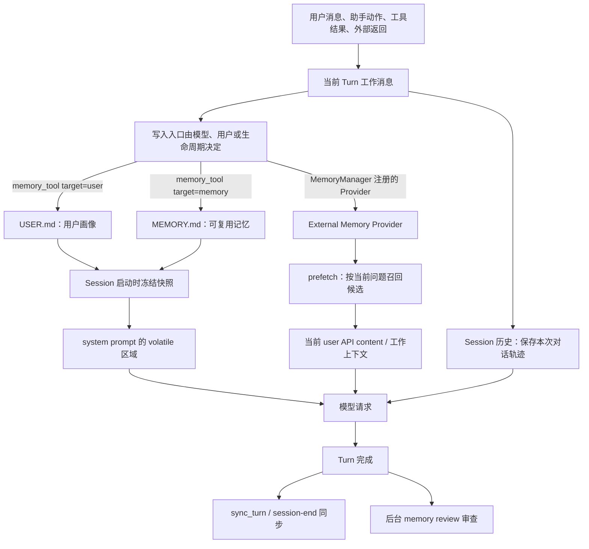
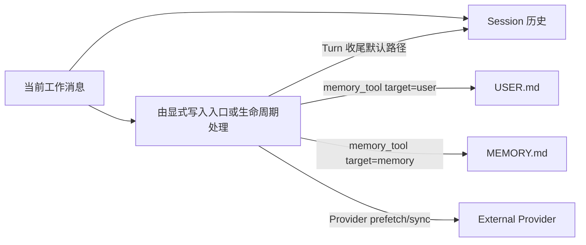
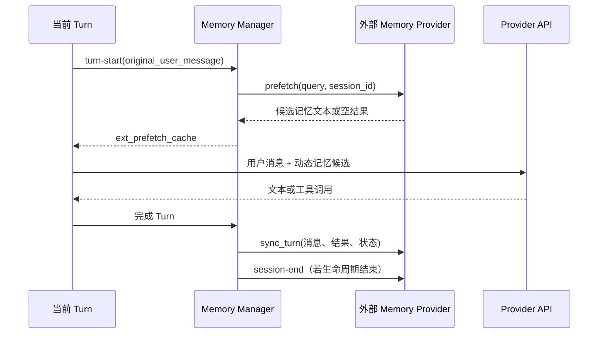
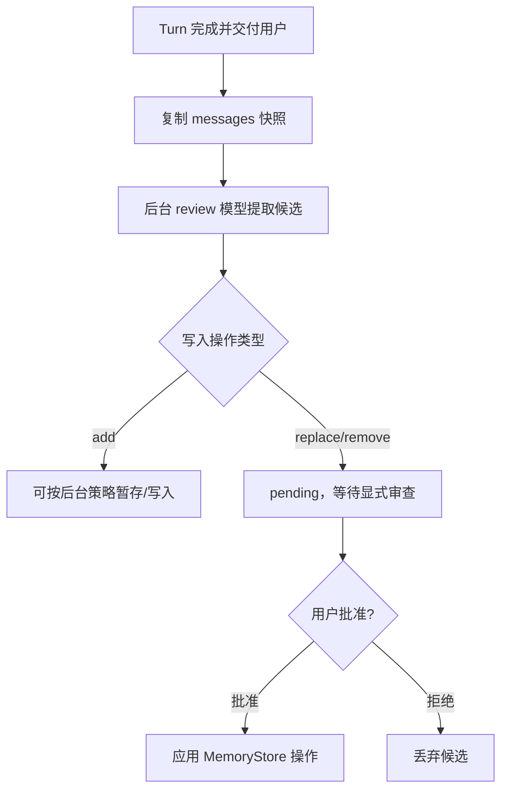

# 第 6 章：Memory、History 与外部记忆边界

## 1. 先看整体：一条信息怎样被保存和再次使用

这一章研究“信息如何在 Hermes 中留下来”。用户说了一句话、工具返回了一段结果，并不意味着它们都会变成长期记忆。不同信息进入哪一层，取决于 Turn 收尾、显式 `memory_tool` 写入、后台 review 或外部 Provider 生命周期；源码没有一个自动把所有信息分类到 USER/MEMORY/Provider 的总分类器。



先记住四个结论：

1. 工作消息解决“当前这一轮怎么继续”；
2. Session 历史解决“这段对话以后怎样恢复”；
3. `USER.md` / `MEMORY.md` 解决“跨 Session 仍值得复用什么”；
4. 外部 Memory Provider 负责可插拔的召回和同步，不自动保证事实正确。

## 2. 五种信息放在哪里

| 层次 | 保存什么 | 典型寿命 | 下一次请求如何使用 |
|---|---|---|---|
| 当前 Turn 工作消息 | 本轮 user、assistant、tool call、tool result | 当前 Turn | 直接组成 `messages` |
| Session 历史 | 已完成 Turn 的可恢复轨迹 | Session 生命周期 | 恢复后复制到 `messages` |
| `USER.md` | 用户身份、偏好、沟通习惯 | 多个 Session | 启动时或边界重建时作为 system prompt 快照 |
| `MEMORY.md` | 项目事实、经验、长期可复用知识 | 多个 Session | 启动时或边界重建时作为 system prompt 快照 |
| 外部 Memory Provider | Provider 自己管理的索引、事件或向量记忆 | 由外部系统决定 | `prefetch` 作为本轮候选，`sync_turn` 回写 |

“保存在哪里”与“模型本次能否看到”是两个问题。普通 Turn 继续使用冻结快照，磁盘变化不一定立即可见；当前 Turn 要立即使用新内容，依靠 Memory tool 返回或 prefetch 进入工作上下文；整份文件快照可在压缩成功后的边界重建或下一次 Session 启动时进入 system prompt，并非只有 `/new` 才会刷新。

## 3. 第一步：信息从哪里产生

### 3.1 用户消息

用户消息是最高优先级的任务输入，但不应自动复制成长期记忆。比如“这次先用 staging”通常是当前任务约束；只有用户明确表达稳定偏好，如“以后都先给结论”，才可能进入 `USER.md`。

### 3.2 助手判断和工具动作

助手说“我会先读取配置”，本身是执行轨迹；工具调用记录了准备执行的动作；工具结果记录了实际观察。它们默认属于工作消息和 Session 历史，不应因为出现过一次就进入长期 Memory。

### 3.3 外部系统返回

外部 Memory Provider 可以返回候选记忆，但候选有来源、时间和作用域。它不是系统规则，也不能覆盖当前用户明确要求。模型使用前应把它当成“可参考事实”，必要时通过工具或原始文件重新验证。

## 4. 第二步：Session 历史与长期 Memory 的分流



Session 历史重视顺序和可恢复性：用户要求、助手动作、工具观察要保持角色和时间关系。长期 Memory 重视提炼后的复用价值：它不需要保存每个工具调用，而应保存“以后做 staging 部署前必须先备份数据库”这样的稳定事实。

压缩摘要处在两者之间：它把 Session 历史变成较短的继续执行轨迹，但不自动升级为 `MEMORY.md`。第 5 章的压实改变的是活动历史；本章的 Memory 写入需要独立的工具或 Provider 流程。

## 5. 本地 Memory：`USER.md` 与 `MEMORY.md`

### 5.1 文件角色

`USER.md` 保存用户画像，例如语言、输出偏好和长期沟通习惯；`MEMORY.md` 保存可复用的项目事实、工作经验和已经确认的长期知识。二者都属于 profile-scoped memory（按用户配置作用域保存），不是某个 Session 的普通消息表。

Hermes 通过 `tools/memory_tool.py::get_memory_dir` 确定 Memory 目录，通过 `memory_tool_store.py::MemoryStore` 读取和写入文件。文件名、目标参数和内容语义必须保持区分：把项目事实写进用户画像会污染后续所有任务，把短期临时安排写进长期记忆会造成过期指导。

### 5.2 启动读取和冻结快照

`MemoryStore.load_from_disk()`（`tools/memory_tool_store.py:111`）会读取两个 Markdown 文件并捕获 frozen system-prompt snapshot；`tools/memory_tool.py:47` 的 `load_on_disk_store()` 是进程侧加载入口。启动后普通 Turn 使用冻结快照，不会因为磁盘文件变化就自动重建整个 system prompt。

因此有四层不同状态：

```text
1. 磁盘 `USER.md` / `MEMORY.md`：持久文件
2. `MemoryStore.user_entries` / `memory_entries`：活动列表；Memory tool 写入会改这里和磁盘
3. `MemoryStore._system_prompt_snapshot`：`load_from_disk()` 时冻结，供 system prompt 使用
4. `agent._cached_system_prompt`：已经拼入当前 Session 请求的提示词
```

调用 Memory tool 修改文件后，第 1、2 层会改变，第 3、4 层通常仍是旧内容；当前 Turn 若必须立即使用新内容，应依靠工具返回或 prefetch。压缩成功后的边界重建或下一次 Session 启动会重建整份文件快照。

### 5.3 写入操作和安全门

`memory_tool` 支持针对 `user` 或 `memory` 的添加、替换、删除和批量操作。`MemoryStore` 会检查目标、旧文本是否唯一、文件是否发生外部漂移、读取是否失败以及内容是否满足写入条件。

写入有两道门：无人值守后台 review 对 `replace/remove`（包括 batch）始终进入 pending，`add` 仍可走；另有 `tools/write_approval.py` 的总闸门 `memory.write_approval`，默认关闭（`false`，表示前台可直接写），打开后前台跨 Session 写入也会 stage，等待 `/memory pending` 审查。

## 6. 外部 Memory Provider 的整体生命周期

外部 Provider 是一个可选扩展，不等于本地 Memory 文件的别名。它通常有以下阶段：

它在源码中也不是一个“外部文件夹”：`MemoryProvider` 是协议，`MemoryManager` 负责管理多个 Provider、召回和压缩前钩子；本地文件则由 `MemoryStore` 独立负责。



`prefetch` 的目的是在本轮开始时根据用户问题召回候选；`sync_turn` 的目的是把完成的 Turn 或事件同步给外部系统。两者都可能失败，失败时 Hermes 应保留本地执行能力，不能把空结果解释成“没有相关事实”，也不能把同步调用返回解释成“外部已经永久保存”。

`_memory_turn_start_and_prefetch` 会跳过 `is_trivial_prompt(_query)` 判定为 trivial 的输入；因此空结果可能表示跳过、Provider 无结果或调用失败，不能直接解释为“没有相关记忆”。协议中的 `system_prompt_block()` 用于静态 system 内容；`prefetch()` 的召回内容走当前 user API content/工作上下文，不能画进静态 `MEMORY.md` 快照。

### 6.1 `prefetch` 怎样进入当前请求

`agent/turn_context.py::_memory_turn_start_and_prefetch` 在 Turn 开始通知 Memory Manager，并把 Provider 返回保存到 `ext_prefetch_cache`。之后 `build_api_messages` 通过 `compose_user_api_content` 把动态候选和插件上下文加入本轮 user API content 的发送副本。

压缩前还会调用 `MemoryManager.on_pre_compress` 以及 Provider 的同名钩子，向摘要流程提供 `memory_context` 或 checkpoint。它只辅助摘要；`require_checkpoint` 失败时调用方应保住未压缩 transcript，不能把摘要写进 `MEMORY.md`。

这条路径很容易被误解：`ext_prefetch_cache` 是 TurnContext 的运行时字段，但它不是 `MEMORY.md`，也不是永久历史。它主要服务当前 Turn 的请求重组，并可在同一 Turn 的多次 iteration 中复用，避免每圈重复召回。

### 6.2 `sync_turn` 和 session-end

Turn 完成后，`turn_finalizer.py::finalize_turn` 会在交付流程附近执行外部 Memory sync，并在符合条件时安排后台 review。同步应使用已经完成或明确标记的 Turn 状态；中途失败的工具调用不能伪装成成功事实。

`on_session_switch` 用于 `/resume`、`/branch`、`/reset`、`/new` 或压缩轮换改变 `session_id` 时换绑；`reset=True` 才表示全新对话。`on_session_end` 是真正 Session 结束时的生命周期回调，不是每个 Turn 都调用。

## 7. 后台 Memory Review：审查而不是自动真理

当 `should_review_memory` 或配置触发 review，Hermes 会复制消息快照，在用户结果交付后执行后台审查，避免审查任务抢占当前 Turn。审查可以识别候选用户偏好、项目事实和重复记忆，但它仍然是一个需要权限和验证的提议流程。



审查输入是消息快照，不应和 live transcript 建立可变别名；否则后台任务可能读到已经变化的工作列表。审查失败只代表这次没有得到候选，不代表历史丢失；历史持久化和 Memory review 是两条不同的收尾路径。

## 8. Memory 与 Context、压缩的边界

| 操作 | 改变什么 | 模型何时看到 | 是否改变 Session 历史 |
|---|---|---|---|
| 追加当前工具结果 | 当前 `messages` | 下一次 iteration | 收尾时可能持久化 |
| 写入 `MEMORY.md` | 磁盘长期记忆 | 下一次加载，或边界重建后 | 不直接改变历史 |
| 外部 `prefetch` | 本轮动态候选 | 当前 API 请求 | 通常不直接写历史 |
| 上下文压缩 | 活动 `messages` 的表示 | 压缩后下一次请求 | SessionDB 活动行改变 |
| `trim_memory` | 进程内存占用 | 不增加模型内容 | 不改变文件 |

`_rebuild_system_prompt_at_boundary` 在压缩成功等边界上会失效旧缓存并重新加载 Memory/Skills。它不是 new 一个 Context，也不等于新开 Session；原地压实时 `session_id` 可以保持不变。这样做的目的，是在合法的边界刷新已经更新的记忆和工具定义，同时重新建立历史基线。

## 9. 一条信息的完整追踪案例

用户先说：“以后部署 staging 前都先备份数据库。”随后请求：“现在部署这个项目。”

| 时刻 | 信息所在位置 | 内容 | 能否被当前模型看到 | 是否长期保存 |
|---|---|---|---|---|
| t0 | 当前 user message | 用户表达偏好/约束 | 本轮请求能看到 | 尚未决定 |
| t1 | 工作 `messages` | 原始 user 消息 | 下一次 iteration 能看到 | 收尾时进入 Session 历史 |
| t2 | Memory tool 候选 | 建议写入用户偏好或项目记忆 | 工具返回会看到 | 尚未应用 |
| t3 | `USER.md` 或 `MEMORY.md` | 审查后形成的长期条目 | 当前冻结快照未必马上看到 | 是 |
| t4 | 新 Session 启动 | 文件重新加载进 `volatile` | 后续请求能看到 | 是 |
| t5 | 外部 Provider prefetch | 根据“部署 staging”召回的候选 | 当前请求可看到 | 取决于 sync 是否成功 |

这里不能把 t0 直接跳到 t3。长期记忆写入需要选择目标、检查内容、处理权限和确认持久化结果；外部候选也需要来源和时效信息。

## 10. 源码地图：先有架构，再看文件

| 架构位置 | 固定源码入口 | 作用 |
|---|---|---|
| 本地 Memory 目录 | `tools/memory_tool.py:38` `get_memory_dir` | 确定 profile-scoped 存储位置 |
| MemoryStore | `tools/memory_tool_store.py:66` `MemoryStore` | 读取、冻结、写入和漂移检查 |
| Memory tool | `tools/memory_tool.py:172` `memory_tool` | 暴露 add/replace/remove 等操作 |
| Turn 开始召回 | `agent/turn_context.py:754` `_memory_turn_start_and_prefetch` | 调 Provider、保存 `ext_prefetch_cache` |
| 动态注入 | `agent/turn_context.py:1018` `build_api_messages` | 将候选放入发送副本 |
| Turn 完成同步 | `agent/turn_finalizer.py:433` `finalize_turn` | 交付后 sync 和 review 调度 |
| 压缩边界重载 | `agent/conversation_compression.py:2782` `_rebuild_system_prompt_at_boundary` | 重建 Memory/Skills/system prompt |
| 协议 | `agent/memory_provider.py` `MemoryProvider` | `prefetch`、`sync_turn`、会话和压缩钩子 |
| 多 Provider 编排 | `agent/memory_manager.py:289` `MemoryManager` | 管理多个 Provider、`prefetch_all`、`on_pre_compress` |
| 后台审查 | `agent/background_review.py` | Turn 后 fork，使用 messages 快照 |
| 写入审批 | `tools/write_approval.py` | pending 目录和 `/memory pending` |

这些文件不是七个互相独立的 Memory 系统，而是同一条生命周期在不同阶段的实现入口。

## 11. 异常和恢复

| 异常 | 不应发生的误判 | 正确处理 |
|---|---|---|
| `USER.md`/`MEMORY.md` 读取失败 | 把空内容当成“没有记忆” | 保留旧快照/错误状态，记录失败 |
| 文件发生外部漂移 | 静默覆盖他人修改 | 返回 drift error，要求重新读取 |
| Memory tool 删除不唯一文本 | 随机删除一条 | 拒绝操作，要求唯一匹配 |
| Provider prefetch 失败 | 把失败当成无相关记忆 | 当前 Turn 继续，本地路径可用 |
| Provider sync 失败 | 假装外部已保存 | 记录失败，等待重试或人工处理 |
| 后台 review 想删除记忆 | 无人值守直接删除 | 转 pending，等待显式批准 |
| 压缩成功但 prompt 未重建 | 认为磁盘新内容已被模型看到 | 边界重建后才使用新快照 |
| `trim_memory` 被触发 | 误认为 MEMORY.md 被清空 | 它只释放进程内存，不改文件 |
| Memory 文件过长 | 认为可以无限追加 | `MemoryStore` 默认 `memory_char_limit=2200`、`user_char_limit=1375`；consolidation 每 Turn 最多失败 3 次 |

恢复的共同原则是：本地 Session 历史、长期文件和外部 Provider 各自保留自己的事实边界。一条路径失败，不应让其他路径被伪造为成功。

## 12. 概念辨析

| 概念 | Hermes 中的诚实表述 |
|---|---|
| History | 以消息顺序为核心的 Session 可恢复轨迹 |
| Memory | 跨 Session 复用的精选信息，来源和写入需要审查 |
| `USER.md` | 用户画像和稳定偏好 |
| `MEMORY.md` | 项目事实、经验和可复用知识 |
| Prefetch | 当前问题相关的外部候选上下文 |
| Sync | 向外部 Provider 同步 Turn/事件，不等于同步成功保证 |
| Review | 生成和审查 Memory 候选的后台流程 |
| Context | 当前请求的信息组装；会读取 Memory，但不等于 Memory 系统 |
| RAG | 只有存在检索器、索引和证据注入时才称为 RAG；Memory Provider 不自动等于 RAG |

## 13. 验证练习

在固定源码副本中运行：

```powershell
git rev-parse HEAD
rg -n "class MemoryStore|def load|def get_memory_dir|def memory_tool" tools/memory_tool.py tools/memory_tool_store.py
rg -n "def _memory_turn_start_and_prefetch|def build_api_messages|def finalize_turn" agent/turn_context.py agent/turn_finalizer.py
rg -n "prefetch|sync_turn|on_session_switch|review" agent tools
```

观察以下结果：

1. 修改 `MEMORY.md` 后，当前 `_cached_system_prompt` 不会凭空变化；
2. `ext_prefetch_cache` 只服务当前 Turn 的动态注入；
3. Session 历史和 Memory 文件使用不同的持久化路径；
4. 后台 review 使用消息快照，且删除/替换操作有 pending 门；
5. 压缩边界重建 prompt 后，下一次请求才获得新的 Memory/Skills 快照。

## 14. 本章小结

Hermes 的 Memory 架构是一条分层生命周期：当前工作消息记录正在发生的事，Session 历史保存可恢复的对话轨迹，`USER.md` 与 `MEMORY.md` 保存经过选择的长期信息，外部 Provider 通过 `prefetch` 和 `sync_turn` 提供可插拔召回与同步。信息只有经过正确的分流、写入、权限检查和边界刷新，才会在合适的时间被模型看到。理解这条整体链之后，再阅读单个工具函数，才不会把历史、压缩、Memory 和 Context 混成一个系统。
