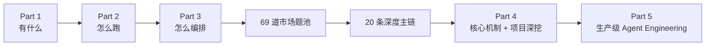

# 从这里开始

基础阶段已经完成：

1. **Part 1：看懂 LangGraph 有什么。**
2. **Part 2：看懂这些东西在一次真实执行中怎么跑。**
3. **Part 3：站在开发者视角把同一个 Agent 编排出来。**

现在进入“面试问题驱动”的第二阶段。

## 当前阶段：Part 4 深度面试主链

市场题池已经完成 69 道候选题，并重组成 20 条深度主链。现在开始逐条写正式答案。

第一批已经完成：

1. [[讲解/04-深度面试主链/00-Part4导航|Part 4 导航]]
2. [[讲解/04-深度面试主链/01-M01-为什么是LangGraph|M01 为什么是 LangGraph]]
3. [[讲解/04-深度面试主链/02-M02-一次真实请求完整调用链|M02 一次真实请求完整调用链]]
4. [[讲解/04-深度面试主链/03-M03-Graph拆分与多Agent边界|M03 Graph 拆分与 Multi-Agent 边界]]

题目研究入口：

- [[面试题池/01-高价值题目池|69 道高价值候选题]]
- [[面试题池/05-20条深度主链|20 条深度主链]]
- [[面试题池/06-69题覆盖映射|69 题覆盖映射]]
- [[面试题池/02-来源登记与搜索记录|来源登记与搜索记录]]

这里的“压缩”不是删除题目：69 道候选题完整保留，只是组织成 20 条可以一路追问到底的主链。

## Part 1：全景地图

1. [[讲解/01-全景地图/01-框架定位与系统边界|01 框架定位与系统边界]]
2. [[讲解/01-全景地图/02-六大核心模块|02 六大核心模块]]
3. [[讲解/01-全景地图/03-核心运行循环|03 核心运行循环]]
4. [[讲解/01-全景地图/04-开发者编排视角|04 开发者编排视角]]
5. [[讲解/01-全景地图/05-贯穿案例-采购经营数据分析Agent|05 贯穿案例]]
6. [[讲解/01-全景地图/06-Part1学习检查|06 Part 1 学习检查]]

## Part 2：完整运行旅程

1. [[讲解/02-完整运行旅程/00-Part2导航|00 Part 2 导航]]
2. [[讲解/02-完整运行旅程/01-一张图看完整执行链路|01 一张图看完整执行链路]]
3. [[讲解/02-完整运行旅程/02-从invoke到第一个Node|02 从 invoke 到第一个 Node]]
4. [[讲解/02-完整运行旅程/03-State如何随真实数据演化|03 State 如何随真实数据演化]]
5. [[讲解/02-完整运行旅程/04-Node-LLM-Tool谁调用谁|04 Node、LLM、Tool 到底谁调用谁]]
6. [[讲解/02-完整运行旅程/05-分支并行与Super-step|05 分支、并行与 Super-step]]
7. [[讲解/02-完整运行旅程/06-Thread-Checkpoint与可恢复生命周期|06 Thread、Checkpoint 与可恢复生命周期]]
8. [[讲解/02-完整运行旅程/07-Part2学习检查|07 Part 2 学习检查]]

## Part 3：从零编排同一个 Agent

1. [[讲解/03-开发者编排/00-Part3导航|00 Part 3 导航]]
2. [[讲解/03-开发者编排/01-从业务需求到Graph蓝图|01 从业务需求到 Graph 蓝图]]
3. [[讲解/03-开发者编排/02-State-Schema怎么设计|02 State Schema 怎么设计]]
4. [[讲解/03-开发者编排/03-Node怎么拆怎么写|03 Node 怎么拆、怎么写]]
5. [[讲解/03-开发者编排/04-Edge-ConditionalEdge-Command怎么选|04 Edge、Conditional Edge、Command 怎么选]]
6. [[讲解/03-开发者编排/05-并行-Send-Reducer怎么配合|05 并行、Send、Reducer 怎么配合]]
7. [[讲解/03-开发者编排/06-LLM与Tool怎么接进Node|06 LLM 与 Tool 怎么接进 Node]]
8. [[讲解/03-开发者编排/07-compile-invoke-stream怎么串起来|07 compile、invoke、stream 怎么串起来]]
9. [[讲解/03-开发者编排/08-Checkpointer与Thread怎么接入|08 Checkpointer 与 Thread 怎么接入]]
10. [[讲解/03-开发者编排/09-完整代码逐段映射|09 完整代码逐段映射]]
11. [[讲解/03-开发者编排/10-Part3学习检查|10 Part 3 学习检查]]

配套教学代码：[[示例代码/Part3-采购经营分析Graph.py|Part3 采购经营分析 Graph]]。

## 整体路线

