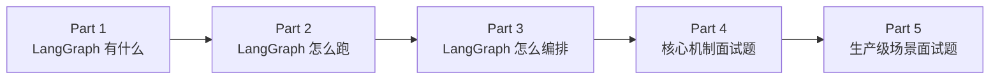

# 从这里开始

你现在的第一目标不是记住几十个 LangGraph API，而是先回答四个问题：

1. **LangGraph 在 Agent 系统里到底负责什么？**
2. **LangGraph 自己由哪些核心机制组成？**
3. **一次 Graph 从输入到结束到底怎样运行？**
4. **作为开发者，我到底怎样把这些东西编排出来？**

只要这四个问题还不能连成一张图，就暂时不要进入大量生产题。

## Part 1 阅读顺序

1. [[讲解/01-全景地图/01-框架定位与系统边界|01 框架定位与系统边界]]
2. [[讲解/01-全景地图/02-六大核心模块|02 六大核心模块]]
3. [[讲解/01-全景地图/03-核心运行循环|03 核心运行循环]]
4. [[讲解/01-全景地图/04-开发者编排视角|04 开发者编排视角]]
5. [[讲解/01-全景地图/05-贯穿案例-采购经营数据分析Agent|05 贯穿案例：采购经营数据分析 Agent]]
6. [[讲解/01-全景地图/06-Part1学习检查|06 Part 1 学习检查]]

如果阅读中忘记术语位置，可以看 [[附录/核心术语索引]]，但不要一开始把术语索引从头背一遍。

## 整体路线

Part 1 建立的是“地图”；Part 2 和 Part 3 才会把地图里的组件真正跑起来、写出来；后面的题目都必须能回到前三部分的骨架上。
