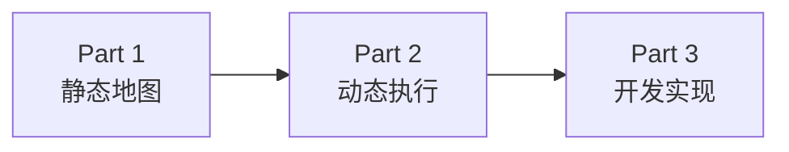

# LangGraph 学习路线

| Part | 核心问题 | 当前状态 | 完成后的能力 |
|---|---|---|---|
| Part 1：全景地图 | LangGraph 有什么？各部分是什么关系？ | 第一版已完成 | 能画出框架结构并定位主要概念 |
| Part 2：完整运行旅程 | 一次 `graph.invoke()` 到底怎样推进？ | 第一版已完成 | 能沿真实数据解释状态、节点、路由、并行和持久化 |
| Part 3：开发者编排 | 从业务需求到可执行 Graph 怎么写？ | 第一版已完成 | 能完成 State、Node、控制流、并行、Tool、持久化的基本设计 |
| Part 4：核心机制题 | 面试官单独追问某个机制时怎么答？ | 待生成 | 能从整体位置解释 State、Reducer、Command、Checkpoint 等 |
| Part 5：生产级场景题 | 已经使用 LangGraph 后为什么仍会出问题？ | 待生成 | 能处理恢复、幂等、并发、权限、观测、评估等场景 |

## 前三部分之间的关系

- Part 1：看到 State、Node、Edge、Runtime、Persistence 等组件在整套框架里的位置。
- Part 2：沿一次采购分析任务看这些组件怎样真正协同运行。
- Part 3：从同一业务需求反向设计 State、Node、边、并行与持久化，并落到代码。

完成 Part 3 后，基础阶段结束。后续 Part 4 不再按“教材章节”平铺，而是转成面试官追问核心机制；Part 5 再进入真实生产问题和系统设计。

## 贯穿业务

全程使用同一个“集团采购经营数据分析 Agent”：从用户提出经营分析目标开始，获取采购数据、进行数据质量处理、指标计算、异常识别、下钻分析、业务解释、图表与报告生成，并在后续章节扩展到定时执行、主动预警、人工确认和多 Agent 协作。