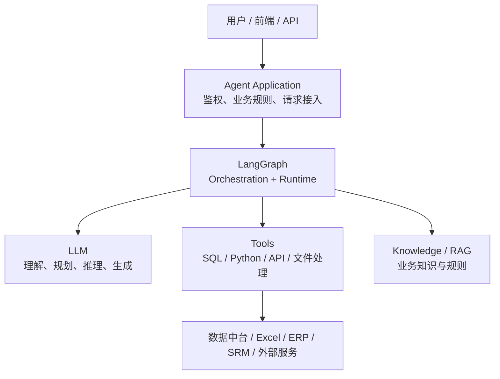
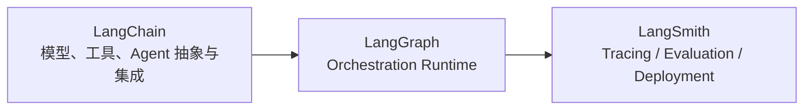

# 01｜LangGraph 在 Agent 系统里到底负责什么？

## 先看结论

LangGraph 是一个面向长生命周期、有状态 Agent 的**底层编排框架与运行时（low-level orchestration framework and runtime）**。它的核心价值不是“提供一个更聪明的模型”，而是把模型、工具、普通代码和外部系统组织成一个可控制、可持久、可暂停恢复的执行流程。

官方文档把 LangGraph 的重点放在编排（Orchestration）、持久执行（Durable Execution）、流式输出（Streaming）、人在回路（Human-in-the-loop）和持久化（Persistence）等运行能力上。

## 放到完整系统里看

这张图最重要的是**边界**。

### LangGraph 负责什么

- 执行流程如何组织；
- 当前任务状态（State）如何在步骤之间流动；
- 哪个节点（Node）下一步被执行；
- 如何表达分支、循环、并行和动态分发；
- 如何保存线程（Thread）内的图状态；
- 如何暂停、恢复和组合更大的图。

### LangGraph 不直接负责什么

- 模型本身训练得好不好；
- SQL 是否正确；
- Excel 清洗逻辑是否符合业务；
- 采购指标定义是否正确；
- ERP / SRM 是否可靠；
- 身份鉴权和业务授权规则本身如何制定；
- 外部写入是否天然满足幂等性（Idempotency）。

也就是说，LangGraph 管的是**“谁在什么时候做什么，以及做完后往哪里走”**；具体“事情怎么做”仍然由大语言模型（Large Language Model，LLM）、工具（Tool）、普通代码或外部系统完成。

## 和 LangChain、LangSmith 的关系

这不是严格的调用链，而是职责示意：

- LangChain 更偏模型、工具和高层 Agent 抽象；
- LangGraph 更偏底层执行编排和运行时（Runtime）；
- LangSmith 更偏追踪（Tracing）、评估（Evaluation）与部署平台能力。

LangGraph 可以使用 LangChain 的模型与工具组件，但官方明确说明：**使用 LangGraph 并不要求必须使用 LangChain。**

## 放进我们的贯穿案例

用户提出：

> 分析本月集团采购成本变化，找出同比异常最大的品类和子公司，继续下钻供应商与采购明细，判断主要原因，并生成经营分析报告。

这个任务里：

- 数据中台、Excel、ERP / SRM 提供原始数据；
- SQL / Python 工具负责确定性的计算与清洗；
- 大语言模型（Large Language Model，LLM）可以负责分析计划、结果解释和报告生成；
- LangGraph 负责把“取数 → 清洗 → 指标计算 → 异常识别 → 下钻 → 解释 → 报告”编排成一套有状态执行流程。

> [!important] 当前要形成的第一条认知
> LangGraph 不是“另一个 LLM 框架名字”，而是站在 Agent 执行层负责 **Orchestration + Runtime** 的那一块。

## 官方来源

- LangGraph Overview：https://docs.langchain.com/oss/python/langgraph/overview
