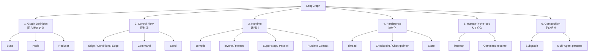
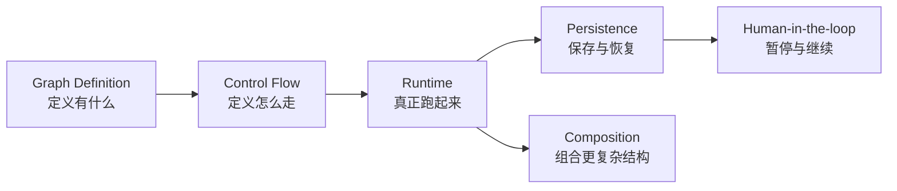

# 02｜把 LangGraph 先拆成六大块

> [!note] 分类说明
> “六大块”是本 Vault 为建立心智模型做的教学分类，不是 LangGraph 官方给出的六个产品模块名称。官方图应用程序接口（Graph API）的最基础概念仍是状态（State）、节点（Node）和边（Edge）。

## 总图

## 1. 图与状态定义（Graph Definition）

这一块回答：**“这个 Agent 的可执行结构由什么组成？”**

- 状态（State）：当前应用状态的共享快照。
- 节点（Node）：执行具体逻辑的函数；可以是普通代码，也可以调用大语言模型（Large Language Model，LLM）或工具（Tool）。
- Reducer（状态合并函数）：节点（Node）返回状态更新（State Update）后，决定某个状态字段应该覆盖、追加还是用自定义规则合并。

在采购经营分析 Agent 中，分析目标、已获得的数据、异常品类、下钻结果、结论和报告都可能进入状态（State）；取数、清洗、计算、分析和报告则可能分别成为节点（Node）。

## 2. 控制流（Control Flow）

这一块回答：**“当前节点执行完以后，到底去哪？”**

- 边（Edge）：固定地连接下一个节点（Node）。
- 条件边（Conditional Edge）：根据状态（State）决定下一步。
- `Command`：可以在一次返回里同时携带状态更新和控制跳转等信息。
- `Send`：适合运行时才知道有多少工作项的动态分发，例如发现 12 个异常品类后动态创建 12 个分析任务。

## 3. 运行时（Runtime）

这一块回答：**“定义好的 Graph 到底是谁跑起来的？”**

- `compile()`：把 Graph 定义编译为可执行对象，也是接入检查点持久化器（Checkpointer）等能力的位置之一。
- `invoke()` / `stream()`：真正启动一次执行。
- 超级步（Super-step）：LangGraph 底层受 Pregel 启发，以离散执行轮次推进；同一个超级步（Super-step）可以包含多个并行节点（Node）。
- 运行时上下文（Runtime Context）：给节点（Node）提供当前运行所需但不适合放进状态（State）的依赖或配置。

## 4. 持久化（Persistence）

这一块回答：**“任务跨请求、跨时间甚至发生故障以后，执行状态怎么办？”**

官方把持久化（Persistence）分成两套互补系统：

- 检查点持久化器（Checkpointer）：把某条线程（Thread）的 Graph 状态保存成检查点（Checkpoint），用于线程内短期状态、连续会话、人工介入、故障恢复等。
- 存储（Store）：保存 Graph 状态之外的跨线程长期数据，例如用户偏好、长期事实或共享知识。

不要把检查点持久化器（Checkpointer）和存储（Store）都笼统叫“Memory”。

## 5. 人在回路（Human-in-the-loop）

这一块回答：**“Agent 运行到关键动作前，能不能停下来等人？”**

- `interrupt()`：暂停当前执行并向外暴露需要人工处理的信息。
- `Command(resume=...)`：之后使用相同线程（Thread）恢复执行。

它依赖持久化（Persistence），因此人工介入并不是一个孤立 API。

## 6. 复杂组合（Composition）

这一块回答：**“一个 Graph 变得很大以后怎么办？”**

- 子图（Subgraph）：把一整块复杂流程作为另一个 Graph 组合进父 Graph。
- 多智能体系统（Multi-Agent System）：通常进一步利用子图（Subgraph）、路由（Routing）、`Command` 等基础机制组织多个 Agent 的职责和控制权。

因此多智能体系统（Multi-Agent System）不是和状态（State）、节点（Node）、边（Edge）平行的一套完全独立知识，而是建立在这些基础机制之上的更高层组织方式。

## 现在应该记住的关系

这不是严格的执行顺序，而是学习关系。后续每遇到一个新概念，先判断它属于哪一块，再研究内部细节。

## 官方来源

- Graph API：https://docs.langchain.com/oss/python/langgraph/graph-api
- Persistence：https://docs.langchain.com/oss/python/langgraph/persistence
- Interrupts：https://docs.langchain.com/oss/python/langgraph/interrupts
- Subgraphs：https://docs.langchain.com/oss/python/langgraph/use-subgraphs
