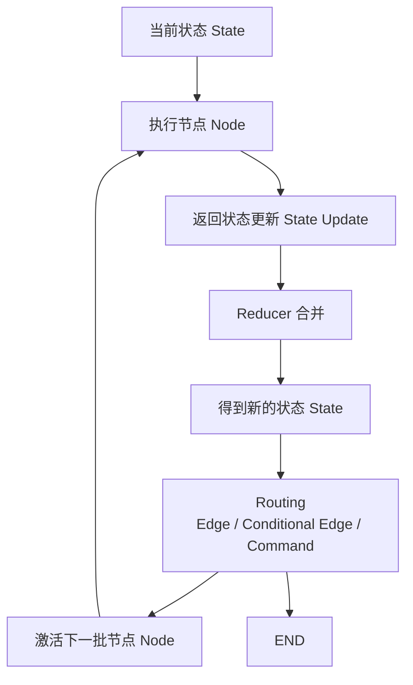
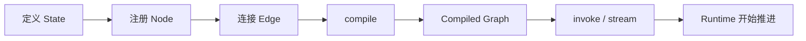
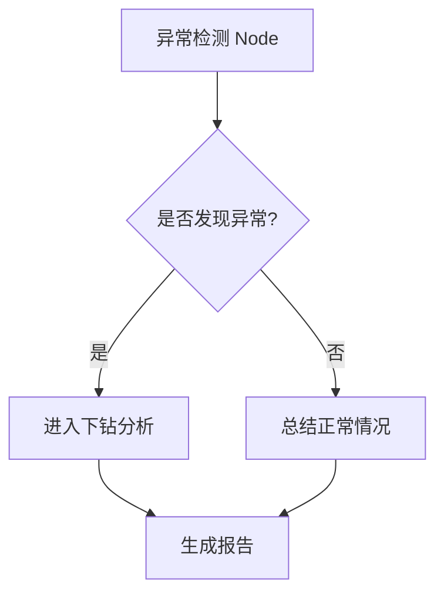
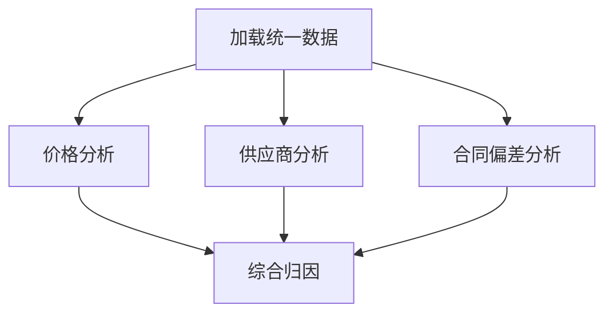

# 03｜一次 Graph 最核心的运行循环

Part 1 最重要的动态模型不是某个 API，而是下面这条循环：



## 第一步：运行从可执行 Graph 开始

定义阶段通常会先创建 `StateGraph`、注册节点（Node）和边（Edge），然后调用 `compile()` 得到可执行 Graph。真正传入用户任务，则发生在 `invoke()`、`stream()` 或相关运行接口。

因此要把两个阶段分开：



`compile()` 不是“任务已经执行”，而是把图结构准备成可运行对象。

## 第二步：节点（Node）读取状态（State）并工作

假设当前状态（State）里已经有：

```python
{
    "analysis_goal": "定位本月采购成本异常",
    "cleaned_data_ref": "dataset://procurement/2026-08",
    "abnormal_categories": []
}
```

异常识别节点（Node）完成计算后可以只返回：

```python
{"abnormal_categories": ["中药材", "包材"]}
```

这叫状态更新（State Update），不是“重新创建一个只剩一个字段的新状态”。

## 第三步：Reducer 决定字段如何合并

如果一个字段没有特殊合并规则，新更新通常覆盖旧值；如果字段配置了 Reducer（状态合并函数），则可以追加、聚合或使用自定义规则。

这在并行分析中尤其重要：多个节点（Node）可能在同一执行轮次里都向某个列表型结果字段写入数据，Reducer（状态合并函数）决定这些更新最终如何形成新的状态（State）。

## 第四步：路由（Routing）决定下一步

得到新的状态（State）后，控制流（Control Flow）会决定接下来激活哪些节点（Node）：



这里可以由固定边（Edge）、条件边（Conditional Edge）或 `Command` 表达不同控制方式。

## 第五步：LangGraph 为什么会谈超级步（Super-step）

官方图应用程序接口（Graph API）说明 LangGraph 的执行模型受到 Pregel 启发，Graph 以离散的超级步（Super-step）推进。同一个超级步（Super-step）中的多个节点（Node）可以并行执行，顺序节点（Node）则位于不同超级步（Super-step）。

例如：



可以把它理解为：

- Super-step 1：`加载统一数据`
- Super-step 2：`价格分析`、`供应商分析`、`合同偏差分析` 并行
- Super-step 3：`综合归因`

这个执行模型是以后理解并发、Reducer（状态合并函数）、动态分发、检查点（Checkpoint）和恢复行为的重要前置知识。

## 有持久化时，执行循环多了一层“可恢复状态”

配置检查点持久化器（Checkpointer）后，某条线程（Thread）的 Graph 状态会以检查点（Checkpoint）的形式被持久化。于是运行不再只是“一次函数调用从头跑到尾”，而可以支持连续对话、人工介入和故障恢复。

这里先只建立位置关系，不展开检查点保存时机、重执行与副作用等生产细节；那些会进入后续生产级场景。

## 一句话看懂整个动态骨架

> 节点（Node）读取当前状态（State）完成工作并返回状态更新（State Update），Reducer（状态合并函数）把更新合并成新状态（State），控制流（Control Flow）根据新状态决定下一批节点（Node），运行时（Runtime）不断推进这个过程，直到结束或被中断。

## 官方来源

- Graph API：https://docs.langchain.com/oss/python/langgraph/graph-api
- Persistence：https://docs.langchain.com/oss/python/langgraph/persistence
