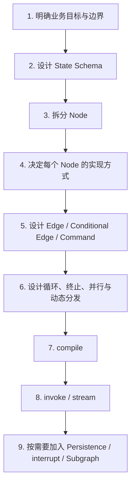
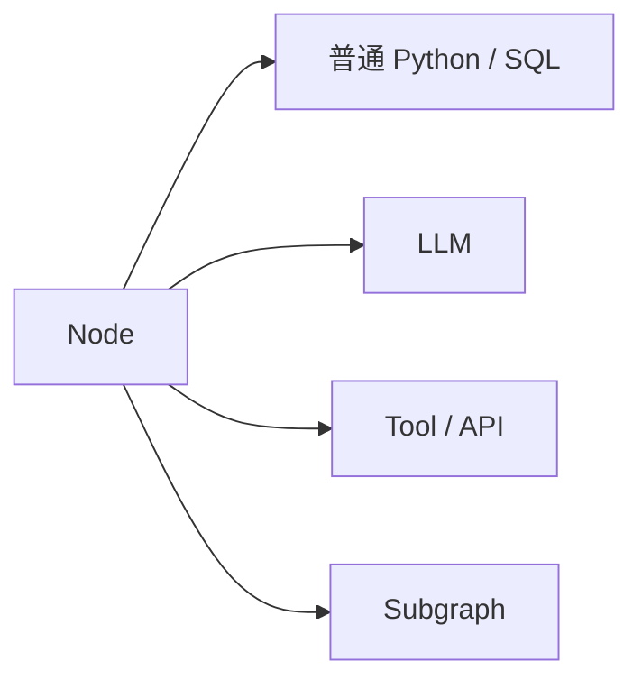
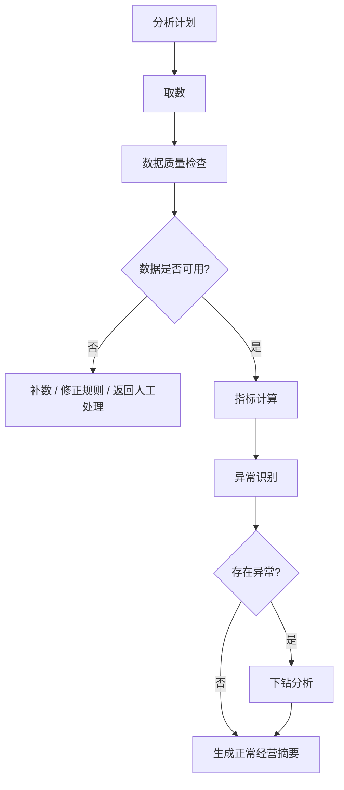

# 04｜如果让我自己开发，我到底在编排什么？

从开发者视角看，LangGraph 的重点不是“调用某个神奇 Agent API”，而是把业务执行过程建模成 **状态（State） + 节点（Node） + 控制流（Control Flow）**。

## 开发者的主流程



## 1. 先设计任务状态，而不是先写 Prompt

对于采购经营分析 Agent，状态（State）至少要回答：

- 用户到底想分析什么；
- 当前分析范围是什么；
- 已经获得哪些数据或数据引用；
- 当前发现了哪些异常；
- 下钻到了哪一层；
- 已经形成哪些结论；
- 报告是否已经生成。

状态（State）设计的本质是：**哪些信息需要在多个节点（Node）之间持续共享和演化？**

## 2. 再把工作拆成节点（Node）

一个节点（Node）应该承担一个清楚的执行职责。例如：

```text
plan_analysis         生成分析计划
load_data             获取数据
validate_data         数据质量检查
calculate_metrics     计算指标
find_anomalies        识别异常
analyze_dimension     下钻某一维度
synthesize_findings   综合归因
create_report         生成报告
```

节点（Node）不等于大语言模型（Large Language Model，LLM）。



确定性计算优先交给普通代码或工具（Tool）；需要语言理解、计划、解释和生成的部分才适合交给大语言模型（Large Language Model，LLM）。

## 3. 然后设计控制流（Control Flow）

节点（Node）只定义“做什么”，还需要控制流（Control Flow）定义“做完以后去哪里”。

例如：



这一步才是 LangGraph “编排”的核心：把确定性流程和 Agent 式决策放到同一套可执行图里。

## 4. 再考虑运行方式

定义完成后通过 `compile()` 得到可执行 Graph，再使用 `invoke()`、`stream()` 等接口运行。需要连续会话或恢复时，再把检查点持久化器（Checkpointer）接入编译后的运行体系；需要人工确认时使用人在回路（Human-in-the-loop）；流程过大时考虑子图（Subgraph）。

这里的顺序并不意味着“持久化一定最后才想”。真实项目应在架构阶段考虑运行生命周期，只是学习时先把基础图模型分清，再叠加这些能力。

## Graph API 与 Functional API

LangGraph 当前同时提供图应用程序接口（Graph API）和函数式应用程序接口（Functional API）。两者共享同一底层运行时（Runtime）。

- 图应用程序接口（Graph API）：显式暴露状态（State）、节点（Node）和边（Edge），非常适合建立框架心智模型和表达复杂控制流。
- 函数式应用程序接口（Functional API）：通过 `@entrypoint`、`@task` 等方式保留普通 Python 控制流，同时获得持久执行、流式输出和人工介入等能力。

本 Vault 主线先使用图应用程序接口（Graph API），因为面试时需要先看清框架内部的组织方式；后续再专门比较两种 API。

## 现在看到代码时应该会定位

```python
builder = StateGraph(AnalysisState)          # 定义 State Schema
builder.add_node("load_data", load_data)    # 注册 Node
builder.add_edge(START, "load_data")        # 定义 Edge
# ...
graph = builder.compile()                    # 生成可执行 Graph
result = graph.invoke(initial_state)         # Runtime 开始执行
```

Part 1 不要求你背这些代码，而是看到每一行时知道它属于整张全景图的哪一层。

## 官方来源

- Graph API：https://docs.langchain.com/oss/python/langgraph/graph-api
- Functional API：https://docs.langchain.com/oss/python/langgraph/functional-api
