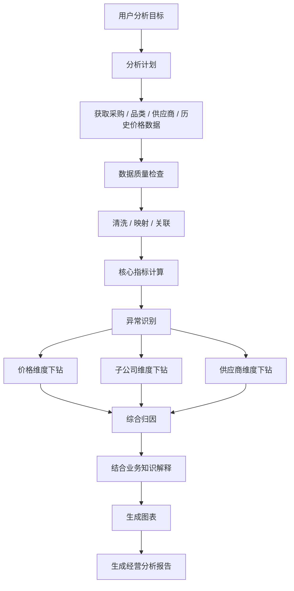
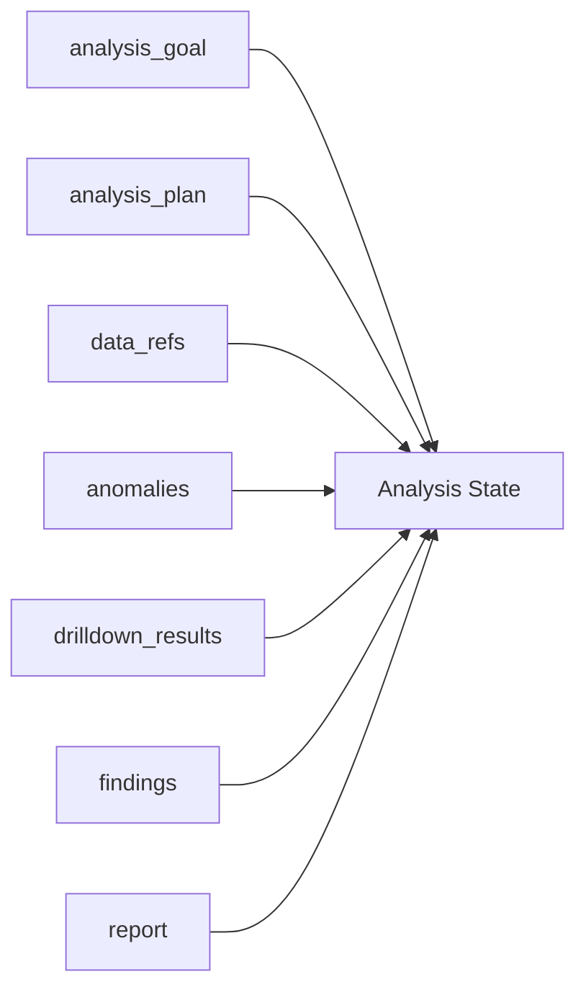
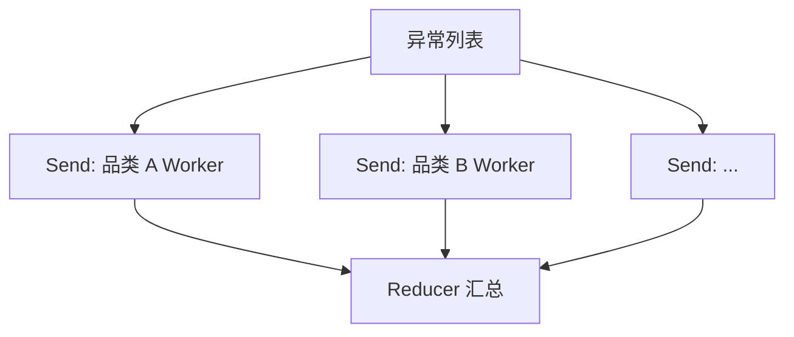
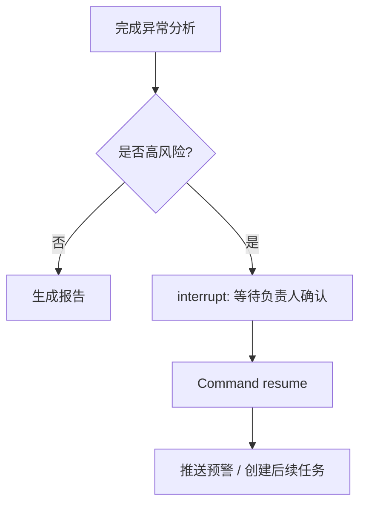

# 05｜贯穿案例：采购经营数据分析 Agent

后续所有章节尽量围绕同一个业务，不再频繁更换例子。

## 用户目标

> 分析本月集团采购成本变化，找出同比异常最大的品类和子公司，继续下钻到供应商与采购明细，判断主要原因，并生成一份经营分析报告。

这里故意选择“信息处理 + 数据分析 + 报告”的业务，因为它同时包含确定性数据处理和非确定性分析推理，适合观察 LangGraph 怎样把不同能力编排到一起。

## 完整业务图

并不是图里每一个框都必须成为一个节点（Node）。节点（Node）粒度会在 Part 3 专门讨论。现在只用它观察职责。

## 哪些适合普通代码，哪些适合大语言模型

| 工作 | 更典型的实现 | 原因 |
|---|---|---|
| 文件解析、字段映射、数据清洗 | Python / 数据处理工具（Tool） | 规则明确，需要可复现 |
| 同比、环比、分组聚合 | SQL / Python / 指标服务 | 数值计算应确定性执行 |
| 分析目标拆解 | 大语言模型（Large Language Model，LLM）或固定模板 | 自然语言需求可能开放 |
| 选择下钻方向 | 条件逻辑 + 大语言模型（Large Language Model，LLM） | 可以同时利用硬规则和语义判断 |
| 业务原因解释 | 大语言模型（Large Language Model，LLM）+ 知识检索 | 需要结合数据与业务语义 |
| 报告文字组织 | 大语言模型（Large Language Model，LLM） | 适合结构化生成与表述 |

这正体现 LangGraph 官方强调的一个特征：同一 Graph 可以把确定性步骤和大语言模型（Large Language Model，LLM）驱动的 Agentic 步骤混合起来。

## 状态（State）在这个业务里保存什么

注意：原始大表不一定必须全部塞进状态（State）。真实工程中可以只保存数据引用、查询参数、结果摘要或对象标识，具体选择取决于数据规模、序列化成本、持久化策略和安全要求。Part 1 只需要知道状态（State）承载“跨节点需要共享和演化的信息”。

## 动态分发为什么在数据分析里很自然

异常识别后可能只发现 2 个异常维度，也可能发现 20 个异常品类。数量在运行前并不确定。

这就是 `Send` 和 Reducer（状态合并函数）以后会组合出现的一个典型原因：运行时动态创建多个 Worker，再把结果汇总回来。

## 持久化和人工介入以后会放在哪里

后续可以扩展：

此时检查点持久化器（Checkpointer）、线程（Thread）、检查点（Checkpoint）和人在回路（Human-in-the-loop）就不再是孤立术语，而是服务于一个真实长生命周期任务。

## 以后多智能体系统从哪里长出来

当单一 Graph 变得过于复杂，可以把“问数分析”“异常归因”“报告生成”“风险解释”等能力拆成子图（Subgraph）或多个 Agent。是否拆分的依据是职责、状态隔离、控制权和协作成本，而不是“多 Agent 看起来更高级”。

## 这条业务线后面不会变

Part 2 会沿同一个任务真正走一遍运行时（Runtime）；Part 3 会把它编排成代码；核心机制题和生产场景题也优先回到这套业务解释。
