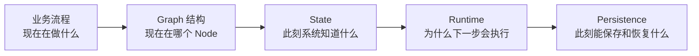

# Part 2｜一次采购经营数据分析 Agent 的完整运行旅程

Part 1 已经回答“LangGraph 大致有什么”。Part 2 不再继续扩展名词，而是把同一套组件放到一次真实任务里，让你看到它们**什么时候出现、为什么出现、数据怎样变化、运行时怎样推进**。

## 固定任务

用户提出：

> 分析 2026 年 8 月集团采购成本变化，找出同比异常最大的品类、子公司和供应商，继续下钻原因，并生成经营分析报告。

为了看清 LangGraph 运行机制，我们使用一份很小的教学数据。真实项目里可能是几万行甚至更多，这里故意缩小到 5 条。

| row | 子公司 | 品类 | 供应商 | 数量 | 本期单价 | 去年同期单价 |
|---:|---|---|---|---:|---:|---:|
| 1 | 甲公司 | 中药材 | 供应商 A | 1000 | 48 | 40 |
| 2 | 甲公司 | 包材 | 供应商 B | 20000 | 2.30 | 2.20 |
| 3 | 乙公司 | 中药材 | 供应商 C | 1600 | 55 | 41 |
| 4 | 乙公司 | 原料药 | 供应商 D | 500 | 118 | 115 |
| 5 | 丙公司 | 中药材 | 供应商 A | 900 | 49 | 40 |

为了演示异常路由，我们设定一个**教学规则**：单条采购记录单价同比上涨超过 15% 时，标为价格异常。这只是课程规则，不是通用采购业务标准。

这五条数据的同比涨幅分别约为：20%、4.5%、34.1%、2.6%、22.5%。因此 1、3、5 行会进入异常分析。

## 阅读时始终带着五个视角

如果你看某篇笔记时迷失，就回到这五个问题。

## Part 2 阅读顺序

- [[01-一张图看完整执行链路]]：先看整部“电影”，不要急着研究单个镜头。
- [[02-从invoke到第一个Node]]：理解 `invoke()` 之后 Runtime 到底开始做什么。
- [[03-State如何随真实数据演化]]：用 S0 → S6 看 State 不断变成什么样。
- [[04-Node-LLM-Tool谁调用谁]]：分清 Node、LLM、Tool、外部系统各自的调用责任。
- [[05-分支并行与Super-step]]：看异常发现以后如何 fan-out、并行、fan-in。
- [[06-Thread-Checkpoint与可恢复生命周期]]：把同一次执行放进 Thread 和 Checkpoint 生命周期。
- [[07-Part2学习检查]]：检查自己能不能不看资料走完整条链。

> [!important]
> Part 2 的重点不是背代码，而是看到代码时能把它映射回“业务步骤 → Graph Node → State Update → Runtime Routing → Checkpoint”。
