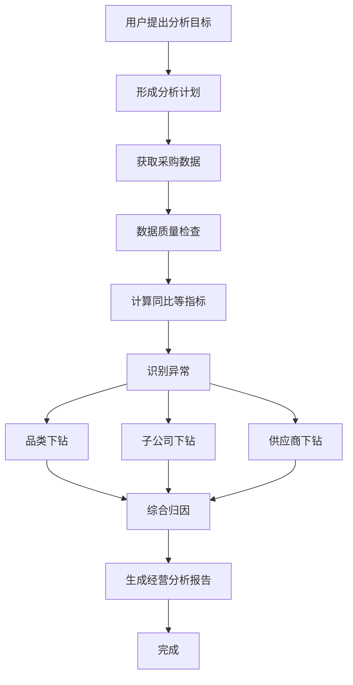
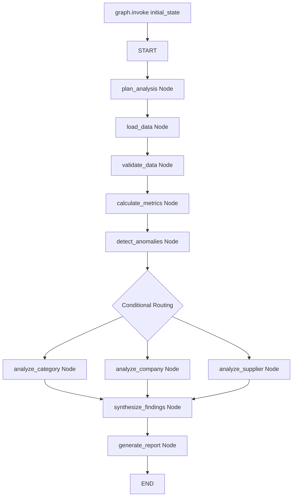
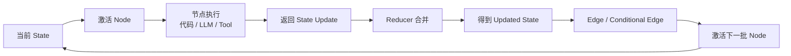
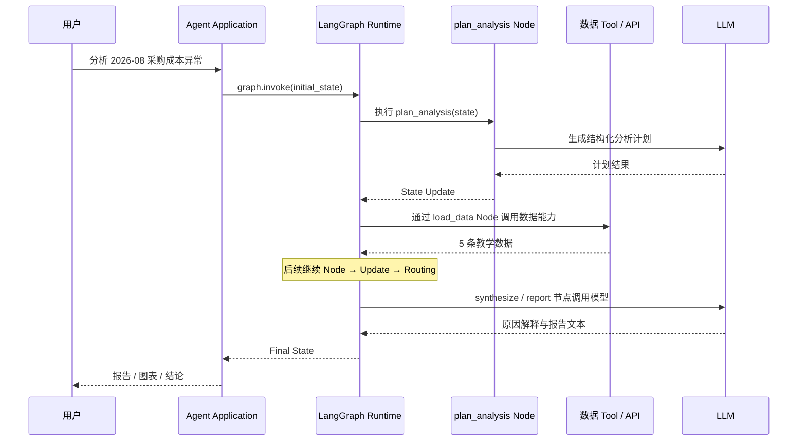
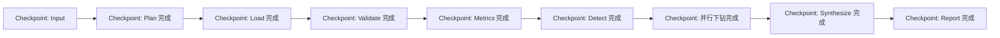

# 01｜先看整部电影：一次 Graph 到底怎样从请求跑到报告？

如果 Part 1 像看一栋工厂的平面图，Part 2 就是看这家工厂真正开工一次。

## 1. 先看业务全流程

同一个用户请求，业务上可以理解为：



这是**业务图**。它只告诉你“工作顺序”，还没有告诉你 LangGraph 内部是怎么跑的。

## 2. 换成 LangGraph 视角



这里每个业务动作都落到了一个节点（Node）或路由（Routing）位置。

你可以把 LangGraph Runtime 想象成**一个拿着当前项目工作台和流程图的调度员**：

- 它不会自己算同比；
- 它不会自己写采购报告；
- 它会激活该执行的节点（Node）；
- 节点（Node）做完后把结果交回来；
- Runtime 把结果合并进状态（State）；
- 然后根据边（Edge）或路由规则决定下一批节点。

## 3. 同一次执行的 Runtime 循环



这张图就是 Part 2 的“发动机”。

> [!example] 类比
> 把 State 想成一个共享分析工作台；Node 是不同分析岗位；Reducer 是各栏目怎么合并新结果的规则；Edge 是任务流转单；Runtime 是调度员。每个岗位完成工作后，不是自己私下去叫下一个岗位，而是把结果交回系统，由调度规则决定下一步。

## 4. 同一次执行的调用时序

下面再换一个角度：谁调用谁？



注意：严格来说是 `load_data` Node 调用 Tool，这里为了突出系统层关系省略了该 Node 的生命线。[[04-Node-LLM-Tool谁调用谁]] 会把这件事拆开。

## 5. 这次任务的 State 会经历什么

你后面会看到类似这样的变化：

```text
S0：只有用户问题和分析月份
 ↓
S1：多了 analysis_plan
 ↓
S2：多了 data_rows / data_ref
 ↓
S3：多了 metrics
 ↓
S4：多了 anomalies
 ↓
S5：三个并行分析节点把 drilldown_results 汇总回来
 ↓
S6：多了 findings 和 report
```

所以 State 不是静态对象，而是**Graph 执行过程中不断演化的当前事实集合**。

## 6. 这次任务的 Super-step 大致怎么分

在我们这条固定路径中，可以先这样理解：

```text
Input      初始输入进入图
Step 1     plan_analysis
Step 2     load_data
Step 3     validate_data
Step 4     calculate_metrics
Step 5     detect_anomalies
Step 6     analyze_category + analyze_company + analyze_supplier  并行
Step 7     synthesize_findings
Step 8     generate_report
END
```

其中 Step 6 的三个节点属于**同一个超级步（Super-step）**，因为它们是同一轮被激活的并行节点。官方 Graph API 将 Super-step 描述为图执行的一次离散迭代；并行节点处于同一 Super-step，顺序节点位于不同 Super-step。

## 7. 如果配置了 Checkpointer，Checkpoint 又包在哪里



官方当前文档说明：配置检查点持久化器（Checkpointer）后，完整状态快照（Checkpoint）建立在超级步（Super-step）边界上。也就是说，Checkpoint 并不是“每执行一行 Python 就自动存一次”。

## 8. 先记住这一条完整因果链

> 用户请求通过 `graph.invoke()` 进入可执行 Graph → Runtime 用当前 State 激活 Node → Node 通过普通代码、LLM 或 Tool 完成工作并返回 State Update → Reducer 把更新合并进 State → Edge / Conditional Edge 根据新 State 决定下一批 Node → 并行分支在同一个 Super-step 内执行并汇总 → 持久化开启时，Thread 中形成连续 Checkpoint → 最终到达 END 并返回 Final State。

如果这条链已经能在脑中连起来，Part 2 后面每篇只是把其中一段放大。

## 官方来源

- Graph API：https://docs.langchain.com/oss/python/langgraph/graph-api
- Checkpointers：https://docs.langchain.com/oss/python/langgraph/checkpointers
