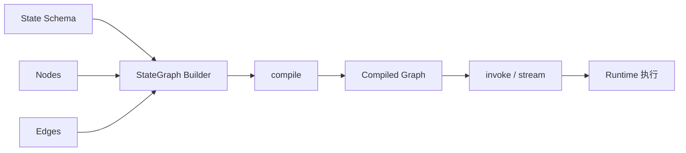
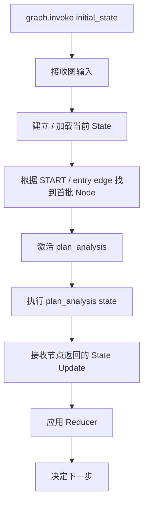

# 02｜`graph.invoke()` 之后，到底发生了什么？

很多人看到：

```python
graph = builder.compile()
result = graph.invoke(initial_state)
```

就只记住“compile 后 invoke”。但真正重要的是：**第二行开始，Graph 才进入运行时（Runtime）阶段。**

## 1. `StateGraph` 是施工图，Compiled Graph 才是可运行机器



`builder.add_node()` 和 `builder.add_edge()` 在定义结构。官方文档说明，`compile()` 会做基础结构检查，并且是配置 Checkpointer 等运行参数的位置之一；Graph 必须先 compile 才能使用。

> [!example] 类比
> `StateGraph` 像施工图和工位布局；`compile()` 像验收并把流水线安装成可启动设备；`invoke()` 才是真正按下“开始生产”按钮。

## 2. 这次任务的 initial_state 是什么

我们给用户请求构造一个最小输入：

```python
initial_state = {
    "user_query": "分析 2026 年 8 月集团采购成本异常，并生成报告",
    "analysis_month": "2026-08",
    "analysis_plan": [],
    "data_rows": [],
    "metrics": [],
    "anomalies": [],
    "drilldown_results": [],
    "findings": [],
    "report": "",
}
```

这相当于 **S0**：任务已经被创建，但真正的分析工作还没有发生。

需要特别注意：真实系统不一定把几十万行原始数据放进 State。教学数据只有 5 行，所以直接展示；生产系统更常见的是保存查询条件、对象 ID、数据集引用、摘要结果等，避免大对象在每次 State / Checkpoint 中重复序列化。

## 3. `invoke()` 不是“调用第一个函数这么简单”

从概念上，它做的是：



LangGraph 官方底层执行模型使用消息传递（message passing）和 Super-step 概念。一个 Node 收到新状态输入后被激活，执行并产生更新，然后后续 Node 再被激活。

## 4. 第一个 Node：`plan_analysis`

假设我们让大语言模型（Large Language Model，LLM）负责把自然语言需求拆成一个结构化分析计划：

```python
def plan_analysis(state: AnalysisState):
    # 教学伪代码：真实实现会调用模型并要求结构化输出
    plan = [
        "获取 2026-08 与去年同期采购记录",
        "检查数据质量",
        "计算单价同比变化",
        "识别异常记录",
        "按品类、子公司、供应商下钻",
        "综合归因并生成报告",
    ]
    return {"analysis_plan": plan}
```

这里最关键的不是 LLM，而是返回值：

```python
{"analysis_plan": plan}
```

Node 不需要把整个 State 全部复制返回。它只返回这一步产生的**状态更新（State Update）**。

## 5. Runtime 收到更新以后怎么办

原来的状态里：

```python
"analysis_plan": []
```

Node 返回：

```python
"analysis_plan": ["获取数据", "检查质量", ...]
```

如果这个字段没有配置自定义 Reducer，则默认更新语义是“新值覆盖旧值”。于是 S0 变成 S1：

```text
S0
analysis_plan = []

      plan_analysis 返回 update
                 ↓
S1
analysis_plan = [获取数据, 检查质量, ...]
```

其他字段不会因为 Node 没有返回而消失。官方 Graph API 明确把 Node 输出视为对 State 的部分更新。

## 6. 为什么 Node 不自己调用下一个 Node

你当然可以写：

```python
def plan_analysis(state):
    ...
    return load_data(...)
```

但这样控制流就重新藏进普通函数调用里了。

LangGraph 更希望把“做什么”和“下一步去哪”分开：

```text
plan_analysis Node
    负责：形成计划

Edge
    负责：plan_analysis 完成后去 load_data
```

代码大致是：

```python
builder.add_edge("plan_analysis", "load_data")
```

这就是编排框架的价值之一：你能直接看到和修改流程结构，而不是到每个业务函数内部寻找“它接下来调用了谁”。

## 7. `stream()` 又是什么位置

`invoke()` 更像“等整次 Graph 结束后拿 Final State”；`stream()` / `stream_events()` 则允许你观察执行中的更新、状态或消息流。不同具体接口和 stream mode 会影响你拿到的事件形态。

Part 2 先记住：

```text
invoke = 启动并等待完整结果
stream = 启动并持续观察过程
```

后面做可观测性与前端实时反馈时，再深入 streaming 的事件类型。

## 8. 这一篇真正要理解的东西

不是“invoke 是一个函数”，而是：

> `invoke()` 是从**图定义阶段**进入**图运行阶段**的边界。它把输入交给 Runtime，Runtime 用 State + Graph 结构激活第一个 Node；Node 返回的不是“下一个函数调用”，而是 State Update；状态更新完成后，Runtime 再按图结构推进。

## 官方来源

- Graph API：https://docs.langchain.com/oss/python/langgraph/graph-api
- Quickstart：https://docs.langchain.com/oss/python/langgraph/quickstart
