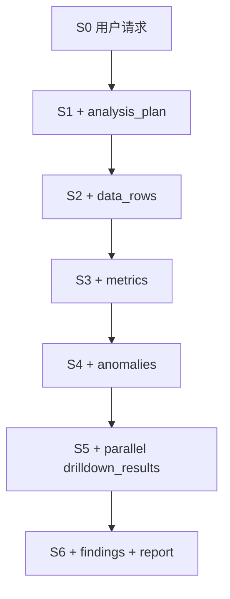

# 03｜不要只背“State 是共享状态”：看它怎样从 S0 变成 S6

状态（State）最容易被讲得抽象。你可以先把它想成**整个分析任务共用的一张项目工作台**：每个节点（Node）从工作台读取自己需要的信息，做完工作后，只把新增或修改的结果写回工作台。

## 1. 教学 State Schema

为了观察数据变化，我们先用一个简化版本：

```python
from operator import add
from typing import Annotated, TypedDict

class AnalysisState(TypedDict):
    user_query: str
    analysis_month: str
    analysis_plan: list[str]
    data_rows: list[dict]
    metrics: list[dict]
    anomalies: list[dict]
    drilldown_results: Annotated[list[dict], add]
    findings: list[str]
    report: str
```

其中只有 `drilldown_results` 明确使用了 `operator.add` 作为 Reducer（状态合并函数），因为后面三个并行节点都会向它追加结果。

## 2. S0：任务刚进入 Graph

```python
{
  "user_query": "分析 2026-08 采购成本异常并生成报告",
  "analysis_month": "2026-08",
  "analysis_plan": [],
  "data_rows": [],
  "metrics": [],
  "anomalies": [],
  "drilldown_results": [],
  "findings": [],
  "report": ""
}
```

此时系统只知道“要做什么”，还不知道任何分析结果。

## 3. S1：`plan_analysis` 写入计划

```python
return {
    "analysis_plan": [
        "取数",
        "质量检查",
        "计算同比",
        "异常识别",
        "多维下钻",
        "综合归因",
        "报告生成",
    ]
}
```

State 里只有 `analysis_plan` 被更新，其他字段继续保留。

## 4. S2：`load_data` 写入真实教学数据

我们使用这 5 条：

```python
rows = [
    {"company": "甲公司", "category": "中药材", "supplier": "供应商A", "qty": 1000, "price": 48, "last_price": 40},
    {"company": "甲公司", "category": "包材",   "supplier": "供应商B", "qty": 20000, "price": 2.30, "last_price": 2.20},
    {"company": "乙公司", "category": "中药材", "supplier": "供应商C", "qty": 1600, "price": 55, "last_price": 41},
    {"company": "乙公司", "category": "原料药", "supplier": "供应商D", "qty": 500, "price": 118, "last_price": 115},
    {"company": "丙公司", "category": "中药材", "supplier": "供应商A", "qty": 900, "price": 49, "last_price": 40},
]
return {"data_rows": rows}
```

现在 State 不再只是“一个用户问题”，而包含后续计算要读取的数据。

> [!note] 生产工程提醒
> 这里为了教学才把 5 条数据直接放入 State。真实数据分析 Agent 经常只在 State 保存 `dataset_id`、查询参数、对象存储 URI、表名、结果摘要等，避免巨大的 DataFrame 在每个 Checkpoint 里重复保存。

## 5. S3：`calculate_metrics` 产生指标

我们计算：

```text
涨幅 = (本期单价 - 去年同期单价) / 去年同期单价
```

得到：

| row | 子公司 | 品类 | 本期单价 | 去年同期 | 同比涨幅 | 价格差影响 = 数量 × 单价差 |
|---:|---|---|---:|---:|---:|---:|
| 1 | 甲公司 | 中药材 | 48 | 40 | 20.0% | 8,000 |
| 2 | 甲公司 | 包材 | 2.30 | 2.20 | 4.5% | 2,000 |
| 3 | 乙公司 | 中药材 | 55 | 41 | 34.1% | 22,400 |
| 4 | 乙公司 | 原料药 | 118 | 115 | 2.6% | 1,500 |
| 5 | 丙公司 | 中药材 | 49 | 40 | 22.5% | 8,100 |

总价格差影响是 42,000；其中三条中药材异常记录合计 38,500，约占 91.7%。这已经说明“中药材”很可能是本次价格上涨的主要来源。

`calculate_metrics` 可以返回：

```python
return {"metrics": metrics}
```

## 6. S4：`detect_anomalies` 写入异常

教学规则：涨幅 > 15%。

所以：

```python
anomalies = [row1, row3, row5]
return {"anomalies": anomalies}
```

此时后续路由已经有了判断依据：

```text
anomalies == []
    → 不需要复杂下钻

anomalies != []
    → 进入多维下钻
```

这就是为什么控制流往往依赖 State：**路由不是凭空决定，而是读取前面节点已经写入的事实。**

## 7. S5：三个并行 Node 同时写 `drilldown_results`

假设三个节点分别返回：

```python
# analyze_category
{"drilldown_results": [
    {"dimension": "category", "key": "中药材", "impact": 38500}
]}

# analyze_company
{"drilldown_results": [
    {"dimension": "company", "key": "乙公司", "largest_row_increase": 0.341}
]}

# analyze_supplier
{"drilldown_results": [
    {"dimension": "supplier", "key": "供应商C", "largest_row_impact": 22400}
]}
```

如果 `drilldown_results` 没有 Reducer，而三个并行节点都写这个字段，会产生并发更新冲突或无法得到你想要的累积结果。

我们使用：

```python
drilldown_results: Annotated[list[dict], add]
```

于是 Reducer 会像“汇总员”一样，把三个分支的结果追加到同一列表：

```python
[
  {"dimension": "category", ...},
  {"dimension": "company", ...},
  {"dimension": "supplier", ...},
]
```

> [!example] 类比
> 三个分析员同时完成工作。如果共享工作台只有一个“分析结果”格子，最后一个人覆盖前两个人，就丢信息；Reducer 相当于事先规定“这个格子不是覆盖，而是把每个人的分析单追加进去”。

## 8. S6：综合归因与报告

`synthesize_findings` 读取 S5，形成：

```python
findings = [
    "价格差影响主要集中在中药材，约占教学样本总影响的 91.7%",
    "乙公司-供应商C 的中药材记录涨幅约 34.1%，为单条最大涨幅",
    "供应商C 对本次价格差影响贡献最大的一条记录为 22,400",
]
```

再由 `generate_report` 写入 `report`。

最终 State 不只是“聊天记录”，而是一条任务从输入到结果的**结构化执行事实**。

## 9. 一张图看 S0 → S6



## 10. 你现在应该如何理解 Reducer

官方文档的精确定义是：每个 State key 都有自己的 Reducer；如果没有显式指定，一般采用覆盖语义。Node 返回 partial update 后，Runtime 对每个更新字段执行对应 Reducer。

通俗地说：

> **State 是工作台；State Update 是“我这一步新产出的内容”；Reducer 是“这个栏目收到新内容时到底覆盖、追加还是自定义合并”。**

这比把 Reducer 单独背成“归约器”更重要。

## 官方来源

- Graph API Reducers：https://docs.langchain.com/oss/python/langgraph/graph-api
