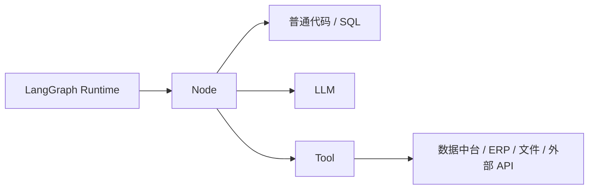
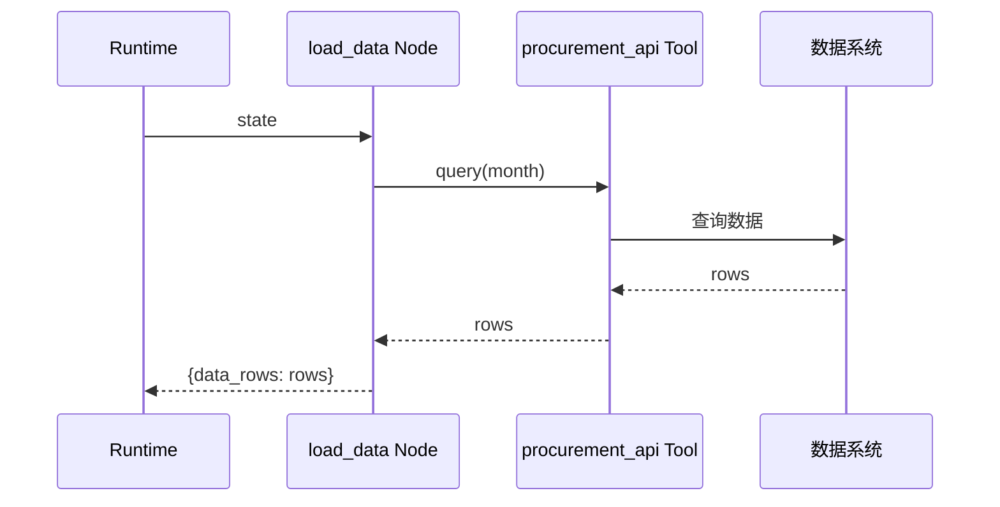
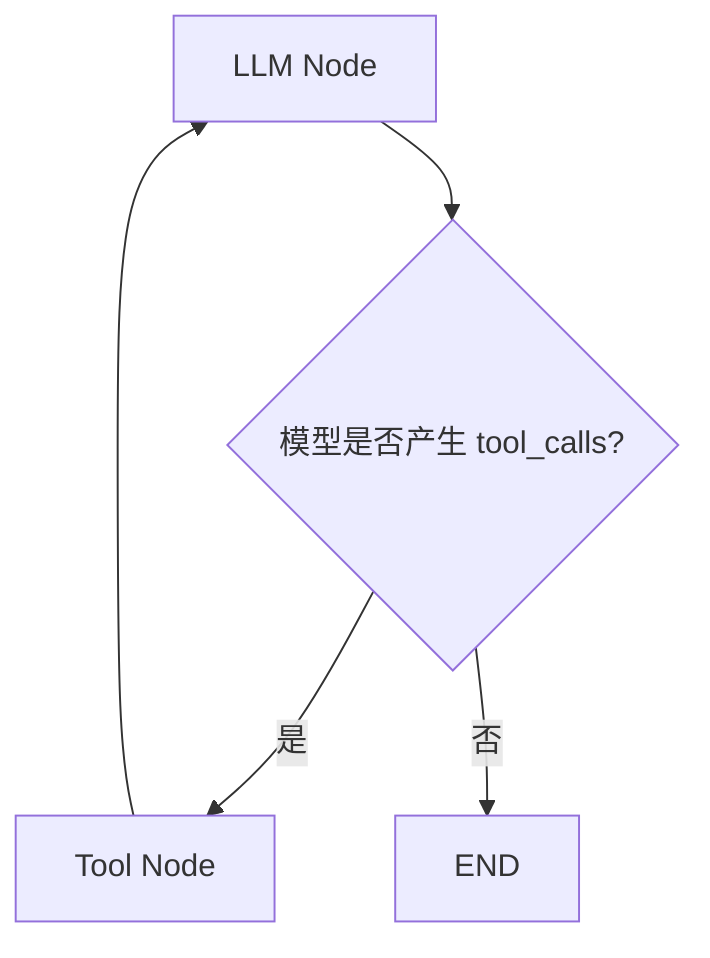

# 04｜Node、LLM、Tool、外部系统到底是什么关系？

这是初学 LangGraph 最容易混成一团的地方。

先给结论：

> **Node 是 Graph 中的执行单位；Node 内部可以运行普通代码、调用 LLM、调用 Tool，也可以组合这些能力。LLM 本身不会因为“想调用工具”就自动修改数据库；真正执行动作的是工具或外部系统。**

## 1. 四个角色先分开



- Runtime：决定什么时候执行哪个 Node。
- Node：Graph 中的工作单元。
- LLM：负责理解、推理、规划、生成等不确定性任务。
- Tool：封装可实际执行的能力，例如查数据库、读文件、计算指标、调用业务 API。

## 2. 在我们的数据分析 Agent 中，不是每一步都需要 LLM

| 节点 | 更合理的主要实现 | 原因 |
|---|---|---|
| `load_data` | Tool / SQL / API | 需要准确取数 |
| `validate_data` | Python / 规则引擎 | 数据校验应可复现 |
| `calculate_metrics` | Python / SQL | 数值计算应确定性 |
| `detect_anomalies` | 规则 / 算法 | 异常阈值或算法可验证 |
| `plan_analysis` | LLM 或固定模板 | 用户目标可能开放 |
| `synthesize_findings` | LLM + 结构化数据 | 需要跨结果做语义解释 |
| `generate_report` | LLM + 模板 | 适合组织自然语言报告 |

这就是 LangGraph 很重要的一点：**Agent 不等于“把整个流程都交给模型”。**

## 3. 模式 A：Node 直接调用确定性 Tool

例如：

```python
def load_data(state):
    rows = procurement_api.query(
        month=state["analysis_month"],
        compare_with_last_year=True,
    )
    return {"data_rows": rows}
```

调用关系是：



这里模型完全没有参与。

## 4. 模式 B：Node 调用 LLM，但 LLM 不调用 Tool

例如 `synthesize_findings`：

```python
def synthesize_findings(state):
    prompt = build_prompt(state["drilldown_results"])
    result = model.invoke(prompt)
    return {"findings": result.findings}
```

调用关系：

```text
Runtime
→ Node
→ LLM
→ Node 拿到结果
→ Node 返回 State Update
→ Runtime
```

LLM 只是 Node 内部的一种计算能力。

## 5. 模式 C：真正的 Agent Loop —— LLM 决定要不要调用 Tool

官方 Quickstart 展示的经典模式是：



过程是：

1. LLM 读取消息与上下文；
2. 模型输出中带有 `tool_calls`；
3. 条件边（Conditional Edge）看到存在 tool call，于是路由到 Tool Node；
4. Tool Node 根据工具名和参数真正执行工具；
5. 工具结果包装成 ToolMessage 等消息；
6. 回到 LLM；
7. LLM 结合工具结果继续判断；
8. 如果不再产生 tool call，则结束或进入其他流程。

## 6. 用采购分析场景理解 Tool Calling

假设模型正在做“异常原因补充调查”。它看到：

```text
乙公司 / 中药材 / 供应商C
单价同比 +34.1%
```

模型可能决定：

```text
我还缺供应商C近12个月报价趋势。
```

于是模型输出一个结构化 Tool Call：

```python
{
    "name": "query_supplier_price_history",
    "args": {
        "supplier": "供应商C",
        "category": "中药材",
        "months": 12
    }
}
```

注意：**这仍然只是“模型提出动作请求”。**

真正访问数据库的是：

```text
Tool Node
→ query_supplier_price_history(...)
→ 数据 API
```

查询结果再回到模型，模型才可能生成“供应商C近期报价连续上涨”的解释。

> [!example] 类比
> LLM 像分析师：它可以在分析单上写“请调取供应商C过去12个月价格”；Tool Node 像系统操作员：真的去系统查；ToolMessage 像操作员把查询结果送回分析师。分析师不能靠在纸上写一句“已查询”就真的获得数据。

## 7. 高层业务 Graph 和局部 Agent Loop 可以同时存在

我们的主流程可以是确定性的：

```text
取数 → 校验 → 算指标 → 找异常 → 下钻 → 报告
```

但其中“根因补充调查”可以是一个 Agent Loop：

```text
LLM
↔ Tool
↔ LLM
```

这两种思路并不冲突。LangGraph 的价值就在于可以把 deterministic workflow（确定性工作流）和 agentic decision（模型驱动决策）组合起来。

## 8. 现在不要混淆的三件事

### “LLM 调工具”不等于 LLM 直接执行工具

模型产生 tool call，Runtime / Tool Node 执行真正函数。

### “Tool”不等于“Node”

Tool 是能力封装；Node 是 Graph 中的执行单位。一个 Node 可以调用 Tool，一个 Tool 也可以被不同 Node / Agent 使用。

### “Graph Routing”不等于“LLM 决策”

路由可以是纯 Python 条件，也可以利用 LLM 结果。是否把控制权交给模型，是架构设计选择。

## 官方来源

- LangGraph Quickstart：https://docs.langchain.com/oss/python/langgraph/quickstart
- Graph API：https://docs.langchain.com/oss/python/langgraph/graph-api
