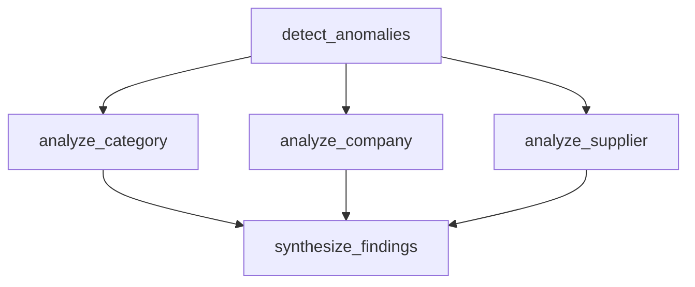
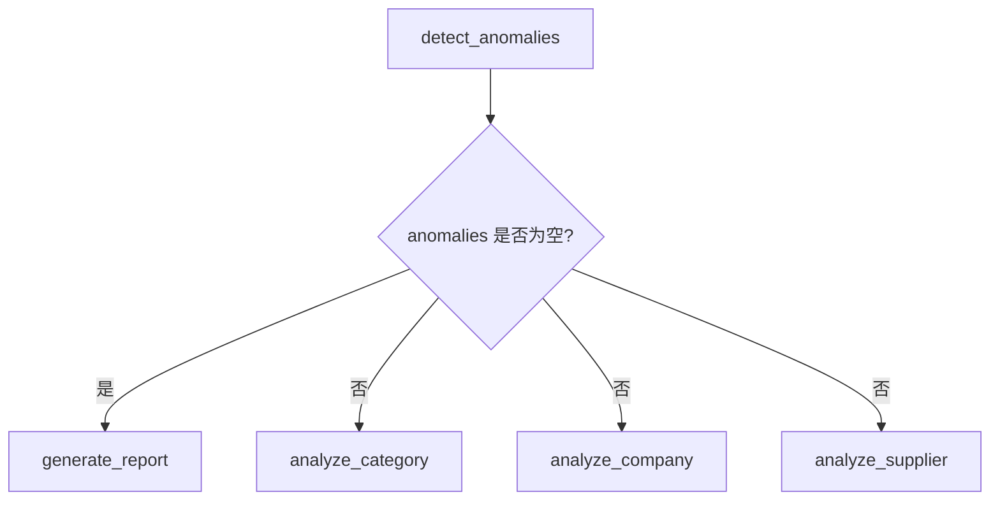

# 05｜为什么三个分析节点能一起跑？Super-step 到底是什么？

Part 1 里看到 Super-step 很抽象。现在把它放到真实数据分析里。

## 1. 异常检测以后，下一步不是固定一条直线

`detect_anomalies` 完成后，State 里已经有：

```python
anomalies = [row1, row3, row5]
```

这时需要同时从三个角度下钻：



三个分析都只读取同一个“异常检测完成后的 State”，彼此不依赖，所以天然适合并行。

## 2. Super-step 可以理解成 Runtime 的“一轮统一发车”

官方 Graph API 的执行模型受到 Pregel 启发，Graph 以离散 Super-step 推进。

> [!example] 类比
> 把每个 Super-step 想成高铁站的一次“统一发车时刻”。这一轮所有已经具备执行条件的 Node 一起出发；它们完成后，结果统一进入状态更新，下一轮才根据更新后的状态决定谁继续出发。

我们的主路径大致是：

```text
Super-step 1   plan_analysis
Super-step 2   load_data
Super-step 3   validate_data
Super-step 4   calculate_metrics
Super-step 5   detect_anomalies
Super-step 6   analyze_category | analyze_company | analyze_supplier
Super-step 7   synthesize_findings
Super-step 8   generate_report
```

## 3. 同一个 Super-step 的并行 Node 看到什么

关键点：三个并行 Node 都是基于**进入这一轮时的 State**执行。

```text
            State after detect_anomalies
                     │
        ┌────────────┼────────────┐
        ▼            ▼            ▼
   category       company      supplier
   analysis       analysis     analysis
```

因此不要把它想成：

```text
category 先写 State
→ company 立刻看到 category 的更新
→ supplier 再看到前两个更新
```

这不是同一 Super-step 的语义。

并行 Node 的输出会在这一轮完成后通过对应 Reducer 应用到 State，然后下一 Super-step 的节点看到合并后的结果。

## 4. 为什么并行写同一个字段必须考虑 Reducer

三个节点都返回：

```python
{"drilldown_results": [result]}
```

如果这个字段设计成普通覆盖值，相当于三个人同时往一块只能保留一个结果的白板写内容。

我们通过：

```python
drilldown_results: Annotated[list[dict], operator.add]
```

告诉 Runtime：这个字段的多次更新应该追加合并。

## 5. fan-out 与 fan-in

上面的结构有两个常见名字：

```text
              detect
           /     |      \
      category company supplier    ← fan-out
           \     |      /
             synthesize             ← fan-in
```

- fan-out：一个节点后激活多个分支；
- fan-in：多个分支重新汇合到一个节点。

## 6. fan-in 不能只看“画了三条箭头”

官方用法里，`add_edge` 的 list 形式可以表达“等待一组起始节点都完成后，再执行汇总节点”：

```python
builder.add_edge(
    ["analyze_category", "analyze_company", "analyze_supplier"],
    "synthesize_findings",
)
```

这和分别添加三条独立入边的运行语义并不总是完全相同，尤其当分支长度不同或条件分支只选择部分路径时，需要明确等待语义。

Part 2 先记住：**汇总节点什么时候执行，是控制流设计的一部分，不是画图时自然“看起来会等”。**

## 7. Conditional Edge 在这里做什么

如果没有异常，没必要跑三个下钻节点。

可以有：

```python
def route_after_detect(state):
    if not state["anomalies"]:
        return "generate_report"
    return [
        "analyze_category",
        "analyze_company",
        "analyze_supplier",
    ]
```

官方 Graph API 支持条件路由选择一个或多个目标节点。

所以路由逻辑是：



## 8. 为什么这比串行下钻更合理

如果三个分析互不依赖：

```text
串行：category → company → supplier
```

会增加总延迟，而且后面的节点实际上没有利用前一个节点的结果。

并行：

```text
category
company   → 同一轮执行
supplier
```

更符合依赖关系。

但是**能并行不代表一定要并行**。如果外部数据库只能承受有限并发，或三个查询都很重，仍然需要在生产环境考虑限流、连接池、成本和资源竞争。那属于后续生产级场景题。

## 9. 固定并行和动态 `Send` 不一样

当前我们明确知道始终分析三个维度，所以直接 fan-out 即可。

如果异常识别以后得到 27 个异常品类，运行前不知道 Worker 数量，则会更接近：

```text
anomalies = 27 items
        ↓
Send 动态创建 27 个分析任务
        ↓
Reducer 汇总
```

这属于动态 Map-Reduce / Orchestrator-Worker 模式，后续会单独深入。

## 10. 一句话真正理解 Super-step

> Super-step 不是一个业务节点，而是 LangGraph Runtime 推进 Graph 的一轮执行边界：这一轮里所有被激活且可以并行的 Node 执行，产生的 State Update 在该轮结束后形成新的可见状态，然后 Runtime 再决定下一轮激活哪些 Node。

这句话会直接影响你后面理解并行状态、Checkpoint、失败恢复和 Pending Writes。

## 官方来源

- Graph API：https://docs.langchain.com/oss/python/langgraph/graph-api
- Use Graph API（parallel / fan-out / fan-in）：https://docs.langchain.com/oss/python/langgraph/use-graph-api
