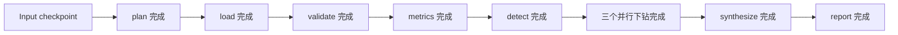
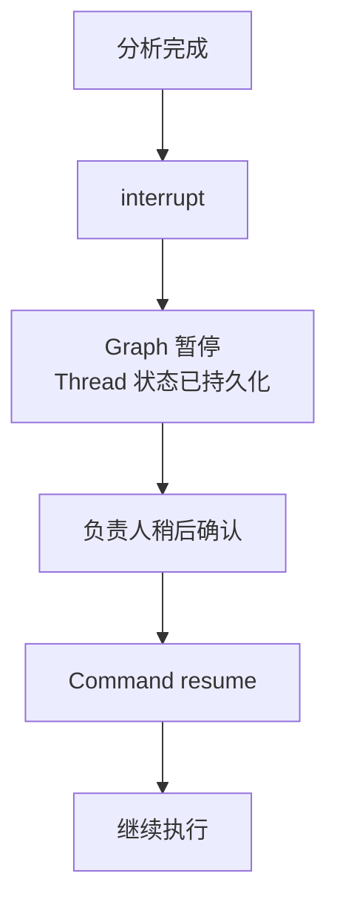

# 06｜如果运行到一半进程没了，LangGraph 到底保存了什么？

到前一篇为止，你看到的还是“这一趟 Graph 正常跑完”。现在给它套上持久化（Persistence）层。

## 1. 先区分三个词

### Thread（线程 / 执行状态线）

可以先理解成：**这一条持续任务的身份 ID。**

例如：

```python
config = {
    "configurable": {
        "thread_id": "procurement-analysis-2026-08-001"
    }
}
```

官方 Checkpointer 使用 `thread_id` 组织和查询一系列 Checkpoint。

### Checkpoint（检查点）

是：**某个 Thread 在一个时间点上的完整 Graph State 快照和相关执行信息。**

### Checkpointer（检查点持久化器）

是：**负责把这些 Checkpoint 保存、读取和列出的持久化组件。**

> [!example] 类比
> Thread 像一份长期案件编号；Checkpoint 像案件处理到不同阶段时保存的案卷快照；Checkpointer 像档案系统。你不是“有档案系统就自动知道案件业务规则”，但它让你能找回案件处理到哪里。

## 2. Checkpointer 怎么接入 Graph

教学环境可以：

```python
from langgraph.checkpoint.memory import InMemorySaver

checkpointer = InMemorySaver()
graph = builder.compile(checkpointer=checkpointer)
```

调用时提供 Thread：

```python
result = graph.invoke(
    initial_state,
    config={"configurable": {"thread_id": "procurement-analysis-2026-08-001"}},
)
```

这里的 `InMemorySaver` 只适合实验；官方文档明确说明内存 Saver 在进程重启后数据会丢失，生产环境应选择持久化实现。

## 3. Checkpoint 不是每行代码都存一次

官方 Checkpointer 文档说明：完整 Checkpoint 建立在**Super-step 边界**。

对我们的主路径，可以想成：



因此 Time Travel 或从历史 Checkpoint 恢复，核心边界也是这些状态快照，而不是任意 Python 源代码行。

## 4. 一个 Checkpoint 不只是 `state` 字典

官方 `StateSnapshot` 还包含类似：

- `values`：当前 State channel 的值；
- `next`：下一步待执行 Node；
- `config`：thread_id、checkpoint_id 等；
- `metadata`：当前 step、writes 等执行元数据；
- `tasks`：当前待执行任务以及错误 / interrupt 信息。

所以 Checkpoint 更接近“**状态 + 下一步执行位置 + 运行元数据**”，而不是普通 JSON 备份。

## 5. 如果并行 Super-step 里一个节点失败怎么办

假设：

```text
Super-step 6

analyze_category   ✅ 成功
analyze_company    ✅ 成功
analyze_supplier   ❌ 外部 API 超时
```

直觉上你可能以为整个 Step 6 要全部重跑。

但官方当前的 Checkpointer 设计还有 **Pending Writes（待提交写入）**：同一 Super-step 内已经完成的节点输出可以先作为 task-level writes 被持久化。如果另一个并行节点失败，恢复时已经成功的节点不必重新执行。

可以这样理解：

```text
完整 Checkpoint：按 Super-step 边界保存整张“阶段快照”
Pending Writes：同一阶段里，某个 Worker 已经交卷，先把它的答案单独存住
```

这对并行数据分析尤其重要，因为某个耗时查询失败时，不希望所有已完成查询都无意义重复。

## 6. 但“Graph 恢复”不等于“外部副作用 exactly-once”

这一点先埋下伏笔。

假设某个 Node：

```text
调用外部系统创建任务
→ 外部已经成功
→ 网络在返回结果前断开
```

Checkpoint 只能告诉你 LangGraph 当前记录到什么；它不能凭空证明外部系统到底有没有已经执行成功。

所以生产级系统仍然要考虑幂等性（Idempotency）、业务动作 ID、重试、对账等。这会放到 Part 5，而不是在 Part 2 展开。

## 7. Thread 和 Store 还是不要混

这条采购分析任务的执行状态属于 Thread / Checkpointer：

```text
这个分析任务取完数了吗？
异常识别完成了吗？
报告生成了吗？
```

而跨任务长期保留的信息更适合 Store，例如：

```text
这个用户偏好按“集团 → 公司 → 品类 → 供应商”顺序看报告
```

官方文档的区分就是：Checkpointer 是 thread-scoped Graph state；Store 是跨 Thread 的应用级长期数据。

## 8. Human-in-the-loop 为什么依赖它

假设高风险异常必须负责人确认：



如果没有可恢复的 Thread / Checkpoint，就无法自然支持“今天停下、明天继续同一个任务”。

Part 2 只理解依赖关系：

```text
interrupt / resume
        ↑
   Checkpointer
        ↑
 Thread + Checkpoint
```

至于恢复时某段 Node 代码为什么可能重新执行，后面进入生产级场景再细讲。

## 9. Durability Mode 先知道有这回事

官方当前提供不同持久化耐久模式，在性能与持久保证之间取舍。例如同步持久化会在进入下一步前确保 Checkpoint 写完，异步模式允许写入和下一步执行重叠，而 exit 模式只在 Graph 退出时持久化变化。

Part 2 不要求记参数，但要知道：**“用了 Checkpointer”仍然存在持久化时机和性能取舍，不是一个单一行为。**

## 10. 这一篇真正要形成的生命周期

```text
thread_id 标识持续任务
        ↓
Graph 以 Super-step 推进
        ↓
Checkpointer 在执行边界保存状态
        ↓
Checkpoint 记录 State + next + tasks 等
        ↓
失败 / interrupt 后可找到先前状态
        ↓
从可恢复边界继续
```

## 官方来源

- Persistence：https://docs.langchain.com/oss/python/langgraph/persistence
- Checkpointers：https://docs.langchain.com/oss/python/langgraph/checkpointers
- Interrupts：https://docs.langchain.com/oss/python/langgraph/interrupts
