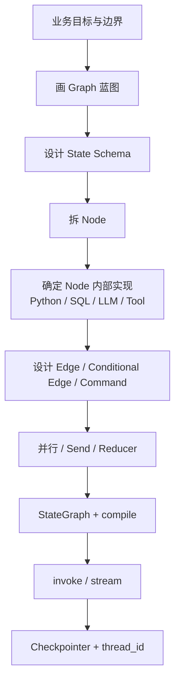

# Part 3｜从零编排同一个采购经营数据分析 Agent

Part 2 里你是“站在 Runtime 旁边看一次执行”。Part 3 换成开发者视角：**业务需求已经给你了，你要怎样把它变成一个 LangGraph？**

## 学完 Part 3 要做到什么

不是背 API，而是看到业务后能够按下面顺序思考：

## 阅读顺序

1. [[01-从业务需求到Graph蓝图]]
2. [[02-State-Schema怎么设计]]
3. [[03-Node怎么拆怎么写]]
4. [[04-Edge-ConditionalEdge-Command怎么选]]
5. [[05-并行-Send-Reducer怎么配合]]
6. [[06-LLM与Tool怎么接进Node]]
7. [[07-compile-invoke-stream怎么串起来]]
8. [[08-Checkpointer与Thread怎么接入]]
9. [[09-完整代码逐段映射]]
10. [[10-Part3学习检查]]

配套代码：[[../../示例代码/Part3-采购经营分析Graph.py|Part3-采购经营分析Graph.py]]。

## 贯穿需求

用户说：

> 分析 2026 年 8 月集团采购成本变化，找出同比异常最大的品类、子公司和供应商，继续下钻原因，并生成经营分析报告。

教学数据保持很小，目的是让你能追踪 State，而不是学习采购指标本身。

| 公司 | 品类 | 供应商 | 数量 | 本期单价 | 去年同期单价 |
|---|---|---|---:|---:|---:|
| 制造公司 A | 黄芪 | 供应商甲 | 1000 | 48 | 40 |
| 制造公司 A | 当归 | 供应商乙 | 500 | 72 | 70 |
| 药材公司 B | 黄芪 | 供应商丙 | 1600 | 55 | 41 |
| 药材公司 B | 包材 | 供应商丁 | 800 | 12 | 12 |
| 制造公司 C | 原料药 | 供应商戊 | 600 | 91 | 80 |

> [!important]
> Part 3 的重点始终是“怎么把这条业务编排成 Graph”，不是教 SQL、Excel 或采购分析。