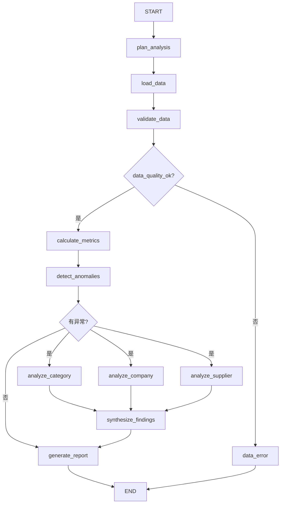

# 01｜拿到业务需求后，第一步不是写 Prompt，而是画执行蓝图

很多初学者拿到 Agent 需求以后会直接写一个很长的 Prompt：

> 你是采购分析专家，请获取数据、计算指标、发现异常、分析原因并生成报告……

这会把数据读取、确定性计算、分支控制、模型推理和报告生成全都混在一个黑盒里。

LangGraph 更适合的思路是：**先把业务步骤和控制关系显式化。**

## 1. 先把业务动作分类

| 业务动作 | 更典型的实现 | 为什么 |
|---|---|---|
| 读取采购明细 | Tool / API / SQL | 外部数据访问 |
| 数据质量检查 | Python / SQL | 规则明确、应可复现 |
| 同比计算 | Python / SQL | 数值计算必须确定性 |
| 发现异常 | 规则 / 统计逻辑 | 可以明确定义阈值 |
| 选择分析角度 | 路由逻辑或 LLM | 可能固定，也可能开放 |
| 解释业务原因 | LLM + 业务知识 | 需要语义推理 |
| 生成报告 | LLM | 适合语言组织 |

这张表已经隐含了 Node 的边界：**LangGraph 不要求所有 Node 都是 LLM。**

## 2. 先画业务 Graph



这张图已经包含三类不同结构：

1. **固定顺序**：`plan_analysis → load_data → validate_data`；
2. **条件路由**：数据质量是否通过、有没有异常；
3. **并行 fan-out / fan-in**：品类、公司、供应商三个分析同时进行，再汇总。

## 3. 类比：先画“工厂流程”，再决定每个工位放什么机器

你可以把整个 Graph 想成数据分析工厂：

- State 是共享工作台；
- Node 是不同工位；
- Edge 是工位之间的传送路线；
- Conditional Edge 是分拣口；
- Runtime 是调度系统；
- Tool 是某个工位使用的外部设备；
- LLM 是某些需要判断和表达的“分析专家”。

先把工厂流程画清楚，再决定哪个工位放 Excel、SQL、Python 或 LLM，比“让一个专家从头干到尾”可控得多。

## 4. Node 粒度为什么不能太粗也不能太碎

如果写成一个 Node：

```text
analyze_everything
```

它内部又取数、又清洗、又计算、又调用 LLM、又写报告，那么：

- State 中间过程看不见；
- 某一步失败时定位困难；
- 很难只重跑其中一个阶段；
- 无法自然并行；
- Checkpoint 的价值变小。

但如果把每一个字段计算都拆成一个 Node，又会让 Graph 过碎。

一个实用判断是：**这个步骤是否有独立输入、独立输出、独立失败边界或独立并行价值？** 如果有，通常更值得成为 Node。

## 5. Workflow 还是 Agent？

官方当前把两者区分为：Workflow 通常有预先定义的路径，Agent 则拥有更动态的工具选择和过程控制。

我们的主线先按“可控 Workflow + 局部 LLM 决策”设计，因为采购分析的大部分步骤是已知的：取数、校验、计算、下钻、报告。后续如果让模型自己决定调用哪个数据工具、分析几轮、何时停止，就会更接近 Agent Loop。

> [!important] 这一篇先形成的能力
> 拿到需求以后，先画 Graph，再设计 State；不要直接从 Prompt 或某个 Agent API 开始。