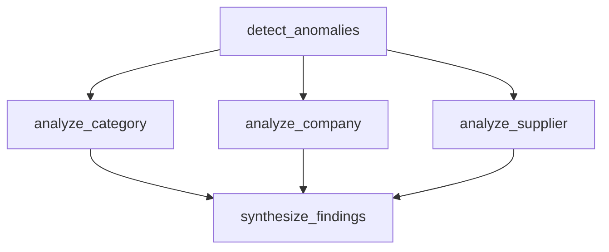

# 05｜并行、Send、Reducer 怎么配合

这一篇把三个容易分开记的概念放到一条业务链里。

## 1. 固定并行：我们明确知道要做三个维度

异常识别后固定做：

- 品类分析；
- 公司分析；
- 供应商分析。



这种情况不一定需要 Send；Conditional Edge 返回多个目标就能表达。

## 2. 三个并行 Node 同时写什么

三个 Node 都返回：

```python
{"drilldown_results": [result]}
```

例如：

```python
{"drilldown_results": [
    {"dimension": "category", "finding": "黄芪上涨明显"}
]}
```

另一个：

```python
{"drilldown_results": [
    {"dimension": "company", "finding": "药材公司 B 贡献最大"}
]}
```

## 3. 为什么必须考虑 Reducer

State 定义：

```python
drilldown_results: Annotated[list[dict], operator.add]
```

这表示：多个 Update 写到这个 key 时，用列表加法累计，而不是互相覆盖。

```text
Worker A 结果 ─┐
Worker B 结果 ─┼─> reducer(operator.add) ─> drilldown_results
Worker C 结果 ─┘
```

类比：三个分析师分别交一页结论，Reducer 是“把三页订成一份材料”的规则。

## 4. Send 什么时候才真正必要

假设 detect_anomalies 得到：

```python
anomalies = ["黄芪", "原料药", "包材", "辅料", ...]
```

异常数量运行前不知道，而且你希望**每个异常对象都启动一个 Worker**。

这就适合 `Send`：

```python
from langgraph.types import Send

def assign_workers(state: AnalysisState):
    return [
        Send("analyze_one_category", {"category": category})
        for category in state["anomalies"]
    ]
```

此时：

```text
发现 2 个异常 → 2 个 Worker
发现 18 个异常 → 18 个 Worker
```

Worker 数量由运行时数据决定。

## 5. 静态 Parallel 和 Send 的区别

```text
固定并行：开发时就知道有哪几个分支
动态 Send：运行以后才知道要产生多少个任务
```

我们的 Part 3 主代码使用固定三维分析，因为结构更容易学习；同时保留 Send 作为真实数据分析场景中很重要的扩展。

## 6. fan-out 和 fan-in

- fan-out：一个节点激活多个并行节点；
- fan-in：多个并行结果汇合到下游。

在 LangGraph 的 Super-step 模型下，三个并行节点属于同一个 Super-step。它们基于这一轮开始时可见的 State 工作，而不是按某个随机先后顺序互相读取对方刚写的结果。

因此正确设计是：

```text
并行 Worker
→ 各自返回 Update
→ Reducer 合并
→ 下一 Super-step 的 synthesize 再读取完整结果
```

## 7. 如果 reducer 设计错会怎样

典型问题：

- 只留下最后一个 Worker 结果；
- 多个并行写入冲突；
- 列表重复累加；
- 想“清空列表”却因为 reducer 继续合并而没清空。

这也是为什么 Reducer 不是一个可以跳过的小语法点，它直接决定并行 Graph 的状态语义。

> [!important]
> 并行解决“谁同时跑”，Send 解决“动态产生多少 Worker”，Reducer 解决“多个 Worker 的 State Update 最后怎么合并”。