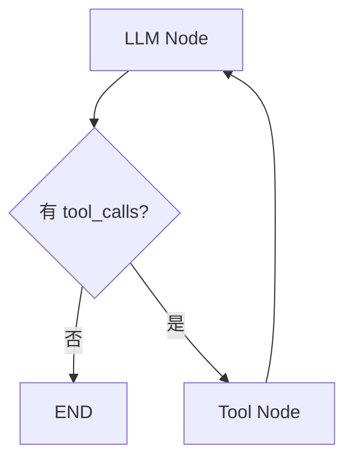

# 06｜LLM 与 Tool 怎么接进 Node：两种模式不要混

这部分是 Agent 开发里很关键的一个边界：**已知流程中的能力调用**，和**让模型动态选择 Tool**，不是一回事。

## 1. 模式 A：Workflow 已经知道要调用什么

我们的 `load_data` Node 很明确：它就是要查询采购数据。

```python
def load_data(state: AnalysisState):
    rows = query_procurement_data(
        month=state["analysis_month"]
    )
    return {"data_rows": rows}
```

这里不需要让 LLM 决定“要不要取数”。业务流程已经确定。

```text
Runtime
→ load_data Node
→ query_procurement_data()
→ 数据平台
→ Node 返回 State Update
```

这种结构简单、确定、容易测试。

## 2. 模式 B：让 LLM 自己决定调用哪个 Tool

如果用户可能问：

- 查采购均价；
- 查库存；
- 查供应商资质；
- 查合同执行；

而你希望模型根据问题动态选择工具，就属于 Tool Calling Agent。

官方当前典型结构是：



这就是一个 Agent Loop。

## 3. LLM “调用 Tool”其实先生成 Tool Call 请求

重要的是：模型通常不是自己执行数据库函数。

流程更接近：

```text
LLM 输出：我要调用 query_price，参数是 {...}
        ↓
程序 / ToolNode 真正执行工具
        ↓
Tool Result 进入消息 / State
        ↓
LLM 再读取结果继续判断
```

## 4. ToolNode 是什么

LangGraph 当前提供预构建 `ToolNode`：

```python
from langgraph.prebuilt import ToolNode

tool_node = ToolNode([query_price, query_inventory])
```

它负责执行 Tool Call，并处理并行工具执行、错误处理、State 注入等工具执行相关工作。

但**不是用了 Tool 就必须用 ToolNode**。

- 已知流程：普通 Node 直接调用 API / 函数很自然；
- 模型动态 Tool Calling：`ToolNode` 更自然。

## 5. LLM Node 怎样接

比如真实项目的 `synthesize_findings`：

```python
def synthesize_findings(state: AnalysisState):
    prompt = build_prompt(
        anomalies=state["anomalies"],
        drilldowns=state["drilldown_results"],
    )
    response = llm.invoke(prompt)
    return {"findings": [response.content]}
```

Node 依然是 Graph 的执行边界；LLM 只是 Node 内部调用的一个能力。

## 6. 为什么指标计算不要让 LLM 直接算

例如黄芪：

```text
去年 40 → 本期 48 = +20%
去年 41 → 本期 55 ≈ +34.1%
```

这种数值计算应该由代码 / SQL 完成，再把结构化结果交给 LLM 做解释。

推荐结构：

```text
SQL / Python
→ 计算事实
→ State.metrics
→ LLM
→ 解释事实
```

而不是：

```text
把原始表全塞给 LLM
→ 希望模型自己精确算完所有指标
```

## 7. 工程上最重要的边界

```text
LangGraph = 编排
Node = 执行边界
Tool = 外部能力
LLM = 推理 / 生成能力
```

四个概念不要混成“Agent 会自动做一切”。

> [!important]
> 什么时候直接在 Node 里调用函数，什么时候让 LLM 动态选 Tool，是架构选择问题。前者更确定，后者更灵活；灵活性越高，越需要终止条件、权限、错误处理和评估。