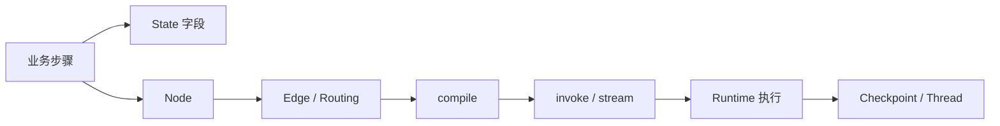

# 09｜把完整代码重新映射回 Part 1 和 Part 2

配套代码：[[../../示例代码/Part3-采购经营分析Graph.py|Part3-采购经营分析Graph.py]]。

它故意使用确定性教学函数模拟分析计划和报告生成，不需要真实模型 API。目的不是假装这是生产 Agent，而是让你能完整看清 LangGraph 结构。

## 1. State Schema

代码：

```python
class AnalysisState(TypedDict, total=False):
    ...
    drilldown_results: Annotated[list[DrilldownResult], operator.add]
    ...
```

对应 Part 1：Graph Definition。

对应 Part 2：S0 → S1 → S2 → … 的 State 演化。

## 2. Node

代码：

```python
def calculate_metrics(state: AnalysisState):
    ...
    return {"metrics": metrics}
```

对应：

```text
Current State
→ Node
→ State Update
```

## 3. Reducer

代码：

```python
drilldown_results: Annotated[list[DrilldownResult], operator.add]
```

对应：三个并行分析 Node 都返回 `drilldown_results`，Runtime 在 Super-step 边界合并。

## 4. 固定 Edge

```python
builder.add_edge("plan_analysis", "load_data")
```

表示固定顺序。

## 5. Conditional Edge

```python
builder.add_conditional_edges(
    "validate_data",
    route_after_validation,
    ["calculate_metrics", "data_error"],
)
```

表示根据当前 State 决定路径。

异常路由函数还会返回三个 Node 名，形成并行 fan-out。

## 6. fan-in

```python
builder.add_edge("analyze_category", "synthesize_findings")
builder.add_edge("analyze_company", "synthesize_findings")
builder.add_edge("analyze_supplier", "synthesize_findings")
```

三个并行 Node 都结束后，下一 Super-step 才进入 `synthesize_findings`。

## 7. compile

```python
checkpointer = InMemorySaver()
graph = builder.compile(checkpointer=checkpointer)
```

这一刻从 Graph Definition 进入可执行 Compiled Graph。

## 8. invoke

```python
result = graph.invoke(initial_state, config=config)
```

从这里 Runtime 才真正处理这次用户任务。

## 9. 为什么示例代码没有真实 LLM

如果在基础代码中直接绑某个模型供应商，会引入：

- API Key；
- 模型版本；
- 网络；
- SDK；
- 随机输出；

这些会干扰你观察 LangGraph 本身。

真实项目只需要把：

```python
plan_analysis(...)
synthesize_findings(...)
generate_report(...)
```

内部的确定性教学逻辑替换成真实 `llm.invoke(...)` 或 structured output，不需要改整套 Graph 思维。

## 10. 从业务到代码的完整映射



你现在应该能反向回答：

- 为什么这里是 Node？
- 为什么这里是 Edge？
- 为什么这里需要 reducer？
- 为什么并行分析必须汇总后再综合？
- `compile()` 和 `invoke()` 分别在哪一层？

如果这些问题能顺着代码答出来，Part 3 的主要目标已经完成。