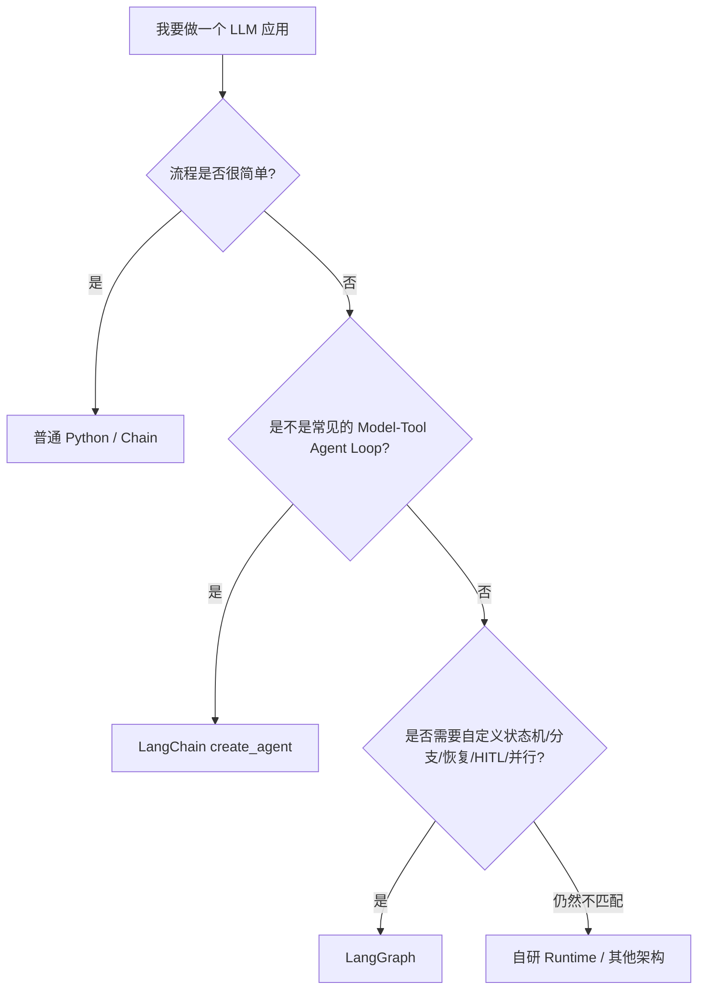
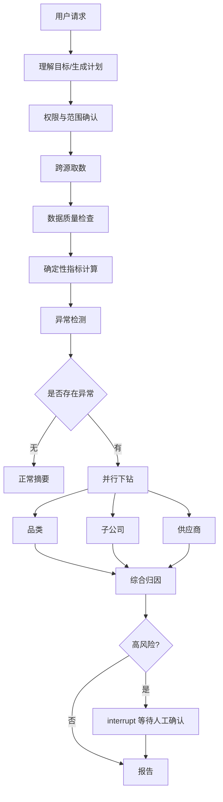

# M01｜为什么是 LangGraph，而不是 LangChain 高层 Agent、Python 脚本或自研 Runtime？

这是非常典型的项目深挖题。面试官真正想知道的不是你会不会说“LangGraph 是图框架”，而是：**你是否理解自己为什么需要一层 Agent Orchestration Runtime，以及你是否知道它的代价和边界。**

对应题池：`LG-A01`、`LG-A02`、`LG-A04`、`LG-A06`。

---

## 1. 面试时先怎么回答

### 60～90 秒版本

> 我不会因为项目里用了 LLM 和 Tool 就默认上 LangGraph。当前 LangChain 的 `create_agent` 已经提供常见的模型—工具循环，高层 Agent 足够时我会优先用高层抽象；如果任务只是一个短链路、没有复杂分支、暂停恢复和长期状态，普通 Python 也完全可以。
>
> 我会在流程开始出现“显式状态 + 多步控制流 + 持久化恢复 + Human-in-the-loop + 并行/循环 + 需要把 deterministic workflow 和 LLM decision 混在一起”时考虑 LangGraph。它的价值不是让模型更聪明，而是把 Agent 的**状态、执行步骤、路由和恢复边界显式化**，并提供 durable execution、streaming、HITL、persistence 这些运行时能力。
>
> 但 LangGraph 也不是完整业务基础设施。鉴权、租户隔离、Tool 的业务幂等、数据正确性、外部系统可靠性、业务审批规则仍然需要应用层和 Tool 层自己保证。如果一个项目只是几步固定调用，我会认为 LangGraph 可能是过度设计；如果要完全自研 Runtime，则要自己承担调度、状态持久化、恢复、并发、流式事件和可观测性等长期维护成本。

如果只能记一条主线，就记：

```text
LangGraph 的核心价值不是“能调 LLM”，
而是“让复杂 Agent 的状态和控制流成为可管理、可恢复的运行时对象”。
```

---

# 2. 先把四种选择放到同一张图里



这里不是“从低级到高级”的排名，而是**抽象层级和控制需求不同**。

官方当前定位非常明确：

- LangChain：高层 Agent Framework，提供模型、工具、Agent Loop 等抽象；
- LangGraph：更低层的 Orchestration Runtime；
- `create_agent`：适合常见 Agent Harness；
- LangGraph：适合需要精细控制、长期运行和状态化的 Agent / Workflow；
- LangGraph 可以不依赖 LangChain 使用，只是官方文档常用 LangChain 的 model / tool 组件。

---

# 3. 为什么 `create_agent` 有时候已经够了

当前 LangChain 官方把 Agent 定义得很直接：

```text
Agent ≈ Model 调用 Tools 的循环，直到任务完成
```

而 `create_agent` 已经把常见 Harness 做好了，例如：

```text
用户消息
  ↓
LLM 判断
  ↓
需要 Tool ? ── 否 ──→ 输出
  │
 是
  ↓
执行 Tool
  ↓
Tool Result 回到 LLM
  ↓
继续判断
```

所以如果你的需求只是：

> 用户提问 → 模型自行选择搜索 / 数据查询 Tool → 返回答案

你没有必要为了“显得工程化”手动画十几个 Node。

例如采购场景只做：

> “帮我查询 A 公司 8 月采购额，并解释一下变化。”

只有两个读工具：

```text
query_purchase_total
query_yoy_data
```

模型调用工具后输出答案，权限和指标口径又已经在 Tool 服务里封装好，此时一个高层 `create_agent` 可能就够。

### 这类情况下上 LangGraph 反而可能增加什么

你要额外维护：

- State Schema；
- Node；
- Edge；
- Routing；
- Graph 编译；
- 状态字段的语义；
- Graph 版本变化；
- 更多 Trace 节点与测试边界。

如果这些东西没有带来真正的控制收益，就是样板复杂度。

---

# 4. 普通 Python while-loop 为什么也完全可以做 Agent

最简 Agent Loop 用普通 Python 就能写：

```python
messages = [user_message]

while True:
    response = model.invoke(messages)
    messages.append(response)

    if not response.tool_calls:
        break

    for call in response.tool_calls:
        result = run_tool(call)
        messages.append(result)
```

因此面试里说：

> “没有 LangGraph 就做不了 Agent。”

这是错误答案。

真正的问题是：**当这个循环逐渐承担越来越多业务约束时，你还愿不愿意继续手写它？**

假设采购分析从这个 while-loop 慢慢增加：

```text
1. 先识别用户要哪个集团 / 月份
2. 判断权限
3. 查本期数据
4. 查同比数据
5. 数据不完整时重新查
6. 计算同比
7. 发现异常后同时从品类、公司、供应商下钻
8. 某一维失败可以局部重试
9. 高风险结论要求人工确认
10. 人可能第二天才确认
11. 确认后继续生成报告
12. 前端还要实时显示当前做到哪一步
13. 进程挂掉后要恢复
```

你当然仍然可以自己写：

```python
if ...
while ...
try ...
retry ...
load_from_db(...)
save_to_db(...)
resume_from_step(...)
```

但此时你实际上已经在**自己实现一个工作流 / 状态机 Runtime**。

LangGraph 的价值就在这里出现：

```text
业务函数
    ↓
显式 Node
    ↓
显式 State
    ↓
显式 Control Flow
    ↓
统一 Runtime
    ↓
Persistence / Streaming / HITL / Resume
```

换句话说，不是 Python 做不到，而是：

> **当“执行流程本身”成为需要管理的复杂对象时，使用一个明确的 Orchestration Runtime 通常比继续把控制逻辑散落在业务代码里更容易维护。**

---

# 5. LangGraph 到底替你解决了什么

官方当前把 LangGraph 定位为 low-level orchestration framework and runtime，核心能力集中在几类。

## 5.1 显式 State

不再只靠局部变量和 prompt 拼接传递上下文，而是把 Graph 当前工作状态显式化。

例如：

```python
class AnalysisState(TypedDict):
    query: str
    plan: list[str]
    metrics: dict
    anomalies: list[dict]
    findings: list[str]
    report: str
```

这给后续 Node、Checkpoint、Debug、Resume 一个共同的数据契约。

## 5.2 显式控制流

固定流程：

```text
A → B
```

条件流程：

```text
A → 检查异常
      ├─ 无异常 → summary
      └─ 有异常 → drilldown
```

循环：

```text
generate → evaluate
    ↑          │
    └──────────┘
```

并行：

```text
           category
         ↗
 detect → company
         ↘
           supplier
```

这些不再只是散落的 `if/while/asyncio`，而是 Graph 的一部分。

## 5.3 Durable Execution / Persistence

如果配置 Checkpointer，Graph 的状态可以按执行边界持久化。

于是：

```text
进程重启
网络异常
人工等待
长任务跨请求
```

都可以围绕 Thread / Checkpoint 来设计恢复，而不是只能从头再跑。

这并不等于“任何外部 Tool 都 exactly-once”，后面 M09 会专门讲。

## 5.4 Human-in-the-loop

Graph 可以暂停，并在另一个请求里继续。

业务上很重要，因为真实 Agent 往往不是：

```text
用户点一下
↓
30 秒内全部结束
```

而可能是：

```text
分析异常
↓
判断金额超过阈值
↓
负责人审批
↓
两小时后批准
↓
继续发报告 / 推任务
```

## 5.5 Streaming / Runtime Event

长链路任务不能让用户只看一个转圈动画。

Runtime 可以输出节点更新、消息、custom events 等，使前端知道：

```text
正在取数
正在计算指标
已识别 3 个异常
正在供应商下钻
正在生成报告
```

---

# 6. LangGraph 没有替你解决什么

这一块在面试里非常重要，因为很多“会用框架”的回答会把所有生产能力都归功于框架。

## 6.1 不替你保证业务正确

如果同比公式写错：

```python
yoy = (current - previous) / current
```

LangGraph 不会自动发现你的指标口径错了。

它只负责把 `calculate_metrics` Node 按你的流程运行。

## 6.2 不替你定义权限策略

如果用户只能看 A 子公司，权限不能写成：

```text
System Prompt: 请不要访问其他子公司数据。
```

真正的权限校验仍应在应用层 / Tool Gateway / 数据层强制执行。

LangGraph 可以承载身份 Context 和审批流，但它不是 Authorization Policy 本身。

## 6.3 不替你保证外部副作用 exactly-once

例如：

```text
create_work_order()
```

外部 ERP 已成功，但 HTTP Response 丢了。

Graph 重试时可能再次调用。

Checkpoint 只能保存 Graph 已知的状态，不能凭空知道远端系统到底发生了什么。

所以仍然需要：

- idempotency key；
- 业务唯一键；
- downstream dedupe；
- reconciliation；
- compensation（部分场景）。

## 6.4 不替你解决 Prompt Injection

把网页 / RAG 文档 / Tool Result 塞给 LLM 后，其中可能包含恶意指令。

安全需要：

```text
信任边界
+ Tool 最小权限
+ 服务端参数校验
+ 数据隔离
+ 高风险 HITL
+ 输出 / 执行 Guardrail
```

而不是“用了 LangGraph 所以安全”。

---

# 7. 回到我们的采购经营分析 Agent：为什么这里值得用 LangGraph

假设真实需求是：

> 分析本月集团采购成本变化，找出同比异常最大的品类和子公司，继续下钻供应商和采购明细，判断主要原因，生成经营分析报告；高风险异常需要负责人确认后才能推送到业务群。

如果把它拆出来：



这个系统已经具备 LangGraph 很擅长的特征：

- deterministic + agentic 混合；
- 多个明确状态阶段；
- 条件路由；
- 并行；
- 长时间等待；
- 中断恢复；
- 需要前端展示进度；
- 后续还可能有 Checkpoint 和审计。

这才是“为什么用 LangGraph”的真正项目论证。

不是因为：

> “LangGraph 比较火。”

也不是因为：

> “Agent 项目都应该用 Graph。”

---

# 8. 为什么不完全自研 Runtime

如果团队完全自研，需要自己逐步解决：

```text
Node / Task 抽象
State Contract
Routing / Loop
并行调度
Task Retry
Checkpoint Schema
Thread / Run Identity
暂停 / 恢复
Streaming Event Protocol
失败状态
Graph 版本
Tracing
测试工具
```

当然，**完全自研并不是错误**。

有些系统可能因为：

- 极端性能要求；
- 已有成熟的内部 Workflow Engine；
- 特殊调度语义；
- 语言 / Runtime 限制；
- LangGraph 的执行模型无法匹配现有系统；

而选择自研或接到已有调度平台。

面试里更成熟的回答应该是：

> “我不是为了避免写代码才用 LangGraph，而是不想重复维护一套已经存在的状态化 Agent Runtime；如果我们的核心约束超出框架模型，或者已有基础设施更适合，就不应该强行套 LangGraph。”

---

# 9. LangGraph 的代价是什么

技术选型不能只说优点。

## 9.1 学习和认知成本

团队要理解：

```text
State Update
Reducer
Super-step
Checkpoint
Thread
Command
Send
interrupt / resume
```

否则很容易把普通函数调用思维硬套到 Graph Runtime 上。

## 9.2 状态模型设计成本

State 设计差会导致：

- giant dict；
- Node 互相污染；
- Checkpoint 膨胀；
- 并行冲突；
- Schema 升级困难。

## 9.3 调试方式发生变化

你不能只看一段 Python Stack Trace，还要看：

```text
哪个 Node？
哪个 Super-step？
进入时 State 是什么？
哪个 Node 写了这个字段？
路由为什么走这里？
Checkpoint 停在哪？
```

## 9.4 框架耦合

业务函数本身可以保持普通 Python，但：

- Graph topology；
- State schema；
- Checkpointer；
- Runtime config；
- interrupt / Command；

都会产生一定的框架语义耦合。

因此应该把业务能力和编排能力分层，而不是所有代码都直接依赖 Graph 类型。

---

# 10. 一个真正实用的选型判断表

| 场景 | 更自然的选择 | 原因 |
|---|---|---|
| 一次 LLM 调用 | 普通 SDK / Chain | 没有 Agent Runtime 需求 |
| 固定 2～3 步 Prompt Pipeline | Python / Chain | 控制流简单 |
| 常见 LLM ↔ Tools 循环 | `create_agent` | 高层 Harness 已覆盖 |
| 明确 Workflow + 少量 LLM 节点 | LangGraph | deterministic / agentic 混合 |
| 多分支、多循环、并行、HITL | LangGraph | 需要显式 orchestration |
| 长任务、暂停恢复、Thread State | LangGraph + Checkpointer | Durable execution |
| 已有企业级 BPM / Scheduler，Agent 只是其中一步 | 现有引擎 + Agent | 不必重复一套顶层编排 |
| 执行模型与 LangGraph 根本不匹配 | 自研 / 其他 Runtime | 避免硬套框架 |

这张表的重点不是死记选择，而是学会回答：

> **“我根据什么约束做这个决定？”**

---

# 11. 面试官继续追问

## 追问 1：LangChain 和 LangGraph 到底是什么关系？

当前官方定位可以这样答：

- LangChain 提供高层 Agent Framework、模型与工具集成；
- LangGraph 是底层 orchestration runtime；
- LangChain 的高层 Agent abstractions 建立在 LangGraph 能力之上；
- 你可以只使用 LangGraph，不强制使用 LangChain；
- 想快速做标准 Agent Loop，优先高层 Agent；想精细控制执行图，用 LangGraph。

不要回答成：

```text
LangChain 是旧框架，LangGraph 是新框架，所以 LangGraph 替代 LangChain。
```

这不是当前官方产品关系。

## 追问 2：普通 while-loop 真的有什么问题？

答：

**没有天然问题。**

当它只有：

```text
LLM → Tool → LLM
```

时很合理。

问题出现在它继续承担：

```text
多状态
多分支
并行
暂停
跨请求恢复
重试
事件流
```

后，控制流会越来越难集中管理。

## 追问 3：是不是只要有 Checkpoint 就应该用 LangGraph？

不是。

你完全可以自己把一个 Python 状态机状态写进数据库。

真正比较的是：

> 是否值得自己长期维护“状态 + 调度 + 恢复”这一整层能力。

## 追问 4：LangGraph 最大缺点是什么？

可以从三个层次回答：

1. **对于简单系统是额外复杂度。**
2. **需要严谨 State / Runtime 心智模型。**
3. **框架不会替你完成生产级业务语义。** 如果团队误把 persistence 当 exactly-once、把 LLM routing 当权限控制，反而容易产生错误安全感。

## 追问 5：为什么不用 Multi-Agent 框架？

这不是 M01 的重点，M03 会展开。

先答：

> Multi-Agent 是系统组织方式，不等于 Runtime 选型。即使用 LangGraph，也可以做 single-agent、workflow、subgraph 或 multi-agent；我会先根据上下文、工具边界、权限、并行和团队边界判断是否需要 Multi-Agent，而不是先因为“复杂”就拆多个 Agent。

---

# 12. 常见低质量回答

### 错误 1

> LangGraph 的优势是可视化流程图。

可视化只是辅助，不是核心价值。

### 错误 2

> LangGraph 可以保证 Agent 不出错。

不能。

它管理执行，不保证业务逻辑、LLM 输出和 Tool 结果正确。

### 错误 3

> LangGraph 比 LangChain 更高级，所以应该都用 LangGraph。

抽象层级不同，不是简单的新旧 / 高低关系。

### 错误 4

> 有状态就必须 LangGraph。

普通程序、数据库、工作流引擎都能做状态；需要讨论的是**复杂状态化 Agent 的 orchestration 成本**。

### 错误 5

> Checkpoint 可以保证 Tool 不重复执行。

这是非常危险的回答。外部副作用的幂等和恢复要单独设计，后面 M09 专讲。

---

# 13. 这一题真正应该形成的认知

```text
LLM / Tool            = 能力
LangChain create_agent = 常见 Agent Harness
LangGraph              = 自定义状态化 Orchestration Runtime
业务系统                = 权限、数据、事务、幂等、领域规则
```

你选择 LangGraph，不是因为它“包含更多功能”，而是因为：

> **你的业务已经需要把复杂 Agent 的执行状态、控制流和恢复机制变成一等公民。**

下一条：[[02-M02-一次真实请求完整调用链|M02 一次真实请求完整调用链]]。

---

## 官方来源（核对日期：2026-09-16）

- LangGraph Overview：https://docs.langchain.com/oss/python/langgraph/overview
- LangChain Agents：https://docs.langchain.com/oss/python/langchain/agents
- Workflows and Agents：https://docs.langchain.com/oss/python/langgraph/workflows-agents
- 题目市场来源与证据：[[../../面试题池/02-来源登记与搜索记录]]
