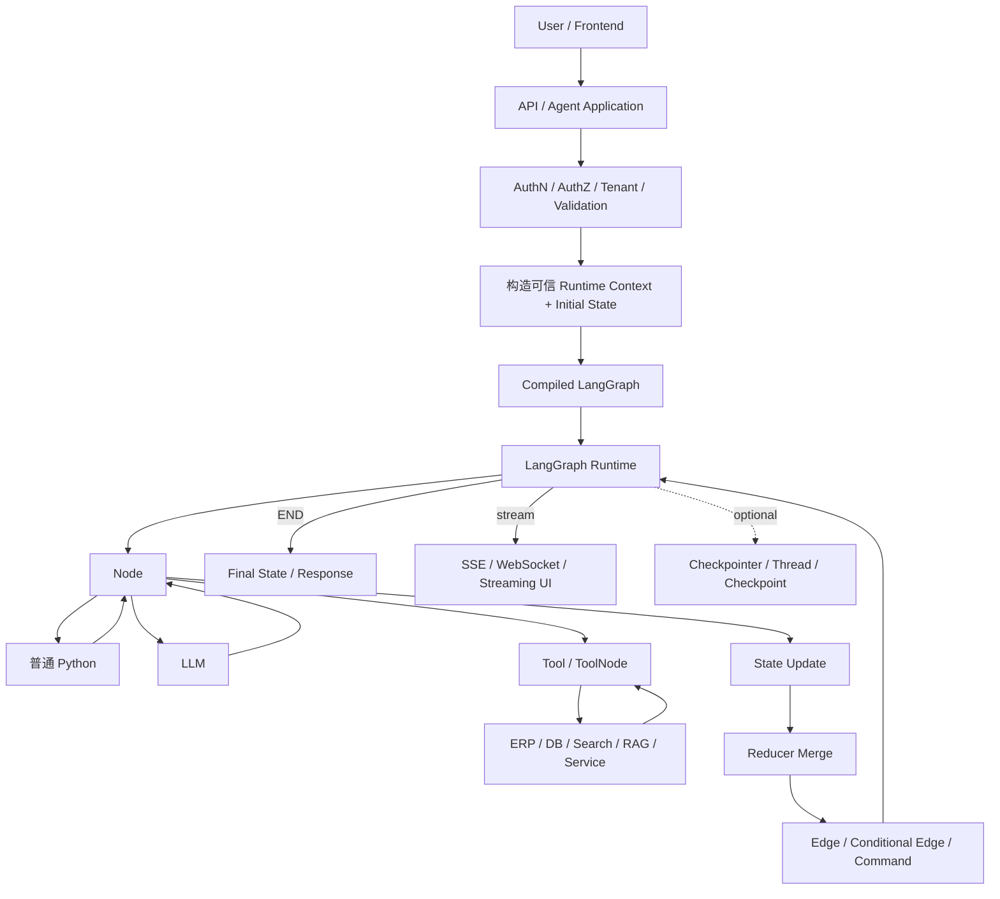
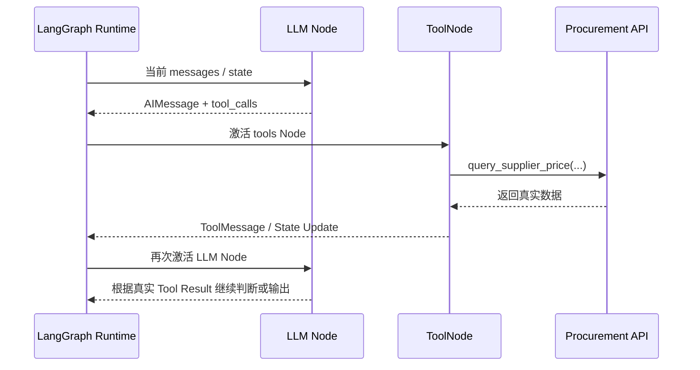

# M02｜一次真实请求从 API 进入到最终答案，LangGraph、Node、LLM、Tool 各负责什么？

这道题会暴露一个候选人到底只是“会写几个 `add_node()`”，还是理解 Agent 系统真正的层次。

对应题池：`LG-A03`、`LG-A05`、`LG-B09`。

---

# 1. 面试可直接回答的版本

### 60～90 秒版本

> 我会把生产 Agent 分成应用入口、编排 Runtime、能力层和外部系统几层。HTTP/API 层先做身份、租户、请求参数和限流等工作，然后把可信的运行上下文和初始 State 交给已经 compile 的 Graph。LangGraph Runtime 根据当前 State 激活 Node，Node 是图里的执行单元，它可以执行普通 Python，也可以调用 LLM 或 Tool，并返回 State Update。Runtime 再按 Reducer 合并更新，根据 Edge / Conditional Edge / Command 决定下一步。
>
> 如果是典型 Tool Calling，LLM 本身只生成“我要调用什么 Tool、参数是什么”的结构化请求，真正执行 Tool 的是 ToolNode 或我们自己的 Tool 执行 Node；Tool Result 再作为 ToolMessage / State Update 回到模型，Graph Runtime 负责推进这个循环。最终到 END 后返回 Final State，或者通过 stream 把中间事件实时给前端。
>
> 我不会把所有步骤都交给 LLM。权限校验、指标计算、参数约束、金额阈值、写操作审批这些应该尽量 deterministic；LLM 更适合意图理解、计划、低风险工具选择、归因解释和自然语言报告。

一句话：

```text
LLM 负责“判断 / 生成”，
Tool 负责“做能力动作”，
Node 负责“在 Graph 里承载一次执行”，
LangGraph Runtime 负责“什么时候让谁执行、执行后状态怎么推进”。
```

---

# 2. 先看一张生产级全链路图



这张图必须先刻在脑子里。

因为很多混淆都来自把下面几个东西混成同一个：

```text
Node
Tool
LLM
Runtime
Application
```

它们不是一回事。

---

# 3. 第 0 层：用户请求不是直接“掉进 Graph”

真实系统通常先经过 Agent Application。

例如用户请求：

```json
{
  "query": "分析 8 月集团采购成本异常，并下钻主要供应商",
  "company_scope": ["A集团"],
  "month": "2026-08"
}
```

HTTP 层通常还要处理：

```text
Authorization Header
Tenant ID
User ID
Request ID
Rate Limit
Input Size
API Schema
```

这里一个非常重要的工程边界是：

> **不要让 LLM 自己决定“这个用户是谁、拥有什么权限”。**

可信身份应该来自认证系统，并作为服务端 Context 传下去。

例如概念上：

```python
runtime_context = {
    "user_id": auth.user_id,
    "tenant_id": auth.tenant_id,
    "allowed_company_ids": auth.allowed_company_ids,
}
```

然后再调用 Graph。

为什么不把这些全部当普通 Prompt？

因为 Prompt 是模型上下文，不是安全边界。

后面的 Security 主链会专门展开。

---

# 4. 第 1 层：`compile()` 后得到的是可执行 Graph

开发阶段：

```python
builder = StateGraph(AnalysisState)

builder.add_node("plan", plan_analysis)
builder.add_node("load", load_data)
builder.add_node("metrics", calculate_metrics)
...

graph = builder.compile()
```

这是 **Build Time**。

此时你是在定义：

```text
有哪些 Node
State 是什么
Node 怎么连接
哪里分支
哪里循环
哪里并行
是否配置 Checkpointer
```

真正用户请求来了以后：

```python
graph.invoke(initial_state, ...)
```

或：

```python
graph.stream(initial_state, ...)
```

才进入 **Runtime**。

面试里如果把 `compile()` 说成“执行 Graph”，说明 Build Time / Runtime 还没有分清。

---

# 5. 第 2 层：Runtime 到底做什么

你可以把 Runtime 看成“Graph 的执行调度层”。

它大致在重复这条链：

```text
当前 State
  ↓
确定本轮要激活哪些 Node
  ↓
执行 Node
  ↓
拿到 State Update
  ↓
Reducer 合并
  ↓
得到新 State
  ↓
根据 Routing 决定下一批 Node
  ↓
继续 / END / interrupt
```

所以 Runtime 自己不会：

- 算同比；
- 查 ERP；
- 写采购分析；
- 判断财务业务逻辑。

这些都在 Node / Tool / LLM / 业务服务里。

Runtime 管的是**执行顺序、状态传播和生命周期**。

---

# 6. Node 到底是什么

Node 是：

> **Graph 中一次可调度的执行单元。**

它最常见就是一个 Python callable。

```python
def calculate_metrics(state: AnalysisState):
    metrics = ...
    return {"metrics": metrics}
```

Node 可以只执行普通代码：

```text
Node
 └─ Python Function
```

也可以调用 LLM：

```text
Node
 └─ LLM
```

也可以调用 Tool / API：

```text
Node
 └─ Tool / HTTP / SQL
```

甚至可以内部调用一个完整 Subgraph。

因此：

```text
Node ≠ LLM
Node ≠ Tool
Node 是 Graph 的执行位置
```

这是 M02 最重要的基础区分之一。

---

# 7. Tool 又是什么

Tool 更接近：

> **模型或 Agent 可以使用的一项能力。**

例如：

```python
query_procurement_data(company_id, month)
get_supplier_profile(supplier_id)
search_policy(query)
create_alert_task(...)
```

Tool 背后可能是：

- Python Function；
- SQL Service；
- REST API；
- RAG Retrieval；
- ERP；
- 文件系统；
- 搜索引擎。

Tool 本身不天然决定 Graph 下一步去哪。

例如：

```text
query_procurement_data Tool
```

只负责“查采购数据”。

它并不知道：

```text
查完以后是进入异常检测，
还是要求用户补充月份，
还是结束。
```

这是 Graph Control Flow 的职责。

---

# 8. ToolNode 是什么，为什么又多一个词

当前官方把 `ToolNode` 定义为一个预构建的 LangGraph Node，用于执行 Tools，并处理常见的并行工具执行、错误处理和状态注入等逻辑。

所以关系是：

```text
Tool      = 能力
ToolNode  = Graph 里的“工具执行节点”
```

例如：

```python
builder.add_node(
    "tools",
    ToolNode([search, calculator])
)
```

Graph 里真正被调度的是：

```text
"tools" Node
```

它内部再去执行某个具体 Tool。

如果你的流程很确定：

```text
load_data Node → 固定调用 procurement_service
```

你完全可以直接在普通 Node 里调用业务 API，而不一定要 ToolNode。

如果是：

```text
LLM 自己决定调用 search / supplier_query / policy_lookup 哪一个
```

ToolNode 会更自然。

---

# 9. LLM → Tool → LLM 到底是谁推进的

这是非常高频的混淆。

模型第一次执行：

```text
User: 帮我分析黄芪价格上涨原因
```

模型可能输出的不是最终答案，而是类似：

```text
tool_call:
  name = query_supplier_price
  args = {"category": "黄芪"}
```

这里要注意：

> **LLM 没有真的执行数据库查询。**

它只是生成“调用意图 + 参数”。

然后：



因此三层职责分别是：

```text
LLM          决定 / 生成 Tool Call
ToolNode     执行 Tool
LangGraph    按图推进 LLM ↔ Tool 的循环
```

高层 `create_agent` 已经把这一类常见 Loop 封装好了；自定义 LangGraph 时，你可以明确控制这个 Loop 怎么接。

---

# 10. 为什么不是所有步骤都交给 LLM

官方对 Workflow 与 Agent 的区分是：

```text
Workflow：代码路径预先定义
Agent：动态决定过程和工具使用
```

真实生产系统通常不是二选一，而是混合。

## 适合 deterministic 的部分

### 权限

```python
if company_id not in allowed_company_ids:
    raise PermissionDenied()
```

而不是：

```text
问 LLM：“你觉得用户是否应该有权限？”
```

### 指标计算

```python
yoy = (current - previous) / previous
```

公式应该稳定可测试。

### 业务阈值

例如：

```text
采购金额 > 500 万且异常幅度 > 20%
→ 必须人工确认
```

如果这是业务制度，就应该用代码 / Policy Engine。

### Tool 参数 Schema

模型可以提出参数，但服务端必须验证。

## 适合 Agentic 的部分

例如：

```text
用户意图理解
分析计划草拟
从多个低风险读 Tool 中选择下一步
根据异常结果决定需要继续哪类下钻
综合解释多维证据
自然语言报告
```

一个成熟的 Agent 系统不是“让 LLM 尽量多决定”，而是：

> **只在需要不确定推理和语言能力的地方给模型自由度。**

---

# 11. 用采购经营分析 Agent 走一遍真实请求

用户：

> 分析 2026 年 8 月集团采购成本异常，找出主要异常品类和供应商，并生成报告。

## Step 1：API 层

拿到：

```text
user_id = U1008
tenant_id = T001
allowed_company_ids = [C01, C02, C03]
query = "分析 2026-08 采购成本异常..."
```

## Step 2：构造 Initial State

```python
{
    "user_query": "分析 2026-08 采购成本异常...",
    "month": "2026-08",
    "analysis_plan": [],
    "data_refs": [],
    "metrics": {},
    "anomalies": [],
    "findings": [],
    "report": ""
}
```

注意权限身份不一定都应该作为普通可写 State；可以通过可信 Runtime Context 传递，后续安全章节再展开。

## Step 3：`plan_analysis` Node

它可能调用 LLM：

```text
用户要：
1. 集团同比
2. 品类异常
3. 供应商下钻
4. 原因解释
```

返回：

```python
{"analysis_plan": [...]}
```

## Step 4：`load_data` Node

这里更适合确定性地调用数据服务：

```text
Node
  ↓
procurement_query Tool / Service
  ↓
Data Platform
```

权限过滤也必须落在服务端查询边界，而不是只依赖模型生成 SQL。

## Step 5：`calculate_metrics` Node

普通 Python / SQL 计算：

```text
本期采购额
去年同期采购额
同比增幅
价格贡献
数量贡献
```

没有必要浪费 LLM 来做确定性算术。

## Step 6：`detect_anomalies`

可以是确定性规则，也可以是统计模型 + 业务规则。

得到：

```python
[
  {"category": "黄芪", "yoy": 0.31},
  {"category": "当归", "yoy": 0.18}
]
```

## Step 7：Routing

```text
有异常 → 下钻
没异常 → 正常摘要
```

## Step 8：并行下钻

```text
品类原因
公司原因
供应商原因
```

## Step 9：`synthesize_findings`

LLM 读取结构化证据：

```text
价格上涨 23%
供应商丙占增量 61%
采购量变化仅 4%
```

生成解释：

> 本次成本上涨主要由供应商丙的采购单价提升驱动，而不是采购量增长。

## Step 10：`generate_report`

模型把确定性结果组织成经营语言。

这个流程中你可以非常清楚地看到：

```text
LangGraph 没有“替代” LLM 和 Tool，
而是在安排它们怎样协作。
```

---

# 12. State Update 在链路里的位置

假设 `calculate_metrics`：

```python
def calculate_metrics(state):
    return {
        "metrics": {
            "total_yoy": 0.12,
            "category_yoy": {"黄芪": 0.31}
        }
    }
```

它不是把整个 Graph State 重建一遍，而是返回**它负责产生的更新**。

Runtime 再执行：

```text
Old State
+
Node Update
↓
Reducer / Merge
↓
New State
```

然后下一 Node 看到新 State。

所以完整链应该记成：

```text
Node 读取 State
→ Node 做工作
→ 返回 State Update
→ Runtime 合并
→ Routing
→ 下一 Node
```

而不是：

```text
Node A 直接调用 Node B
```

在 Graph 思维里，Node 之间通常通过 State 和控制流协作。

---

# 13. 一次请求的“谁负责什么”表

| 层 | 典型职责 | 不应该误认为 |
|---|---|---|
| API / App | Auth、Tenant、Rate Limit、Request、Response | LangGraph Runtime |
| LangGraph Runtime | 调度 Node、状态推进、路由、执行生命周期 | 业务计算器 |
| Node | 一次可调度执行单元 | Tool 本身 |
| LLM | 理解、推理、生成、选择 Tool | 真正执行外部系统 |
| Tool | 对外部能力的调用接口 | 路由器 |
| ToolNode | 执行 Tool 的预构建 Graph Node | Tool 本身 |
| Checkpointer | 持久化 Thread 的 Graph 执行状态 | 业务数据库 |
| ERP / DB / RAG | 真实业务数据与动作 | Agent State |

如果这张表能解释清楚，系统边界基本就不会混乱。

---

# 14. 面试追问树详细回答

## 追问 1：用户请求进入哪一层？

通常先进入应用层，不建议把公网 HTTP 语义直接等同于 Graph Node。

应用层至少要完成：

```text
认证
授权上下文
租户
请求校验
限流
追踪 ID
```

再调用 Graph。

## 追问 2：LangGraph Runtime 在哪里？

在 Application 与业务能力之间，负责执行 Graph。

不是独立部署才叫 Runtime；你在 Python 进程里 `graph.invoke()` 时，就已经进入它的执行模型。

## 追问 3：Node 是执行单元还是能力？

Node 是执行单元。

能力可能来自：

```text
函数
模型
Tool
API
Subgraph
```

一个 Node 可以协调一个或多个能力。

## 追问 4：Tool 和 ToolNode 有什么区别？

Tool 是能力；ToolNode 是执行 Tool 的 Graph Node。

## 追问 5：一轮 Tool Calling 谁推进？

LLM 产生 tool call，ToolNode / Tool executor 真正调用 Tool，Graph Runtime 根据边推进循环。

## 追问 6：为什么指标计算不直接给 LLM？

因为有确定公式、需要可复现和可测试。

如果 LLM 负责计算：

```text
相同输入可能格式不同
容易算错
难验证
难审计
```

LLM 应该消费结构化计算结果，而不是替代计算引擎。

## 追问 7：是不是所有路由都应该让 LLM 决定？

不是。

如果条件是：

```python
if anomalies:
    return "drill_down"
else:
    return "summary"
```

代码即可。

只有当路由依赖模糊语义时，才值得让 LLM 分类。

---

# 15. 生产中最容易出问题的边界

## 15.1 Auth 信息被模型修改

如果 `tenant_id` 只是普通消息字段，模型或用户输入可能影响它。

要区分：

```text
可信 Runtime Context
vs
LLM 可见 / 可生成 State
```

## 15.2 Tool 参数没有二次校验

模型生成：

```json
{"company_id": "OTHER_TENANT_COMPANY"}
```

Tool 服务必须再次校验权限。

## 15.3 把 Tool Result 直接全部塞 Prompt

可能导致：

- Token 膨胀；
- Prompt Injection；
- 隐私暴露；
- 结构难以验证。

## 15.4 Node 做太多事情

比如一个 Node 同时：

```text
查数据
算指标
写数据库
调用模型
发消息
```

失败时很难判断到底哪个阶段出了问题，也很难安全重试。

M03 会继续讲 Node 边界。

---

# 16. 常见低质量回答

### “LLM 会调用 Tool，所以 LLM 负责执行 Tool。”

不准确。模型生成 Tool Call，实际执行由 Tool executor / ToolNode / 应用代码完成。

### “ToolNode 就是 Tool。”

错误。一个 ToolNode 可以承载多个 Tool。

### “LangGraph Node 就必须调用 LLM。”

错误。Node 可以是纯 Python。

### “Agent 就应该让模型决定所有流程。”

生产系统里通常要混合 deterministic 与 agentic steps。

### “Auth 也可以让 Agent 判断。”

权限必须有确定性的服务端强制边界。

---

# 17. 这一题真正应该形成的运行模型

```text
HTTP Request
   ↓
Application / Security Boundary
   ↓
Initial State + Trusted Runtime Context
   ↓
Compiled Graph
   ↓
Runtime 激活 Node
   ↓
Node 调 Python / LLM / Tool
   ↓
State Update
   ↓
Reducer Merge
   ↓
Routing
   ↓
下一 Node / Loop / Parallel / Interrupt / END
   ↓
Final State + Stream Events
```

只要这条链真正理解，后面的 State、Checkpoint、Retry、安全、并发都会有明确位置。

下一条：[[03-M03-Graph拆分与多Agent边界|M03 Graph 拆分与 Multi-Agent 边界]]。

---

## 官方来源（核对日期：2026-09-16）

- LangGraph Overview：https://docs.langchain.com/oss/python/langgraph/overview
- Workflows and Agents：https://docs.langchain.com/oss/python/langgraph/workflows-agents
- LangChain Agents：https://docs.langchain.com/oss/python/langchain/agents
- ToolNode 当前说明：https://docs.langchain.com/oss/python/langgraph/workflows-agents#toolnode
- 题目市场来源：[[../../面试题池/02-来源登记与搜索记录]]
