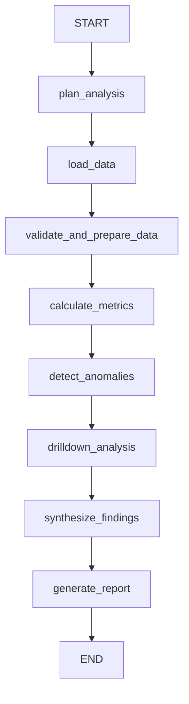
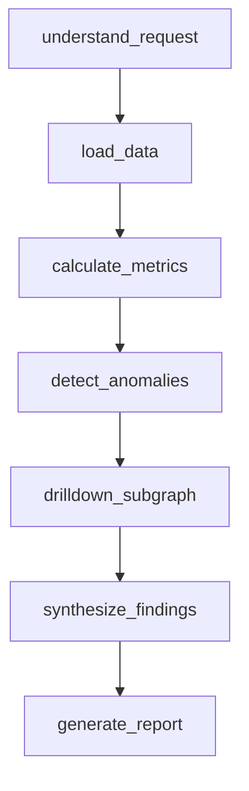
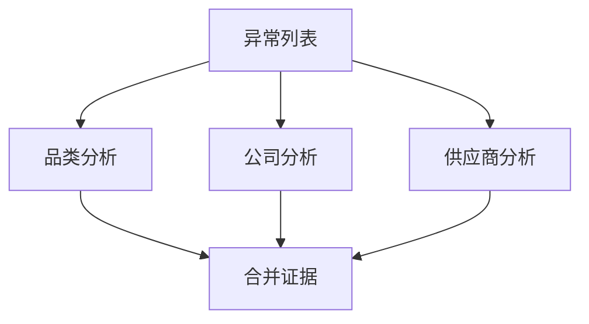

# M03｜Graph 到底怎么拆：Node、Subgraph、单 Agent 和 Multi-Agent 的边界在哪里？

这道题很容易回答成“代码组织风格”，但真正的面试深度在于：**你是否会用状态边界、失败边界、上下文边界、权限边界和成本来决定架构。**

对应题池：`LG-A07`、`LG-B08`、`LG-G04`。

---

# 1. 面试可直接回答的版本

### 60～90 秒版本

> 我不会按“一个业务名词一个 Node”机械拆 Graph。Node 更适合对应一个有清晰输入输出、可单独验证、可单独失败或重试的执行单元。如果一个 Node 内部已经形成多步流程，并且这套流程需要独立复用、独立 State、单独测试或权限隔离，我会考虑抽成 Subgraph。
>
> 但 Subgraph 不等于 Multi-Agent。Multi-Agent 的价值通常来自上下文隔离、专业化工具、并行协作或团队独立开发。官方当前也明确指出，不是所有复杂任务都需要 Multi-Agent，很多情况一只 Agent 配合合适的 Tools 就够。拆成多个 Agent 会增加模型调用、Token、状态传递、路由、权限和失败传播成本。
>
> 所以我的判断顺序一般是：先用普通 deterministic Node 和单 Agent 解决；只有当某块形成真正独立的“状态 + 上下文 + 工具 + 决策”边界时，再升级成 Subgraph / 子 Agent。复杂度本身不是拆 Multi-Agent 的理由。

核心记忆：

```text
Node      = 执行边界
Subgraph  = 可组合的流程边界
Agent     = 具有自主决策的执行主体
Multi-Agent = 多个自主主体之间的协作架构
```

四者不是同义词。

---

# 2. 先看一个错误拆法

假设采购分析业务：

```text
理解请求
取数据
清洗
计算同比
找异常
品类下钻
供应商下钻
归因
报告
```

初学者可能觉得：

> “业务有 9 步，所以做 9 个 Agent。”

这是非常典型的错误。

因为其中很多步骤根本不需要“自主决策主体”。

例如：

```text
清洗
指标计算
权限过滤
同比计算
金额阈值判断
```

用确定性函数 / Node 更合适。

如果你把每一步都变成 Agent：

```text
DataCleaningAgent
MetricAgent
PermissionAgent
ThresholdAgent
```

会出现：

- 不必要的模型调用；
- Token 成本；
- 结果非确定性；
- 更多 Prompt；
- 更多上下文同步；
- 更多错误来源。

所以第一原则是：

> **有多个步骤 ≠ 需要多个 Agent。**

---

# 3. Node 应该按什么拆

Node 最实用的判断不是“代码多少行”，而是看以下几个边界。

## 3.1 输入 / 输出是否清晰

好的 Node：

```text
输入：raw_data_ref
输出：clean_data_ref + data_quality
```

例如：

```python
def validate_and_clean_data(state):
    ...
    return {
        "clean_data_ref": cleaned_ref,
        "data_quality": quality_report,
    }
```

它的职责可以一句话说清楚。

坏的 Node：

```text
输入：整个 State
输出：可能修改十几个字段
内部：取数 + 清洗 + 分析 + 报告 + 发通知
```

你几乎无法定义它的失败语义。

## 3.2 是否有独立失败边界

例如：

```text
load_data
```

失败可能是：

- DB timeout；
- ERP 503；
- 权限拒绝。

而：

```text
generate_report
```

失败可能是：

- Model timeout；
- Structured output validation fail；
- Token limit。

两者错误类型、Retry 策略、Fallback 都不同，所以适合拆成不同 Node。

## 3.3 是否需要独立观测

如果你上线后想问：

```text
到底是取数慢，还是模型慢？
```

那就不能把两者永远塞进一个不可观察的大 Node。

## 3.4 是否需要不同 Retry / Timeout

例如：

```text
query_data       timeout 10s, retry network error
call_llm         timeout 60s, retry 429/5xx
write_erp        不允许盲重试，需要幂等
```

不同策略通常意味着不同执行边界更自然。

## 3.5 是否跨越 side-effect 边界

尤其生产场景：

```text
分析结论
↓
真正创建业务任务
```

建议不要随便塞在同一个巨型 Node 里。

因为前半段是可重算的，后半段可能产生不可逆副作用。

---

# 4. Node 太大有什么问题

假设：

```python
def analyze_everything(state):
    # 查数据
    # 清洗
    # 算同比
    # LLM 解释
    # 写数据库
    # 发消息
    return {...}
```

## 问题 1：失败位置模糊

只知道：

```text
analyze_everything failed
```

不知道：

```text
数据 API？
计算？
LLM？
DB？
消息系统？
```

## 问题 2：重试粒度太粗

如果最后发消息失败，重试整个 Node 可能导致：

```text
重新查数
重新调用 LLM
重新写库
```

甚至重复副作用。

## 问题 3：Trace 没有诊断价值

Graph 看起来只有：

```text
START → analyze_everything → END
```

使用 Graph 反而没有得到可观测性收益。

## 问题 4：权限边界过宽

一个 Node 同时拿：

```text
读 DB 权限
写 ERP 权限
发消息权限
```

Blast Radius 会变大。

---

# 5. 但 Node 拆得太碎也不好

反面极端：

```text
parse_month
parse_company
check_month
check_company
load_table_a
load_table_b
join_a_b
calculate_1
calculate_2
format_1
format_2
```

每一步都变 Node。

结果：

- Graph topology 巨大；
- State 字段越来越多；
- Trace 噪声大；
- 简单局部变量也被迫进入 State；
- 心智负担增加；
- 测试和版本维护变复杂。

所以 Node 粒度可以记一个实用标准：

> **Node 应该对应一个有业务意义的 execution / validation / failure boundary，而不是一行代码。**

---

# 6. 一个适合采购分析的 Node 粒度

例如：



这里：

`calculate_metrics` 内部可以有很多普通函数：

```python
calc_total_yoy()
calc_price_effect()
calc_quantity_effect()
calc_supplier_contribution()
```

并不需要每个都成为 Node。

因为它们：

- 都是同一确定性计算阶段；
- 失败处理相似；
- 通常不需要单独暂停；
- 可以在 Node 内部直接单元测试。

---

# 7. 什么时候升级成 Subgraph

Subgraph 是一个完整 Graph 被另一个 Graph 组合使用。

你可以把它理解成：

> **一个内部也有 State / Node / Edge 的复合执行模块。**

## 适合 Subgraph 的典型信号

### 7.1 内部已经有多步流程

例如供应商风险分析：

```text
查询供应商历史
↓
查询价格趋势
↓
查履约记录
↓
查质量事件
↓
综合风险
```

它已经不是一个简单函数。

### 7.2 需要被多个 Parent Graph 复用

比如：

```text
采购异常分析
合同风险分析
供应商准入分析
```

都需要“供应商画像 Subgraph”。

### 7.3 需要独立 State

Parent Graph 只关心：

```text
supplier_risk_summary
```

Subgraph 内部却有：

```text
supplier_profile
price_history
quality_events
contract_flags
intermediate_evidence
```

这些内部状态没必要污染 Parent State。

### 7.4 需要独立测试与演进

供应商分析团队可以单独维护这段 Graph，而顶层采购报告只依赖它的输入输出契约。

---

# 8. Parent 和 Subgraph 的 State 一定要一样吗

不一定。

官方 Subgraph 文档支持两种思路。

## 情况 A：共享 State Key

如果 Parent / Child 有共同字段，可以直接共享。

例如：

```text
Parent State:
  anomalies
  supplier_findings

Subgraph State:
  supplier_id
  supplier_findings
```

共同字段可以用于状态通信。

## 情况 B：State Schema 完全不同

这时可以用一个 Wrapper Node 做转换：

```text
Parent State
   ↓ transform
Subgraph Input
   ↓ subgraph.invoke()
Subgraph Output
   ↓ transform
Parent State Update
```

概念代码：

```python
def call_supplier_subgraph(state: ParentState):
    child_input = {
        "supplier_id": state["target_supplier_id"]
    }

    child_output = supplier_graph.invoke(child_input)

    return {
        "supplier_findings": child_output["risk_summary"]
    }
```

这个方式非常重要，因为它建立了明确的信息边界。

---

# 9. Subgraph 不等于 Agent

这两个概念经常被混在一起。

## Subgraph

描述的是**图的组合关系**。

内部可以完全 deterministic：

```text
清洗 → 指标 → 验证
```

没有任何 LLM 自主决策。

它仍然是 Subgraph。

## Agent

强调的是：

> 模型在一定约束下动态决定过程 / Tool 使用。

所以你完全可以有：

```text
一个 deterministic Subgraph
```

也可以：

```text
一个内部包含 Agent Loop 的 Subgraph
```

不要把“子图”自动叫“子 Agent”。

---

# 10. 什么情况下“一只 Agent + 多 Tools”已经够了

当前官方 Multi-Agent 文档明确提醒：**不是每个复杂任务都需要 Multi-Agent，单 Agent 加合适的 Tools 经常能完成同样的事情。**

如果你的系统具备：

```text
一个主要用户目标
一个主要对话上下文
一套相近权限
Tool 数量可控
不需要多角色长期协商
```

单 Agent 往往更简单。

例如采购问答 Agent 有：

```text
query_purchase
query_supplier
query_contract
search_policy
```

模型能够稳定选 Tool，所有 Tool 都属于同一采购域，没有明显上下文隔离需求。

这时没必要变成：

```text
PurchaseAgent
SupplierAgent
ContractAgent
PolicyAgent
```

因为你只是把 4 个 Tools 套成了 4 个 Prompt + 4 个 Model Loop。

---

# 11. 什么时候 Multi-Agent 才真的有价值

官方当前把常见动机总结为几个核心方向：

- Context Management；
- Distributed Development；
- Parallelization；
- Tool 过多导致单 Agent 选择变差；
- 不同领域需要大量专门上下文；
- 需要显式的能力解锁和顺序约束。

我们把它翻译成工程语言。

## 11.1 上下文真的需要隔离

例如集团经营 Agent 同时有：

```text
采购政策 100 页
财务口径 80 页
法务合同规则 120 页
```

如果全塞一个 Agent：

- Token 大；
- 注意力混杂；
- Tool 选择空间大；
- 角色边界弱。

这时不同专业 Agent 保留不同上下文会更合理。

## 11.2 Tool 权限明显不同

例如：

```text
采购分析 Agent：只读采购数据
法务 Agent：只读合同
执行 Agent：可以创建任务 / 发通知
```

独立 Agent / Subgraph 能帮助建立权限边界。

但注意：真正的权限仍然必须由服务端 Tool 层 enforce，而不是“因为分成 Agent 就安全”。

## 11.3 能够真正并行

例如：

```text
采购分析
财务影响
供应商风险
```

三块互不依赖，可以并行，然后由 Coordinator 汇总。

## 11.4 不同团队独立维护

不同团队有不同：

```text
Prompt
Tools
Eval Dataset
Release Cycle
```

多 Agent 可以成为组织边界，而不仅是代码技巧。

---

# 12. Multi-Agent 会付出什么成本

官方文档还专门比较不同 Multi-Agent Pattern 的 Model Calls 和 Token Cost。

这说明一个重要事实：

> **Multi-Agent 不只是“模块化”，它通常会增加真实推理成本。**

常见成本包括：

## 12.1 更多 Model Calls

例如主 Agent：

```text
决定调用子 Agent
↓
子 Agent 自己调用模型 / Tool
↓
结果回主 Agent
↓
主 Agent 再总结
```

比单 Agent 多一层或多层调用。

## 12.2 更多 Token 复制

需要决定：

```text
哪些上下文传给子 Agent？
结果返回多少？
历史消息带不带？
```

如果不做 Context Engineering，成本会迅速膨胀。

## 12.3 新的失败传播问题

```text
子 Agent 超时怎么办？
部分 Agent 成功怎么办？
Supervisor 重试谁？
子 Agent 有副作用怎么办？
```

## 12.4 权限和审计更复杂

每个 Agent 能看到什么、能调用什么 Tool，都要明确。

## 12.5 更难评估

最终错了，要判断：

```text
Router 错？
子 Agent 错？
Tool 错？
上下文传错？
汇总错？
```

---

# 13. 一个实用的四层判断模型

面对一个业务模块，不要先问：

> “要不要做 Agent？”

而按下面四层判断。

## Level 1：普通函数够不够

如果：

```text
输入固定
算法确定
无自主决策
```

普通函数即可。

例：

```text
calculate_yoy()
```

## Level 2：需要独立 Node 吗

如果它有独立：

```text
失败 / Retry / Timeout / Trace / State Update
```

做 Node。

例：

```text
load_data
```

## Level 3：需要 Subgraph 吗

如果内部已经是多步骤、可复用、有独立 State：

```text
supplier_risk_subgraph
```

## Level 4：需要独立 Agent 吗

如果需要独立：

```text
LLM 决策
专业上下文
Tools
权限
长期角色
```

才考虑 Agent。

形成：

```text
Function
  ↓
Node
  ↓
Subgraph
  ↓
Agent / Multi-Agent
```

注意这不是“越往下越高级”，而是**只有在必要时才增加协调复杂度**。

---

# 14. 把我们的采购 Agent 重新设计一次

## 14.1 顶层 Graph



## 14.2 普通 Node

适合：

```text
load_data
calculate_metrics
detect_anomalies
```

因为职责和失败边界清晰。

## 14.3 Subgraph

`drilldown_subgraph` 内部：



为什么适合 Subgraph？

- 顶层只关心 `drilldown_findings`；
- 内部有自己的并行结构；
- 后续可能被“采购月报”“专项分析”复用；
- 可以独立测试。

## 14.4 目前不一定需要 Multi-Agent

因为：

```text
品类分析
公司分析
供应商分析
```

可能只是三个确定性 / LLM-assisted Worker，并不需要三个长期自主 Agent。

只有当它们发展成：

```text
Supplier Agent：供应商知识库 + 合同 Tool + 风险 Tool
Finance Agent：财务规则 + 财务系统 Tool
Procurement Agent：采购指标 + 采购 Tool
```

而且上下文 / 权限 / Eval 都明显独立，才更有理由升级 Multi-Agent。

---

# 15. Node 边界和 Checkpoint / Retry 有什么关系

这是一个更深的工程点。

假设一个 Node：

```text
A. 读取数据
B. LLM 生成结论
C. 写 ERP
```

如果 C 失败，需要重试 Node：

```text
A、B 可能再次执行
```

尤其 B 是非确定 LLM，结果甚至可能不同。

如果拆成：

```text
load_data
   ↓
generate_findings
   ↓
write_erp
```

你可以对每一段设计不同的：

```text
Retry
Timeout
Idempotency
Checkpoint
Validation
```

所以 Node 粒度不只是“代码好不好看”，还影响 durable execution 的语义。

后面 M08 / M09 会继续深入。

---

# 16. Node 边界和权限有什么关系

例如：

```text
analysis Node：只读
publish Node：可以发消息
execute Node：可以写 ERP
```

如果它们是不同边界，Tool Credential 也可以按最小权限配置。

但如果一个超级 Node 拿到所有权限：

```text
READ_DB
WRITE_ERP
SEND_MESSAGE
```

任何 Prompt / 代码错误的 Blast Radius 都更大。

所以 Graph 拆分还可以帮助你建立：

```text
Execution Boundary
=
Observability Boundary
+
Retry Boundary
+
Permission Boundary
```

虽然并不是每次完全一一对应，但这是很有价值的设计视角。

---

# 17. 面试追问树详细回答

## 追问 1：Node 多大才合理？

没有固定行数。

看它是否有统一：

```text
输入输出语义
失败原因
Retry 策略
权限
观测目标
```

如果一个 Node 内包含明显不同的失败 / 副作用阶段，通常偏大。

## 追问 2：Node 太碎为什么不好？

因为 Graph State 会被迫承载大量原本局部变量，拓扑复杂，Trace 噪声高，维护成本上升。

## 追问 3：什么时候抽 Subgraph？

常见信号：

```text
多步骤
可复用
独立 State
独立测试
独立团队 / 版本
```

## 追问 4：Subgraph 是不是一定是子 Agent？

不是。Subgraph 可以没有任何 LLM。

## 追问 5：为什么一只 Agent + Tools 往往够？

如果一个 Agent 能稳定管理上下文和 Tool 选择，多 Agent 只会增加调用和协调成本。

当前官方也明确说 not every complex task requires multi-agent。

## 追问 6：什么时候单 Agent 明显开始不够？

例如：

- Tool 太多，选择经常出错；
- 每个领域需要大块独立 Context；
- 需要多个专业任务并行；
- 不同团队独立维护；
- 权限 / 角色需要强隔离。

## 追问 7：业务很多是不是就应该 Multi-Agent？

不是。

业务复杂度和 Agent 数量没有线性关系。

一个复杂 Workflow 可以只有一个甚至没有 Agent。

---

# 18. 一个实际决策表

| 需求特征 | Function | Node | Subgraph | 独立 Agent |
|---|---:|---:|---:|---:|
| 确定性计算 | ✅ | 可选 | 通常不需要 | ❌ |
| 独立 Retry / Timeout |  | ✅ | ✅ | ✅ |
| 多步骤内部流程 |  |  | ✅ | 可能 |
| 复用内部 Workflow |  |  | ✅ | 可能 |
| 需要 LLM 自主决定 Tool |  | 可做 | 可做 | ✅ |
| 独立大上下文 |  |  | 可做 | ✅ |
| 独立权限 / Tools |  | 可做 | ✅ | ✅ |
| 多专业角色协作 |  |  |  | ✅ |

这只是思考辅助，不是硬规则。

---

# 19. 常见低质量回答

### “Node 越细越符合微服务思想。”

错误。Graph Node 不是微服务实例，拆太细会增加 State 和控制流复杂度。

### “Subgraph 就是 Multi-Agent。”

错误。Subgraph 是组合结构。

### “业务复杂就应该 Multi-Agent。”

错误。官方明确指出单 Agent + Tools 经常已经足够。

### “每个 Tool 配一个 Agent。”

通常是过度设计。Tool 本来就是 Agent 可调用的能力。

### “Multi-Agent 的主要好处是更聪明。”

不严谨。更明确的价值通常是 Context、专业化、并行、组织边界；同时会增加成本和协调风险。

---

# 20. 这一题真正应该形成的架构习惯

以后看到一个 Agent 需求，按这个顺序问：

```text
1. 这一步能不能普通函数解决？
2. 是否需要独立 Execution / Failure Boundary？
3. 是否已经形成可复用的多步骤流程？
4. 是否需要独立 State / Context / Tools / Permission？
5. 是否真的需要另一个自主 Agent？
```

最后得到的系统可能是：

```text
一个顶层 LangGraph
+ 多个 deterministic Node
+ 少数 LLM Node
+ 一两个可复用 Subgraph
+ 必要时才出现 Multi-Agent
```

这种设计通常比“每个业务模块都 Agent 化”更容易控制、测试和上线。

下一条主链将进入 [[../../面试题池/05-20条深度主链#M04｜State 怎么设计成系统契约，而不是一个所有人随便写的 giant dict？|M04 State 作为系统契约]]。

---

## 官方来源（核对日期：2026-09-16）

- LangGraph Subgraphs：https://docs.langchain.com/oss/python/langgraph/use-subgraphs
- LangChain Multi-Agent：https://docs.langchain.com/oss/python/langchain/multi-agent
- LangGraph Workflows and Agents：https://docs.langchain.com/oss/python/langgraph/workflows-agents
- 题目市场来源：[[../../面试题池/02-来源登记与搜索记录]]
