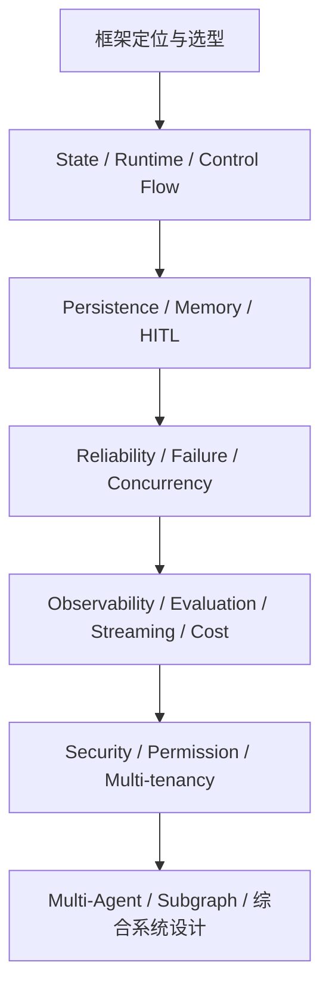

# 题目去重与市场观察

本页只记录“搜索后观察到什么”，**还不决定 Part 4 / Part 5 最终学习顺序**。

## 1. 真实面试明显不是按 API 名字逐个考

公开面经里最常见的起点不是：

```text
Reducer 的定义是什么？
Command 的参数有哪些？
```

而是：

```text
为什么用 LangGraph？
你这个 Agent 的完整执行链路是什么？
为什么拆成 Subgraph？
State 在 Node 之间怎么传？
长链路怎么稳？
失败怎么恢复？
怎么评测和监控？
```

也就是说，API 机制通常是**项目追问里的证据**，而不是孤立知识点。这和我们完成 Part 1～3 后转向综合题的方向是一致的。

## 2. “为什么这样设计”比“你会不会写”出现得更多

曹操出行、LangChain Deployed Engineer、小红书/百度等来源都在追架构理由：为什么 LangGraph、为什么子图、为什么不是脚本、还有什么替代方案。

因此后续真正高价值的题，不应该只要求“写一段 StateGraph 代码”，而要能回答：

- 业务约束是什么；
- 哪个机制解决哪个约束；
- 如果不用它会怎样；
- 代价和替代方案是什么。

## 3. State + Persistence 是 LangGraph 专项的核心深水区

在真实/整理面经和 2026 题库里反复出现的组合是：

```text
State Schema
→ Reducer
→ 并发写
→ Checkpoint
→ thread_id
→ Memory / Store
→ interrupt / resume
→ 外部副作用
```

单独背“Checkpoint 是状态快照”远远不够；面试很容易继续追：

- `thread_id` 是否等于订单号；
- 并行写同一个字段怎么办；
- Checkpoint 膨胀怎么办；
- 外部写成功但响应丢失怎么办；
- 恢复后是否会重复调用 Tool；
- 多租户数据如何隔离。

## 4. 生产可靠性已经和 LangGraph 机制绑在一起问

2026 面经里出现了：

- 长链路稳定性；
- 子任务抓空如何 Retry / Degrade；
- FastAPI + SSE 如何推 Node 执行结果；
- Demo 到高并发生产如何改造；
- Agent 幻觉链式积累如何阻断；
- Agent 评测、监控和成本。

这说明“LangGraph 面试”实际上经常是在考**一个带 LLM 的分布式/状态化应用怎么上线**，框架本身只占一部分。

## 5. Security / Permission 不能作为最后附录

公开 LangGraph 一手面经里安全题数量少于 State / Checkpoint，但 Agent 岗的专项安全题已经非常具体：

```text
Prompt Injection
Tool 权限
最小权限
跨租户数据隔离
Secret
HITL 高危操作
代码 / SQL / 网络沙箱
State / Checkpoint / Trace 敏感数据
```

这些问题和 LangGraph 的 Runtime Context、State、Tool、Interrupt、Persistence 有直接交叉，因此题池把它们纳入正式高价值候选，而不是放到“有空再看”。

## 6. Multi-Agent 的高价值问题不是“有几种模式”

真实面经更关注：

- 为什么一定要 Multi-Agent；
- 为什么拆 Subgraph；
- 子 Agent 之间怎么传数据；
- 子图跑偏怎么办；
- State 和 Tools 是否共享；
- 消息有没有重复/遗漏。

因此“Supervisor / Swarm / Handoff 名词解释”只应该是背景，真正的主问题是**状态隔离、控制权、错误传播和成本**。

## 7. Evaluation 与 Observability 是明显高频工程能力

曹操出行直接问 Agent 评测，淘天问节点效果和监控，LangChain 自己的 Deployed Engineer 面试也强烈强调 debugging、evaluation、production issue。

后续答案应该把评测拆成至少三层：

```text
最终任务是否完成
执行轨迹是否合理
每个 Node / Tool / Model 是否按预期工作
```

但当前题目池阶段只记录这一观察，不展开答案。

## 8. 当前版本必须主动清理旧题库知识

搜索过程中发现第三方 2026 题库仍可能把旧 API 当成当前推荐。例如有来源还把 `langgraph.prebuilt.create_react_agent` 当迁移目标之一。

当前官方 LangGraph v1 文档已经明确：

```text
create_react_agent  → deprecated
推荐替代           → langchain.agents.create_agent
MessageGraph        → deprecated
推荐替代           → StateGraph + messages
```

因此以后每一道题都要遵守：

> 面经决定“值得学什么”，官方文档决定“现在应该怎么答”。

## 9. 不能把“出现次数”伪装成统计频率

本轮公开样本来自不同平台、不同岗位、不同作者，存在严重选择偏差。因此不写：

```text
Reducer 出现率 37%
Checkpoint 是 Top 3 高频
```

只使用更保守的表达：

- 在多个独立来源中重复观察到；
- 有第一人称面经支持；
- 题库中也反复覆盖；
- 公开面经较少，但生产意义强。

`P0 / P1` 是我们的**学习优先级**，不是互联网真实频率排行榜。

## 10. 本轮检索后形成的七个稳定主题



这七类是当前题目池的分类，不等于后续一定按七章顺序学习。下一步应该基于知识依赖与面试场景，把 69 道候选题进一步合并成更少的“主问题 + 追问树”。
