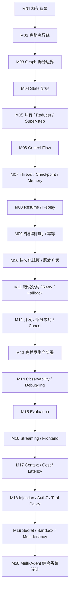

# 69 道候选题压缩为 20 条深度主链

这里的“压缩”**不是删题**，也不是把 69 道题缩成 20 个更短的问题。

真正目标是把零散问题组织成 **20 个主问题 + 追问树**：

```text
主问题
  ↓
先回答系统设计与核心机制
  ↓
面试官沿同一条因果链继续追问
  ↓
把原本分散的 69 道题逐层展开
  ↓
最后进入生产故障、安全、评估和综合系统设计
```

因此 [[01-高价值题目池]] 仍完整保留 69 道候选题；本页只是建立学习和面试表达的“骨架”。完整一一映射见 [[06-69题覆盖映射]]。

## 为什么这样组织

公开面经显示，真实面试通常不会按 `State → Reducer → Checkpoint → Send` 逐个背定义，而会从一个项目问题开始不断向下追：

```text
为什么用 LangGraph？
→ 你的系统怎么编排？
→ State 怎么设计？
→ 并行写冲突怎么办？
→ 失败以后怎么恢复？
→ 外部 Tool 已经成功但响应丢了怎么办？
→ 怎么监控、评估、控成本？
→ 怎么防越权和 Prompt Injection？
```

所以 20 条主链按“面试追问能够自然连续发生”的方式组织，而不是按 API 分类。

---

# 阶段一：先证明你真的会设计一个 LangGraph 系统

## M01｜为什么是 LangGraph，而不是 LangChain 高层 Agent、Python 脚本或自研 Runtime？

**主问题**：你的项目为什么需要 LangGraph？框架解决了什么，又没有解决什么？

**原题覆盖**：`LG-A01` `LG-A02` `LG-A04` `LG-A06`

**追问树**：

```text
LangGraph 和 LangChain 当前是什么关系？
→ 什么情况下直接 create_agent / Chain 就够了？
→ 为什么普通 while-loop / 状态机不够？
→ 为什么不完全自研 Runtime？
→ LangGraph 的成本、复杂度和锁定风险是什么？
→ 什么项目用了反而是过度设计？
```

**这一链真正要学深的东西**：框架边界、显式状态、持久执行、Human-in-the-loop、工程复杂度与技术选型 trade-off。

---

## M02｜一次真实请求从 API 进入到最终答案，LangGraph、Node、LLM、Tool 各负责什么？

**主问题**：请画出一个生产 Agent 的完整调用链，并说明 deterministic workflow 与 agentic decision 的边界。

**原题覆盖**：`LG-A03` `LG-A05` `LG-B09`

**追问树**：

```text
用户请求进入哪一层？
→ LangGraph Runtime 在哪？
→ Node 是执行单元还是能力本身？
→ Tool 与 ToolNode 有什么区别？
→ 一次 LLM → Tool → LLM 循环是谁推进的？
→ 哪些步骤必须 deterministic？
→ 哪些地方才值得让 LLM 自主决策？
```

**贯穿案例**：采购经营分析 Agent 中，指标计算应保持确定性，而分析计划、异常解释可以包含模型决策。

---

## M03｜Graph 到底怎么拆：Node、Subgraph、单 Agent 和 Multi-Agent 的边界在哪里？

**主问题**：为什么某个业务步骤要拆成独立 Node、Subgraph 或子 Agent？

**原题覆盖**：`LG-A07` `LG-B08` `LG-G04`

**追问树**：

```text
Node 多大才合理？
→ 太大有什么问题？
→ 太碎又有什么代价？
→ 什么时候抽成 Subgraph？
→ 什么时候一只 Agent + 多 Tools 已经足够？
→ 为什么“业务多”不等于“必须 Multi-Agent”？
```

**关键判断维度**：状态边界、失败边界、复用、权限隔离、测试难度、模型调用成本与控制复杂度。

---

## M04｜State 怎么设计成系统契约，而不是一个所有人随便写的 giant dict？

**主问题**：你会怎样设计 LangGraph State Schema？

**原题覆盖**：`LG-B01` `LG-B02` `LG-B04`

**追问树**：

```text
输入 / 中间过程 / 决策结果 / 最终输出怎么分？
→ Node 为什么返回 partial update？
→ 每个字段应该由谁写、谁读？
→ append / overwrite / clear 语义如何明确？
→ 大 DataFrame / 文件 / Tool 原始响应要不要进 State？
→ State 什么时候应该只保存引用或摘要？
```

**核心认知**：State 不是“所有数据”，而是跨节点真正需要共享和演化的工作状态契约。

---

## M05｜并行 Node 同时写 State 时，Reducer、Super-step、Send 到底怎么配合？

**主问题**：三个并行分析节点同时写结果，为什么不会天然安全合并？

**原题覆盖**：`LG-B03` `LG-B05` `LG-B06` `LG-G05`

**追问树**：

```text
Super-step 是什么？
→ 并行 Node 这一轮看到的是哪份 State？
→ 为什么看不到兄弟 Node 刚写的结果？
→ 两个 Node 写同一 key 会发生什么？
→ Reducer 应该解决什么、不应该解决什么？
→ 固定并行与运行时动态 Send 有什么差异？
→ fan-out / fan-in 如何形成？
```

**贯穿案例**：异常品类数量运行前未知时，用 `Send` 动态分发下钻 Worker，再用 Reducer 汇总。

---

## M06｜Edge、Conditional Edge、Command、Send 和循环应该怎样组合？

**主问题**：一个真实 Graph 的控制流为什么不能只靠 `add_edge()`？

**原题覆盖**：`LG-B07` `LG-B10` `LG-B11`

**追问树**：

```text
固定 Edge 什么时候够？
→ 条件分支什么时候放 Conditional Edge？
→ 为什么有时 Node 直接返回 Command 更自然？
→ Send 属于“路由到已有节点”还是“动态创建任务”？
→ Reflection / Retry Loop 如何终止？
→ recursion limit、attempt budget、业务停止条件分别解决什么？
→ compile、invoke、stream 各处于哪一层？
```

---

# 阶段二：让这个 Graph 能跨时间、跨故障继续活着

## M07｜Thread、Checkpoint、Checkpointer、Store 和 Memory 到底是什么关系？

**主问题**：如果用户第二天继续同一个分析任务，系统到底靠什么找回状态？

**原题覆盖**：`LG-C01` `LG-C02` `LG-C03` `LG-C12`

**追问树**：

```text
Checkpoint 只是一份 State JSON 吗？
→ StateSnapshot 还包含哪些执行信息？
→ thread_id 应该等于 user_id / session_id / order_id 吗？
→ Checkpointer 管什么？
→ Store 又管什么？
→ 短期任务状态与长期用户记忆怎么划界？
```

---

## M08｜崩溃、interrupt、resume、Replay、Time Travel 的恢复语义到底是什么？

**主问题**：Graph 跑一半停了，恢复时到底从哪里继续？

**原题覆盖**：`LG-C04` `LG-C05` `LG-C06` `LG-C10`

**追问树**：

```text
Checkpoint 边界在哪里？
→ interrupt 为什么必须依赖持久化？
→ Command(resume=...) 实际恢复什么？
→ 为什么包含 interrupt 的 Node 可能从头执行？
→ 哪些代码可能被再次运行？
→ Replay / Time Travel 是重放结果还是重新执行？
→ LLM / Tool 非确定性为什么让“完全复现”变得困难？
```

---

## M09｜外部 Tool 已经成功，但 LangGraph 不知道：怎么防止重复副作用？

**主问题**：创建工单、发消息、写 ERP 已经成功，但网络返回丢了，重试怎么办？

**原题覆盖**：`LG-C07` `LG-D12`

**追问树**：

```text
本地 Checkpoint 能证明外部系统成功了吗？
→ 为什么 at-least-once 场景会重复？
→ 稳定业务意图 ID / idempotency key 怎么设计？
→ “先查有没有，再创建”为什么仍可能 race？
→ 下游不支持幂等怎么办？
→ 什么时候需要 reconciliation / 对账？
→ 恢复后如何验证内部 State 与外部真实世界一致？
```

**这是 Part 5 里非常重要的一条生产主线。**

---

## M10｜Checkpoint 越来越大、Graph 又升级了，长期运行 Thread 怎么维护？

**主问题**：一个运行几天甚至几周的 Agent，状态、存储和版本怎么治理？

**原题覆盖**：`LG-C08` `LG-C09` `LG-C11` `LG-D11`

**追问树**：

```text
Checkpoint 为什么会膨胀？
→ 大 Tool Result / 文件 / 对话历史怎么外置？
→ TTL / compaction / summary 怎么做？
→ InMemory / SQLite / Postgres 等 Saver 怎么选？
→ 多实例部署时需要什么耐久性与并发能力？
→ State Schema 升级怎么兼容旧 Checkpoint？
→ 滚动发布期间老 Thread 应该绑定旧 Graph 还是迁移？
```

---

# 阶段三：把 Demo 变成不会轻易失控的生产系统

## M11｜长链路失败时，什么该 Retry，什么绝不能 Retry？

**主问题**：一个任务跨多个模型、Tool 和数据源时，怎样建立系统性的错误处理策略？

**原题覆盖**：`LG-D01` `LG-D02` `LG-D03` `LG-D08` `LG-D09`

**追问树**：

```text
Timeout / 429 / 5xx / 参数错误 / 权限错误 / 解析错误怎么分类？
→ 哪些可立即重试？哪些需要退避？
→ 哪些必须改参数或重新规划？
→ 哪些应该 fail fast？
→ fallback / degradation / circuit breaker 放在哪？
→ Node 输出怎样做 schema / domain validation？
→ 如何阻断错误结果在长链路里逐步放大？
```

---

## M12｜并发请求、部分成功、取消任务和消息重复怎么处理？

**主问题**：状态化 Agent 遇到并发和部分失败时，怎样避免重复、覆盖和不一致？

**原题覆盖**：`LG-D04` `LG-D05` `LG-D06` `LG-D10`

**追问树**：

```text
同一 Super-step 2 个成功 1 个失败怎么办？
→ Pending Writes 能解决什么？
→ 同一个 thread_id 同时两次 invoke 有什么风险？
→ per-thread lock / queue / version check 怎么选？
→ 用户 cancel 时正在跑的外部 Tool 能不能真的停止？
→ 已经发生的副作用是否需要 compensation？
→ 多 Agent 消息怎样建立 message identity 与去重？
```

---

## M13｜从单机 Demo 到高并发服务，Agent Runtime 怎么部署？

**主问题**：如果同时有上千条长任务，LangGraph 应用层怎么扩展？

**原题覆盖**：`LG-D07`

**关键追问**：

```text
同步 HTTP 请求是否应该一直挂着？
→ 任务队列和 Worker 怎么分工？
→ 限流和背压在哪一层？
→ 模型 / Tool 配额怎么分租户治理？
→ State / Checkpoint 为什么必须外置？
→ 水平扩展时 Worker 如何做到无本地会话依赖？
→ 长任务与短交互请求是否需要资源隔离？
```

**交叉主链**：M10 的持久化、M11 的下游保护、M17 的延迟成本都会在这里重新出现。

---

# 阶段四：让系统可观察、可验证、可交互、可控成本

## M14｜最终答案错了，怎么定位到底是 Prompt、Routing、State、Tool 还是模型的问题？

**主问题**：生产上出现一次坏 Run，你怎么系统化排查？

**原题覆盖**：`LG-E01` `LG-E02` `LG-E05`

**追问树**：

```text
一次 Run 要记录哪些 Trace？
→ Node / Tool / Model span 各看什么？
→ latency、error、token、retry 怎么归因？
→ Routing 走错怎么发现？
→ State 在哪一步被污染怎么定位？
→ Tool 返回正确但最终答案错了，怎么继续缩小范围？
→ LangSmith 与自建 Observability 各负责什么？
```

---

## M15｜怎么证明一个 Agent “效果好”，而不只是 Demo 看起来能跑？

**主问题**：Agent Evaluation 应该评什么？

**原题覆盖**：`LG-E03` `LG-E04`

**追问树**：

```text
只评最终文本为什么不够？
→ Task Success 怎么定义？
→ Trajectory 是否合理怎么评？
→ Tool / Node 层需要哪些指标？
→ Golden Dataset 怎么构建？
→ LLM 非确定性为什么不能只做 exact-text assertion？
→ 离线回归、在线评测、人工审核怎么组合？
```

---

## M16｜Streaming 不是“把 Token 推给前端”这么简单，完整协议怎么设计？

**主问题**：长时间 Agent 如何让用户看见进度、工具状态和人工审批？

**原题覆盖**：`LG-E06` `LG-E07`

**追问树**：

```text
Token stream 与 Node progress 有什么区别？
→ updates / values / messages / custom 怎么选？
→ SSE 和 WebSocket 的系统边界怎么判断？
→ interrupt 怎样变成前端待审批状态？
→ 为什么不能把完整内部 State 直接推给浏览器？
→ 客户端断线重连后进度怎么恢复？
```

---

## M17｜Context、Checkpoint、Memory、Token、延迟和成本为什么必须一起治理？

**主问题**：Agent 越跑上下文越长，成本和延迟不断升高，你怎么拆问题？

**原题覆盖**：`LG-E08` `LG-E09`

**追问树**：

```text
State 大 ≠ Context Window 大，二者怎么区分？
→ 哪些历史需要给模型看？
→ 哪些只需要留在 Checkpoint？
→ 哪些进入长期 Store / 向量库？
→ summary / trimming 如何避免丢业务状态？
→ 模型分级、缓存、并行、结果复用怎么降低成本？
→ 如何用 Trace 把延迟与 Token 成本归到具体 Node？
```

---

# 阶段五：最后把 Agent 变成真正可上线的受控系统

## M18｜Prompt Injection、越权和危险 Tool 调用，安全边界到底应该放在哪里？

**主问题**：为什么不能只在 System Prompt 里告诉模型“不要做危险操作”？

**原题覆盖**：`LG-F01` `LG-F02` `LG-F03` `LG-F04` `LG-F09`

**追问树**：

```text
网页 / RAG 文档 / Tool Result 的间接 Prompt Injection 怎么处理？
→ 用户身份和授权规则从哪里进入 Runtime？
→ Tool 层为什么必须服务端再次鉴权？
→ 最小权限、工具白名单、读写分级怎么做？
→ 高危动作什么时候 interrupt 等人工审批？
→ 审批如何绑定工具名、参数、资源和版本，防止“批准 A、执行 B”？
→ Guardrail 能挡什么，不能替代什么？
```

---

## M19｜Secret、敏感 State、多租户和代码执行如何隔离？

**主问题**：如果 Agent 能查数据库、跑 SQL、写文件、访问网络，怎么限制爆炸半径？

**原题覆盖**：`LG-F05` `LG-F06` `LG-F07` `LG-F08`

**追问树**：

```text
API Key / DB Credential / User Token 放在哪里？
→ 为什么不应该进入 Prompt 和普通可持久 State？
→ Checkpoint / Trace 如何做字段脱敏、加密、TTL、删除？
→ 代码执行、SQL 和网络访问如何沙箱？
→ CPU / 内存 / 时间 / 文件系统 / 出网如何限制？
→ tenant_id 如何贯穿 Thread、Store、Tool、向量库、Trace 和成本归属？
```

---

## M20｜最终综合题：什么时候需要 Multi-Agent，多个 Agent 怎么共享状态、权限和失败语义？

**主问题**：给一个真实业务场景，完整设计 LangGraph / Multi-Agent 系统，并解释为什么这样拆。

**原题覆盖**：`LG-A08` `LG-G01` `LG-G02` `LG-G03` `LG-G06` `LG-G07` `LG-G08`

**追问树**：

```text
为什么不是单 Agent + Tools？
→ Supervisor / Handoff / Hierarchical / Network 什么时候合理？
→ Parent Graph 与 Subgraph Schema 不同怎么映射？
→ 子 Agent 应共享哪些 State，哪些必须私有？
→ Tool 权限是否按 Agent 角色拆分？
→ 子图跑偏或失败谁发现、谁降级？
→ A2A / 跨 Agent 调用的 timeout、幂等、协议版本怎么处理？
→ 最后把 Persistence、HITL、Observability、Security 一起放到系统图里。
```

**这不是额外的新题，而是前 19 条主链的最终汇合点。**

---

# 20 条主链之间的整体关系



这是一条**知识依赖链**，不是说面试官一定按这个顺序提问。正式学习时可以用它保证：每一题越学越深，但不丢掉原始题池的任何高价值问题。
