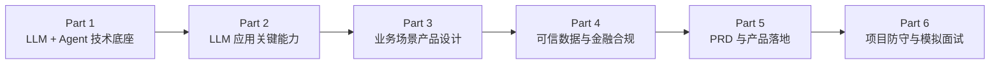

# 深圳平安科技 AI 产品经理面试 Vault

这是一个面向 **深圳平安科技 AI / 大模型产品经理岗位** 的短周期面试学习项目。

它不是普通产品经理八股合集，也不是重新学习一遍人工智能基础，而是围绕当前岗位描述（Job Description，JD）建立一条明确的学习路径：

> **先从已有技术基础出发 → 把大模型与智能体能力整理成产品经理可表达的技术认知 → 再进入金融/医疗业务场景 → 最后补可信数据空间、隐私计算、金融合规、PRD 与产品落地。**

## 1. 岗位关键词

当前 JD 的核心关键词整理为四层：

### 技术能力层

- 大语言模型（Large Language Model，LLM）基础理解
- 大模型智能体（AI Agent）架构
- 提示工程（Prompt Engineering）
- 结构化输出（Structured Output）
- 长文本处理（Long-context / Long-document Processing）
- 多轮对话（Multi-turn Conversation）
- 工具调用（Tool Calling）
- 幻觉抑制（Hallucination Mitigation）
- 检索增强生成（Retrieval-Augmented Generation，RAG）与评估（Evaluation）

### 业务场景层

- 数据解读（Data Interpretation）
- 智能报告（AI-generated / AI-assisted Report）
- 信贷风险（Credit Risk）
- 潜客推荐（Lead / Prospect Recommendation）
- 金融与医疗场景的大模型创新应用

### 数据可信与合规层

- 可信数据空间（Trusted Data Space）
- 隐私计算（Privacy-preserving Computing）技术栈
- 金融数据合规、权限、审计与可追溯

### 产品落地层

- 需求理解与需求管理
- 产品需求文档（Product Requirements Document，PRD）
- 产品原型
- 技术方案协同
- MVP、试点、评估、推广与迭代
- 与算法、研发、业务团队协作

## 2. 贯穿学习的两段个人经历

本 Vault 不凭空包装经历，而是明确区分“已经真实做过”和“需要补齐的知识”。

### 经历 A：津药达仁堂 ERP / SRM 采购分析自动化

可用于证明：

- 真实医药企业业务场景理解；
- ERP / SRM 多源数据治理；
- 业务流程梳理与自动化边界设计；
- 统一数据模型、Schema、确定性 Tool；
- Prompt 约束、Workflow / Agent 设计；
- 人工复核与异常处理。

### 经历 B：Personal Health Agent

可用于证明：

- 医疗健康 AI 产品场景；
- LangGraph Agent 编排；
- Tool Calling；
- RAG、Citation、证据不足拒答；
- 对话与报告生成；
- 权限边界、来源追踪、恢复与可靠性。

### 不直接包装成“做过”的能力

以下内容当前主要作为专项补课，不应在面试中伪装成真实项目经验：

- 信贷风控业务；
- 金融潜客推荐；
- 隐私计算算法实现；
- 可信数据空间正式项目；
- 金融监管合规项目。

正确策略是：**用现有项目证明方法论，再说明如何迁移到金融场景。**

## 3. 学习顺序

学习入口：

1. [[00-总学习路线|00 总学习路线]]
2. [[01-JD与个人经历映射|01 JD 与个人经历映射]]
3. [[讲解/01-大模型与Agent架构|第一课：大模型与 Agent 架构]]

## 4. 教学方式

每个模块固定回答五个问题：

1. **JD 为什么要求这个能力？**
2. **这个技术/业务概念到底是什么？**
3. **真实 AI 产品里它位于什么位置？**
4. **你的经历中哪里能证明理解或实践过？**
5. **面试官会如何继续追问？**

不追求把每一项知识学成算法或后端岗位深度，而追求达到 AI 产品经理需要的三种能力：

- 能和业务沟通；
- 能和算法、研发沟通；
- 能解释为什么这个产品方案在业务、技术、数据和风险上成立。

## 5. 当前状态

- 总体 JD 拆解：已建立。
- 学习顺序：已建立。
- 个人经历映射：第一版已建立。
- Part 1：从“大模型与 Agent 架构”开始。
- 后续章节按面试时间优先级逐步生成。

> [!warning] 状态说明
> 本 Vault 当前是 `teaching_draft`，用于短周期面试准备，不等同于 AI-Learn 正式知识图谱的已审计知识章节。涉及版本、法规和具体金融业务规则时，需要进一步用官方资料核验。