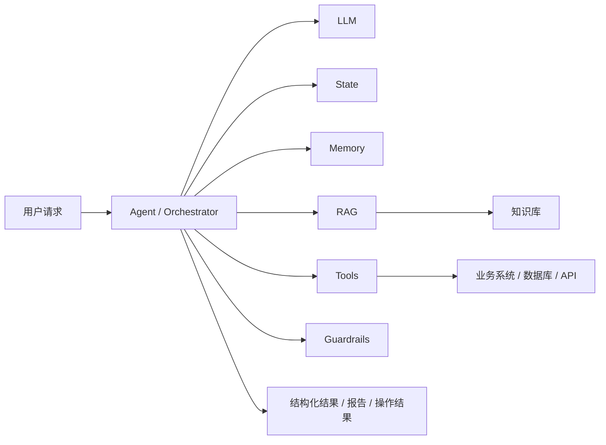

# 第一课：大模型与 Agent 架构

## 1. 为什么这会是第一课

当前岗位要求并不是“会使用 ChatGPT”或“听说过 Agent”，而是要求候选人理解大模型、隐私计算技术栈、大模型智能体架构，并能参与金融/医疗场景应用设计。

因此这里的学习目标不是算法岗深度，而是达到 AI 产品经理需要的三层理解：

1. 知道大语言模型（Large Language Model，LLM）能做什么、不能做什么；
2. 知道为什么企业应用不能只放一个聊天框，而需要 Workflow、Tool、RAG、State、Memory、Guardrail；
3. 能把这些能力映射到自己的 Health Agent 与津药项目，并进一步迁移到金融业务。

---

## 2. 先建立大模型的产品视角

可以先把 LLM 理解为一个“基于上下文预测下一段 Token 的通用语言与推理引擎”。

产品经理不需要在面试中推导 Transformer 公式，但必须理解几个直接影响产品设计的事实。

### 2.1 LLM 擅长什么

典型优势：

- 自然语言理解与生成；
- 非结构化文本提取、分类、总结；
- 在给定上下文和示例下完成复杂指令；
- 对多步骤任务进行一定程度的规划和判断；
- 把结构化数据转化成人类易理解的解释；
- 在 Tool / RAG 提供事实后进行综合表达。

这解释了为什么 JD 会列出：数据解读、智能报告、信贷风险、潜客推荐。

这些场景往往不是让 LLM 独立完成业务决策，而是利用它处理“解释、归纳、非结构化信息、自然语言交互”这一层。

### 2.2 LLM 不擅长什么

必须记住四个边界：

1. **事实并不天然可靠。** 模型可能生成听起来合理但没有依据的内容，即幻觉（Hallucination）。
2. **确定性计算不是强项。** 金额、统计口径、数据库查询、权限判断不应依赖自由生成。
3. **它不知道企业内部实时状态，除非外部系统把信息提供给它。**
4. **它不是天然安全的业务执行器。** 不能因为模型说“删除客户数据”就直接执行高风险动作。

因此企业级 AI 产品通常要把 LLM 放在一个受控系统中。

---

## 3. 从“LLM 应用”到“Agent”到底多了什么

最简单的 LLM 应用可以是：

```text
用户输入
   ↓
Prompt
   ↓
LLM
   ↓
文本回答
```

但这类结构无法很好处理企业真实任务：

- 要查询数据库怎么办？
- 要调用客户画像系统怎么办？
- 要连续执行多个步骤怎么办？
- 要保存对话状态怎么办？
- 工具失败后怎么办？
- 高风险操作怎么审批？
- 需要引用依据怎么办？

于是系统开始增加能力：



这里最重要的不是“Agent 比 Chatbot 更高级”，而是：

> Agent 把 LLM 放进一个能够读取状态、选择工具、执行动作、观察结果并继续决定下一步的任务循环中。

---

## 4. Agent 的核心组成

### 4.1 LLM：负责理解和非确定性决策

适合做：

- 识别用户意图；
- 判断下一步需要哪个 Tool；
- 从检索结果中综合答案；
- 生成解释和报告；
- 对开放问题进行规划。

不适合直接承担：

- 权限认证；
- 金额计算；
- 强一致性业务状态更新；
- 最终合规审批。

### 4.2 Tool：让模型接触真实世界

Tool Calling（工具调用）的本质是：

> 模型不直接访问系统，而是根据预定义 Tool Schema 选择一个受控能力，由程序真正执行。

例如健康 Agent：

```text
用户：我最近三个月空腹血糖变化怎么样？
        ↓
LLM 判断需要真实指标
        ↓
get_health_metric(metric="fasting_glucose", range="3_months")
        ↓
程序查询数据库并返回真实记录
        ↓
LLM 基于结果解释趋势
```

金融产品中可以迁移成：

```text
客户经理：这个客户最近有哪些可跟进机会？
        ↓
Agent
        ↓
客户画像 Tool + 产品资格 Tool + 历史行为 Tool
        ↓
真实业务数据
        ↓
LLM 生成可解释的跟进建议
```

### 4.3 State：一次任务当前进行到哪里

State（状态）保存当前运行需要共享的信息，例如：

```text
用户问题
用户身份
当前意图
已经拿到的数据
工具返回结果
报告草稿
错误信息
当前流程阶段
```

你之前学习 LangGraph 时接触的 State，本质就在解决这个问题。

### 4.4 Memory：跨轮次保留什么

State 与 Memory 不完全一样。

- State 更偏“当前这次任务怎么执行”；
- Memory 更偏“过去的信息中哪些值得未来继续使用”。

多轮对话、客户偏好、历史交互摘要等会涉及 Memory。

### 4.5 Workflow / Orchestration：限制执行范围

真实企业 Agent 通常不是完全自由探索。

尤其金融和医疗场景，更合理的是：

```text
确定业务流程
    +
局部环节允许 LLM 判断
```

例如智能报告：

```text
拉取指标
→ 校验数据
→ 计算确定性指标
→ 检索业务知识
→ LLM 生成分析
→ 规则校验
→ 人工确认
→ 发布报告
```

LLM 可以在“如何解释、需要补充哪个 Tool、如何组织报告”上做判断，但不能自由跳过权限、审核、合规步骤。

这就是“受控 Agent”。

---

## 5. Workflow 和 Agent 的区别

这是高概率面试题。

### Workflow

流程和下一步主要由程序预先定义：

```text
A → B → C → D
```

适合：

- 规则明确；
- 高确定性；
- 合规流程固定；
- 需要稳定可预测。

### Agent

LLM 可以根据当前上下文在允许的范围内决定下一步：

```text
当前状态
  ↓
LLM 判断
  ├→ Tool A
  ├→ Tool B
  ├→ RAG
  └→ Finish
```

适合：

- 用户表达开放；
- 路径不能完全提前枚举；
- 需要根据中间结果动态调整。

### 企业实践通常不是二选一

更常见的是：

> **Workflow 提供边界和确定性，Agent 在局部负责灵活决策。**

这个结论非常适合金融/医疗岗位。

---

## 6. 把这套架构映射到你的两个项目

### 6.1 Health Agent

可以这样解释：

```text
用户问题 / 周期报告任务
        ↓
LangGraph 编排
        ↓
意图与任务状态
        ↓
Tool 获取正式健康记录
RAG 获取知识证据
        ↓
LLM 做趋势解释 / 报告生成
        ↓
Citation / 权限 / 拒答 / 人工确认
        ↓
最终结果
```

这里能证明你不仅“知道 Agent”，而是理解：

- LLM 不等于完整产品；
- 数据必须来自真实 Tool / RAG；
- 编排负责控制过程；
- 权限和 Citation 是生产治理的一部分。

### 6.2 津药项目

津药项目更适合证明“为什么不能所有东西都交给 LLM”。

可以这样讲：

```text
LLM：理解任务、选择分析模块、组织结果
Tool：字段转换、单位换算、聚合、关联、确定性指标计算
Workflow：控制处理顺序和人工确认点
```

这说明你已经有“确定性系统 + LLM”的产品设计意识。

---

## 7. 如果迁移到平安业务，会是什么样

### 智能报告

```text
业务数据平台
   ↓
指标 / 风险 / 客户数据 Tool
   ↓
规则与计算层
   ↓
RAG 提供制度 / 产品 / 行业知识
   ↓
Agent 综合分析
   ↓
结构化报告
   ↓
引用 / 校验 / 人工审批
```

### 潜客推荐

```text
客户数据
→ 标签与候选筛选
→ 推荐 / 排序模型
→ Agent 获取客户上下文
→ LLM 生成“为什么推荐 + 如何沟通”
→ 客户经理确认
```

注意：

LLM 不一定承担“谁最可能购买”的核心预测模型，它更适合补充非结构化分析、解释和交互。

### 信贷风险

```text
征信 / 交易 / 业务材料
→ 规则 + 风险模型
→ 非结构化文档解析
→ Agent 汇总证据
→ LLM 生成风险解释 / 辅助报告
→ 风险规则和人工审批
```

LLM 更像“辅助分析层”，不应该被简单设计成最终放贷决策者。

---

## 8. 面试答题结构

如果面试官问：

> 你怎么理解大模型 Agent？

推荐按照四步回答：

### 第一步：先定义

Agent 是以 LLM 作为理解和决策核心，同时结合 State、Memory、Tool、RAG 和执行编排，让模型能够围绕目标进行多步骤任务执行的应用架构。

### 第二步：讲和普通 LLM 应用区别

普通 LLM 应用主要是输入 Prompt 得到文本；Agent 可以根据状态决定调用哪些外部能力，并根据执行结果继续下一步。

### 第三步：强调生产边界

企业 Agent 尤其在金融医疗场景不能完全自治，通常需要 Workflow、权限、Schema、审计、Fallback 和人工确认约束。

### 第四步：放自己的项目

再接 Health Agent 或津药项目作为证据。

---

## 9. 面试官可能继续追问

1. Agent 和 Workflow 到底什么时候分别使用？
2. Tool Calling 和普通 API 调用有什么区别？
3. 为什么不能让 LLM 直接查数据库？
4. State 和 Memory 有什么区别？
5. 一个 Agent 怎样避免无限循环？
6. Tool 调错了怎么办？
7. 金融场景为什么不能完全 Autonomous？
8. 为什么某些任务直接用 Workflow 比 Agent 更好？
9. RAG 是 Agent 必须的吗？
10. 你的 Health Agent 里 LLM 到底负责哪些步骤，哪些步骤不是 LLM 做的？

这些问题后续会在 Tool Calling、多轮对话、幻觉和业务场景章节逐步展开。

---

## 10. 本课结束后应该能说清楚什么

不是背定义，而是能够自己解释：

> 大模型提供自然语言理解、推理和生成能力，但企业产品不能让它独立承担事实、数据和高风险业务动作。Agent 的价值是把 LLM、Tool、State、Memory、RAG 和 Workflow 组织起来，让模型可以完成多步骤任务；而金融医疗中的产品设计重点是“让 LLM 在受控范围内发挥灵活性”，确定性计算、权限、合规和最终高风险决策仍然交给确定性系统或人工。

这是后面学习 Prompt、结构化输出、多轮对话、Tool Calling 和幻觉抑制的基础。