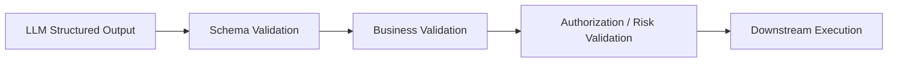
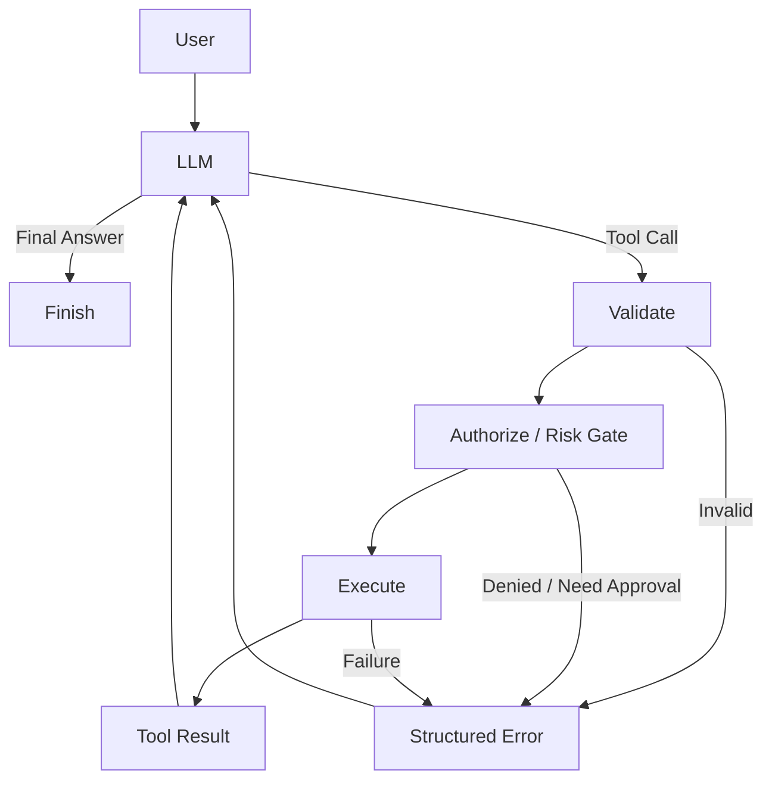
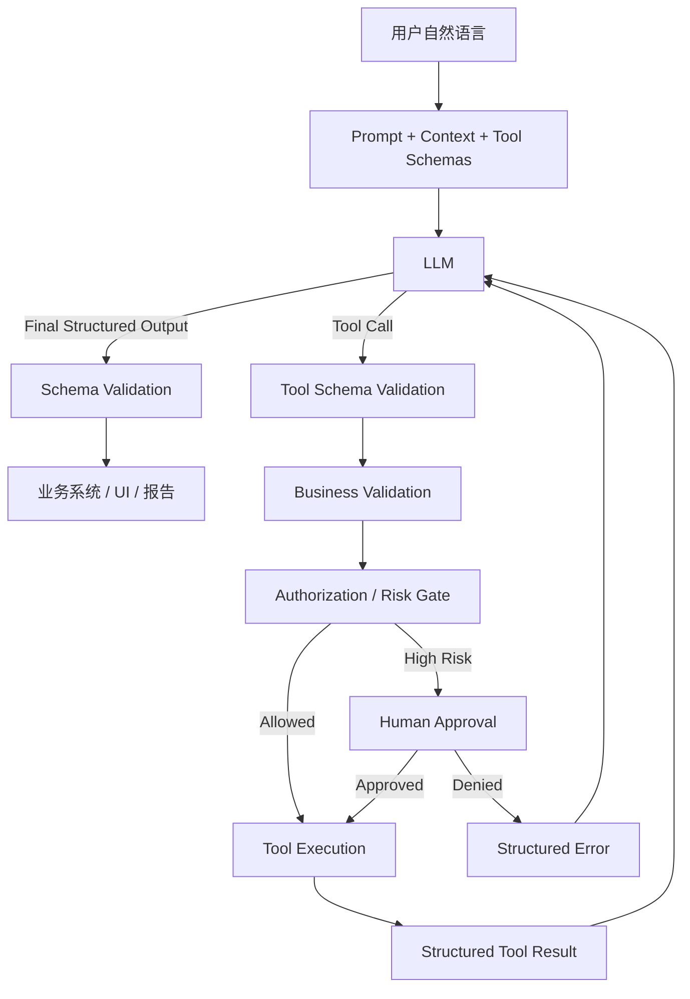

# 第二课：结构化输出与 Tool Calling

这一课直接对应平安科技岗位描述中的两个明确关键词：**结构化输出（Structured Output）**与**工具调用（Tool Calling）**。

它们看起来像两个独立知识点，实际上在企业级大模型产品中经常组成同一条链路：

```text
自然语言输入
    ↓
LLM 理解任务
    ↓
结构化 Tool Call
    ↓
Runtime 校验 / 鉴权 / 审批
    ↓
真实工具执行
    ↓
结构化 Tool Result
    ↓
LLM 综合解释
    ↓
结构化最终输出
    ↓
前端 / 工作流 / 报告 / 业务系统
```

如果只记一句话，可以先记：

> **结构化输出解决“模型产出的东西能不能稳定被机器消费”；Tool Calling 解决“模型如何以受控方式请求外部系统完成真实动作”。**

但面试真正会追问的是这句话后面的工程细节：Schema、校验、权限、重试、并发、副作用、人工确认、错误回传和停止条件。

---

## 1. 先把以前小林面试题里的知识重新接起来

此前的小林工具调用专题里，与你这次岗位最直接相关的是以下几组问题：

- 什么是 Function Calling，原理是什么；
- LLM 如何学会调用外部工具；
- Function Call 能力怎么训练；
- LangChain 中如何注册工具；
- Function Calling 与 MCP、Skill 的区别；
- 工具多时怎样做 Tool Routing；
- 工具格式非法、参数错误、超时或失败时怎样容错。

固定在 AI-Learn 来源登记中的 `xiaolin-ai-learning` 快照覆盖 2026-08-06 时的 86 道题，其中 Tools 栏已有 Function Calling、MCP、Skill 等 16 道题；小林站点后续又增加了 Tool Routing 与工具调用可靠性问题。本课不复制外部题库原文，而是把其中真正需要掌握的知识重新组织为一套可用于平安 AI 产品岗位的完整结构。

先恢复最核心的 Function Calling 心智模型：

```text
开发者 / 产品与研发
定义有哪些 Tool，以及每个 Tool 的 Schema
            ↓
LLM
根据用户问题判断：是否需要 Tool、调用哪个、参数是什么
            ↓
宿主程序 / Agent Runtime
解析 → 校验 → 鉴权 → 执行
            ↓
真实 API / DB / ERP / CRM / 搜索 / 文件系统
            ↓
Tool Result
            ↓
重新交给 LLM
            ↓
继续调用 Tool 或给最终答案
```

这里第一条必须说准确：

> **LLM 本身不是那个真正查询数据库、访问网络或执行函数的程序。模型产生的是结构化“调用意图”；真正执行动作的是 Agent Runtime / 宿主程序。**

这也是为什么 Tool Calling 一旦进入金融、医疗等企业场景，产品设计重点就不只是“模型能不能选对工具”，还包括“系统是否允许它执行”。

---

# Part A：结构化输出（Structured Output）

## 2. 为什么企业 AI 产品必须理解结构化输出

如果输出只给人阅读，自然语言就可以：

```text
这个客户近期经营情况总体稳定，但现金流波动有所增加……
```

但如果下一步需要程序继续处理，例如：

- 前端按字段渲染风险卡片；
- 后端根据 `needs_human_review` 决定是否转人工；
- 工作流根据 `risk_level` 进入不同节点；
- 下一个 Agent 把当前结果作为输入；
- 报告系统按固定章节生成文档；
- 数据库需要记录可统计的分类结果；

那么模型输出就不能再只是“一段大概能看懂的话”，而需要变成稳定的数据契约（Contract）。

例如：

```json
{
  "risk_level": "medium",
  "risk_reasons": [
    {
      "type": "cashflow_volatility",
      "evidence_id": "txn_summary_2026Q3",
      "description": "近三个月经营现金流波动增大"
    }
  ],
  "needs_human_review": true,
  "summary": "建议结合最新经营流水进一步人工复核"
}
```

这才是结构化输出真正的产品意义：

> **把 LLM 从“文字生成器”变成可以嵌入软件系统的数据生产节点。**

AIPM-Wiki 对这一点的总结很准确：只要输出需要由前端、后端、工单系统或另一个 Agent 消费，它就不再只是文字，而是下游依赖的契约。

---

## 3. “请输出 JSON”不等于可靠的结构化输出

这里要区分几个层级。

### 3.1 Prompt 口头要求：软约束

最简单的做法是：

```text
请只输出 JSON，不要输出额外文字。
```

模型可能仍然输出：

```text
好的，以下是分析结果：
{
  ...
}
```

也可能：

- 字段名变了；
- 漏掉必填字段；
- 数字变成字符串；
- 多生成了未知字段；
- 枚举值自己造了一个新词。

因此这种方式只能叫 **Prompt-level soft constraint（提示词层软约束）**。

### 3.2 JSON Mode：保证“像 JSON”，不等于符合业务 Schema

某些模型接口提供 JSON 模式，它主要解决：

```text
输出是不是合法 JSON？
```

但合法 JSON：

```json
{
  "hello": "world"
}
```

不代表它满足你真正想要的：

```json
{
  "risk_level": "low | medium | high",
  "needs_human_review": true
}
```

所以一定要区分：

```text
JSON Syntax Valid
        ≠
Schema Valid
        ≠
Business Valid
```

### 3.3 Schema-constrained Structured Output：结构契约

更可靠的做法是给模型提供 JSON Schema 或由 Pydantic / Zod 等类型模型生成约束，让输出必须满足：

- 字段名称；
- 字段类型；
- required / optional；
- enum；
- 数组或嵌套对象结构；
- 是否允许额外字段。

例如：

```json
{
  "type": "object",
  "properties": {
    "risk_level": {
      "type": "string",
      "enum": ["low", "medium", "high"]
    },
    "needs_human_review": {
      "type": "boolean"
    },
    "evidence_ids": {
      "type": "array",
      "items": {"type": "string"}
    }
  },
  "required": ["risk_level", "needs_human_review", "evidence_ids"],
  "additionalProperties": false
}
```

当前主流模型平台已经把 Structured Outputs 做成模型/API 层能力，核心思路是通过受约束生成（Constrained Generation / Constrained Decoding）让模型生成范围受到 Schema 限制，而不是完全依赖 Prompt 自觉遵守。具体厂商支持的 JSON Schema 子集仍然不同，面试中没有必要死背每一家参数名，但必须知道**原生结构约束比“Prompt 里说一句返回 JSON”更可靠**。

---

## 4. Schema 能解决什么，不能解决什么

这是很容易被追问的一层。

假设 Schema 定义：

```json
{
  "amount": {"type": "number"},
  "customer_id": {"type": "string"}
}
```

模型输出：

```json
{
  "amount": -1000000,
  "customer_id": "another_customer"
}
```

它完全可能：

```text
Schema Valid ✅
Business Valid ❌
Authorized ❌
```

所以生产系统至少要有三层校验：



### Schema Validation

检查：

- JSON 是否可解析；
- 必填字段是否存在；
- 类型是否正确；
- enum 是否匹配；
- 嵌套结构是否符合契约。

### Business Validation

检查：

- 日期区间是否合法；
- 金额是否超过可操作额度；
- 资源是否存在；
- 当前状态是否允许执行该动作；
- 数据版本是否冲突。

### Authorization / Risk Validation

检查：

- 当前用户是谁；
- 是否拥有目标资源权限；
- 是否允许使用这个 Tool；
- 是否允许这个参数范围；
- 是否属于高风险动作；
- 是否需要人工审批。

因此需要牢牢记住：

> **Schema 解决的是结构确定性，不是事实真实性，更不是权限与业务正确性。**

同理：结构化输出可以降低“格式幻觉”，但不能直接解决事实幻觉。

---

## 5. Schema 怎么设计才是产品经理应该关心的

AI 产品经理不一定亲手写 JSON Schema，但 PRD 必须能把输出契约定义清楚。

更好的设计顺序不是：

```text
“让模型输出点什么字段吧”
```

而是：

```text
谁消费这个输出？
    ↓
下游需要做什么决策？
    ↓
需要哪些最小字段？
    ↓
哪些字段必须可枚举、可校验？
    ↓
失败时怎样表示？
```

例如智能报告中，比起只定义：

```json
{"analysis": "..."}
```

可以更产品化地定义：

```json
{
  "report_version": "1.0",
  "summary": "...",
  "findings": [
    {
      "category": "cashflow",
      "severity": "medium",
      "statement": "...",
      "evidence_ids": ["..."],
      "limitations": ["..."]
    }
  ],
  "needs_human_review": true
}
```

设计 Schema 时重点考虑：

1. **字段尽量少而明确。** 不为“看起来完整”堆无消费方字段。
2. **能 enum 就不要完全自由生成。** 例如风险级别、动作类型、状态码。
3. **每个字段都写清语义。** `status` 这种字段如果不说明是“任务状态”还是“业务审核状态”，模型容易误填。
4. **required 与 optional 明确。** 不要让模型猜哪些字段可缺省。
5. **区分 `null`、空数组、缺字段。** 三者对下游含义可能完全不同。
6. **尽量控制嵌套深度。** 越复杂越难生成、验证、维护和版本升级。
7. **契约需要版本。** 下游一旦消费字段，改字段名或类型就是接口变更。
8. **不要把模型自报的 confidence 当真实概率。** 如果业务需要可信度，应结合可验证信号、评估数据或规则，而不是只让 LLM 生成 `confidence=0.95`。

---

## 6. 结构化输出失败怎么处理

不能只有：

```text
try:
    parse()
except:
    retry()
```

应该先区分故障类型。

```text
A. JSON / Schema 不合法
→ 可以把具体校验错误反馈给模型，进行有限次数修复或重新生成

B. 被安全策略拒绝
→ 不是“JSON 格式错误”，应进入 refusal / fallback 产品路径

C. 输出被 token 截断
→ 检测 truncation，重新规划输出长度或降级

D. Schema 合法但业务非法
→ 不应该只是让模型换个 JSON；应根据业务规则补数据、询问用户或拒绝

E. 连续失败
→ 降级为确定性模板、人工处理或明确错误状态
```

这里的关键词是 **bounded retry（有界重试）**：

> 不能为了“让模型一定成功”无限重试。

失败样本还应该进入评测集，区分究竟是：

- Prompt 不清楚；
- Schema 设计不好；
- 模型能力不足；
- 输入数据本身缺失；
- 下游业务规则不完整。

---

# Part B：Tool Calling / Function Calling

## 7. Function Calling 和 Tool Calling 到底是什么

在面试语境里两者经常混用。

可以这样理解：

- **Tool**：模型之外的真实能力，例如查询数据库、计算指标、搜索、发邮件、创建工单；
- **Function Calling**：模型用结构化 `function name + arguments` 表达调用函数的意图；
- **Tool Calling**：更宽泛的说法，除了本地函数，还可以包括搜索、代码执行、MCP Tool、浏览器等能力。

核心流程始终是：

```text
Tool Schema + User Request
           ↓
          LLM
           ↓
 tool_call(name, arguments)
           ↓
 Agent Runtime / Host
           ↓
 验证 → 鉴权 → 执行 Tool
           ↓
       Tool Result
           ↓
          LLM
           ↓
继续调用 / 最终回答
```

### 最容易答错的一句话

错误：

> Function Calling 就是大模型直接调用 API。

更准确：

> Function Calling 是模型输出结构化的工具调用请求，由宿主程序解析、验证并执行真实函数或外部 API，再把执行结果作为 Tool Message 返回模型继续推理。

“模型决策，代码执行”是这块最基础也最重要的边界。

---

## 8. Tool Schema 为什么这么重要

一个工具至少需要告诉模型：

```text
name
+ description
+ parameters schema
```

例如：

```json
{
  "name": "get_customer_transactions",
  "description": "查询当前授权客户在指定日期范围内的交易汇总，只读，不返回其他客户数据",
  "parameters": {
    "type": "object",
    "properties": {
      "customer_id": {
        "type": "string",
        "description": "目标客户唯一标识"
      },
      "start_date": {
        "type": "string",
        "description": "ISO 日期 YYYY-MM-DD"
      },
      "end_date": {
        "type": "string",
        "description": "ISO 日期 YYYY-MM-DD"
      }
    },
    "required": ["customer_id", "start_date", "end_date"]
  }
}
```

模型主要根据：

- Tool 名称；
- Tool description；
- 参数 description；
- 当前用户问题与 Context；

判断“该不该调用、该选哪个、参数怎么填”。

因此 Tool Schema 不只是研发接口文档，同时也是 **model-facing product contract（面向模型的产品契约）**。

Hermes 的当前实现非常典型：`registry.register()` 中同时注册 `name`、`toolset`、`schema`、`handler`、`check_fn` 等字段，而真正给模型看的描述以 `schema["description"]` 为准。也就是说，内部代码有一个工具不等于模型就理解这个工具；**模型实际看到的 Schema 质量会直接影响路由效果。**

---

## 9. Tool Calling 的完整运行时不是“两轮 API”这么简单

教学例子通常是：

```text
第一轮 LLM → tool_call
执行工具
第二轮 LLM → final answer
```

这是最小闭环。

真实 Agent 更像：



模型可能：

- 第一次调用 Tool A；
- 根据结果再调用 Tool B；
- 参数缺失时询问用户；
- Tool 失败后改计划；
- 最终判断任务完成并停止。

这就是 Tool Calling 与 Agent Loop 的连接点。

---

## 10. 模型怎样“学会”调用工具：把以前小林题里的内容校准一下

小林题库用一个很好记的教学框架解释：

```text
SFT：教模型“怎么调”
Preference / RL Alignment：改善模型“什么时候该调、什么时候不该调”
```

监督微调（Supervised Fine-Tuning，SFT）的工具调用样本通常包含：

```text
System / Tool Definitions
→ User Request
→ Assistant Tool Call
→ Tool Result
→ Assistant Final Response
```

训练集不能只有“单工具成功调用”，还需要覆盖：

- 不需要工具直接回答；
- 单工具调用；
- 多工具调用；
- 并行工具调用；
- 多轮上下文中的调用；
- 参数缺失；
- Tool Error 后的恢复；
- 不应调用或无权限调用的负样本。

需要注意的是，面试中不要把“Function Calling 一定由 SFT + RLHF + PPO 这一条固定流水线训练出来”讲成行业硬标准。不同模型的后训练会使用不同的监督数据、偏好优化、强化学习或 AI Feedback 方法，训练细节也未必公开。稳定结论是：

> **模型需要通过针对工具使用的后训练学会结构化调用模式，并通过正负样本/偏好或强化信号改善工具选择边界。**

作为 AI 产品经理，理解到这一层已经足够。真正落地时你更需要关心的是 Runtime 如何控制模型行为。

---

# Part C：企业级 Tool Runtime 必须补上的“硬约束”

## 11. Prompt 里的“不要越权”为什么远远不够

例如 System Prompt 写：

```text
只能查询当前客户的数据，禁止查询其他客户。
```

模型仍然可能生成：

```json
{
  "customer_id": "other_customer"
}
```

因此：

```text
Prompt Rule
= Soft Constraint

Runtime Authorization
= Hard Constraint
```

真正的企业链路应该是：

```text
LLM Tool Call
    ↓
Schema Validation
    ↓
Authenticated User / Role
    ↓
Resource Scope Validation
    ↓
Business Preconditions
    ↓
Risk Classification
    ↓
Human Approval（如需要）
    ↓
Tool Execution
```

金融场景尤其不能把以下能力交给模型自己判断：

- 用户身份；
- 客户数据访问范围；
- 额度；
- 交易权限；
- 合规规则；
- 最终审批权限。

模型可以“理解规则”，但不能成为唯一的权限执行器。

---

## 12. Tool 参数校验至少要分三层

### 12.1 结构校验

```text
字段是否存在？
类型是否正确？
enum 是否合法？
格式是否正确？
```

### 12.2 业务语义校验

```text
日期范围是否允许？
金额是否超过余额？
目标订单是否存在？
当前订单状态是否允许退款？
当前报告是否已经发布？
```

### 12.3 权限与风险校验

```text
谁在调用？
有权调用这个 Tool 吗？
有权操作这个 customer_id 吗？
这是只读还是写操作？
是否需要审批？
```

因此：

> **Tool Schema 是必要条件，但不是业务安全边界。**

---

## 13. Read Tool 和 Write Tool 要区别设计

Tool 不应该只按业务功能分类，还应该按副作用（Side Effect）分类。

### Read-only

例如：

- 查询客户画像；
- 查询健康指标；
- 搜索知识库；
- 获取采购记录。

通常风险较低，可以在权限校验通过后自动执行。

### Write / Side-effecting

例如：

- 发邮件；
- 修改正式记录；
- 创建订单；
- 删除数据；
- 提交审批；
- 发起付款。

这类动作要额外考虑：

```text
明确确认
+ 权限
+ 幂等
+ 状态持久化
+ 审计
+ 失败恢复
```

金融 Agent 的核心不是“工具越多越智能”，而是：

> **不同风险等级的 Tool 拥有不同执行政策。**

---

## 14. Human-in-the-loop 不是“模型问一句确认吗”这么简单

高风险动作应该有真正的 Approval Gate。

```text
LLM：我要执行 transfer_money(amount=100000)
          ↓
Runtime：高风险 Tool
          ↓
生成审批请求
          ↓
用户 / 审批人看到明确参数
          ↓
Approve / Reject
          ↓
Runtime 执行或拒绝
```

好的审批必须让人看见真正将要执行的关键参数：

```text
对象是谁？
金额是多少？
影响范围是什么？
是否不可逆？
```

而不是：

```text
“Agent 想继续执行，是否确认？”
```

否则人也不知道自己批准了什么。

---

## 15. Tool Error 不能全部“重试三次”

这一点是工具调用工程实践中的高频追问。

需要先分类：

| Error 类型 | 示例 | 合理处理 |
|---|---|---|
| 模型 / 格式错误 | Tool 不存在、JSON 非法、缺参数 | Schema 拦截，给模型明确错误，有限重新生成 |
| 业务校验失败 | 库存不足、订单状态不允许 | 不原样重试；重新规划或告知用户 |
| 权限失败 | 用户无访问权限 | 拒绝 + 审计；不能让模型“换参数试试”绕过 |
| 瞬时故障 | 429、连接失败、部分 5xx | 满足安全重放条件时有限重试 + backoff |
| 明确执行失败 | 下游明确回滚 | 根据业务降级、换路径或结束 |
| 结果未知 | 写操作已发出但响应超时 | 查询状态 / 对账，不能盲目重试 |

这里最危险的是最后一种：

```text
send_payment()
      ↓
下游已经扣款
      ↓
网络在响应前断开
      ↓
Agent 看到 timeout
```

如果简单：

```text
timeout → retry
```

可能就扣两次。

---

## 16. 幂等（Idempotency）为什么是 Agent Tool 的关键概念

对副作用操作，Agent 可能因为：

- API timeout；
- 模型重新规划；
- Worker 重启；
- Checkpoint 恢复；
- 用户重复提交；

再次执行同一步骤。

因此需要稳定的幂等标识，例如：

```text
idempotency_key = run_id + step_id
```

服务端要能够识别：

```text
同一个 key + 相同请求
→ 返回之前的结果 / 不重复执行

同一个 key + 不同请求
→ 拒绝，避免错误复用
```

但不能说：

> “加了 idempotency key 就保证 exactly-once。”

真正的业务效果去重还依赖：

- 服务端是否支持；
- 去重记录保存多久；
- 业务写入和幂等记录是否在可靠事务边界；
- 一个 Tool 是否跨越多个系统；
- 是否需要补偿和对账。

所以更稳妥的工程表达是：

> 通过幂等、状态查询、去重、Checkpoint 和补偿机制，使副作用在业务约束范围内收敛为一次有效效果。

---

## 17. Timeout、Retry 与 Deadline

重试是否允许至少看四个问题：

```text
这是什么错误？
这个调用能否安全重放？
还剩多少总时间预算？
已经试了多少次？
```

只读、幂等 Tool 遇到瞬时故障可以：

```text
bounded retry
+ exponential backoff
+ jitter
+ respect Retry-After
```

而参数错误、权限错误、业务拒绝：

```text
原样重试没有意义
```

此外要同时有：

```text
单次 Tool Timeout
+
整个 Agent Task Deadline
```

否则单个工具不断等待，会把整个 Agent 卡死。

---

## 18. Tool Error 为什么也应该结构化

Tool 执行失败后，不应该：

```text
直接把 Python stack trace 全塞回 LLM
```

这既可能泄漏内部细节，又不利于模型判断下一步。

更合理的是：

```json
{
  "ok": false,
  "tool": "get_customer_profile",
  "error": {
    "category": "permission_denied",
    "code": "CUSTOMER_SCOPE_DENIED",
    "retryable": false,
    "outcome": "not_started",
    "safe_message": "当前用户无权访问该客户"
  }
}
```

模型需要的是：

```text
发生了什么？
能否重试？
是否应该换工具？
是否需要询问用户？
```

而详细内部 Exception、Token、连接信息留在受控日志里。

于是你会发现：

> **Structured Output 不只用于 LLM 最终回复，也应该用于 Tool Call 和 Tool Result。**

---

## 19. 并行 Tool Calling 怎么判断

用户问：

```text
分别查北京、上海、深圳的天气
```

三个调用互不依赖：

```text
Tool A ─┐
Tool B ─┼→ 汇总
Tool C ─┘
```

可以并行。

但：

```text
先根据姓名找到 customer_id
再用 customer_id 查询交易记录
```

是依赖关系：

```text
Tool A → Result A → Tool B
```

不能简单并行。

此外即使没有数据依赖，也不代表所有 Tool 都适合并行。例如：

- 需要人工交互的 Tool；
- 高风险写操作；
- 操作同一资源、可能产生竞争的 Tool；

通常应更谨慎地串行控制。

---

## 20. Tool 太多时为什么会出问题：Tool Routing

如果一个 Agent 一次把 200 个 Tool Schema 全塞给模型，会发生：

```text
Context Token 增长
+ 成本增加
+ Prompt Cache 压力
+ 相似工具之间更容易误选
+ 参数 Schema 干扰
```

所以 Tool Calling 还有一个更高级的产品问题：

> **当前这一步到底应该给模型看到哪些工具？**

通常可以按层过滤：

```text
全部工具
  ↓
用户 / 租户权限过滤
  ↓
当前 Workflow 阶段过滤
  ↓
业务域路由
  ↓
Tool Retrieval / Top-K
  ↓
LLM 最终选择
```

其中工具检索可以利用：

- keyword / BM25；
- embedding；
- hybrid retrieval；
- reranking；

但检索只是找“可能相关的候选工具”，不能跳过鉴权和执行前校验。

Tool Routing 的评估至少要拆成：

```text
候选召回：正确 Tool 有没有进入 Top-K？
模型选择：有没有选错相似 Tool？
参数生成：Schema 与事实是否正确？
业务结果：任务是否真正成功？
安全：有没有暴露或尝试未授权 Tool？
成本：Schema Token / LLM calls / latency 是否合理？
```

---

# Part D：Hermes 是怎么真正实现 Tool Calling 的

## 21. Hermes 的 Tool 不是散落的一堆 Python 函数

Hermes 当前使用的是集中式 Tool Registry / Dispatch 架构。

每个工具模块通过 `registry.register(...)` 注册，大致包含：

```text
name
Toolset
Schema
Handler
check_fn
is_async
metadata
```

可以抽象成：

```text
Tool Definition
├─ 给 LLM 看：Schema
└─ 给 Runtime 用：Handler / availability / metadata
```

这正好体现一个很重要的架构分离：

> **“模型认为这个工具是什么”与“系统真正怎么执行这个工具”是两层。**

Hermes 的 `model_tools.py` 会发现工具并组装给模型的 Tool Schema；执行时再通过 Registry 找到真正 Handler。

---

## 22. Hermes Tool Runtime 的真实执行链

Hermes 官方开发文档给出的核心流程可以概括成：

```text
Model response: tool_call
          ↓
AIAgent / Agent Loop
          ↓
handle_function_call(name, args, ...)
          ↓
特殊 Agent-level Tool？
(todo / memory / session_search / delegate_task)
          ↓ 否
pre_tool_call hook
          ↓
registry.dispatch(name, args)
          ↓
查找 ToolEntry
          ↓
同步 / 异步 Handler
          ↓
Tool Result
          ↓
post_tool_call hook
          ↓
写回 conversation history
          ↓
再次调用 LLM
```

这说明 Function Calling 绝不是：

```text
LLM → Python Function
```

中间有一个真正的 Runtime。

---

## 23. Hermes 如何控制“模型能看到哪些 Tool”

Hermes Tool Runtime 支持：

```text
enabled_toolsets
disabled_toolsets
platform presets
MCP toolsets
plugin tools
check_fn availability
```

尤其值得注意的是 `check_fn`：

如果某工具：

- API Key 不存在；
- 依赖服务没启动；
- 二进制程序不可用；

那么它可以直接不进入提供给模型的 Tool Definitions。

Hermes 对 `check_fn` 异常采用 unavailable 的保守处理。

这给企业 Agent 一个非常好的产品启示：

> **不要把“用户不能调用”只写进 Prompt；如果某能力当前就不该被模型使用，最好根本不要把它暴露在当前 Tool Surface 中。**

Hermes 甚至会动态修改某些工具的 Schema，只引用实际通过过滤的工具，降低模型幻想不存在能力的概率。

---

## 24. Hermes 的危险操作 Approval 是“软约束 + 硬门”的好例子

Hermes 的 Terminal Tool 对危险命令有独立的 Approval Flow，例如识别：

- 递归删除；
- 文件系统格式化；
- 破坏性 SQL；
- 修改系统配置；
- 停止系统服务；
- 远程脚本执行等。

实际链路不是：

```text
System Prompt：请谨慎执行 rm -rf
```

而是：

```text
LLM 生成 terminal Tool Call
        ↓
Runtime 检测危险模式
        ↓
Approval Gate
        ↓
Approve → 执行
Deny    → 不执行
```

这就是前面一直强调的：

```text
Prompt = 软行为引导
Runtime Gate = 硬执行边界
```

把它迁移到平安金融场景，就是：

```text
查询普通公开产品信息 → 可以直接执行
查询当前授权客户数据 → 权限校验后执行
修改正式客户信息 → 明确确认 / 审批
发起高风险金融动作 → 更严格流程，不由 LLM 自主决定
```

---

## 25. Hermes 如何处理多个 Tool Call

Hermes 当前 Agent Loop 不是无脑串行：

- 单个 Tool Call 直接执行；
- 多个 Tool Call 可以通过线程池并发；
- 交互式工具会强制顺序执行；
- 并发执行完成后仍保持 Tool Call 与结果的对应关系。

这正好对应前面讲的产品原则：

```text
Independent → 可以并行优化延迟
Dependent / Interactive / Risky → 应串行或受控执行
```

所以面试被问“Tool Calling 能不能并行”，不要只答“能”。

应该继续说明：

> 需要看依赖关系、副作用和交互属性，并发是 Runtime 的执行策略，不是模型吐了多个 Tool Call 就一定全部同时执行。

---

## 26. Hermes 如何把 Tool Error 重新给模型

Hermes Registry 在 Handler 异常时会捕获异常，并以 JSON 错误字符串返回；上层 `handle_function_call()` 还有一层兜底，保证异常不会直接打穿 Agent Loop。

于是模型获得的是类似：

```json
{"error": "..."}
```

而不是整个程序崩掉。

这体现了 Agent 的典型恢复模式：

```text
Tool Failure
    ↓
作为 Observation / Tool Result 返回 LLM
    ↓
LLM 根据错误重新判断
    ↓
换参数 / 换 Tool / 询问用户 / 停止
```

不过要注意：Hermes 的通用工具错误包装不等于金融生产系统完整的业务错误协议。真正高风险企业产品还应进一步区分 `retryable`、业务错误、权限错误、副作用状态、审计字段等。

---

## 27. Hermes 哪些地方不能机械照搬到金融产品

Hermes 是通用 Agent，很适合作为 Tool Runtime 学习样本，但不能把它直接等同于金融交易 Runtime。

可以借鉴：

- Tool Registry；
- Tool Schema；
- Toolset 过滤；
- Availability Check；
- Agent Loop；
- 并发执行；
- Approval Gate；
- Tool Error 返回模型；
- Iteration Budget。

金融或医疗还需要在具体业务层继续补：

- 身份 / RBAC / ABAC；
- 客户和数据 Scope；
- 数据分级分类；
- 业务规则校验；
- 幂等键；
- 事务 / Outbox / 对账；
- 高风险双人或多级审批；
- 合规审计；
- 数据脱敏与最小必要原则。

这也是 AI 产品经理面试里很有价值的判断：

> 会看开源 Agent 的实现，但知道开源通用 Agent 和金融生产系统之间还有业务安全层。

---

# Part E：Structured Output 与 Tool Calling 的关系

## 28. Tool Call 本身就是一种特殊结构化输出

模型不是输出：

```text
“我想查一下这个客户的信息。”
```

而是输出类似：

```json
{
  "name": "get_customer_profile",
  "arguments": {
    "customer_id": "C123"
  }
}
```

所以可以认为：

> **Tool Calling 建立在结构化输出能力之上，只不过这个结构化结果不是普通业务结果，而是给 Runtime 的“动作请求”。**

完整企业链路甚至可以全部结构化：

```text
User Natural Language
        ↓
Structured Tool Call
        ↓
Structured Tool Result
        ↓
LLM Interpretation
        ↓
Structured Final Result
```

这四段一旦稳定下来，AI 才真正容易嵌进复杂业务系统。

---

## 29. Structured Output 和 Tool Calling 不要混为同一个东西

### Structured Output

目标是：

```text
让模型最终产出满足某个数据契约
```

例如：

```json
{
  "sentiment": "negative",
  "reason": "..."
}
```

不一定执行外部动作。

### Tool Calling

目标是：

```text
模型决定需要某个外部能力
→ 产出结构化调用请求
→ Runtime 真正执行
```

所以一个判断方法是：

> **如果结果只是给下游消费，是 Structured Output；如果这个结构化结果意味着“请系统执行某个能力”，则进入 Tool Calling。**

---

# Part F：把知识映射回你的项目

## 30. 津药 ERP / SRM 项目：这是你回答 Structured Output 最好的项目

不要说：

> “我用了 Prompt 让模型分析 Excel。”

更准确的产品表达是：

```text
采购业务请求
    ↓
LLM 理解意图 / 选择分析模块
    ↓
Structured Parameters
    ↓
Schema Validation
    ↓
Deterministic Tool
字段映射 / 聚合 / 金额计算 / 跨表关联
    ↓
Structured Result
    ↓
LLM 做业务解释
```

你的关键设计思想应该讲出来：

> 对金额、聚合、字段映射、关联键这类确定性任务，不让 LLM 自己“算”；先定义数据源、粒度、关联键、输入输出 Schema，再由确定性 Tool 执行。LLM 主要负责用户意图理解、分析模块选择和结果解释。

这里同时覆盖：

```text
Prompt Design
Structured Output
Tool Calling
Human-AI Boundary
Hallucination Mitigation
Enterprise Data Workflow
```

这比单独说“我精通提示词”有说服力得多。

---

## 31. Personal Health Agent：这是你回答 Tool Governance 最好的项目

你的项目 README 已经明确写到助手运行时具有：

- 持久化对话；
- Tool Authorization Envelope；
- Event Replay；
- Citation；
- Controlled Provider；

同时正式记录、破坏性隐私操作和来源选择需要明确操作，外部健康数据 Provider 默认 fail-closed。

所以面试不要只讲：

```text
LangGraph 可以调用 Tool
```

而应该讲：

> 我把 LLM 的工具选择和真正的业务执行分开。模型可以提出调用意图，但 Tool Runtime 仍然要根据当前用户、Scope、工具 Schema 和操作风险判断能否执行；高风险正式动作不能只靠 Prompt 约束。

这和 Hermes 的 Approval / Tool Availability 思想其实是同一类架构原则：

```text
LLM 决策
≠
Runtime 自动无条件执行
```

而 Health Agent 又比 Hermes 多了一层与你项目业务相关的健康记录正式性和来源约束。

---

# Part G：直接迁移到平安 JD 场景

## 32. 数据解读 / 智能报告

一个比较合理的 AI 产品链路是：

```text
用户：生成本月客户经营分析
        ↓
Agent 判断需要哪些数据
        ↓
Tool Calls
├─ get_transaction_metrics
├─ get_credit_exposure
└─ get_customer_profile
        ↓
Runtime 权限 + Schema 校验
        ↓
确定性指标计算
        ↓
LLM 分析
        ↓
Structured Report
{
  summary,
  findings[],
  evidence_ids[],
  limitations[],
  needs_review
}
        ↓
前端 / 报告系统 / 人工审核
```

这一个场景就可以把 JD 中：

```text
结构化输出
工具调用
数据解读
智能报告
幻觉抑制
金融合规
```

串在一起。

---

## 33. 信贷风险场景

最重要的产品边界是：

```text
Tool / 规则 / 风控模型
→ 提供真实数据与确定性评分

LLM
→ 处理非结构化材料、归纳证据、生成解释与辅助报告
```

而不是：

```text
客户材料
→ LLM
→ 是否放贷
```

Tool Calling 能让 LLM 读取受控信息，但最终授信规则、权限和审批仍然属于受控业务系统。

---

## 34. 潜客推荐场景

可以设计为：

```text
客户候选池 / 排序模型
        ↓
Agent 取得当前客户上下文
        ↓
客户画像 Tool
行为 Tool
产品资格 Tool
        ↓
Structured Opportunity
{
  product,
  reason,
  evidence,
  next_best_action
}
        ↓
客户经理确认
```

这里也要注意：

> LLM 可以解释和组织营销建议，但“谁最有购买概率”通常还可能由规则、推荐或排序模型提供，不要把所有算法职责都塞给生成式模型。

---

# Part H：平安面试高概率追问——答题逻辑

## 35. “什么是 Function Calling？”

回答至少包含四层：

```text
① 定义：模型产生结构化工具调用请求
② Tool Schema：name / description / parameters
③ Runtime：模型不执行，代码负责校验和执行
④ Loop：Tool Result 返回模型，继续推理或完成任务
```

如果继续追问，再进入并行、权限、错误处理。

---

## 36. “为什么有了 Function Calling 还要做参数校验？”

逻辑是：

```text
模型生成概率性输出
→ Schema 只能限制结构
→ 业务规则无法完全编码进模型
→ 权限必须根据真实身份与资源 Scope 执行
```

举例：

```text
customer_id 是合法字符串
≠
当前用户有权查询这个 customer_id
```

---

## 37. “结构化输出和 Prompt 要怎么配合？”

可以按：

```text
Prompt：规定任务语义、判断原则、边界
Schema：规定输出结构和类型
Application Validation：规定业务与安全合法性
```

三者职责不同。

---

## 38. “结构化输出能不能解决幻觉？”

不能。

它主要解决：

```text
字段漂移
格式错误
类型不稳定
下游解析不稳定
```

幻觉需要更多机制：

```text
RAG / Tool Grounding
+ Citation
+ Validation
+ Refusal / Abstention
+ Human Review
+ Evaluation
```

一个输出可以：

```text
JSON 100% 合法
但事实完全错误
```

这一点必须明确。

---

## 39. “Tool 失败了怎么办？”

不要答“重试三次”。

应该先分类：

```text
格式错误？
业务错误？
权限错误？
瞬时故障？
明确失败？
副作用结果未知？
```

之后才决定：

```text
重新生成参数
重新规划
拒绝
有限重试
降级
查询状态
人工接管
```

---

## 40. “怎么避免 Agent 乱调 Tool？”

从软到硬回答：

```text
清晰 Tool Name / Description / Schema
        ↓
只暴露当前场景需要的工具
        ↓
Role / Scope 过滤
        ↓
参数 / 业务校验
        ↓
高风险 Approval
        ↓
Tool / Iteration Budget
        ↓
Trace + Evaluation + Badcase 回流
```

不要只答“优化 Prompt”。

---

## 41. “多个 Tool 能不能一起调用？”

判断依据不是“模型支不支持 parallel tool calls”，而是：

```text
有没有数据依赖？
有没有资源冲突？
有没有副作用？
有没有交互确认？
```

独立读取可以并行；有依赖、高风险写入和交互操作应串行或受控执行。

---

## 42. “Function Calling、MCP、Skill 是什么关系？”

为了把以前小林题里的概念一起唤醒，可以用这一层理解：

```text
Function / Tool Calling
= 模型如何表达“我要调用某个能力”

MCP (Model Context Protocol)
= 外部 Tool / Resource 如何用标准协议被发现、连接与调用

Skill
= 面对某类任务时，Agent 应遵循什么 SOP / 知识 / 操作方法
```

可以串成：

```text
Skill 告诉 Agent 怎么做
        ↓
Agent 决定需要什么能力
        ↓
Function Calling 表达调用意图
        ↓
Tool 可能来自本地 Registry，也可能通过 MCP 接入
```

所以三者不是互相替代。

---

# Part I：作为 AI 产品经理写 PRD 时要定义什么

如果一个需求涉及 Agent Tool，不要只在 PRD 写：

```text
“AI 调用客户数据接口并返回结果。”
```

至少要明确：

| 维度 | PRD 应定义的问题 |
|---|---|
| Capability | Tool 解决什么业务能力，什么时候应该使用 |
| Input Contract | 参数、类型、required、enum、单位、日期格式 |
| Output Contract | 成功结果、空结果、错误结果分别是什么 |
| Permission | 谁能调用，能操作什么 Scope |
| Risk | read / write / destructive，是否需要审批 |
| Preconditions | 执行前必须满足哪些业务状态 |
| Timeout | 单次最大等待多久 |
| Retry | 什么错误允许重试，最多几次 |
| Idempotency | 副作用调用如何避免重复效果 |
| Failure UX | 失败后用户看到什么，是否转人工 |
| Audit | 记录哪些 Tool Call / 参数摘要 / 审批 / 结果 |
| Evaluation | Tool 选择率、参数正确率、执行成功率、任务成功率 |

这就是为什么平安 JD 会把“Prompt、结构化输出、Tool Calling、Agent”同时列出来：

> 它要的不是会聊天机器人的产品经理，而是能把概率模型接入真实业务系统的人。

---

# Part J：这一课最终应该形成的完整心智模型



把这张图理解透之后，就不会再把下面这些问题割裂开：

```text
Structured Output
Tool Calling
Agent Loop
Prompt
权限
审批
错误恢复
幂等
并发
幻觉治理
PRD
```

它们本来就是一个企业 AI Agent 产品的不同层。

---

## 43. 下一步与后续课程连接

这一课之后，下一块最自然的知识是：

```text
长文本处理
+ 多轮对话
+ Context Engineering
```

因为 Tool Result、Conversation History、RAG Evidence、System Prompt 和 Tool Schemas 最终都会进入有限的 Context Window。

之后再进入：

```text
RAG
→ 幻觉抑制
→ Evaluation
```

这样技术部分能够形成一条完整链路，再进入数据解读、智能报告、信贷风险和潜客推荐等业务产品设计。

---

# 参考与版本说明

本课是面试冲刺用 `teaching_draft`，不是 AI-Learn 正式知识图谱的已审计 Tool Calling 章节。

### 小林 AI 面试题

- AI-Learn 登记快照：`SodaWWater/xiaolin-ai-learning@7c363bb44d06f4ae2f05c2374d05760e1eef0ff1`，快照日期 2026-08-06。
- Function Calling 原理：https://xiaolinnote.com/ai/tools/1_function_calling.html
- LLM 如何学会调用工具：https://xiaolinnote.com/ai/tools/2_llm_tool_learning.html
- Function Call 训练：https://xiaolinnote.com/ai/tools/3_fc_training.html
- LangChain Tool Registration：https://xiaolinnote.com/ai/langchain/tool_registration.html
- Tool Routing（站点后续新增，2026-09-16 核验）：https://xiaolinnote.com/ai/tools/17_tool_routing.html
- Tool Reliability（站点后续新增，2026-09-16 核验）：https://xiaolinnote.com/ai/tools/18_tool_reliability.html

小林来源用于恢复题目线索和教学框架，不作为所有工程结论的唯一依据。

### AIPM-Wiki

- `archlizheng/AIPM-Wiki@60b6c7a5eb28c155108d2f7e470c38aa06db0e7c`
- Structured Output：https://github.com/archlizheng/AIPM-Wiki/blob/main/docs/01-ai-basics/prompt-engineering/structured-output.md
- Agent Product Design：https://github.com/archlizheng/AIPM-Wiki/blob/main/docs/02-pm-skills/ai-product-operations/agent-product-design.md

### Hermes Agent

- 本课核对版本：`NousResearch/hermes-agent@784d5c3f9c2cb77698d8a9d2e72b1d106a38ea88`
- Agent Loop：https://github.com/NousResearch/hermes-agent/blob/main/website/docs/developer-guide/agent-loop.md
- Tools Runtime：https://github.com/NousResearch/hermes-agent/blob/main/website/docs/developer-guide/tools-runtime.md
- Tool Registry：https://github.com/NousResearch/hermes-agent/blob/main/tools/registry.py
- Tool Executor：https://github.com/NousResearch/hermes-agent/blob/main/agent/tool_executor.py
- Approval：https://github.com/NousResearch/hermes-agent/blob/main/tools/approval.py

### Personal Health Agent

- https://github.com/SodaWWater/personal-health-agent
- 本课只引用仓库当前明确声明的助手运行时、安全边界和明确确认机制，不把本地 Mock Provider 或合成数据项目描述成生产医疗系统。
