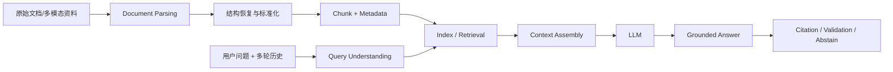
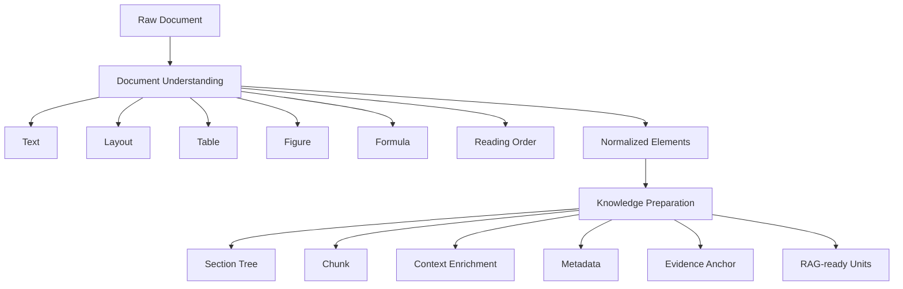
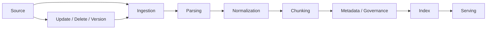
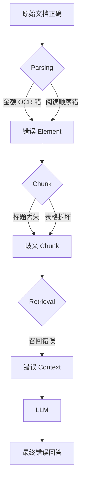

# 03-A 长文本与多模态文档处理：从原始文件到 RAG-ready Evidence

> 这一课先不把重点放在“向量数据库怎么搜”。
>
> 我们先解决更靠前的问题：**一份真实 PDF、扫描合同、财报、医疗报告，到底怎样变成后续 RAG 可以可靠检索的知识单元？**
>
> 如果这一步做错，后面的 Embedding、Hybrid Search、Rerank 再强，也只能更准确地检索到错误内容。

---

## 1. 这节课在第三部分里的位置

第三部分不是四个平铺的名词：

```text
长文本
多轮对话
RAG
幻觉抑制
```

而是一条完整的信息链：



本课深入左半边：

```text
原始文件
↓
文档识别
↓
解析
↓
结构恢复
↓
知识单元
↓
Chunk
↓
Metadata
↓
RAG-ready Evidence
```

下一课 `03-B` 再进入：

```text
Embedding
BM25
Hybrid Search
Parent-child Retrieval
Neighbor Expansion
Rerank
zg / Agentic Search
```

这样拆是有意的，因为**生产级 RAG 的效果上限，很多时候在“检索之前”就已经被文档解析质量决定了。**

---

# 2. 最先纠正的认知：PDF 不是“一个长字符串”

初学 RAG 常见流程是：

```text
PDF
↓
提取文字
↓
每 500 字切一块
↓
Embedding
↓
Vector DB
```

这条链可以跑 Demo，但不能代表真实企业文档。

一份 PDF 可能同时包含：

```text
标题层级
正文段落
页眉页脚
脚注
列表
双栏排版
表格
跨页表格
图表
扫描图片
印章
公式
目录
附件
文本框
```

所以真实文档更像：

```text
Document
├── Chapter 1
│   ├── Section 1.1
│   │   ├── Paragraph
│   │   ├── Table
│   │   └── Figure
│   └── Section 1.2
├── Chapter 2
└── Appendix
```

如果第一步就把它拍平成纯文本，你可能已经丢失：

- 一段话属于哪个章节；
- 表头和表体的对应关系；
- 脚注解释的是哪个数字；
- 图片对应哪个 Caption；
- 表格是否跨页；
- 某句话是正文还是页眉模板。

因此 Document Processing 的目标不是简单的：

> 把文件变成文字。

而是：

> **尽可能恢复机器可用、同时保留原始证据关系的 Document Representation。**

---

# 3. Document Understanding 和 Chunking 是两件事

生产链路最好拆成两个阶段：



### Document Understanding

回答：

> 文件里面到底有什么？

### Knowledge Preparation

回答：

> 后续检索系统应该以什么单位使用这些内容？

很多“RAG 八股”直接从 Chunking 开始，实际上跳过了最容易造成生产错误的一层。

---

# 4. 不要所有 PDF 一律转图片 OCR

你提供的生产评论里有一个链路：

```text
PDF → 多张图片 → OCR → 整合
```

这在扫描型 PDF 中很合理，但不能当作所有 PDF 的统一答案。

## 4.1 Born-digital PDF

从 Word、LaTeX、报表系统等直接导出的 PDF，通常本来就有：

```text
text objects
coordinates
fonts
vector objects
```

如果先截图再 OCR，等于：

```text
正确文本
→ 像素
→ 再猜一次像素是什么字
```

会额外引入：

- OCR 错字；
- 数字错误；
- 延迟；
- 成本；
- 版面恢复误差。

因此通常优先：

```text
Native Text / Layout Parsing
```

## 4.2 Scanned PDF

历史合同、扫描盖章件等，本质可能是：

```text
PDF
└── page image
```

这时需要：

```text
Image
↓
OCR / VLM
↓
Text + Layout
```

## 4.3 Mixed PDF

真实企业文档常常一部分是数字页，一部分是扫描附件或图片表格。

更合理的是：

```text
Document / Page Detection
        ↓
┌───────────────┬───────────────┐
│ Native Parser │ OCR / VLM     │
└───────────────┴───────────────┘
        ↓
统一 Document Schema
```

MinerU 当前官方能力就体现了这种思路：CLI 支持 `auto / txt / ocr`，同时存在 pipeline、VLM、hybrid 等解析后端，并能自动检测扫描或乱码 PDF。

所以面试里更好的表达不是：

> “生产里 PDF 都转图片 OCR。”

而是：

> **先判断数字 PDF、扫描件还是复杂多模态页面，再路由到 Native Parsing、OCR 或 VLM/Hybrid Pipeline。**

---

# 5. OCR 和 VLM 不只是“旧技术 vs 新技术”

OCR 主要回答：

> 图片里面写了什么字？

典型链路：

```text
Image
↓
Text Detection
↓
Text Recognition
↓
Text + Coordinates
```

而 VLM 还能够结合：

```text
视觉内容
+
空间关系
+
文字
+
上下文
```

理解：

```text
这是柱状图
这一列对应 2025 年
红色框是风险提示
左边是资产、右边是负债
```

因此在复杂文档中可以粗略理解为：

```text
VLM
≈ OCR 能力
+ Layout / Visual Understanding
+ Semantic Understanding
```

Qwen3-VL 官方当前就把 OCR、Key Information Extraction、Document Parsing、Layout Position、Long Document Understanding 列为相关能力。

但是这不意味着：

```text
所有文档 → VLM
```

因为还需要考虑：

```text
吞吐
成本
延迟
数字准确率
稳定性
可复现性
```

真实系统很常见的是 Hybrid。

---

# 6. 表格绝不能只做“图生文”

假设表格：

| 指标 | 2024 | 2025 |
|---|---:|---:|
| 营业收入 | 100 | 130 |
| 净利润 | 8 | 12 |

如果最终只保留一句：

> “公司的营业收入和净利润均增长。”

那你已经丢掉：

```text
100
130
8
12
年份
行列关系
```

以后用户问：

> 2025 年营业收入是多少？

系统就无法稳定回答。

更合理的是 **Multi-representation**：

```text
Table Element
├── Raw Image
├── HTML / Cell Structure
├── Markdown Representation
├── Caption
├── Semantic Summary
├── Page
└── Bounding Box
```

不同表示服务不同任务：

```text
精确查数
→ structured cells

语义检索
→ caption / summary

模型阅读
→ Markdown / HTML

人工复核
→ original image + page
```

这就是一个重要生产原则：

> **不是把多模态内容全部“变成自然语言”，而是给同一证据保留多种表示。**

MinerU 官方也明确支持将表格转换为 HTML，而不是只输出一句描述。

---

# 7. 图表和公式同样要保留结构

对于 Figure：

```text
近三年不良率走势图
```

VLM 生成的语义描述有利于检索，例如：

> “2025 年较上一年上升。”

但如果用户追问具体数值，仅保存描述是不够的。

所以 Figure 可以保留：

```json
{
  "type": "figure",
  "caption": "...",
  "semantic_description": "...",
  "source_page": 23,
  "bbox": "...",
  "image_ref": "...",
  "extracted_values": []
}
```

公式也一样。

如果只 OCR 成普通字符串：

```text
括号
分数
上下标
运算顺序
```

都可能丢失。

更合理的是：

```text
Formula
├── LaTeX
├── surrounding text
└── source position
```

MinerU 官方支持公式转 LaTeX，所以在金融、论文、医疗、工程资料中，应把：

```text
Table
Figure
Formula
```

首先看成特殊 Element，而不是普通 Paragraph。

---

# 8. Layout Analysis 直接决定语义是否正确

假设页面是双栏：

```text
┌─────────────────────────────┐
│ 标题                        │
├──────────────┬──────────────┤
│ 左栏正文     │ 右栏正文     │
│ 左栏正文     │ 右栏正文     │
├──────────────┴──────────────┤
│ 页脚                        │
└─────────────────────────────┘
```

如果简单按坐标取文本，可能得到：

```text
左栏第1句
右栏第1句
左栏第2句
右栏第2句
```

语义被直接打乱。

所以 Document Parsing 不只是 OCR，还要恢复：

```text
Block Detection
+
Reading Order
+
Element Type
+
Hierarchy
```

Layout Analysis 不是“排版美观问题”，而是事实正确性问题。

---

# 9. 解析结果最好是 Element Tree，而不是只剩 Markdown

Markdown 是很方便的输出格式，但从系统设计角度，它更适合看作一种 View。

真正有价值的是保留：

```text
Document
├── metadata
├── pages[]
└── elements[]
```

例如：

```json
{
  "element_id": "el_0182",
  "type": "table",
  "text": "...",
  "html": "<table>...</table>",
  "page": 18,
  "bbox": [100, 300, 900, 1100],
  "section_path": [
    "第三章 财务分析",
    "3.2 现金流"
  ],
  "source_document": "company_A_2025_report.pdf"
}
```

这样 Chunking 的输入就不再是一坨字符串，而是：

```text
Title
Paragraph
Paragraph
Table
Paragraph
Figure
...
```

这才有条件做真正的：

```text
Structure-aware Chunking
```

---

# 10. Element 不等于 Chunk

Element 是：

> 文档解析得到的自然结构单元。

Chunk 是：

> 为后续检索和 LLM 消费组织出来的知识单元。

例如：

```text
Section: 3.2 企业现金流情况

Element 1：Title
Element 2：Paragraph
Element 3：Paragraph
Element 4：Table
Element 5：Table Caption
```

可以：

```text
Element 1 + 2 + 3
→ Text Chunk

Element 4 + 5
→ Table Chunk
```

所以 Chunking 是一个**后处理和知识组织过程**。

---

# 11. 为什么“每 500 字切一次”容易出问题

假设原文：

```text
第四条 贷款人应对借款人开展尽职调查，内容包括：

（一）组织架构……
（二）经营情况……
（三）财务情况……
```

固定长度可能切成：

```text
Chunk A：
第四条……
（一）……
（二）经营

Chunk B：
情况……
（三）财务情况……
```

Chunk B 已经丢失：

```text
谁的经营情况？
为什么列这三项？
属于哪一条？
```

因此真正的问题不是：

> Chunk Size 500 还是 800？

而是：

> **切分后，知识单元是否仍保留足够完整的语义？**

---

# 12. Structure-aware Chunking

如果解析阶段恢复：

```text
第一章
  1.1
  1.2
第二章
  2.1
```

就可以优先按照 Section Boundary 分块。

例如：

```text
Chunk
metadata:
chapter = 第二章
section = 2.1 风险评级
title = 风险评级
```

Unstructured 官方 `by_title` 策略就是很好的例子：识别到 Title 后关闭当前 Chunk，从而避免一个 Chunk 横跨不同章节。

这个框架告诉我们的不是“必须使用 Unstructured”，而是：

> **语义结构边界通常应优先于纯字符边界。**

---

# 13. 但“按标题切”依然不够

你提供的评论说：

> 只会标题切分、语义切分，有点像背公式。

这个判断非常值得吸收。

因为会遇到两个相反的问题。

## Section 太大

```text
第五章 风险管理
```

可能 20 页。

显然不能整个章一个 Chunk。

需要：

```text
结构边界
+
Size / Token Budget
```

共同控制。

## Section 太小

```text
4.1 定义
一句话

4.2 范围
两句话
```

严格按标题会出现大量：

```text
50 tokens
80 tokens
100 tokens
```

的小块。

所以还需要：

```text
Small Section Merge
```

Unstructured 的 `combine_text_under_n_chars` 就是类似机制。

真实 Chunking 更像：

```text
Document Structure
        ↓
Natural Boundary
        ↓
Size Constraint
        ↓
Small-unit Merge
        ↓
Oversized-unit Split
```

而不是一句：

```text
chunk_size = 500
```

---

# 14. Overlap 是边界补偿，不是万能参数

Overlap：

```text
Chunk A:
1–500

Chunk B:
451–950
```

重复一小段，其目标是：

> 避免信息刚好在边界被切断。

但它有代价：

```text
重复内容
↓
重复 Embedding
↓
重复召回
↓
Context 冗余
↓
Token 增加
```

如果本身已经按照完整 Element 形成干净的 Chunk，对所有块强行 overlap 反而可能制造噪声。

Unstructured 官方文档也明确提示，对正常 Chunk 使用 `overlap_all` 要谨慎。

所以面试不要背：

> “一般 500 tokens，overlap 100。”

更好的说法：

> **优先保留自然语义边界，Overlap 是边界损失补偿机制；是否使用和具体大小都应该通过检索评测确定。**

---

# 15. 给 Chunk 补“简短上下文”到底是什么意思

你提供的第一条评论还提到：

> 必要时给 Chunk 补充简短上下文。

假设 Chunk 只有：

```text
同比下降 17%，主要受到原材料价格上升影响。
```

脱离章节后根本不知道：

> 什么同比下降？

但原 Section 是：

```text
第三章 财务分析
> 3.2 毛利率
```

那么索引表示可以变成：

```text
A公司2025年年报
第三章 财务分析 > 3.2 毛利率

同比下降17%，主要受到原材料价格上升影响。
```

这样 Embedding 会拥有更完整语义。

核心思想是：

> **Chunk 太局部时，补充最少必要的上位语境。**

但注意：

```text
补已有上下文
≠
让 LLM 新编业务事实
```

否则会在入库阶段把幻觉写进知识库。

---

# 16. Embedding Content 和 Raw Content 可以不同

一个 Chunk 可以同时保存：

```text
raw_content
```

用于原文引用。

以及：

```text
embedding_content
```

例如：

```text
文档名
+ 章节路径
+ 标题
+ 原始正文
```

检索时：

```text
embedding_content
→ Embedding
```

回答和引用时：

```text
raw_content
+ evidence anchor
```

这说明：

> **“怎么表示以便被搜到”和“原始事实是什么”不一定是同一个字段。**

这是理解下一课 Parent-child Retrieval 的重要基础。

---

# 17. Metadata 不是附属信息，而是第二条检索通道

典型 Chunk 不应该只有：

```json
{
  "text": "...",
  "vector": [...]
}
```

还应该考虑：

```json
{
  "chunk_id": "ch_00193",
  "document_id": "doc_2025_001",
  "document_version": "v3",
  "document_type": "credit_policy",
  "title": "...",
  "section_path": ["第三章", "风险评价"],
  "page_start": 8,
  "page_end": 9,
  "effective_date": "2024-07-01",
  "department": "...",
  "security_level": "internal",
  "language": "zh-CN"
}
```

以后用户问：

> 只查当前有效的对公信贷政策。

系统就能：

```text
semantic retrieval
+
metadata filter
```

所以 Metadata 会直接参与：

```text
Filtering
Authorization
Version Control
Citation
```

---

# 18. 金融、医疗场景尤其必须有 Version

例如：

```text
政策 v1
2024-01 生效

政策 v2
2025-08 生效
```

如果全部入库，却没有：

```text
version
effective_from
effective_to
status
```

用户问：

> “现在的准入要求是什么？”

检索可能同时召回新旧政策，LLM 再自然地把两版揉在一起。

最终得到一个现实中从未存在过的规则。

这不只是：

```text
LLM Hallucination
```

而是：

```text
Knowledge Governance Failure
```

所以高风险知识库从文档准备阶段就必须考虑：

```text
版本
生效日期
失效日期
Owner
来源
权限
```

幻觉治理从这里就开始。

---

# 19. Evidence Anchor：为什么一定要知道“原文在哪里”

只有：

```text
text
```

是不够的。

至少希望保留：

```text
document_id
page
section
element_id
bbox / table cell
```

于是：

```text
Answer
↓
Citation
↓
Chunk
↓
Original Element
↓
PDF Page
↓
原始位置
```

这就是 Traceability。

在金融、医疗、法律、企业制度问答中，**证据定位能力往往和答案本身同样重要**。

---

# 20. 一个 RAG-ready Chunk 可以长什么样

没有行业统一 Schema，但你应该形成这个心智：

```json
{
  "chunk_id": "chunk_0182",
  "document_id": "doc_A_2025",
  "document_version": "2025_final",
  "content_type": "text",
  "raw_content": "...",
  "embedding_content": "A公司2025年度报告 > 财务分析 > 现金流\n...",
  "section_path": [
    "第三章 财务分析",
    "3.4 现金流"
  ],
  "page_start": 18,
  "page_end": 18,
  "source_elements": ["el_0181", "el_0182"],
  "parent_id": "section_3_4",
  "previous_chunk_id": "chunk_0181",
  "next_chunk_id": "chunk_0183",
  "security_level": "internal",
  "parser_version": "xxx",
  "quality_flags": []
}
```

注意提前保存了：

```text
parent_id
previous_chunk_id
next_chunk_id
```

因为下一课的：

```text
Parent-child Retrieval
Neighbor Expansion
```

依赖这些关系。

---

# 21. 父子分片其实从 Document Tree 就开始了

原文：

```text
第三章 风险管理
│
├── 3.1 风险框架
│   ├── paragraph A
│   └── paragraph B
│
└── 3.2 信用风险
    ├── paragraph C
    ├── paragraph D
    └── table E
```

可以形成：

```text
Parent:
3.2 信用风险（完整 Section）

Children:
3.2-1
3.2-2
3.2-3
```

这提供一种很重要的能力：

```text
小块
→ 搜得准

父块
→ 给上下文完整
```

具体“命中子块后什么时候向上取父块”属于下一课。

本课先记住：

> **想做高质量 Parent-child Retrieval，前提是文档准备阶段保留层级，而不是等所有文本打平后再猜父子关系。**

兄弟块也是同样：

```text
prev_id
next_id
```

以后命中 `chunk_02` 时才有能力扩展：

```text
01 + 02 + 03
```

---

# 22. MinerU 到底解决哪一层

不要把 MinerU 理解成：

> “PDF 转 Markdown 的工具。”

它主要解决：

```text
Raw Document
↓
Document Understanding
↓
Structured Representation
```

官方当前能力包括：

- PDF、Image、DOCX、PPTX、XLSX 输入；
- 阅读顺序；
- 图片和图片描述；
- 表格、表题和脚注；
- 公式转 LaTeX；
- 表格转 HTML；
- 扫描 PDF 检测与 OCR；
- 中间 JSON / Markdown 等输出；
- VLM / Hybrid 路径。

所以评论里说：

> 真实文档项目会接 MinerU。

有很强现实参考价值。

但不能背成：

```text
RAG = MinerU
```

MinerU 更偏：

```text
Parsing / Document Preparation
```

后面仍然要做：

```text
Chunk
Index
Retrieval
Evaluation
Knowledge Governance
```

---

# 23. MinerU 也不是“接上就解决”

MinerU 官方 Quick Start 自己就提醒：

复杂 Layout、扫描页、手写内容等场景，解析结果仍可能不理想，应该先用真实样本评估适用性。

因此产品选型应该：

```text
真实文档样本集
↓
按类型分层
↓
Parser Benchmark
↓
人工标注关键字段 / 结构
↓
比较：
OCR
Layout
Table
Formula
Reading Order
Latency
Cost
↓
选择 Pipeline
```

而不是：

```text
听说 MinerU 强
→ 全量接入
```

---

# 24. AI 产品经理怎么验收 Document Parser

你不需要训练 OCR，但必须能定义验收。

| 维度 | 要验证什么 |
|---|---|
| Text | 文字是否正确 |
| Number | 金额、日期、百分比是否正确 |
| Reading Order | 双栏/多栏顺序是否正确 |
| Heading | 标题层级是否恢复 |
| Table | 行列、表头、合并单元格是否正确 |
| Formula | 运算结构是否完整 |
| Figure | 图片与 Caption/上下文是否匹配 |
| Anchor | 能否回到原页位置 |
| Cross-page | 跨页表格/段落是否正确关联 |
| Latency | 每页处理耗时 |
| Cost | OCR/VLM 成本 |
| Failure Detection | 系统是否知道自己没解析好 |

最后一项尤其重要。

可靠系统不是：

> 100% 永远不出错。

而是：

> **出错时尽可能能识别、隔离和进入复核。**

---

# 25. Human Review 不是技术失败，而是可靠性设计

对“人工一定是最下策”这句话要做修正。

成熟系统更像：

```text
Automation First
+
Confidence-aware Review
```

例如：

```text
普通正文：
high confidence
→ 自动

关键授信金额：
OCR 存在歧义
→ 人工确认

复杂跨页表格：
结构不确定
→ Review Queue
```

在银行、医疗、法务场景里，人工审核可以是明确设计的：

```text
Reliability Architecture
```

而不是 AI 做不好才临时补救。

---

# 26. Knowledge Base 其实是一条 Data Pipeline

不要把知识库想成：

```text
上传 PDF
↓
完成
```

更正确的是：



因此必须考虑：

```text
Create
Update
Delete
Re-index
Rollback
```

还应该记录：

```text
parser_name
parser_version
pipeline_version
parse_time
```

否则半年后 Parser 升级，你可能无法解释：

> 为什么同一份 PDF 这次生成的 Chunk 和以前不同？

---

# 27. 这和你的项目怎样真实对应

### 津药项目

你已经做过：

```text
ERP / SRM 多源数据
↓
字段统一
↓
业务口径统一
↓
Canonical Data Model
```

这里可以迁移为：

```text
异构文档
↓
统一 Element Schema
↓
统一 Chunk / Metadata Schema
```

不是说你做过银行 Document AI，而是：

> **你已经实践过“先治理数据结构，再让 AI 使用”的方法论。**

### Personal Health Agent

你已有：

```text
知识版本
发布 / 回滚 / revoke
run-pinned retrieval version
citation
```

这能支持一个更成熟的理解：

> 知识库不是一次向量化，而是有版本和生命周期的数据系统。

---

# 28. 医疗与金融为什么特别需要多表示

医疗资料可能是：

```text
化验单
├── 指标
├── 数值
├── 单位
├── Flag
└── Reference Range

检查报告
├── 医生文字
├── 图像
└── 印象
```

如果：

```text
截图 → VLM → “有几个指标异常”
```

然后只保留这句话，就无法可靠回答：

> LDL-C 具体是多少？

更合理：

```text
结构化指标
→ Structured Store / Tool

文字报告
→ RAG

检查图片
→ VLM / 专门视觉模型

最终
→ Agent 汇合
```

银行也一样：

```text
财报
→ Structured Extraction

政策文件
→ RAG

授信敞口
→ Database / Tool

扫描合同
→ OCR / VLM + Evidence
```

所以：

> **不是所有企业知识都应该被切成文本块后塞进 Vector DB。**

---

# 29. Long Context 为什么没有让这些工作消失

模型 Context Window 越来越长。

那是不是：

```text
300 页 PDF
→ 整份塞入模型
```

就行？

某些一次性、小规模任务可以考虑。

但企业产品仍需要考虑：

```text
Token Cost
Latency
Noise
多文档规模
重复发送
引用
权限
版本
更新
```

所以：

> **Long Context 不等于不需要 Document Preparation，也不等于 RAG 消失。**

AIPM-Wiki 的主线也是：Long Context 与 RAG 应根据任务和工程约束做选型，而不是把它们理解成互斥的新旧技术。

---

# 30. 一个 100 页银行政策文件怎样进入系统

把本课连起来：

```text
授信政策.pdf
100 pages
```

### Step 1：Detect

```text
80 页数字 PDF
15 页扫描附件
5 页复杂表格
```

### Step 2：Parse

```text
数字页
→ Native Parser

扫描页
→ OCR

复杂图表
→ Table Parser / VLM
```

### Step 3：Normalize

统一形成：

```text
Title
Paragraph
List
Table
Figure
Formula
```

并恢复：

```text
reading order
section hierarchy
page anchor
```

### Step 4：Build Tree

```text
授信政策
├── 第一章 总则
├── 第二章 客户准入
├── 第三章 风险评级
│   ├── 3.1 ...
│   └── 3.2 ...
└── ...
```

### Step 5：Chunk

```text
优先 Structure-aware

Section 太大
→ split

Section 太小
→ merge
```

### Step 6：Context Enrichment

把：

```text
“不得超过……”
```

补成：

```text
授信政策 > 第三章风险评级 > 3.2额度要求
“不得超过……”
```

### Step 7：Metadata

```text
policy
version
effective_date
department
security_level
section
page
```

### Step 8：Evidence Anchor

```text
chunk
→ original element
→ PDF page
```

### Step 9：Index

到这里才正式进入下一课：

```text
Embedding
BM25
Hybrid Search
...
```

---

# 31. 很多“LLM 幻觉”其实在上游已经发生

最终答案错了，不要第一时间就说：

> 模型 hallucination。

真实链路可能是：



因此以后做幻觉治理要先定位：

```text
Source 错了吗？
Parsing 错了吗？
Chunk 错了吗？
Retrieval 错了吗？
Context Assembly 错了吗？
还是 LLM 真正无依据生成？
```

这会在 `03-D` 继续展开。

---

# 32. 你提供的三条评论，该怎样正式吸收进知识体系

## 评论 1：PDF → OCR → Chunk → Metadata → Hybrid Retrieval

### 保留

```text
Document Parsing
Contextual Chunk
Metadata
Hybrid Retrieval
```

### 修正

不是所有 PDF 都默认：

```text
Image → OCR
```

而应根据：

```text
digital / scan / mixed / complex
```

做路由。

### 留到 03-B

```text
Hybrid Retrieval
Rerank
zg
```

属于检索阶段。

---

## 评论 2：MinerU + 父子/兄弟分片

这条参考价值很高。

本课已经解释：

```text
Document Tree
parent_id
prev_id
next_id
```

为什么应该在入库前保留。

下一课再真正讲：

```text
Small-to-big Retrieval
Parent-child
Neighbor Expansion
Auto Merge
```

---

## 评论 3：图片表格公式走多模态

保留：

```text
VLM
```

确实应该进入真实 Document AI 方案，尤其适用于：

```text
复杂 Layout
Chart
Image
Scan
```

但要修正两点：

### 不是所有结构都变成一句自然语言

应该：

```text
structured representation
+
semantic representation
+
source evidence
```

### 人工不是“最差方案”

更合理：

```text
Automation First
+
Risk-based Human Review
```

---

# 33. 面试时至少要会回答这 6 个问题

## Q1：PDF 做 RAG 的生产流程是什么？

不要只答：

> 提取文字、切块、Embedding、向量库。

更好的答案：

> 我会先判断数字 PDF、扫描件还是复杂多模态文档，再选择原生解析、OCR 或 VLM/Hybrid；先恢复标题层级、阅读顺序、表格和公式等结构，形成带页码和来源锚点的 Elements。之后再按章节结构和 Token Budget 做 Chunking，必要时给局部 Chunk 补上上级标题，同时保存 Metadata、版本以及 Parent/Neighbor 关系。到这个阶段才进入 Embedding 和检索。

---

## Q2：OCR 和 VLM 怎么选？

> OCR 更适合高吞吐文字识别和格式相对稳定的扫描件；VLM 更适合复杂 Layout、图表和视觉语义理解。生产里可以 Hybrid，根据真实文档集的准确率、成本、延迟做选型。

---

## Q3：为什么表格不能只图生文？

> 自然语言描述会丢失精确的行列和数值关系。更合理的是同时保留结构化表格、语义描述和原始页面证据，语义描述用于搜，精确查数和计算尽量回到结构化表示。

---

## Q4：Chunk Size 应该是多少？

不要背 500/1000。

> 没有统一最优值。先尊重自然语义边界，再处理过大和过小 Section；Chunk Size、Overlap 都要结合问题粒度、Embedding 模型和 Retrieval Eval 调整。

---

## Q5：为什么要父子分片？

> 小 Chunk 更适合精准检索，但可能缺完整上下文；父子结构允许后续命中小块后恢复更大的 Section，从而兼顾 Retrieval Precision 和 Context Completeness。

---

## Q6：为什么不直接把整篇塞给长上下文模型？

> 一次性小规模任务可以考虑，但企业知识库还涉及成本、延迟、多文档规模、更新、权限和引用，因此 Long Context 不能替代文档治理和 Retrieval。

---

# 34. 本课最终心智

不要再想：

```text
PDF
↓
Chunk
↓
Vector DB
```

应该想：

```text
Raw Enterprise Document
        ↓
Document Classification
        ↓
Native / OCR / VLM / Hybrid
        ↓
Layout + Reading Order
        ↓
Text / Table / Figure / Formula Elements
        ↓
Document Tree
        ↓
Structure-aware Chunking
        ↓
Context Enrichment
        ↓
Metadata + Version + Permission
        ↓
Parent / Neighbor Relationship
        ↓
Evidence Anchor
        ↓
RAG-ready Knowledge Units
```

然后才进入：

```text
How to Retrieve?
```

---

# 35. 一句话总结

> **生产级 RAG 的第一步不是向量检索，而是把复杂、异构、带版式的真实企业文档转成结构正确、可追溯、可版本化、适合检索的 Evidence Units。**

只会说：

```text
PDF → 文本 → Chunk
```

属于 Demo 认知。

能讨论：

```text
Native / OCR / VLM
→ Layout
→ Elements
→ Document Tree
→ Structure-aware Chunk
→ Metadata
→ Evidence
```

才真正进入生产项目视角。

---

# 36. 下一课：03-B RAG 生产链路与检索策略

下一课解决：

```text
Embedding 到底做了什么？
Dense Retrieval 为什么能按语义搜索？
BM25 为什么仍然重要？
为什么生产常做 Hybrid Search？
RRF 是什么？
Rerank 到底应不应该上？
Parent-child 如何实现“搜小块、返回大块”？
Neighbor Expansion 怎么工作？
Metadata Filter 放在哪？
Query Rewrite 为什么影响召回？
zvec-grep / zg 和传统 RAG 是什么关系？
Vector DB 是不是必须？
怎么评价 Retrieval 真的变好了？
```

---

# 37. 参考资料

## AIPM-Wiki

用于本课程 AI PM 的整体技术认知框架，尤其是 RAG、Long Context、Production RAG、Agentic Retrieval 等主题：

https://github.com/archlizheng/AIPM-Wiki

相关入口：

https://github.com/archlizheng/AIPM-Wiki/tree/main/docs/01-ai-basics/llm

## MinerU

用于本文关于 Document Parsing、OCR/VLM/Hybrid、表格、公式、扫描 PDF 和结构化中间输出的说明：

https://github.com/opendatalab/MinerU

https://github.com/opendatalab/MinerU/blob/master/docs/en/index.md

https://github.com/opendatalab/MinerU/blob/master/docs/en/quick_start/index.md

## Qwen3-VL

用于本文关于 VLM 在 OCR、Document Parsing、Layout 和 Long Document Understanding 中角色的说明：

https://github.com/QwenLM/Qwen3-VL

## Unstructured Chunking

用于本文关于 Element-aware Chunking、`by_title`、Section Boundary、Small-section Merge 以及谨慎使用 Overlap 的说明：

https://docs.unstructured.io/open-source/core-functionality/chunking

---

> **状态说明**
>
> 本文件是 `teaching_draft`。建议先读到“父子分片其实从 Document Tree 就开始了”。你在阅读中提出的疑问，我们继续深挖后回填这份文档，再封版进入 `03-B`。
