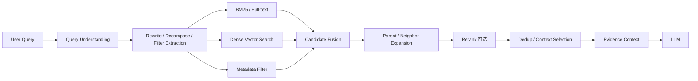
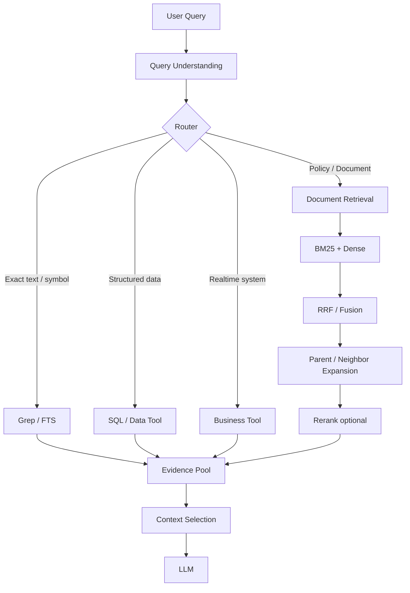

# 03-B RAG生产链路与检索策略：从Embedding到Hybrid、Rerank与Agentic Retrieval

> 上一课解决的是：真实 PDF、表格、扫描件怎样变成结构正确、可追溯、可版本化的 `RAG-ready Evidence Units`。
>
> 这一课继续回答：**用户提出问题之后，系统到底怎样把正确证据找出来？**
>
> 不再把 RAG 简化成 `Query → Vector DB → Top-K → LLM`，而是学习生产链路：
>
> `Query Understanding → Filter → Lexical/Dense Retrieval → Fusion → Parent/Neighbor Expansion → Rerank → Context Selection → Evidence`

---

## 1. RAG 不等于 Vector Search

初学时最常见的是：

```text
User Query
↓
Embedding
↓
Vector Search Top-K
↓
LLM
```

这叫 Naive RAG，可以工作，但它假设：

> 只要文本语义相似，就能找到正确证据。

真实企业问题并不是这样。

例如：

```text
“平安银行2025年第三季度报告里，尽调报告生成的原文是什么？”
```

这里同时包含：

```text
平安银行
→ 实体

2025年第三季度
→ 时间/版本

尽调报告生成
→ 语义主题

原文
→ 精确文本意图
```

因此成熟系统通常会同时利用：

```text
Lexical Signal
Semantic Signal
Metadata
Document Structure
Query Intent
```

更好的心智是：

```text
RAG = Evidence Retrieval + Generation
```

而 Evidence Retrieval 不只有向量搜索。

AIPM-Wiki 当前也把向量语义检索、关键词检索、结构化过滤、SQL、实时 Tool / Agent Retrieval 看成不同证据获取路径。

---

# 2. Production RAG 主链路



可以把这条链理解成：

```text
先尽量别漏
↓
再尽量排准
↓
最后只把真正有用的 Evidence 给模型
```

因此 Retrieval 总是在权衡：

```text
Recall
vs
Precision
```

---

# 3. Embedding 到底是什么

Embedding Model 做的是：

```text
Text
↓
Embedding Model
↓
Vector
```

例如：

```text
“企业偿债能力有所下降”
```

会被编码为高维向量：

```text
[0.12, -0.37, 0.81, ...]
```

单个数字没有人工语义，重要的是：

> **语义相似的文本通常会在向量空间中靠得更近。**

例如：

```text
Query:
“公司的还债能力怎么样？”

Chunk A:
“企业偿债能力有所下降。”

Chunk B:
“公司注册地址位于深圳。”
```

Query 与 A 没有完全一致的关键词，但 Dense Retrieval 仍可能把 A 排在前面。

所以 Dense Retrieval 特别擅长：

```text
同义表达
口语改写
自然语言问题
概念相似
用户不知道原文术语
```

---

# 4. 为什么向量检索不够

企业检索中有很多“精确匹配”问题：

```text
合同编号：HT-2026-0917-0032
产品代码：PA00173
法规：第27条
版本：v3.7.2
错误码：ERR_AUTH_403
```

用户输入：

```text
HT-2026-0917-0032
```

真正想找的是：

```text
包含这个精确字符串的证据
```

而不是：

```text
与这个编号语义相近的证据
```

所以 Vector Search 在下面这些任务上未必最好：

```text
编号
产品名
专有名词
代码
日期
缩写
法规条款
原文搜索
```

这就是 BM25 / Full-text Search 仍然重要的原因。

---

# 5. BM25 解决什么

BM25 可以先理解成一种成熟的 Lexical Retrieval。

它主要关注：

```text
Term Frequency
这个词在当前文档出现多少

Inverse Document Frequency
这个词在整个语料中有多稀有

Document Length Normalization
避免长文档仅因为词多而占便宜
```

例如内部银行语料里：

```text
“银行”
```

到处存在，区分度低。

但：

```text
“尽职调查报告生成”
```

可能只出现在少量文件里，因此区分度高。

BM25 特别适合：

```text
精确术语
法规条款
产品名
编号
缩写
专业实体
原文
```

---

# 6. Dense 和 BM25 不要理解成“新技术 vs 旧技术”

更实用的判断：

| Query | 更适合的信号 |
|---|---|
| `HT-2026-0917` | Lexical |
| `第27条是什么` | Lexical + Metadata |
| `公司为什么可能出现现金流风险` | Dense |
| `还款能力变差怎么表达` | Dense |
| `尽职调查报告生成` | Lexical + Dense |
| `和尽调自动化有关的内容` | Dense 更重要 |
| `Qwen3-VL` | Lexical 很重要 |

所以：

```text
BM25 ≠ 落后
Vector Search ≠ 万能
```

两者捕捉的是不同的 relevance signal。

---

# 7. Metadata Filter 经常比换模型更有效

上一课 Chunk 已经保存：

```text
document_type
version
effective_date
department
security_level
customer_id
section
page
```

用户问：

> “查当前有效的对公流动资金贷款政策。”

不要：

```text
全库
↓
纯 Vector Search
```

更合理：

```text
document_type = credit_policy
business_line = corporate
status = effective
```

先 Filter，再做 BM25 / Dense。

为什么？

两个政策：

```text
A：2024版，已失效
B：2026版，当前有效
```

在向量空间中可能高度相似，但业务上 A 不应该进入当前答案。

所以：

> **语义相关性不等于业务可用性。**

Metadata 直接参与：

```text
Filtering
Authorization
Version Control
Citation
```

---

# 8. Hybrid Search 为什么常见

现在我们有：

```text
BM25
→ exact lexical relevance

Dense Vector
→ semantic relevance
```

很自然可以并行跑：

```text
Query
├─ BM25
└─ Vector
```

再融合。

例如：

```text
“贷款客户经营恶化后银行怎么处理？”
```

BM25 可能命中原文里的：

```text
“经营状况发生重大变化”
```

Dense Search 可能找到：

```text
没有相同用词，但语义上讲“重新进行授信分析评价”的条款
```

两者互补。

Elastic 当前官方 Hybrid Search 文档就把 Full-text Search 和 Vector Search 放在同一查询中，并将 RRF 作为推荐的融合起点之一。

---

# 9. 为什么 BM25 Score 和 Vector Score 不能直接相加

例如：

```text
BM25:
Doc A = 14.7

Vector:
Doc A = 0.83
```

这两个 Score 不是同一量纲。

直接：

```text
14.7 + 0.83
```

没有稳定意义。

可以做：

```text
Normalization
+
Weighted Linear Combination
```

但需要调参数。

另一个常见方法：

```text
RRF
Reciprocal Rank Fusion
```

---

# 10. RRF 是什么

RRF 不太关心原始 Score，而看：

```text
一个文档在每个结果列表里排第几
```

直观公式：

```text
RRF(d) = Σ 1 / (k + rank_i(d))
```

其中：

```text
rank_i(d)
```

是文档 d 在第 i 条检索结果里的名次。

例如：

```text
BM25:
1 A
2 B
3 C

Vector:
1 X
2 A
3 B
```

A 和 B 在两路中都靠前，因此融合后通常仍然很靠前。

RRF 的好处是绕开：

```text
不同 Retriever Score 难直接比较
```

的问题。

Elastic 官方 Hybrid Search 推荐 RRF 作为重要实现方式；zvec-grep 当前公开的多路检索也支持 Fusion，并在其 release notes 中明确提到 RRF。

但不要背：

```text
Hybrid 一定必须 RRF
```

如果有足够业务 Eval，也可以使用：

```text
Linear Fusion
Custom Weights
Learning to Rank
```

---

# 11. Top-K 不是越大越好

假设：

```text
top_k = 50
```

可能让 Recall 增加，但 LLM 也会收到：

```text
更多噪声
更多重复
更多冲突
旧版本
更多 Token
Lost in the Middle
```

所以成熟链路往往：

```text
First-stage Retrieval
→ 较宽候选

Second-stage Ranking / Filtering
→ 缩成少量 Evidence
```

这就是 Rerank 的位置。

---

# 12. Rerank 是什么

第一阶段：

```text
BM25 / Vector / Hybrid
```

追求：

```text
Fast + High Recall
```

例如取：

```text
Top 30
```

第二阶段：

```text
Reranker
```

重新判断：

```text
Query + Candidate Chunk
```

的相关程度，再缩成：

```text
Top 5
```

这叫：

```text
Retrieve then Rerank
```

---

# 13. 为什么 Reranker 可能更准

Dense Retrieval 通常：

```text
Query
→ query vector

Chunk
→ chunk vector

比较 vector
```

两边编码相对独立。

典型 Cross-Encoder Reranker 更像：

```text
Query + Chunk
↓
模型联合阅读
↓
Relevance Score
```

可以更细地判断：

> 这个 Chunk 是否真的能回答这个 Query。

代价：

```text
更慢
更贵
```

所以不会拿 Reranker 直接扫描全部百万级 Chunk，而是只排第一阶段召回的小候选集。

---

# 14. “生产很少用 Rerank”怎么判断

你之前看到的评论里说：

> 生产中很少用 rerank。

这可以是某些项目的经验，但不能当作行业结论。

适合尝试 Rerank：

```text
Corpus 大
候选噪声多
问题复杂
多个 Chunk 都“看起来相关”
准确率要求高
Top-K 顺序明显影响答案
```

例如金融政策、法律条款、复杂企业知识。

可以不加：

```text
知识库很小
Metadata Filter 已经很强
Hybrid Top-K 已经很准
Latency 极敏感
Eval 显示提升很小
```

所以正确结论：

> **Rerank 是用额外 latency/cost 换取排序 precision 的可选阶段，是否保留由 Eval 决定。**

Elastic 当前 Ranking 文档也是这种结构：

```text
First-stage Retrieval
→ Candidate Set
→ More Expensive Reranking
```

---

# 15. Parent-child Retrieval：为什么“搜小块、给大块”

上一课我们已经保存：

```text
Parent Section
├─ Child A
├─ Child B
├─ Child C
└─ Child D
```

为什么先搜 Child？

因为 Child 更聚焦。

例如：

```text
Parent：
整章风险管理，2000 tokens

Child：
专门讲客户重大经营变化后的处理，250 tokens
```

用户问：

```text
“企业经营发生重大变化后怎么办？”
```

Child 更容易精准命中。

但只返回 250 tokens 可能缺：

```text
适用条件
上位定义
例外条款
上下文
```

于是：

```text
Child Hit
↓
resolve parent_id
↓
返回 Parent / Larger Context
```

这就是：

```text
Small-to-big Retrieval
```

关键原则：

> **检索粒度和交给 LLM 的上下文粒度，可以不同。**

---

# 16. LlamaIndex Auto-Merging Retriever 的思想

LlamaIndex 官方经典示例构建：

```text
2048
 ↓
512
 ↓
128
```

的 Hierarchical Nodes。

Leaf Nodes 先用于 Vector Retrieval。

如果：

```text
同一个 Parent 下多个 Children 都被命中
```

Auto-Merging Retriever 可以将这些小碎片合并回更大的 Parent。

目的：

```text
减少碎片
减少重复
恢复更完整上下文
```

重要的不是一定使用 LlamaIndex，而是理解：

```text
检索精准
≠
最终只能给模型同样小的 Chunk
```

---

# 17. Parent 也不能机械全部返回

如果：

```text
Parent = 8000 tokens
```

只命中一个 200-token Child 就把 8000 token 全放进 Context，也不合理。

真正策略可以考虑：

```text
Parent Size
Sibling Hit Count
Query Type
Token Budget
Section Importance
```

例如：

```text
只命中一个 Child
→ Child + Neighbor

同一个 Parent 命中多个 Child
→ Parent Merge

Parent 太大
→ 返回中间层 Node
```

所以成熟 Retrieval 其实是在做：

```text
Evidence Context Reconstruction
```

---

# 18. Neighbor / Sibling Expansion

假设：

```text
Chunk 06
Chunk 07
Chunk 08
```

检索命中：

```text
07
```

但：

```text
定义在06
结论在07
例外在08
```

可以返回：

```text
06 + 07 + 08
```

这叫：

```text
Neighbor Expansion
Window Retrieval
Sibling Expansion
```

适合：

```text
法规
合同
论文
连续论述
长报告
```

但不能机械每次：

```text
±3 chunks
```

否则 Token 又膨胀。

---

# 19. Parent/Neighbor 和 Overlap 的关系

Overlap 是：

```text
在 Indexing 阶段主动制造重复
```

用于补偿切块边界。

Parent/Neighbor 是：

```text
在 Retrieval 阶段动态恢复上下文
```

因此结构保存得好以后，可以：

```text
减少盲目 overlap
+
增加按需 Context Reconstruction
```

这就是为什么真实项目里父子、兄弟分片比只背：

```text
chunk=500 overlap=100
```

更值得理解。

---

# 20. Query Rewrite：Retriever 的输入不一定是用户原句

用户：

```text
“那今年呢？”
```

直接 Embedding 几乎没有信息。

如果上一轮是：

```text
“平安银行去年尽调报告智能助手有什么进展？”
```

真正的 Retrieval Query 应该类似：

```text
“平安银行2026年尽调报告智能助手进展”
```

这就是：

```text
Conversation-aware Query Rewrite
```

完整多轮机制放到 `03-C`。

本课先记住：

> **用户输入和检索 Query 不一定是同一串文字。**

---

# 21. Rewrite 还可以做什么

### 术语规范化

```text
“还款能力”
→ “偿债能力 还款能力”
```

### Acronym Expansion

```text
AUM
→ Assets Under Management / 管理资产规模
```

### 别名扩展

```text
“尽调”
→ “尽职调查”
```

### Query Decomposition

用户：

```text
“这家公司收入为什么下降，它是否违反当前授信政策？”
```

可以拆：

```text
A：收入下降原因
B：当前授信政策
```

甚至走不同数据源。

---

# 22. Multi-query Retrieval

模糊问题：

```text
“企业信用情况不好有什么风险？”
```

可扩展为：

```text
企业信用风险
违约风险
偿债能力恶化
信用评级下降
```

分别检索，再 Merge。

它能提高 Recall，但会增加：

```text
搜索次数
Candidate 数
Latency
Cost
```

因此仍然必须由 Eval 判断是否值得。

---

# 23. Retrieval Routing：不是所有问题都走一个 Retriever

这一步是 Naive RAG 到 Production / Agentic Retrieval 的关键。

### 非结构化文档问题

```text
“授信政策如何定义关联客户？”
→ Document Retrieval
```

### 精确文件搜索

```text
“找出所有 AuthService 引用”
→ grep / FTS
```

### 结构化数据

```text
“客户当前授信敞口是多少？”
→ SQL / Database / Tool
```

### 实时信息

```text
“今天这家企业是否出现新的重大诉讼？”
→ Authorized External Tool / Search
```

这就是：

```text
Retrieval Routing
```

AIPM-Wiki 的 Production RAG / NL2SQL 路线也明确强调：

```text
Document
Structured Database
Realtime Tool
```

是不同 Evidence Path。

---

# 24. Vector DB 是不是必须

不是。

Vector Search 需要：

```text
Embedding
+
Vector Index
```

但 Vector Index 可以存在：

```text
专用 Vector DB
Elasticsearch
Postgres + pgvector
Local In-process DB
```

所以：

```text
RAG ≠ 必须专门购买 Vector Database
```

选型真正考虑：

```text
数据规模
QPS
Filter
Hybrid Search
Persistence
Tenant Isolation
Latency
Cost
运维复杂度
```

你的 Personal Health Agent 用：

```text
Postgres + pgvector
```

就是完全合理的一类实现。

---

# 25. zg / zvec-grep 为什么值得关注

截至 2026 年 9 月，zvec-grep (`zg`) 官方定位为：

```text
local-first workspace search layer
for humans and AI agents
```

它把：

```text
ripgrep
+
BM25 / lexical search
+
vector search
```

放到一个统一接口里，并支持 Hybrid Retrieval。

zvec 在 2026 年 8 月版本中也正式把 zvec-grep 作为 local-first workspace search 能力推出。

---

# 26. zg 更像什么

传统 RAG：

```text
Document
↓
Chunk
↓
Vector / Search Index
↓
Retriever
↓
LLM
```

zg 更强调：

```text
Workspace
↓
Local Index
↓
Agent / Human Search
├─ Hybrid
├─ FTS
├─ Vector
└─ ripgrep
```

特别适合：

```text
代码仓库
Markdown
本地文档
文件型 Workspace
```

Agent 可以按任务决定：

```text
不知道精确词
→ semantic / hybrid

知道符号
→ FTS

知道精确字符串 / Regex
→ ripgrep
```

这比“所有问题都 Vector Search”更灵活。

---

# 27. zg 并不是“RAG 的反义词”

如果：

```text
Agent
↓
zg 搜索
↓
拿到文件片段
↓
交给 LLM
↓
回答
```

本质仍然是：

```text
Retrieval
→ Augment Context
→ Generation
```

所以更准确：

> **zg 是 Agentic / Search-first Retrieval 的一种实现形态，而不是推翻 Retrieval-Augmented Generation 本身。**

---

# 28. Exact Search 仍然重要

Agent 修改代码时问：

```text
“谁调用了 check_permission？”
```

这种问题：

```text
ripgrep "check_permission"
```

往往比 Semantic Search 更直接。

zg 的价值之一就是把：

```text
Exact
Lexical
Semantic
```

放在一个统一 Search Layer 中。

这揭示 Production Retrieval 的核心原则：

> **不同 Query 应使用不同 Search Primitive。**

---

# 29. Fixed RAG 和 Agentic Retrieval

### Fixed RAG

```text
Query
↓
Rewrite
↓
Hybrid Search
↓
Rerank
↓
Top-K
↓
LLM
```

优点：

```text
稳定
可测
成本可控
易审计
```

适合：

```text
企业FAQ
制度问答
固定知识库
```

### Agentic Retrieval

Agent 动态决定：

```text
要不要搜？
搜哪个库？
先 grep 还是 semantic？
是否拆 Query？
是否需要 SQL？
第一次结果不够要不要继续查？
```

例如：

```text
“分析客户A的授信风险并说明依据”
```

Agent 可能：

```text
1. Tool 查实时授信敞口
2. SQL 查财务指标
3. RAG 查当前政策
4. Search 查历史尽调资料
5. 发现缺口后继续补证
6. 汇总 Evidence
```

这已经不是一次 Top-K。

---

# 30. 为什么不能所有 RAG 都 Agentic

Agentic Retrieval 更灵活，但也带来：

```text
更多 LLM Calls
更高 Token Cost
更长 Latency
路径更不确定
更难 Eval
更难 Debug
```

所以：

```text
目标明确、数据源固定
→ Fixed Workflow / RAG

目标复杂、数据源多、需要多步调查
→ Agentic Retrieval
```

与前面的 Agent 原则一致：

> **不要为了 Agent 而 Agent。**

---

# 31. 更完整的 Retrieval Architecture



这比：

```text
Query → Vector DB → GPT
```

更接近真实生产系统。

---

# 32. Context Selection 不等于直接拿 Top 5

假设 Top 5：

```text
1. Policy v3 Section 2
2. Policy v3 Section 2 的重复父块
3. Policy v2 Section 2 旧版本
4. FAQ 解释
5. Policy v3 Section 3
```

直接塞给 LLM 仍然有问题。

Context Selection 还可能做：

```text
Dedup
Version Suppression
Source Diversity
Parent Merge
Conflict Detection
Token Budget
```

所以：

```text
Top Evidence
≠
搜索结果原样复制
```

而是在做：

```text
Context Packing
```

这会在 `03-C Context Engineering` 继续展开。

---

# 33. “相关”不等于“有用”

Query：

```text
“流动资金贷款如何审批？”
```

Chunk：

```text
“本办法适用于流动资金贷款。”
```

主题上非常相关，但并没有回答：

```text
如何审批
```

所以真正需要优化的不是单纯：

```text
Topic Similarity
```

而是：

```text
Answer Utility
```

这也是为什么 Retrieval Eval 必须用真实业务 Query。

---

# 34. Retrieval Evaluation 要拆开做

RAG 需要分：

```text
Retrieval
vs
Generation
```

这一课只测 Retrieval。

准备：

```text
Query
+
Expected Relevant Evidence
```

例如：

```text
Q:
“流动资金贷款实行什么审批原则？”

Relevant Evidence:
对应法规条款
```

然后测试：

```text
正确 Evidence 有没有召回？
排第几？
```

---

# 35. Hit@K / Recall@K

### Hit@5

表示：

> 正确 Evidence 有没有出现在 Top 5。

如果：

```text
100 个 Query
82 个在 Top 5 找到正确证据
```

则：

```text
Hit@5 = 82%
```

### Recall@K

如果一个 Query 有四个相关 Evidence：

```text
A B C D
```

Top 5 找到：

```text
A B D
```

则：

```text
Recall@5 = 3/4
```

---

# 36. MRR

MRR 关注：

> 第一个真正相关结果排多前。

例如：

```text
Q1: rank 1
Q2: rank 2
Q3: rank 5
```

贡献：

```text
1
1/2
1/5
```

再求平均。

它特别适合判断：

```text
有用结果是否尽量靠前
```

---

# 37. NDCG

现实相关性往往不是：

```text
相关 / 不相关
```

而是：

```text
3 = 直接回答
2 = 很有帮助
1 = 背景相关
0 = 无关
```

NDCG 同时考虑：

```text
相关程度
+
排名位置
```

PM 不需要现场推公式，但要知道：

> **检索评测不只看“搜没搜到”，还要看排名质量。**

---

# 38. Rerank 值不值得，看 Incremental Lift

例如：

```text
Hybrid:
Hit@5 = 88%
MRR = 0.72

Hybrid + Rerank:
Hit@5 = 90%
MRR = 0.84
```

同时：

```text
P95 latency:
300ms → 950ms
```

产品决策就变成：

```text
+2% Hit@5
+0.12 MRR
vs
+650ms latency
+推理成本
```

所以不能只问：

```text
“要不要 Rerank？”
```

而要问：

> **它带来的增量质量是否值得成本。**

---

# 39. 整条 Retrieval Pipeline 都应该实验化

对同一组业务 Query：

```text
Baseline:
Dense Top-5

A:
Dense + Metadata

B:
Hybrid RRF

C:
Hybrid + Parent Expansion

D:
Hybrid + Parent + Rerank
```

分别测：

```text
Recall
MRR
NDCG
Context Tokens
Latency
Cost
```

Production RAG 应该是：

```text
Evaluation-driven Retrieval
```

而不是：

```text
Feature-driven RAG
```

---

# 40. Badcase 怎么分类

不要只记：

```text
“RAG 错了”
```

至少拆成：

```text
Query Understanding Error
Filter Error
Recall Error
Ranking Error
Structure Error
Version Error
Permission Error
Context Selection Error
```

例如：

```text
正确 Chunk 根本没进 Top-50
→ Recall Error

进了 Top-50 但排到第40
→ Ranking Error

命中条款但缺上文定义
→ Structure Error

召回旧政策
→ Version Error
```

这样才能知道该改哪层。

---

# 41. 一个银行政策问答的完整示例

用户问：

> **“企业经营情况发生重大变化之后，银行需要重新评估授信吗？”**

### Step 1：Query Understanding

```text
domain = credit
intent = policy_question
topic = credit evaluation
time = current
```

Rewrite：

```text
“授信客户经营情况发生重大变化 重新分析评价 授信”
```

### Step 2：Metadata Filter

```text
document_type = regulation / credit_policy
status = effective
```

### Step 3：Parallel Retrieval

BM25 搜：

```text
经营情况重大变化
授信分析评价
```

Dense 搜：

```text
企业经营变化后重新评估风险
```

### Step 4：RRF

融合 Lexical + Semantic Rank。

### Step 5：Structure Expansion

命中法规子条款后获取：

```text
Parent Section
+
必要 Neighbor
```

### Step 6：Rerank（如 Eval 证明有收益）

重新判断哪个条款真正回答：

```text
重大经营变化后是否需要重新评价
```

### Step 7：Context Selection

去掉：

```text
旧版本
重复块
只讨论适用范围的块
```

保留：

```text
有效条款
必要上下文
Citation Anchor
```

### Step 8：LLM

此时才进入：

```text
Grounded Generation
```

---

# 42. 如果用户问的是数字，就别硬做 RAG

用户：

```text
“客户A当前总授信敞口是多少？”
```

正确路径：

```text
Authorized Credit Exposure Tool
↓
Database
↓
Structured Result
```

而不是：

```text
把数据库记录转成文档
↓
向量检索
```

这就是 AIPM-Wiki 很重要的判断：

> **先判断 Evidence 存在哪里。**

```text
Document
→ RAG

Database
→ SQL / Tool

Realtime System
→ API / Tool

Code / Workspace
→ grep / search
```

---

# 43. 和你的津药项目怎样对应

你的真实项目里：

```text
采购金额
供应商聚合
字段 Join
```

并没有通过 RAG 找答案，而是：

```text
Deterministic Tool / Python
```

所以面试可以说：

> 我会先判断证据形态。制度和非结构化知识走 RAG；数据库里的确定性数值通过 Tool / SQL 获取，而不是把结构化数据强行文本化做 Vector Retrieval。

这是一个很成熟的产品判断。

---

# 44. 和你的 Health Agent 怎样对应

你的 Health Agent 已经有：

```text
versioned retrieval
citation
run-pinned retrieval version
```

它支持一个重要观点：

> **一次 Retrieval Run 不只是“搜到了什么”，还应该知道搜的是哪个知识版本，以及 Citation 对应哪个 source/chunk。**

金融、医疗高风险场景尤其需要这种设计。

---

# 45. AI PM 在 Retrieval 层要懂到什么程度

你不需要：

```text
手写 HNSW
实现 BM25 引擎
训练 Cross-Encoder
```

但要能判断：

```text
Evidence 在哪？
Document / DB / Tool / Workspace

Query 属于什么类型？
Semantic / Exact / Structured / Multi-hop

Retriever 怎么组合？
BM25 / Dense / Hybrid / Metadata

上下文怎么恢复？
Parent / Neighbor

是否要 Rerank？
Eval Lift vs Latency/Cost

怎么验收？
Hit@K / Recall@K / MRR / NDCG / Latency / Cost
```

这已经是 AI 产品经理足够强的 Retrieval 技术深度。

---

# 46. 高频面试追问

## Q1：为什么不能只用向量检索？

> 向量检索擅长语义相似，但企业知识里有大量编号、法规条款、产品名、缩写和原文查找需求，Lexical Search 更稳定。因此生产系统常结合 BM25 与 Dense Retrieval，再用 RRF 或其他 Fusion 合并。

## Q2：Hybrid Search 是什么？

> 同时使用 Lexical 和 Semantic Retrieval。前者捕捉精确词，后者捕捉语义。结果通过 RRF、线性加权等策略合并，是否优于单路检索需要业务 Query Set 评测。

## Q3：RRF 为什么有用？

> BM25 与 Vector 的原始分数不在同一量纲，RRF 直接按各自排名融合，不要求先做复杂 Score Calibration，因此是一个稳健的 Hybrid Search 起点。

## Q4：Rerank 和 Retrieval 有什么区别？

> Retriever 面向大规模语料做快速候选召回，优先保证 Recall；Reranker 对少量候选做更昂贵的 Query-Document 联合判断，提升 Precision。

## Q5：生产一定要 Rerank 吗？

> 不一定。知识库小、Filter 强、Hybrid 已经足够准时可不上；候选噪声大、准确率要求高时可能值得。最终看质量提升是否值得 latency 和 cost。

## Q6：父子分片和普通 Chunking 有什么区别？

> Chunking 是索引时怎样组织知识；Parent-child Retrieval 是查询时如何利用层级。小 Child 用于精准命中，必要时返回更完整 Parent，把检索粒度与最终上下文粒度分开。

## Q7：为什么 Top-K 不能一直加大？

> Top-K 增大可能提升 Recall，但也增加噪声、重复、冲突、Token Cost 和 Lost-in-the-Middle 风险。生产里通常先宽召回，再融合、重排和 Context Selection。

## Q8：Vector DB 是 RAG 必需的吗？

> 不是。可以用专用 Vector DB、Elasticsearch、Postgres+pgvector 或本地索引。真正看规模、QPS、Filter、Hybrid、隔离和运维要求。

## Q9：zg 和传统 RAG 有什么关系？

> zg 更像 Agent 可调用的统一 Search Layer，把 ripgrep、BM25 和 vector retrieval 组合起来。它改变的是 Retrieval Tool 的形态，而不是让 Retrieval-Augmented Generation 这个思想消失。

---

# 47. 最终心智模型

不要再记：

```text
Query
↓
Vector DB
↓
Top 5
↓
GPT
```

应该记：

```text
User Query
    ↓
Query Understanding
    ↓
Evidence Type / Retrieval Routing
    ↓
┌───────────────────────────────────┐
│ Lexical / BM25                    │
│ Dense Vector                      │
│ Metadata Filter                   │
│ Grep / Exact Search               │
│ SQL / Structured Tool             │
│ Realtime Business Tool            │
└───────────────────────────────────┘
    ↓
Candidate Fusion
    ↓
Parent / Neighbor Context Recovery
    ↓
Rerank（需要时）
    ↓
Dedup / Version / Permission / Budget
    ↓
Evidence Context
    ↓
LLM
```

真正成熟的 RAG 不应该先问：

> 用哪个向量数据库？

而应该先问：

> **这个问题需要什么证据、证据在哪里、用什么 Search Primitive 找、怎样证明没漏掉、怎样控制噪声，以及最后该给模型多少上下文？**

---

# 48. 一句话总结

> **Naive RAG 是“Embedding → Top-K → LLM”；Production RAG 是一个 Evidence Retrieval System：同时利用语义、关键词、Metadata 和文档结构，在必要时加入 Rerank，并按问题类型路由到 SQL、Tool 或 Search，再用 Eval 持续证明每个组件是否真正带来提升。**

---

# 49. 下一课：03-C 多轮对话与 Context Engineering

下一课会把 Retrieval 接回 Agent Runtime：

```text
conversation_history 到底是什么？
多轮问题为什么不能只拿当前一句检索？
Query Rewrite 如何结合历史？
State / Memory / Runtime Context / Model Context 怎么区分？
历史消息太多怎么办？
Summary 怎么进入当前 Context？
RAG Evidence 和 History 如何共享 Token Budget？
Hermes active messages / compression / session_search 怎么对应？
LangGraph MessagesState / checkpointer / runtime context 怎么对应？
```

最终回答：

> **一次真实 Agent 调用 LLM 时，到底是谁把 System Prompt、History、Memory、RAG Evidence、Tool Definitions 和 Current State 组装成本轮 Model Context？**

---

# 50. 主要参考资料

## AIPM-Wiki

当前 LLM 学习目录将以下内容作为连续主线：

- 什么是 RAG；
- RAG 没死：死的是 Naive 固定流水线；
- Long Context vs RAG；
- Agentic Retrieval；
- Search as Code；
- Production RAG：Hybrid、Rerank、Evaluation、Knowledge Governance；
- NL2SQL 作为结构化 Evidence 的另一条路径。

https://github.com/archlizheng/AIPM-Wiki/blob/main/docs/01-ai-basics/llm/README.md

https://github.com/archlizheng/AIPM-Wiki/blob/main/docs/01-ai-basics/llm/prompt-rag-finetuning.md

https://github.com/archlizheng/AIPM-Wiki/blob/main/docs/01-ai-basics/llm/nl2sql-for-ai-pm.md

## Elasticsearch 官方文档

用于本文对 Hybrid Search、RRF、Ranking 与 Reranking 的说明：

https://www.elastic.co/docs/solutions/search/hybrid-search

https://www.elastic.co/docs/solutions/search/ranking

https://www.elastic.co/search-labs/blog/vector-search-best-practices-elasticsearch

## LlamaIndex

用于 Parent-child / Hierarchical Node / Auto-Merging Retriever 的实现思想：

https://docs.llamaindex.ai/en/v0.10.17/examples/retrievers/auto_merging_retriever.html

https://docs.llamaindex.ai/en/v0.10.22/module_guides/loading/node_parsers/modules/

这里引用的是公开的经典层级检索思想，不代表生产必须使用该版本或框架。

## zvec / zvec-grep

截至 2026-09，官方公开定位为 local-first workspace search，统一 exact/lexical/semantic retrieval：

https://github.com/alibaba/zvec

https://github.com/zvec-ai/zvec-grep

https://github.com/zvec-ai/zvec-grep/blob/main/docs/04-pipeline.md

---

> **课程状态**
>
> 本文件为 `teaching_draft`。
>
> 到这里 `03-A + 03-B` 已经把“长文档如何进入知识库”和“知识库如何把证据找回来”连起来。下一步进入 `03-C` 时，重点将从 Search Pipeline 转为 **一次 Agent 调用里 Context 是怎样被组装出来的**。
