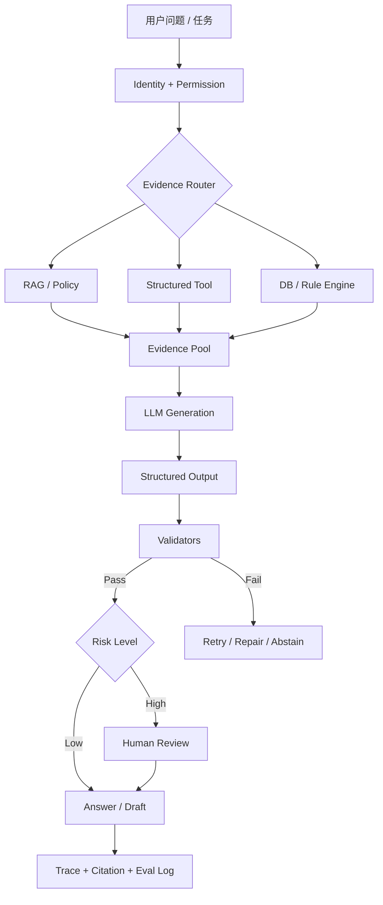
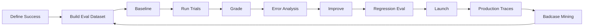

# 03-D 幻觉治理与 AI 产品 Evaluation：从“回答像对的”到“系统可验证、可上线”

> 这一课是第三部分里最需要从“模型视角”升级到“产品系统视角”的一课。
>
> 核心问题不是：
>
> **“怎么让 LLM 不幻觉？”**
>
> 而是：
>
> **“一个 AI 产品怎样把不可靠生成控制在可接受范围内，并且通过 Evaluation 证明它真的达到了上线标准？”**
>
> 本文会严格区分：
>
> - **【公开事实】**：来自 NIST、金融监管、OpenAI、Anthropic、LangSmith、DeepEval 等公开资料；
> - **【工程分类】**：为了排查生产问题而采用的故障分类，不声称是全行业唯一标准；
> - **【产品设计】**：基于公开原理和真实工程实践总结出的系统方案；
> - **【示意场景】**：用于理解机制的例子，不冒充某家公司的真实事故。

---

# 1. 先纠正一个最重要的认知：幻觉不是“模型层的一个百分比”

很多初学回答会说：

```text
幻觉原因：
1. 模型知识不够
2. Prompt 不好
3. RAG 没做好
```

然后解决方案：

```text
加 RAG
加 Prompt
加人工审核
```

这还不够。

生产系统中的错误答案可能来自：

```text
原始知识错误
↓
文档解析错误
↓
Chunk 错误
↓
Retrieval 错误
↓
上下文版本错误
↓
模型生成错误
↓
Citation 对错位置
↓
Tool 调错
↓
业务规则没校验
↓
最终错误回答或错误动作
```

所以：

> **用户看到的一次“幻觉”，从系统视角看可能是整个 Evidence → Reasoning → Action Pipeline 中任何一层的失败。**

这也是为什么幻觉治理必须和 Eval 放在一起学。

如果你不能定位：

```text
到底哪一层错了
```

就不知道：

```text
该改 Prompt？
该改 Retriever？
该换数据？
该加 Validator？
还是根本不该让 LLM 做这个判断？
```

---

# 2. “幻觉”到底是什么：先用公开定义建立边界

NIST 在 `AI RMF Generative AI Profile (NIST AI 600-1)` 中使用 `Confabulation` 描述生成式 AI 产生并自信呈现错误或虚假内容的现象，也包括：

- 输出偏离输入；
- 与同一上下文中已有陈述矛盾；
- 生成看似合理但错误的逻辑；
- 生成虚假的 Citation。

NIST 特别指出，这类问题在医疗等高影响场景中可能导致错误决策，因此需要被系统性监控。

来源：

https://www.nist.gov/publications/artificial-intelligence-risk-management-framework-generative-artificial-intelligence

PDF：

https://doi.org/10.6028/NIST.AI.600-1

OpenAI 2025 年关于幻觉的研究文章也采用了非常直观的表述：

> Hallucinations are plausible but false statements generated by language models.

并强调：

> 只奖励“答对率”的评测会让模型更倾向于猜，而不是承认不知道。

来源：

https://openai.com/index/why-language-models-hallucinate/

---

# 3. 为什么模型天然可能“说得像真的”

LLM 的基础目标并不是：

```text
数据库查询
→ 返回已验证事实
```

而更接近：

```text
根据上下文
预测下一 Token
```

模型学习的是：

```text
什么样的文本在统计上更可能接着出现
```

这使它非常擅长：

```text
流畅表达
模式归纳
文本生成
```

但：

```text
语言上合理
≠
事实一定正确
```

因此即使模型能力越来越强：

> **“生成能力很强”也不能自动推出“每个事实都经过外部验证”。**

这就是为什么生产系统需要：

```text
Grounding
Tool
Citation
Validation
Abstention
HITL
Evaluation
```

这些外部机制。

---

# 4. 一个非常重要的真实结果：Accuracy 和 Hallucination 不是同一件事

OpenAI 2025 年关于 hallucination 的公开研究举过一个很有代表性的例子。

在 SimpleQA 示例中：

```text
模型 A：
Accuracy 22%
Error 26%
Abstention 52%

模型 B：
Accuracy 24%
Error 75%
Abstention 1%
```

如果只看：

```text
Accuracy
```

模型 B 似乎略高。

但它的错误回答比例远高于模型 A。

原因是：

```text
不知道时继续猜
```

可能偶尔猜中，所以 Accuracy 上升；

但同时：

```text
Confident Error
```

也大量增加。

这说明一个特别重要的 AI 产品原则：

> **不能只看 Accuracy，还必须同时看 Error、Abstention、Coverage 和业务错误成本。**

对于金融、医疗等场景：

```text
“我没有足够证据判断”
```

通常可能比：

```text
自信给出错误结论
```

更安全。

但反过来，如果模型所有问题都说：

```text
无法判断
```

产品也没有价值。

所以实际要优化的是：

```text
Reliability
↕
Utility
```

之间的平衡。

来源：

https://openai.com/index/why-language-models-hallucinate/

---

# 5. 工程上不要只分类“有幻觉 / 没幻觉”

下面这个分类是**本课程为了生产排错采用的工程分类**，不是在声称行业存在唯一统一标准。

我们把用户看到的错误拆成：

```text
A. Source Failure
B. Parsing Failure
C. Retrieval Failure
D. Grounding / Generation Failure
E. Citation Failure
F. Reasoning / Consistency Failure
G. Tool / Action Failure
H. Context / Memory Failure
I. Abstention / Refusal Failure
```

为什么这么拆？

因为每一类的修复方法完全不同。

---

# 6. A 类：Source Failure —— 模型依据的“真相源”本身就是错的

例如内部知识库里同时存在：

```text
政策 v1：已失效
政策 v2：当前有效
```

但数据库没有：

```text
version
effective_date
status
```

Retriever 把 v1 搜出来。

模型严格根据 v1 回答。

那么：

```text
回答可能 Grounded
```

但：

```text
业务事实仍然是错的
```

这叫一个非常重要的区别：

> **Groundedness ≠ Real-world Correctness**

模型可以：

```text
忠实地引用了错误知识
```

所以高风险 RAG 必须有：

```text
Source Governance
Version
Owner
Effective Date
Revocation
```

这是 03-A 讲版本治理的原因。

---

# 7. B 类：Parsing Failure —— 原始文档正确，但进入系统时就错了

例如原始财报：

```text
营业收入：12,000 万元
```

OCR 识别为：

```text
72,000 万元
```

后续：

```text
Retriever 正确
LLM 忠实
Citation 正确
```

但答案还是错。

用户最后可能说：

> “模型幻觉了。”

实际上 Root Cause 是：

```text
Document AI / OCR
```

所以 Eval 不能只测最终回答。

还必须能测：

```text
Text Accuracy
Number Accuracy
Table Structure
Reading Order
```

这也是为什么 03-A 先讲 Document Processing。

---

# 8. C 类：Retrieval Failure —— 正确知识存在，但没搜到

例如知识库里有正确政策：

```text
Policy v3
```

但 Retriever 返回：

```text
FAQ
旧版 Policy
背景材料
```

LLM 只能基于错误 Context 回答。

这时候：

```text
换更强 LLM
```

可能没有本质帮助。

真正要看：

```text
Recall@K
MRR
Metadata Filter
Hybrid
Query Rewrite
Parent / Neighbor
```

所以 03-B 的 Retrieval Eval 与幻觉治理是直接相连的。

---

# 9. D 类：Grounding / Generation Failure —— 证据给对了，但模型自己加戏

这是最典型的 RAG “幻觉”。

例如 Context 只说：

```text
“公司经营现金流同比下降。”
```

模型回答：

```text
“公司因为主要客户流失导致经营现金流下降。”
```

其中：

```text
经营现金流下降
```

有 Evidence。

但：

```text
主要客户流失
```

Context 没有。

这就是：

```text
Unsupported Claim
```

LangSmith 当前 RAG Evaluation 教程把这个维度称为：

```text
Groundedness
```

即：

> Response 是否由 Retrieved Documents 支持。

DeepEval 的 Faithfulness Metric 也采用类似思路：

```text
Actual Output
vs
Retrieval Context
```

判断生成内容是否与 Retrieval Context 保持事实一致。

来源：

https://docs.langchain.com/langsmith/evaluate-rag-tutorial

https://deepeval.com/docs/metrics-faithfulness

---

# 10. 一个特别容易混淆的问题：Faithful 不等于 Correct

假设真实世界：

```text
公司的利润确实下降了
```

但 Retriever 没搜到这条证据。

LLM 凭参数知识或推理说：

```text
“公司利润下降。”
```

现实上可能：

```text
Correct
```

但在一个要求“只根据内部知识库回答”的 RAG 产品里：

```text
Unfaithful
```

因为本轮提供给模型的 Evidence 没有支持这个 Claim。

DeepEval 官方当前也明确指出：

> Faithfulness 只奖励 Retrieval Context 能支持的 Claim；一个现实中真实但未被检索到的事实，仍可能被判定为 unfaithful。

所以你必须分清：

```text
Correctness:
和 Ground Truth 比

Groundedness / Faithfulness:
和本轮 Evidence 比
```

这是面试里很容易被追问的点。

---

# 11. E 类：Citation Failure —— 答案可能对，但引用错了

例如模型回答：

```text
“该规则自 2026 年起生效 [2]”
```

实际上：

```text
[1] 支持生效时间
[2] 只讲适用范围
```

那么：

```text
Claim 可能是真的
Answer 可能 Grounded
Citation 仍然是错的
```

所以：

```text
有 Citation
≠
Citation 正确
```

NIST 明确把 fabricated citations 也列入 Confabulation 风险。

DeepEval 当前还提供 Citation Faithfulness Metric，专门判断：

```text
某个 Citation 是否真的支持它绑定的 Claim
```

来源：

https://deepeval.com/docs/metrics-citation-faithfulness

---

# 12. Citation 至少要评两件事

## Citation Correctness / Faithfulness

```text
这个引用真的支持当前 Claim 吗？
```

## Citation Coverage

```text
需要证据的事实 Claim 有多少真正带了引用？
```

例如回答有 10 个可验证 Claim：

```text
8 个有正确 Citation
2 个没有
```

那么可以定义产品自己的：

```text
Citation Coverage = 8 / 10
```

注意：

> 这里的公式是产品工程中可采用的度量设计，不是某个国际标准规定的唯一公式。

---

# 13. F 类：Reasoning / Consistency Failure

模型可能拿到了所有正确事实：

```text
收入下降
现金流下降
负债率上升
```

但推理出：

```text
“因此企业短期一定会违约。”
```

问题不是 Evidence 不存在。

而是：

```text
推理跨越了 Evidence 能支持的边界
```

或者模型前后自相矛盾：

```text
第一段：
企业现金流稳定

第三段：
企业现金流显著恶化
```

NIST 的 Confabulation 定义也覆盖同一 Context 内部自相矛盾的情况。

这类错误不能单靠：

```text
加 Citation
```

解决。

还需要：

```text
Reasoning Constraint
Business Rule
Validator
Human Review
```

---

# 14. G 类：Tool / Action Failure —— Agent 场景最危险的一类

Agent 不只是生成文字。

它还可能：

```text
选 Tool
填参数
执行 Tool
读 Tool Result
继续行动
```

因此错误可能发生在：

```text
Tool Selection
Tool Arguments
Authorization
Execution
Result Interpretation
Action
```

例如系统有：

```text
get_customer_profile()
check_product_eligibility()
submit_application()
```

模型错误调用：

```text
submit_application()
```

这已经不是“说错一句话”。

而是：

```text
Action Risk
```

2026 年中国金融监管公开指导意见已经明确提出，需要防范：

```text
模型生成结果不可靠
记忆污染
身份越权
工具滥用
运行失控
```

并要求高风险金融 AI 应用关键环节建立人工监督和干预机制。

来源：

https://policy.mofcom.gov.cn/claw/clawContent.shtml?id=106182

这说明真实金融 Agent 的幻觉治理不能只讨论：

```text
回答是否真实
```

还必须讨论：

```text
错误答案能不能触发错误动作
```

---

# 15. H 类：Context / Memory Failure

Agent 还可能因为：

```text
旧 History
错误 Summary
Stale Memory
跨客户 Context 混入
```

造成错误。

例如：

```text
上一任务：
客户 A

当前任务：
客户 B
```

Memory / State 里错误保留 A 的信息。

然后 Agent 把：

```text
A 的事实
```

写进：

```text
B 的报告
```

这可以被称为：

```text
Context Pollution
Memory Pollution
```

金融监管 2026 年指导意见也已经明确把：

```text
上下文污染
记忆污染
```

列为需要防范的 AI 安全风险。

完整机制将在 03-C 展开。

---

# 16. I 类：Refusal / Abstention Failure

有两个相反方向。

### Under-refusal

没有证据：

```text
仍然回答
```

产生：

```text
Confident Error
```

### Over-refusal

明明 Evidence 很完整：

```text
却一直说无法回答
```

产品变得不可用。

所以不能把：

```text
Refusal Rate 越高越安全
```

当目标。

OpenAI 与 Anthropic 2025 年联合公开评测就展示过一个真实 Trade-off：

```text
某些模型在 hallucination test 中拒答率很高
→ 幻觉低
→ 但 utility 也受到影响
```

来源：

https://openai.com/index/openai-anthropic-safety-evaluation/

因此真正需要优化：

```text
正确回答
+
正确拒答
```

同时避免：

```text
错误回答
+
错误拒答
```

---

# 17. 幻觉治理不是一个开关，而是多层 Defense-in-Depth

一个比较成熟的系统可以分成：

```text
Layer 1  Source Governance
Layer 2  Retrieval / Tool Grounding
Layer 3  Prompt / Generation Constraint
Layer 4  Structured Output
Layer 5  Validator
Layer 6  Citation / Evidence
Layer 7  Abstention / Refusal
Layer 8  HITL
Layer 9  Monitoring / Eval
```

不要期待：

```text
其中任何一层
```

单独解决全部问题。

---

# 18. Grounding：最基础的治理手段

Grounding 的思想：

```text
不要只依赖模型参数知识
↓
提供外部 Evidence
↓
要求回答基于 Evidence
```

Evidence 可以来自：

```text
RAG
Tool
Database
Search
Structured System
```

所以 Grounding 不等于 RAG。

例如：

```text
客户当前授信敞口
```

最好 Ground 到：

```text
Credit Exposure Tool
```

而不是：

```text
Vector Search
```

---

# 19. Grounding 的真实边界

Grounding 可以减少：

```text
模型凭空生成事实
```

但解决不了：

```text
Source 本身错误
Retriever 找错版本
Tool 返回脏数据
模型误读 Evidence
Citation 对错来源
```

因此：

> **RAG 可以降低某些类型的幻觉，但绝对不能说“用了 RAG 就不会幻觉”。**

这是面试必须明确说出的。

---

# 20. Tool：什么时候比 RAG 更可靠

对于确定性数据：

```text
账户余额
客户授信额度
订单总额
库存
财务比率
日期计算
```

更合理：

```text
LLM 决定需要什么
↓
Tool 获取真实值
↓
程序计算
↓
LLM 解释
```

而不是：

```text
LLM 自己算
```

你的津药项目就是非常好的真实例子：

```text
LLM
→ 理解任务 / 选择模块

Python / openpyxl Tool
→ 金额、聚合、Join 等确定性计算
```

这是幻觉治理，不只是“工程实现方式”。

---

# 21. Structured Output 解决什么、不解决什么

Structured Output 可以确保：

```text
JSON Shape
Field Type
Enum
Required
```

例如：

```json
{
  "risk_type": "cash_flow",
  "needs_review": true
}
```

它解决：

```text
结构可靠性
```

但不能证明：

```text
risk_type 这个事实一定正确
```

所以：

```text
Schema Valid
≠
Factually Valid
```

真正生产系统需要：

```text
Schema Validation
+
Business Validation
+
Evidence Validation
```

---

# 22. Validator：最容易被低估的治理层

Validator 可以有三类。

## 22.1 Structural Validator

检查：

```text
JSON Schema
字段类型
必填字段
Enum
```

## 22.2 Deterministic Business Validator

例如：

```text
end_date >= start_date
金额 >= 0
产品必须存在
客户 ID 必须存在
审批额度不能超过某确定性阈值
```

这种规则：

```text
能写成代码
```

就不应该全部依赖 LLM。

## 22.3 Evidence Validator

例如：

```text
每个 Risk Finding
必须绑定至少一个 Evidence ID
```

或者：

```text
Citation 指向的 Chunk
必须存在
```

更进一步还可以用 LLM-as-judge 判断：

```text
Evidence 是否真正支持 Claim
```

---

# 23. 为什么 Validator 不能保证“绝对真实”

因为：

```text
Validator 自己也只检查它能检查的条件
```

例如：

```text
JSON Schema
```

无法判断：

```text
营业收入是否真的 1.2 亿
```

除非你把它和：

```text
真实数据源
```

比。

所以 Validator 应该按照：

```text
可确定验证的部分
→ Code / Rule

语义一致性
→ LLM Judge / NLP

高风险判断
→ Human
```

分层。

---

# 24. Citation 应该成为 Evidence UX，而不只是回答末尾放链接

成熟产品里用户应该可以：

```text
回答中的 Claim
↓
点击 Citation
↓
看到原始 Evidence
↓
定位文档页码 / 表格 / Chunk
```

对于金融尽调：

```text
风险结论
↓
Evidence
↓
财报第18页
↓
具体表格数字
```

比：

```text
“来源：2025年财报”
```

更有价值。

Citation 的产品价值：

```text
可复核
可追责
降低用户验证成本
提高 Human Review 效率
```

---

# 25. Refusal / Abstention 不是一句固定 Prompt

最差的设计：

```text
Prompt：
如果不知道就说不知道。
```

模型仍然可能猜。

成熟一点的做法：

```text
Evidence Sufficiency Check
        ↓
足够
→ Answer

不足
→ Ask Clarification / Retrieve More / Abstain
```

例如：

```text
required_evidence:
- 最新财务报表
- 现金流
- 贷款用途
```

如果：

```text
现金流缺失
```

系统输出：

```text
“当前证据不足以完成现金流偿债分析，需要补充最新现金流量表。”
```

而不是：

```text
“综合来看偿债能力良好。”
```

---

# 26. “No-answer Case” 必须进入 Eval Dataset

这是非常容易被遗漏的。

如果测试集全部是：

```text
知识库里一定有答案
```

那系统会被训练成：

```text
任何问题都应该回答
```

真实 Eval 必须加入：

```text
Unanswerable Query
Missing Evidence
Ambiguous Query
Conflicting Evidence
Expired Evidence
Unauthorized Query
```

测试：

```text
应该回答时能回答
+
不应该回答时能拒绝
```

这才是真正评价 Abstention。

---

# 27. HITL：什么时候必须有人

Human-in-the-loop 不是：

```text
“AI 不可靠，所以所有东西人工看一遍”
```

那样产品价值会被吃掉。

正确做法是：

```text
Risk-based HITL
```

例如：

```text
低风险 FAQ
→ 可自动回答

内部分析草稿
→ 人工抽查 / Review

对客户正式建议
→ 更严格 Review

信贷审批 / 资金交易等高风险动作
→ 关键环节人工监督和干预
```

2026 年金融监管总局公开指导意见明确：

- 信贷审批、资金交易、资产评估、承保理赔、风险管理等属于高风险 AI 应用；
- 高风险应用需加强准入；
- 关键环节应建立人工监督和干预；
- 需要明确紧急停用、模型退出、备用系统或人工替代流程。

来源：

https://policy.mofcom.gov.cn/claw/clawContent.shtml?id=106182

因此在平安科技这类岗位面试里：

> **HITL 不是泛泛的“最后人工看一下”，而应该和应用风险等级、业务动作和责任边界绑定。**

---

# 28. 一个真实金融产品的治理链应该怎么想

下面是【产品设计示意】，不是声称某家银行内部就按这个名字实现。



这里每一层解决不同风险：

```text
Authorization
→ 越权

Grounding
→ 无依据事实

Structured Output
→ 格式失控

Validator
→ 规则错误

HITL
→ 高风险决策

Trace
→ 无法复盘

Eval
→ 不知道系统实际表现
```

---

# 29. 现在进入 Evaluation：为什么 AI 产品必须“先定义成功，再优化模型”

OpenAI 2026 年公开的企业 Eval 方法把过程概括为：

```text
Specify
→ Measure
→ Improve
```

第一步不是：

```text
先换更强模型
```

而是：

> **先明确这个 AI 系统到底什么叫“做得好”。**

OpenAI 强调 Eval 应尽量模拟真实使用条件，并使用真实场景中的 Example，同时包含低频但高成本的 Edge Cases。

来源：

https://openai.com/index/evals-drive-next-chapter-of-ai/

这非常适合 AI PM。

因为 Eval 首先是产品定义问题。

---

# 30. AI 产品 Eval 不能只测 Model

一个系统至少有四层。

```text
Layer 1
Model / Prompt

Layer 2
Component

Layer 3
End-to-End Agent / Workflow

Layer 4
Business / Product Outcome
```

例如一个 RAG 产品：

```text
Retriever Recall 很高
```

不代表：

```text
最终答案一定正确
```

最终答案很正确，也不代表：

```text
用户真的更高效
```

所以要分层。

---

# 31. Layer 1：Generation Quality

常见维度：

```text
Correctness
Relevance
Groundedness / Faithfulness
Citation
Safety
Format
```

LangSmith 当前 RAG Evaluation 官方教程明确区分：

### Correctness

```text
Response
vs
Reference Answer
```

### Relevance

```text
Response
vs
User Query
```

### Groundedness

```text
Response
vs
Retrieved Docs
```

### Retrieval Relevance

```text
Retrieved Docs
vs
User Query
```

这是非常好的学习框架。

来源：

https://docs.langchain.com/langsmith/evaluate-rag-tutorial

---

# 32. Correctness 到底是什么

如果有人工确认的 Reference：

```text
Question
Expected Answer
```

则可以检查：

```text
Model Answer
vs
Reference
```

例如：

```text
Question:
流动资金贷款审批原则是什么？

Reference:
贷审分离、分级审批……
```

这是：

```text
Correctness
```

但开放式任务不一定有唯一标准答案。

此时可能需要：

```text
Rubric
Human Expert
LLM-as-Judge
```

---

# 33. Groundedness / Faithfulness 到底是什么

假设 Retriever 返回：

```text
Evidence A
Evidence B
```

模型回答：

```text
Claim 1
Claim 2
Claim 3
```

可以拆 Claim：

```text
Claim 1 → A 支持
Claim 2 → B 支持
Claim 3 → 没有支持
```

一个可理解的产品指标可以设计成：

```text
Grounded Claim Rate
=
Supported Factual Claims
/
Total Factual Claims
```

这不是说所有框架都使用同一公式。

DeepEval 的 Faithfulness、LangSmith 的 Groundedness 都是在评价同一个核心问题：

> **输出是否忠实于本轮 Retrieved Evidence。**

---

# 34. Relevance 不是 Correctness

用户问：

```text
“什么是 RAG？”
```

模型回答了一篇完全正确的 Transformer 历史。

它可能：

```text
Correct Facts
```

但：

```text
不 Relevant
```

所以：

```text
Correctness
Groundedness
Relevance
```

不能合成一个模糊的：

```text
“准确率”
```

---

# 35. Retrieval Eval 仍然要单独保留

03-B 已经讲过：

```text
Hit@K
Recall@K
MRR
NDCG
```

这部分在 D 里只强调一点：

> **Generation Groundedness 很差和 Retrieval Recall 很差是两种不同问题。**

例如：

### Case A

```text
正确 Evidence 没找到
```

应该修：

```text
Retriever
```

### Case B

```text
正确 Evidence 已经给模型
模型仍胡说
```

应该修：

```text
Prompt / Model / Generation Guard
```

如果你只看最终 Correctness，无法定位。

---

# 36. Agent Eval：不能只看最终一句话

Anthropic 2026 年公开的 Agent Eval 文章强调：

Agent 会：

```text
多轮交互
调用 Tool
修改环境 State
根据中间结果继续行动
```

因此错误会：

```text
传播
累积
```

Agent Eval 除了 Final Output，还需要：

```text
Task
Trial
Grader
Transcript / Trace / Trajectory
```

并指出由于模型输出存在随机性，同一个 Task 可以运行多次 Trial。

来源：

https://www.anthropic.com/engineering/demystifying-evals-for-ai-agents

---

# 37. Agent 最重要的指标通常是 Task Success

假设任务：

> “找到客户 A 最新授信信息，并生成风险摘要。”

如果最终文字很好看，但：

```text
查错客户
```

这个任务就是失败。

所以 Agent 最核心往往是：

```text
Task Success Rate
=
成功完成业务任务的 Trial
/
全部 Trial
```

成功条件不应该只是：

```text
LLM Judge 觉得回答不错
```

最好能使用：

```text
数据库最终状态
Tool Result
Unit Test
Rule Check
Human Rubric
```

验证。

Anthropic 的公开 Agent Eval 文章也强调，对于能验证环境状态的任务，可以通过 Unit Test 或环境结果来评分，而不是只看输出文本。

---

# 38. Agent 还应该测中间步骤

例如：

```text
Tool Selection Accuracy
Tool Argument Validity
Tool Execution Success
Unauthorized Tool Attempt
Retry Rate
Recovery Rate
Number of Steps
```

假设最终答案正确，但：

```text
尝试访问了 5 次无权限 Tool
最后碰巧成功
```

不能称为一个好的金融 Agent。

所以 Trace Evaluation 非常重要。

---

# 39. “最终结果对”也可能是危险的路径

例如：

```text
Agent
→ 错误调用 Tool A
→ 又错误调用 Tool B
→ 偶然得到正确答案
```

End-to-End Task Success：

```text
Pass
```

但路径：

```text
有安全问题
```

因此真正 Agent Eval 通常要结合：

```text
Outcome Grader
+
Trajectory / Policy Grader
```

这也是 OpenAI 2026 年第三方 Eval 指南强调：

> 对现代 Agent，性能不仅依赖 Model，还依赖 Environment、Tools、Harness 和 Budget。

来源：

https://openai.com/index/trustworthy-third-party-evaluations-foundations/

---

# 40. 评测数据集应该从哪里来

高质量 Eval Dataset 不应该只靠 AI 自己生成。

合理来源：

```text
历史真实用户 Query
业务专家整理
线上 Badcase
客服 / 风控真实案例
产品验收场景
规则边界
故障案例
```

再补：

```text
Synthetic Edge Cases
Adversarial Cases
```

OpenAI 2026 的企业 Eval 公开方法明确建议：

```text
尽可能使用真实场景 Example
+
加入低频但高成本的 Edge Case
```

所以最佳实践是：

```text
真实数据为主
+
合成难例补覆盖
```

而不是：

```text
1000 道问题全部让另一个 LLM 随机生成
```

---

# 41. Eval Dataset 必须分桶

例如金融知识问答：

```text
Bucket A：普通 FAQ
Bucket B：精确政策条款
Bucket C：版本冲突
Bucket D：知识库无答案
Bucket E：权限不足
Bucket F：多轮追问
Bucket G：表格 / 数字
Bucket H：长文档
Bucket I：高风险建议
```

为什么？

如果只看：

```text
总 Accuracy = 91%
```

你不知道：

```text
高风险场景是不是只有 60%
```

所以高风险 AI 产品一定要：

```text
Slice Evaluation
```

按场景看。

---

# 42. 金融场景尤其要做 Risk-weighted Eval

例如：

```text
普通 FAQ 错误
成本 = 1

产品适当性错误
成本 = 10

信贷审批关键事实错误
成本 = 100
```

如果模型：

```text
99 个 FAQ 正确
1 个关键风控问题错误
```

简单 Accuracy：

```text
99%
```

但业务上可能完全不可接受。

因此产品可以设计：

```text
Severity-weighted Error
```

这不是监管统一公式，而是产品风险管理的一种合理方法。

金融监管 2026 年公开指导意见要求依据：

```text
场景重要性
应用规模
对客影响
模型依赖度
模型复杂度
```

实施分类分级管理。

这为“高风险 Case 不应与普通 FAQ 等权”提供了现实业务依据。

---

# 43. Grader 不应该只有一种

可以组合：

```text
Code / Rule Grader
Reference-based Grader
LLM-as-Judge
Human Expert
Environment / State Grader
```

---

# 44. Code / Rule Grader：能确定就别用 LLM 判

例如：

```text
JSON 合法吗？
Tool 名存在吗？
参数 Schema 对吗？
ID 对吗？
最终数据库状态对吗？
Citation ID 存在吗？
```

这些可以：

```text
Deterministic Check
```

优点：

```text
稳定
便宜
可复现
```

---

# 45. Reference-based Grader

有 Ground Truth 时：

```text
Expected
vs
Actual
```

适合：

```text
数字
分类
固定答案
标准 Tool Call
```

例如：

```text
正确 Tool 应该是：
get_credit_exposure

模型实际：
get_customer_profile
```

可以直接判。

---

# 46. LLM-as-Judge 适合什么

适合：

```text
语义 Correctness
Groundedness
Relevance
Style
完整性
开放式 Rubric
```

因为很多自然语言答案：

```text
没有唯一字符串匹配
```

LangSmith 当前公开文档也把 LLM-as-Judge 作为 RAG Correctness、Relevance、Groundedness 等常见 Eval 方法。

---

# 47. 但 LLM-as-Judge 不是 Ground Truth

Judge 本身也可能：

```text
误判
受 Prompt 影响
受顺序影响
和业务专家标准不一致
```

所以不能：

```text
“另一个 LLM 打 95 分”
→
就认为系统真实 95 分
```

LangSmith 当前官方还专门提供：

```text
用 Human Feedback 校准 LLM-as-Judge
```

的流程：

```text
专家标注
↓
Judge 评分
↓
找不一致 Case
↓
调整 Judge Prompt / Rubric
```

来源：

https://docs.langchain.com/langsmith/improve-judge-evaluator-feedback

Anthropic 的 Agent Eval 公开实践也提到：

```text
LLM Grader
+
Periodic Human Calibration
```

---

# 48. Human Expert Evaluation 什么时候特别重要

尤其：

```text
金融
医疗
法律
安全
复杂专业判断
```

例如：

```text
“这个风险摘要是否遗漏了重大风险？”
```

最终还是需要：

```text
Domain Expert
```

建立 Gold Set / Rubric。

AI 可以帮助 Scale Eval，但不能完全替代领域专家定义“什么叫对”。

---

# 49. Eval 不应该只跑一次

AI 系统可能因为：

```text
Prompt 改了
Model 升级了
Embedding 换了
Retriever 改了
Tool Schema 改了
Memory 逻辑变了
```

导致：

```text
旧 Case 回归
```

所以要有：

```text
Regression Suite
```

每次重大改动：

```text
重新跑
```

Anthropic 公开 Agent Eval 实践中也明确提到，真实产品团队会维护：

```text
Quality Benchmark
+
Regression Test Suite
```

---

# 50. Offline Eval 和 Online Eval

## Offline Eval

上线前：

```text
固定 Dataset
↓
跑 Candidate Version
↓
比较
```

适合：

```text
Correctness
Groundedness
Tool Accuracy
Regression
```

---

## Online Eval

上线以后从真实 Trace 监控：

```text
Failure
Latency
Cost
User Feedback
Escalation
Human Override
```

LangSmith 当前官方也区分 Offline 和 Online Evaluation。

来源：

https://docs.langchain.com/langsmith/evaluation-approaches

---

# 51. 为什么 Offline 通过还不够

因为真实用户会：

```text
问你没想到的问题
表达很模糊
连续追问
上传奇怪文档
同时要求多个任务
```

所以：

```text
Offline Eval
→ 防止明显退化

Online Monitoring
→ 发现真实分布问题
```

两者共同构成闭环。

---

# 52. Evaluation 真正的生命周期



这才是真实 AI 产品迭代。

不是：

```text
Prompt 调到感觉不错
→ 上线
```

---

# 53. AI 产品核心指标应该至少分 5 层

```text
1. Quality
2. Reliability / Safety
3. Task Success
4. Efficiency
5. Business Value
```

---

# 54. 第一层：Quality

包括：

```text
Correctness
Relevance
Groundedness
Citation Correctness
Completeness
```

RAG 产品还加：

```text
Retrieval Recall / MRR / NDCG
```

---

# 55. 第二层：Reliability / Safety

包括：

```text
Hallucination / Unsupported Claim Rate
Abstention Accuracy
Policy Violation
Unauthorized Tool Attempt
Unsafe Action Rate
Sensitive Data Leakage
```

对于金融产品，还需要：

```text
高风险 Case Failure Rate
```

单独看。

---

# 56. 第三层：Task Success

Agent：

```text
Task Success Rate
```

例如：

```text
用户要求：
生成一份完整尽调草稿

成功标准：
资料读取成功
关键章节完整
所有重大风险带 Evidence
报告成功落到指定状态
```

不能只看：

```text
最后文字是否流畅
```

---

# 57. 第四层：Latency

至少不要只看 Average。

应该看：

```text
P50
P95
P99
```

因为用户体验经常被尾延迟决定。

还可以拆：

```text
Retrieval Latency
LLM Latency
Tool Latency
End-to-End Latency
```

Agent 多步任务还可以看：

```text
Time to Final Task Completion
```

---

# 58. TTFT 和总耗时是不同问题

对于 Chat：

```text
Time To First Token
```

影响：

```text
用户感知响应速度
```

而：

```text
End-to-End Latency
```

影响：

```text
什么时候真正完成任务
```

对于 Agent：

```text
5 秒开始说话
```

但：

```text
2 分钟才完成后台操作
```

不能只报告 TTFT。

---

# 59. 第五层：Cost

至少看：

```text
Token / Request
Cost / Request
Tool Calls / Task
Model Calls / Task
```

但 Agent 产品更值得看：

```text
Cost per Successful Task
```

例如：

```text
方案 A：
每次任务 $0.10
成功率 40%

方案 B：
每次任务 $0.16
成功率 90%
```

只比较：

```text
Cost / Request
```

可能得出错误结论。

OpenAI 2026 年公开的 Evaluation Playbook 也建议，Agent Eval 除了成功率，还应明确：

```text
turns
tokens
attempts
wall-clock time
inference cost
```

在合适场景甚至考虑：

```text
expected cost per successful solve
```

来源：

https://openai.com/index/trustworthy-third-party-evaluations-foundations/

---

# 60. Product / Business Metrics 不能被 AI Eval 替代

最终产品还需要：

```text
Adoption
Retention
Human Acceptance
Override Rate
Time Saved
Conversion
Task Completion
Customer Satisfaction
```

例如尽调 Agent：

```text
Groundedness 98%
```

很好。

但如果：

```text
信贷人员每份报告仍然全部重写
```

产品价值有限。

可以再看：

```text
AI Draft Acceptance Rate
Human Edit Rate
平均尽调耗时下降
```

---

# 61. 一个完整 Eval Scorecard 可以怎样设计

下面是【产品设计示意】，不是行业固定模板。

| 层 | Metric | 为什么 |
|---|---|---|
| Retrieval | Recall@5 | 正确证据有没有被找回 |
| Retrieval | MRR | 正确证据是否足够靠前 |
| Generation | Correctness | 答案与 Ground Truth 是否一致 |
| Generation | Groundedness | Claim 是否被 Evidence 支持 |
| Citation | Citation Faithfulness | 引用是否真的支持对应 Claim |
| Citation | Coverage | 应引用的 Claim 是否都有引用 |
| Abstention | Unanswerable Correct Refusal | 无答案时是否正确拒答 |
| Agent | Task Success Rate | 最终任务是否完成 |
| Tool | Tool Selection Accuracy | 是否选对 Tool |
| Tool | Argument Validity | 参数是否正确 |
| Safety | Unauthorized Attempt Rate | 是否尝试越权 |
| Ops | P95 Latency | 用户尾延迟 |
| Ops | Cost / Success | 成功任务真实成本 |
| Product | Human Acceptance | 专业用户是否真正采用 |
| Product | Edit Rate | AI 结果需要多少人工修改 |

---

# 62. 不要试图用一个“AI综合评分”盖住所有问题

例如：

```text
AI Score = 92
```

很容易隐藏：

```text
Correctness 98%
Groundedness 99%
但是高风险 Tool 越权率 2%
```

2% 在某些场景可能完全无法上线。

所以更成熟的 Launch Gate 应该是：

```text
多个 Hard Threshold
+
Business KPI
```

而不是一个平均分。

---

# 63. Launch Gate 怎么设计

【产品设计示意】

例如内部 RAG 助手：

```text
必须：
Groundedness >= 某阈值
Citation Faithfulness >= 某阈值
Sensitive Leakage = 0 in test set
Critical Policy Violation = 0
```

同时：

```text
P95 Latency
Cost
Answer Rate
```

要在产品目标内。

高风险场景的阈值应该比普通 FAQ 更严。

真正阈值不能凭空说：

```text
“行业标准必须 95%”
```

而应由：

```text
业务风险
历史基线
人工流程质量
错误成本
法规要求
试点结果
```

共同确定。

---

# 64. Eval Threshold 不能凭经验拍脑袋

正确流程：

```text
先跑 Human Baseline
↓
跑现有系统 Baseline
↓
看错误分布
↓
与业务专家确定不可接受的 Failure
↓
再设 Threshold
```

例如：

```text
普通 FAQ
```

可以允许一些低风险表述差异。

但：

```text
金额错误
错客户
越权
虚假政策 Citation
```

可能要设置：

```text
Zero-tolerance Test Gate
```

至少在验证集上必须 0 Critical Fail。

---

# 65. 多次 Trial：为什么同一个 Case 不能只跑一次

LLM 生成具有非确定性。

同一个 Task：

```text
Trial 1：成功
Trial 2：成功
Trial 3：失败
Trial 4：成功
```

只跑一次：

```text
可能刚好看见成功
```

Anthropic 当前公开 Agent Eval 方法明确建议区分：

```text
Task
vs
Trial
```

并对同一 Task 做多次尝试，以得到更稳定的性能估计。

所以对关键 Agent 场景，可以看：

```text
Pass@1
Pass rate over N trials
```

具体次数按成本和风险决定。

---

# 66. Eval Harness 也会影响结果

同一个 Model：

```text
Tool 不同
Prompt 不同
Budget 不同
Max Steps 不同
Timeout 不同
```

最终表现可能差很多。

OpenAI 2026 年第三方 Eval Playbook 强调：

```text
Model
Reasoning Setting
Tool Access
Harness
Safeguards
Token / Turn Budget
```

都应该被记录。

因此不能笼统说：

> “Model X 的 Agent 成功率是 90%。”

更严谨：

> “在某个具体 Harness、Tool Set、预算和 Dataset 下成功率为多少。”

这对产品经理非常重要。

---

# 67. Trace 是 Agent Eval 的核心资产

一次 Agent Trial 应尽量保留：

```text
User Input
System / Config Version
Model
Prompt Version
Retrieved Evidence
Tool Calls
Tool Arguments
Tool Results
State Changes
Final Output
Latency
Token
Cost
Errors
```

这样 Badcase 才能复盘：

```text
到底哪一步开始偏了？
```

Anthropic 将完整 Trial 记录称为：

```text
Transcript / Trace / Trajectory
```

这是 Agent Eval 与普通 Chatbot Eval 的主要区别之一。

---

# 68. 一个金融尽调 Agent 如何做真实 Eval 拆解

这是【产品设计示意】，其风险边界参考真实金融监管要求。

任务：

> 读取企业资料，形成尽调风险摘要。

不要只评：

```text
最终报告像不像人写的
```

拆开：

### Document

```text
关键金额抽取准确率
表格结构
公司实体匹配
```

### Retrieval

```text
当前政策 Recall
版本正确
Evidence Recall
```

### Generation

```text
Correctness
Groundedness
Risk Finding Completeness
```

### Citation

```text
Claim → Source 是否正确
```

### Tool

```text
客户 ID 是否正确
权限是否正确
参数是否正确
```

### Safety

```text
是否出现无证据重大风险判断
是否越权
是否自动越过人工审批
```

### Human

```text
风险人员接受率
修改率
遗漏的重大风险
```

### Business

```text
尽调平均耗时
补件往返次数
报告返工率
```

这才是完整 AI Product Eval。

---

# 69. “幻觉率”到底怎么定义

这是面试里非常危险的问题。

因为：

```text
Hallucination Rate
```

没有一个适用于所有产品的唯一统一定义。

不同框架可能定义不同。

例如：

```text
Fact-level unsupported claims
Contradiction
Response-level any hallucination
Context disagreement
```

DeepEval 自己就区分：

```text
Hallucination Metric
vs
Faithfulness Metric
```

因此面试里正确说法：

> 我不会先拍一个“幻觉率”指标，而会先定义当前业务里什么算 hallucination，例如“任何未被 Evidence 支持的事实 Claim”，再规定 Claim-level 或 Response-level 的评分方式，并和 Correctness、Groundedness、Citation 分开看。

这比：

```text
幻觉率控制在 5% 以下
```

专业得多。

---

# 70. “Groundedness 100%”也不代表系统正确

再次强调。

```text
Source 错
↓
模型完全忠实 Source
↓
Groundedness 100%
↓
Answer 仍然错
```

所以完整链：

```text
Source Quality
+
Retrieval Quality
+
Groundedness
+
Correctness
+
Citation
```

必须一起看。

---

# 71. “Citation 100%”也不代表系统正确

因为模型可以：

```text
每句话都放一个 Citation
```

但 Citation 可能：

```text
没有支持对应 Claim
```

因此需要：

```text
Citation Coverage
+
Citation Faithfulness
```

一起看。

---

# 72. “Refusal Rate 低”也不一定好

Refusal 太低：

```text
可能喜欢乱猜
```

Refusal 太高：

```text
产品不可用
```

所以应该看一个矩阵：

| 情况 | 正确行为 |
|---|---|
| 有足够证据 | Answer |
| 没有证据 | Abstain / Retrieve More |
| 问题含糊 | Clarify |
| 无权限 | Refuse |
| 高风险正式动作 | Escalate / Human |

这比单一：

```text
Refusal Rate
```

有用。

---

# 73. 真实生产中的 Badcase Loop

```text
Production Trace
↓
发现 Badcase
↓
人工分类 Root Cause
↓
加入 Eval Dataset
↓
修系统
↓
Regression
↓
重新上线
```

Badcase 不能只：

```text
修一个 Prompt
然后忘掉
```

否则以后模型升级可能再次出现。

所以：

> **每个重要 Badcase 最终应该变成 Regression Test。**

---

# 74. 一个好的 Badcase 记录至少包括什么

【产品设计建议】

```text
case_id
user_input
expected_behavior
actual_behavior
severity
root_cause_layer
source_version
retrieval_trace
tool_trace
model_version
prompt_version
judge_result
human_label
fix
regression_status
```

这能让：

```text
产品
算法
工程
业务
```

对同一个错误有统一语言。

---

# 75. AI PM 最应该掌握的 Eval 文档不是“模型榜单”

真正有价值的是一份：

```text
Eval Specification
```

至少定义：

```text
Product Goal
Task Definition
Success Criteria
Failure Taxonomy
Dataset
Slices
Metrics
Graders
Risk Weight
Threshold
Run Configuration
Regression Policy
Launch Gate
Online Monitoring
```

这就是 AI 产品经理能把：

```text
“模型感觉不错”
```

转成：

```text
“产品可以验收”
```

的核心能力。

---

# 76. PRD 里应该怎样写 Eval

传统 PRD 可能：

```text
功能
页面
流程
```

AI PRD 应额外有：

```text
AI Quality Requirements
Eval Dataset
Failure Behavior
Fallback
Human Review
Observability
Cost / Latency Budget
```

例如：

```text
功能：
政策问答

成功：
回答正确且有真实 Citation

失败：
证据不足时不得编造

Fallback：
提示证据不足 / 进入人工

监控：
Groundedness / Citation / P95 / Cost
```

---

# 77. 面试题：RAG 能解决幻觉吗？

建议回答：

> 不能直接说能解决。RAG 能通过外部 Evidence 降低模型凭参数知识生成事实的概率，但它引入了新的失败点，比如文档解析错误、Recall 不足、旧版本召回、Context 噪声以及模型仍然不遵循 Evidence。因此我会把 RAG 看成 Grounding 的一层，再结合版本治理、Citation、Validator、Abstention、HITL 和 Eval 做系统性治理。

---

# 78. 面试题：怎么评价一个 RAG 产品？

建议回答：

> 我会把 Retrieval 和 Generation 分开评。Retrieval 看 Recall@K、MRR 等，判断正确 Evidence 有没有找到；Generation 看 Correctness、Relevance、Groundedness 和 Citation，判断模型是否依据 Evidence 正确回答。最终再看 End-to-End Task Success、Latency、Cost 和用户业务指标。如果是高风险场景还会单独做权限、越权、错误执行和人工干预测试。

---

# 79. 面试题：Groundedness 和 Correctness 什么区别？

建议回答：

> Correctness 是答案和 Ground Truth 是否一致；Groundedness 是答案中的 Claim 是否被本轮提供的 Evidence 支持。一个答案可能现实上是对的，但 Evidence 没有支持它，这时 Correctness 可能高但 Groundedness 低；也可能忠实引用了一个过期错误 Source，Groundedness 高但 Correctness 低。所以两者要分开测。

---

# 80. 面试题：为什么要允许模型拒答？

建议回答：

> 因为在知识不足或证据冲突时，猜测会产生高置信错误。真实评测也表明只奖励 Accuracy 会鼓励模型猜。但拒答也有 Utility 成本，所以我不会追求高 Refusal Rate，而是测试“有证据时正确回答、无证据时正确 Abstain”，并把无答案 Case 纳入 Eval Dataset。

---

# 81. 面试题：LLM-as-Judge 可靠吗？

建议回答：

> 它适合评价自然语言的 Groundedness、Relevance、语义 Correctness 等难以用规则判断的维度，但 Judge 本身也会有偏差。我会优先对可确定的问题使用 Code / Rule Grader，LLM Judge 使用明确 Rubric，并用领域专家标注集校准 Judge，再定期抽样复核，而不是把 Judge 分数当成绝对 Ground Truth。

---

# 82. 面试题：怎么评价 Agent？

建议回答：

> Agent 不只是回答文本，所以核心应看 End-to-End Task Success，同时保留完整 Trace，评价 Tool Selection、参数正确性、权限、步骤、重试和最终 Environment State。高风险场景还要测试未授权调用、错误动作、人工审批绕过等。对关键 Task 可以跑多个 Trial，因为 Agent 输出存在随机性。

---

# 83. 面试题：Latency 和 Cost 怎么纳入 Eval？

建议回答：

> 它们应该和质量一起作为约束，而不是上线后才看。Latency 至少看 P50/P95，并拆 Retrieval、Tool、Model 和 End-to-End；Cost 不只看单次调用，还应看 Cost per Successful Task，因为一个更便宜但成功率很低的 Agent，实际完成业务任务可能反而更贵。

---

# 84. 你的津药项目怎么映射这一课

你已有一个很好的真实治理思想：

```text
大模型：
理解任务
选择分析模块
生成解释

确定性程序：
金额
聚合
Join
指标
```

面试里可以说：

> 我在真实采购分析里没有把金额计算交给 LLM，而是让 LLM 负责理解和解释、Python 工具负责确定性计算。本质就是把高可靠性要求的步骤从生成模型里拿出来，通过 Tool 和结构化校验降低幻觉风险。

这是真实经历，不需要包装成金融经验。

---

# 85. Health Agent 怎么映射这一课

你的项目已有：

```text
Citation
Versioned Retrieval
Run-pinned Retrieval Version
Tool Authorization
Explicit Confirmation
```

这些正好对应：

```text
Grounding
Traceability
Version Governance
Authorization
HITL
```

因此你可以说：

> 我理解幻觉治理不是靠 Prompt 一项技术，而是从知识版本、Tool 权限、Evidence Citation 到人工确认的一整条系统控制链。

---

# 86. 本课真正需要记住的“幻觉治理总图”

```text
                 真实世界 / 权威数据
                         ↓
              Source & Version Governance
                         ↓
            Parsing / Structured Data Quality
                         ↓
              Retrieval / Tool Grounding
                         ↓
                  Context Assembly
                         ↓
                       LLM
                         ↓
                Structured Output
                         ↓
        ┌──────────── Validators ────────────┐
        │                                     │
        ↓                                     ↓
 Evidence / Citation                    Business Rules
        │                                     │
        └────────────────┬────────────────────┘
                         ↓
                  Sufficiency Check
                    ↙           ↘
              Evidence足够       Evidence不足
                  ↓                ↓
               Answer        Retrieve / Clarify
                                  / Abstain
                         ↓
                    Risk Check
                    ↙       ↘
                 Low        High
                  ↓          ↓
               Output      HITL
                         ↓
                   Trace / Monitor
                         ↓
                        Eval
                         ↓
                     Badcase Loop
```

---

# 87. 本课真正需要记住的“AI Evaluation 总图”

```text
Define Product Success
        ↓
Build Realistic Dataset
        ↓
Add Edge / No-answer / High-risk Cases
        ↓
Run System + Multiple Trials
        ↓
Collect Full Trace
        ↓
┌─────────────────────────────────────┐
│ Deterministic Grader                │
│ Reference Grader                    │
│ LLM-as-Judge                        │
│ Human Expert                        │
│ Environment / State Check           │
└─────────────────────────────────────┘
        ↓
Metrics
├─ Correctness
├─ Groundedness
├─ Citation
├─ Retrieval
├─ Task Success
├─ Safety
├─ Latency
└─ Cost
        ↓
Error Analysis
        ↓
Regression Suite
        ↓
Launch Gate
        ↓
Online Monitoring
        ↓
Badcase → Dataset
```

---

# 88. 一句话总结“幻觉治理”

> **不要试图让 LLM 本身变成一个绝对可靠的数据库；正确的生产方案是让事实尽量来自可验证的 Evidence 和 Tool，让模型只在允许的范围内生成，并通过 Validator、Citation、Abstention、HITL 和 Eval 把错误限制、暴露和持续修复。**

---

# 89. 一句话总结“AI 产品 Eval”

> **Evaluation 不是给模型做一次考试，而是把“产品成功”拆成可重复验证的 Task、Dataset、Grader、Trace 和 Metrics，并形成 Offline Regression + Online Monitoring + Badcase 回流的持续工程体系。**

---

# 90. 第三部分与本课的关系

原始要求：

```text
- 长文本为什么不能只靠 Context Window
- Chunking、RAG、Map-Reduce、摘要与分层检索
- Session、State、History、Memory
- 上下文裁剪、总结、长期记忆与污染
- Grounding、Citation、Tool、Validator、Refusal、HITL、Eval
- Correctness、Task Success、Groundedness、Latency、Cost
```

目前：

```text
03-A
完成 Document → Chunk → Metadata → Evidence

03-B
完成 Retrieval → Hybrid → Rerank → Hierarchical Retrieval → Retrieval Eval

03-D（本课）
完成 Hallucination Governance + End-to-End AI Product Evaluation

03-C（待完成）
补齐 Long Context / Map-Reduce / Summary
+ Session / State / History / Memory
+ Context Engineering / Compression / Pollution
```

因此第三部分总体方向没有改变。

---

# 91. 主要公开资料

## NIST AI RMF Generative AI Profile

用于本文对 `Confabulation / Hallucination`、错误逻辑、虚假 Citation、高影响场景风险以及持续测试验证的理解。

https://www.nist.gov/publications/artificial-intelligence-risk-management-framework-generative-artificial-intelligence

https://doi.org/10.6028/NIST.AI.600-1

---

## OpenAI：Why language models hallucinate

用于本文对：

```text
Hallucination
Accuracy-only Evaluation
Guessing vs Abstention
```

关系的说明。

https://openai.com/index/why-language-models-hallucinate/

---

## OpenAI：How evals drive the next chapter in AI for businesses

用于本文对：

```text
Specify → Measure → Improve
真实场景 Eval
Edge Case
Domain Expert
```

的说明。

https://openai.com/index/evals-drive-next-chapter-of-ai/

---

## OpenAI：Trustworthy third-party evaluations

用于本文对 Agent / Frontier System Eval 中：

```text
Tool
Harness
Turns
Tokens
Attempts
Wall-clock
Inference Cost
Expected Cost per Successful Solve
```

等实验条件必须明确的说明。

https://openai.com/index/trustworthy-third-party-evaluations-foundations/

---

## Anthropic：Demystifying evals for AI agents

用于本文对：

```text
Task
Trial
Grader
Transcript / Trace
Agent 多步 Evaluation
Regression Suite
Human Calibration
```

等概念的说明。

https://www.anthropic.com/engineering/demystifying-evals-for-ai-agents

---

## LangSmith：RAG Evaluation

用于本文对：

```text
Correctness
Relevance
Groundedness
Retrieval Relevance
Offline / Online Evaluation
```

的区分。

https://docs.langchain.com/langsmith/evaluate-rag-tutorial

https://docs.langchain.com/langsmith/evaluation-approaches

---

## LangSmith：Human Calibration for LLM-as-Judge

用于本文对“Judge 也需要人工校准”的说明。

https://docs.langchain.com/langsmith/improve-judge-evaluator-feedback

---

## DeepEval：Faithfulness / Hallucination / Citation Faithfulness

用于本文对：

```text
Hallucination vs Faithfulness
RAG Retrieval Context
Citation Faithfulness
```

的概念区分。

https://deepeval.com/docs/metrics-faithfulness

https://deepeval.com/docs/metrics-hallucination

https://deepeval.com/docs/metrics-citation-faithfulness

---

## 国家金融监督管理总局：银行业保险业人工智能安全开发应用指导意见

2026-06-18 发布并实施。

用于本文对金融场景中：

```text
生成结果不可靠
高风险 AI 应用
信贷审批
人工监督与干预
模型退出
人工替代
提示词注入
上下文污染
记忆污染
身份越权
工具滥用
```

等真实监管边界的说明。

公开法规文本：

https://policy.mofcom.gov.cn/claw/clawContent.shtml?id=106182

监管公开信息：

https://www.nfra.gov.cn/en/view/pages/ItemDetail.html?docId=1264488

---

> **状态说明**
>
> 本文是 `teaching_draft`，但文中涉及的公开事实均按截至 2026-09-17 可查资料整理。
>
> 文中“故障分类”“Launch Gate 示例”“金融尽调 Eval 拆解”等部分被明确标记为工程 / 产品设计，不冒充统一行业标准或未公开的平安内部实现。
>
> 下一步建议先用本文把以下五组概念真正吃透：
>
> `Correctness vs Groundedness`  
> `Groundedness vs Real-world Truth`  
> `Citation Coverage vs Citation Faithfulness`  
> `Answer vs Abstain`  
> `Task Success vs Agent Trace`
>
> 这五组一旦理解，AI 产品 Eval 的大部分面试题就不会再停留在“准确率、幻觉率、用户满意度”这种泛回答。
