# 一页式总览：检索增强生成（Retrieval-Augmented Generation，RAG）

> 状态：`draft / backbone-v0.1 / 非正式`

检索增强生成（Retrieval-Augmented Generation，RAG）把可更新的外部知识转化为可检索证据，并在回答时把证据交给生成模型。它不是单一检索器（Retriever）或向量数据库（Vector Database），而是由离线知识构建（Offline Knowledge Construction）、在线查询与回答（Online Query and Answering）、评估反馈（Evaluation and Feedback）和生产治理（Production Governance）共同组成的系统。

```mermaid
flowchart LR
    S["数据源（Data Source）"] --> I["数据摄取（Data Ingestion）"]
    I --> P["文档解析（Document Parsing）"] --> G["数据治理（Data Governance）"]
    G --> C["文本切分（Chunking）"] --> E["向量嵌入（Embedding）"] --> SI["存储与索引（Storage and Indexing）"]
    Q["用户问题（User Query）"] --> QU["查询理解（Query Understanding）"] --> QR["查询改写（Query Rewrite）"] --> QRT["查询路由（Query Routing）"]
    QRT --> R["检索（Retrieval）"] --> F["结果融合（Result Fusion）"] --> RR["重排（Reranking）"] --> CA["上下文组装（Context Assembly）"] --> AG["答案生成（Answer Generation）"] --> CV["引用与验证（Citation and Verification）"]
    SI -. "依赖（Depends On）" .-> R
    CV --> EV["评估（Evaluation）"] --> PG["生产治理（Production Governance）"]
    PG -. "反馈（Feedback）" .-> I
```

## 四条主干

| 主干 | 负责的问题 | 关键输出 | 与其他主干的关系 |
|---|---|---|---|
| 离线知识构建（Offline Knowledge Construction） | 如何把原始材料变成可控、可检索的知识资产 | 已发布索引（Released Index）及其版本 | 为在线检索（Retrieval）提供数据、权限与版本边界 |
| 在线查询与回答（Online Query and Answering） | 如何理解问题、选择证据并生成可追溯回答 | 带引用（Citation）的回答或拒答（Abstention） | 消耗离线索引，产生评估和日志信号 |
| 评估反馈（Evaluation and Feedback） | 哪一段链路损害了质量，改动是否真实有效 | 分层指标（Layered Metrics）、失败归因（Failure Attribution）和回归结论 | 驱动数据、检索策略和生成策略的迭代 |
| 生产治理（Production Governance） | 如何保证权限、安全、成本、可观测性与可恢复性 | 可追踪发布（Traceable Release）和受控运行 | 横切离线、在线与评估全部节点 |

## 18 个流程节点

| # | 节点 | 在线或离线位置 | 一句话职责 |
|---:|---|---|---|
| 1 | 数据摄取（Data Ingestion） | 离线 | 接入原始数据与变更事件。 |
| 2 | 文档解析（Document Parsing） | 离线 | 恢复内容、结构和阅读顺序。 |
| 3 | 数据治理（Data Governance） | 离线 | 处理质量、权限、元数据与合规边界。 |
| 4 | 文本切分（Chunking） | 离线 | 形成适合检索和引用的片段边界。 |
| 5 | 向量嵌入（Embedding） | 离线与在线 | 将内容和查询投射到可比较的语义空间。 |
| 6 | 存储与索引（Storage and Indexing） | 离线与在线 | 管理向量、文本、元数据和查询通路。 |
| 7 | 查询理解（Query Understanding） | 在线 | 识别意图、约束与是否需要检索。 |
| 8 | 查询改写（Query Rewrite） | 在线 | 生成更适合召回的表达，同时控制语义漂移。 |
| 9 | 查询路由（Query Routing） | 在线 | 选择知识源、检索策略或工具路径。 |
| 10 | 检索（Retrieval） | 在线 | 从候选空间召回可能相关证据。 |
| 11 | 结果融合（Result Fusion） | 在线 | 合并多通道候选与排序信号。 |
| 12 | 重排（Reranking） | 在线 | 用更精细的相关性判断筛选候选。 |
| 13 | 上下文组装（Context Assembly） | 在线 | 在上下文预算内组织证据和指令。 |
| 14 | 答案生成（Answer Generation） | 在线 | 基于证据生成受约束的回答。 |
| 15 | 引用与验证（Citation and Verification） | 在线 | 连接断言与证据，并处理不足或冲突。 |
| 16 | 评估（Evaluation） | 反馈 | 分层测量检索、生成和端到端质量。 |
| 17 | 生产治理（Production Governance） | 横切 | 管理运行时质量、风险和发布。 |
| 18 | 高级检索增强生成（Advanced RAG） | 横切 | 为复杂任务引入动态、模块化或图结构路径。 |

## 学习时应持续追问

- 当前失败发生在数据资产、候选召回、上下文选择、答案断言，还是运行治理？
- 一个优化改变的是召回率（Recall）、排序质量、答案忠实度（Faithfulness）、延迟还是成本？
- 该优化依赖哪些上游输入，失败后会向哪些下游节点传播？
- 当前结论是否只能作为草稿学习框架，而非已经完成来源核验（Source Verification）的正式结论？

继续阅读：[关系图集](02-relationship-maps.md) | [18 节点概要学习卡](03-stage-cards.md)
