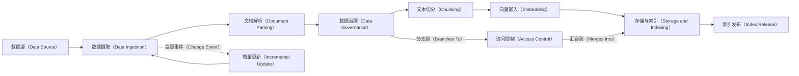
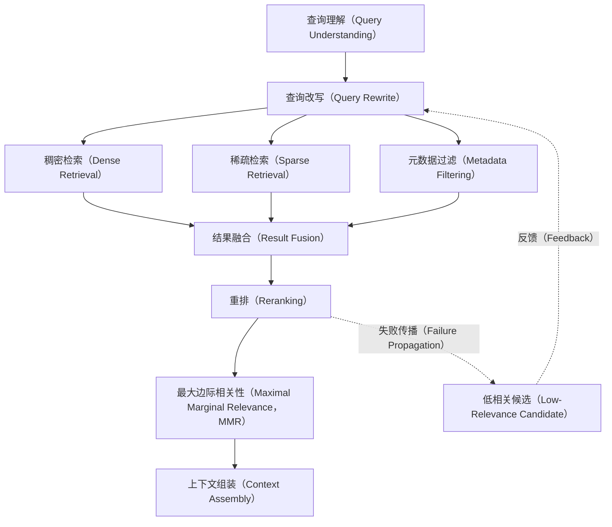
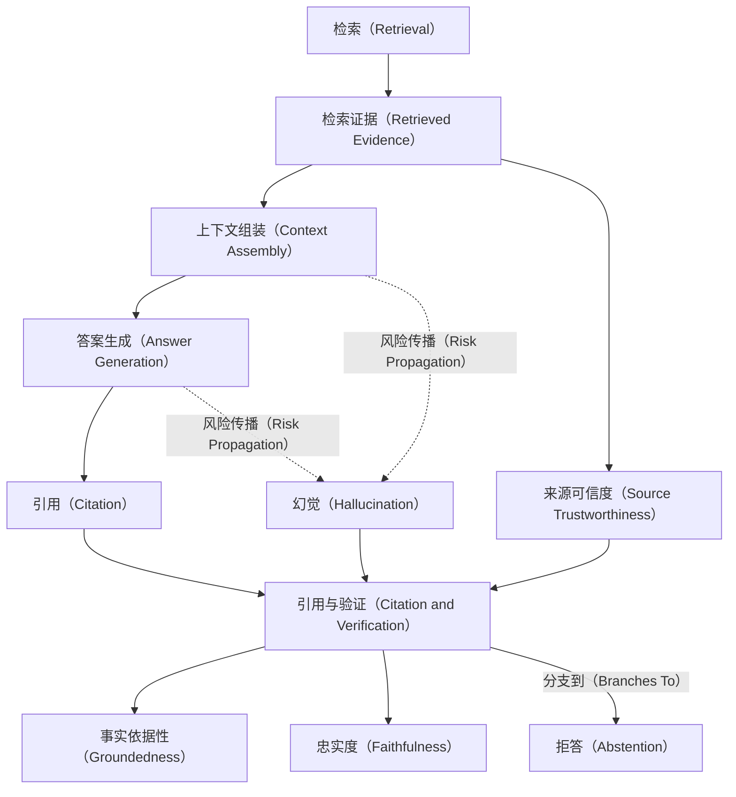
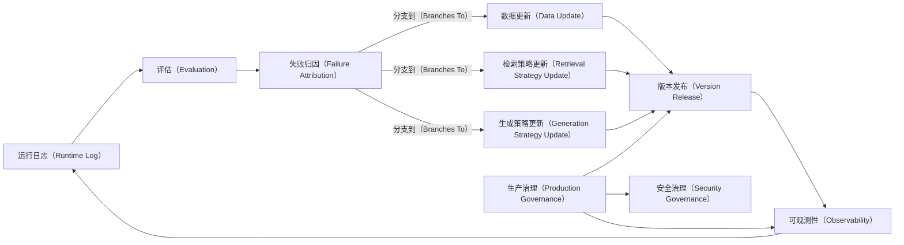
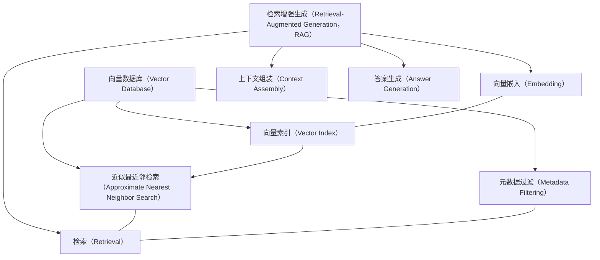
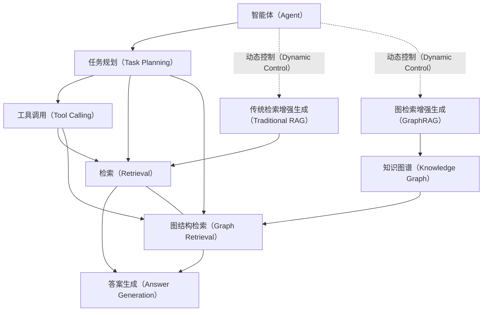
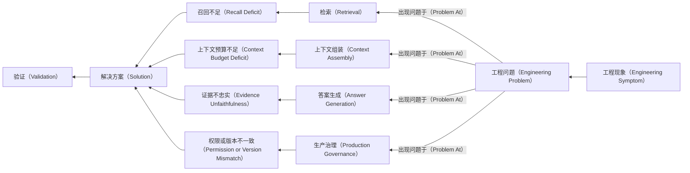

# 关系图集：检索增强生成（Retrieval-Augmented Generation，RAG）可学习骨架版

> 状态：`draft / backbone-v0.1 / 非正式`

图中实线箭头表示正常下游或明确依赖；虚线箭头表示反馈、风险传播或跨主干重叠。图只表达当前已确认架构关系，不替代未来由有向知识图谱（Directed Knowledge Graph）生成的正式视图。

## 1. 离线知识构建主干图（Offline Knowledge Construction Map）

## 2. 在线查询与答案生成主干图（Online Query and Answering Map）

```mermaid
flowchart LR
    UQ["用户问题（User Query）"] --> QU["查询理解（Query Understanding）"] --> QW["查询改写（Query Rewrite）"] --> QT["查询路由（Query Routing）"]
    QT --> RT["检索（Retrieval）"] --> RF["结果融合（Result Fusion）"] --> RK["重排（Reranking）"] --> CA["上下文组装（Context Assembly）"] --> AA["答案生成（Answer Generation）"] --> CV["引用与验证（Citation and Verification）"]
    QT -->|"分支到（Branches To）"| NO["不检索路径（No-Retrieval Path）"]
    NO --> CA
    CV -->|"分支到（Branches To）"| AB["拒答（Abstention）"]
    CV -->|"汇合到（Merges Into）"| OUT["用户输出（User Output）"]
    AB --> OUT
```

## 3. 检索优化局部图（Retrieval Optimization Local Map）

## 4. 答案可信度与幻觉治理图（Answer Trustworthiness and Hallucination Control Map）

## 5. 评估反馈与生产治理图（Evaluation Feedback and Production Governance Map）

## 6. 向量数据库与检索增强生成重叠图（Vector Database and RAG Overlap Map）

## 7. 智能体、图检索增强生成与传统检索增强生成重叠图（Agent, GraphRAG and Traditional RAG Overlap Map）

## 8. 工程问题到故障节点反向定位图（Engineering Problem to Failure-node Diagnosis Map）

继续阅读：[一页式总览](01-one-page-overview.md) | [18 节点概要学习卡](03-stage-cards.md)
