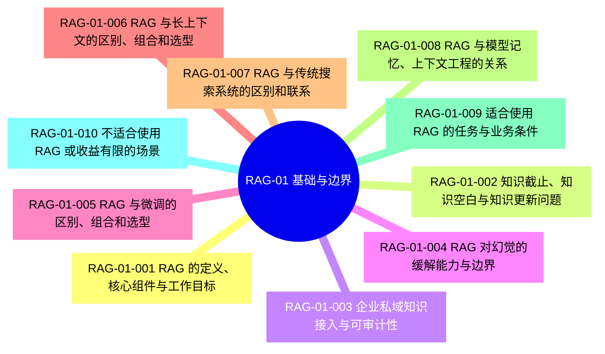

# RAG-01 基础与边界（审计草案）

> 图中每个叶子节点对应原子目录中的一个独立知识点；只有完全同义的来源表述才会合并到同一节点。

```mermaid
mindmap
  root(("RAG-01 基础与边界"))
    RAG_01_001["RAG-01-001 RAG 的定义、核心组件与工作目标"]
    RAG_01_002["RAG-01-002 知识截止、知识空白与知识更新问题"]
    RAG_01_003["RAG-01-003 企业私域知识接入与可审计性"]
    RAG_01_004["RAG-01-004 RAG 对幻觉的缓解能力与边界"]
    RAG_01_005["RAG-01-005 RAG 与微调的区别、组合和选型"]
    RAG_01_006["RAG-01-006 RAG 与长上下文的区别、组合和选型"]
    RAG_01_007["RAG-01-007 RAG 与传统搜索系统的区别和联系"]
    RAG_01_008["RAG-01-008 RAG 与模型记忆、上下文工程的关系"]
    RAG_01_009["RAG-01-009 适合使用 RAG 的任务与业务条件"]
    RAG_01_010["RAG-01-010 不适合使用 RAG 或收益有限的场景"]
```

共 **10** 个原子知识点。来源映射和事实核验状态以 `audits/rag/` 为准。
