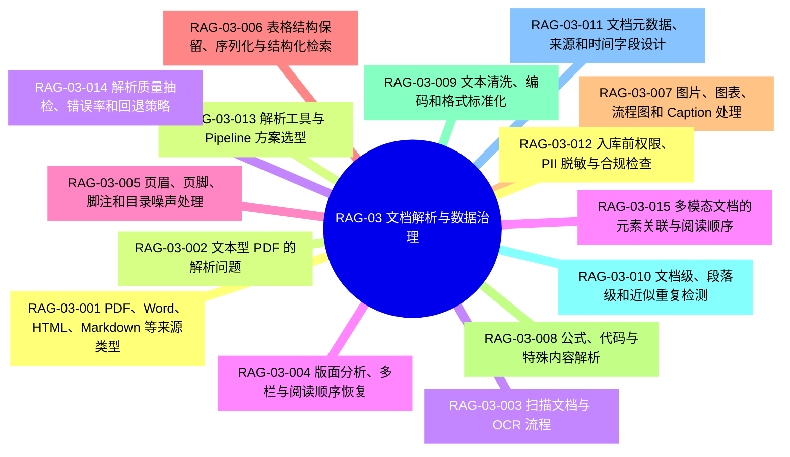

# RAG-03 文档解析与数据治理（审计草案）

> 图中每个叶子节点对应原子目录中的一个独立知识点；只有完全同义的来源表述才会合并到同一节点。

```mermaid
mindmap
  root(("RAG-03 文档解析与数据治理"))
    RAG_03_001["RAG-03-001 PDF、Word、HTML、Markdown 等来源类型"]
    RAG_03_002["RAG-03-002 文本型 PDF 的解析问题"]
    RAG_03_003["RAG-03-003 扫描文档与 OCR 流程"]
    RAG_03_004["RAG-03-004 版面分析、多栏与阅读顺序恢复"]
    RAG_03_005["RAG-03-005 页眉、页脚、脚注和目录噪声处理"]
    RAG_03_006["RAG-03-006 表格结构保留、序列化与结构化检索"]
    RAG_03_007["RAG-03-007 图片、图表、流程图和 Caption 处理"]
    RAG_03_008["RAG-03-008 公式、代码与特殊内容解析"]
    RAG_03_009["RAG-03-009 文本清洗、编码和格式标准化"]
    RAG_03_010["RAG-03-010 文档级、段落级和近似重复检测"]
    RAG_03_011["RAG-03-011 文档元数据、来源和时间字段设计"]
    RAG_03_012["RAG-03-012 入库前权限、PII 脱敏与合规检查"]
    RAG_03_013["RAG-03-013 解析工具与 Pipeline 方案选型"]
    RAG_03_014["RAG-03-014 解析质量抽检、错误率和回退策略"]
    RAG_03_015["RAG-03-015 多模态文档的元素关联与阅读顺序"]
```

共 **15** 个原子知识点。来源映射和事实核验状态以 `audits/rag/` 为准。
