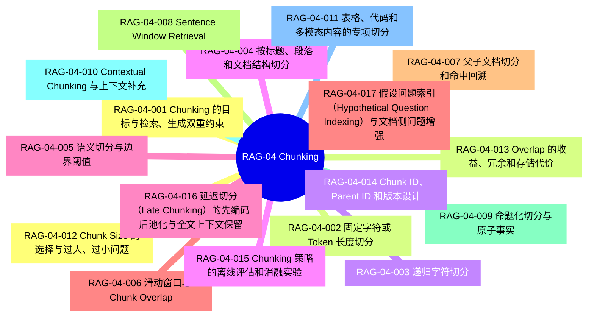

# RAG-04 Chunking（审计草案）

> 图中每个叶子节点对应原子目录中的一个独立知识点；只有完全同义的来源表述才会合并到同一节点。

```mermaid
mindmap
  root(("RAG-04 Chunking"))
    RAG_04_001["RAG-04-001 Chunking 的目标与检索、生成双重约束"]
    RAG_04_002["RAG-04-002 固定字符或 Token 长度切分"]
    RAG_04_003["RAG-04-003 递归字符切分"]
    RAG_04_004["RAG-04-004 按标题、段落和文档结构切分"]
    RAG_04_005["RAG-04-005 语义切分与边界阈值"]
    RAG_04_006["RAG-04-006 滑动窗口与 Chunk Overlap"]
    RAG_04_007["RAG-04-007 父子文档切分和命中回溯"]
    RAG_04_008["RAG-04-008 Sentence Window Retrieval"]
    RAG_04_009["RAG-04-009 命题化切分与原子事实"]
    RAG_04_010["RAG-04-010 Contextual Chunking 与上下文补充"]
    RAG_04_011["RAG-04-011 表格、代码和多模态内容的专项切分"]
    RAG_04_012["RAG-04-012 Chunk Size 的选择与过大、过小问题"]
    RAG_04_013["RAG-04-013 Overlap 的收益、冗余和存储代价"]
    RAG_04_014["RAG-04-014 Chunk ID、Parent ID 和版本设计"]
    RAG_04_015["RAG-04-015 Chunking 策略的离线评估和消融实验"]
    RAG_04_016["RAG-04-016 延迟切分（Late Chunking）的先编码后池化与全文上下文保留"]
    RAG_04_017["RAG-04-017 假设问题索引（Hypothetical Question Indexing）与文档侧问题增强"]
```

共 **17** 个原子知识点。来源映射和事实核验状态以 `audits/rag/` 为准。
