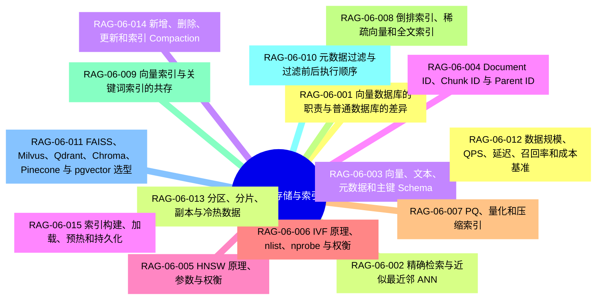

# RAG-06 存储与索引（审计草案）

> 图中每个叶子节点对应原子目录中的一个独立知识点；只有完全同义的来源表述才会合并到同一节点。

```mermaid
mindmap
  root(("RAG-06 存储与索引"))
    RAG_06_001["RAG-06-001 向量数据库的职责与普通数据库的差异"]
    RAG_06_002["RAG-06-002 精确检索与近似最近邻 ANN"]
    RAG_06_003["RAG-06-003 向量、文本、元数据和主键 Schema"]
    RAG_06_004["RAG-06-004 Document ID、Chunk ID 与 Parent ID"]
    RAG_06_005["RAG-06-005 HNSW 原理、参数与权衡"]
    RAG_06_006["RAG-06-006 IVF 原理、nlist、nprobe 与权衡"]
    RAG_06_007["RAG-06-007 PQ、量化和压缩索引"]
    RAG_06_008["RAG-06-008 倒排索引、稀疏向量和全文索引"]
    RAG_06_009["RAG-06-009 向量索引与关键词索引的共存"]
    RAG_06_010["RAG-06-010 元数据过滤与过滤前后执行顺序"]
    RAG_06_011["RAG-06-011 FAISS、Milvus、Qdrant、Chroma、Pinecone 与 pgvector 选型"]
    RAG_06_012["RAG-06-012 数据规模、QPS、延迟、召回率和成本基准"]
    RAG_06_013["RAG-06-013 分区、分片、副本与冷热数据"]
    RAG_06_014["RAG-06-014 新增、删除、更新和索引 Compaction"]
    RAG_06_015["RAG-06-015 索引构建、加载、预热和持久化"]
```

共 **15** 个原子知识点。来源映射和事实核验状态以 `audits/rag/` 为准。
