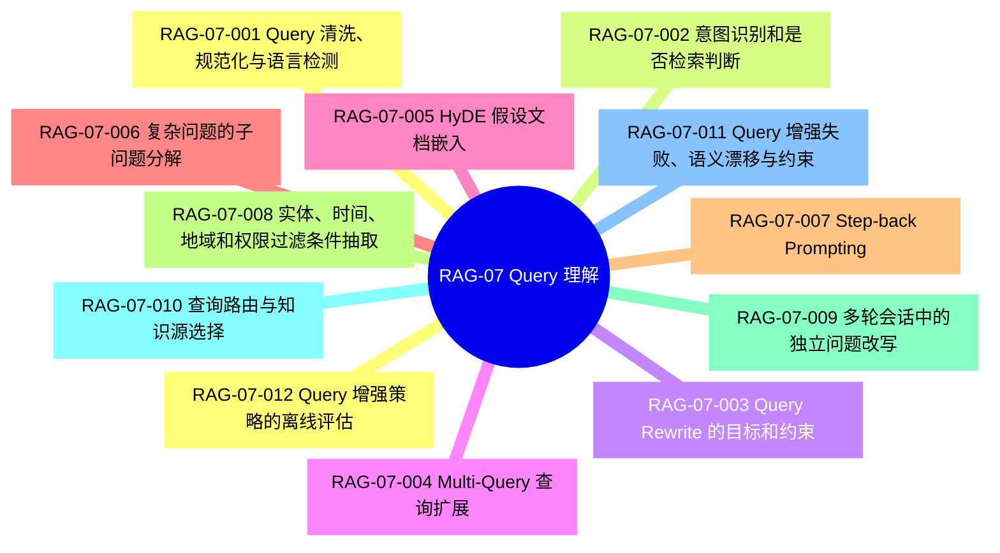

# RAG-07 Query 理解（审计草案）

> 图中每个叶子节点对应原子目录中的一个独立知识点；只有完全同义的来源表述才会合并到同一节点。

```mermaid
mindmap
  root(("RAG-07 Query 理解"))
    RAG_07_001["RAG-07-001 Query 清洗、规范化与语言检测"]
    RAG_07_002["RAG-07-002 意图识别和是否检索判断"]
    RAG_07_003["RAG-07-003 Query Rewrite 的目标和约束"]
    RAG_07_004["RAG-07-004 Multi-Query 查询扩展"]
    RAG_07_005["RAG-07-005 HyDE 假设文档嵌入"]
    RAG_07_006["RAG-07-006 复杂问题的子问题分解"]
    RAG_07_007["RAG-07-007 Step-back Prompting"]
    RAG_07_008["RAG-07-008 实体、时间、地域和权限过滤条件抽取"]
    RAG_07_009["RAG-07-009 多轮会话中的独立问题改写"]
    RAG_07_010["RAG-07-010 查询路由与知识源选择"]
    RAG_07_011["RAG-07-011 Query 增强失败、语义漂移与约束"]
    RAG_07_012["RAG-07-012 Query 增强策略的离线评估"]
```

共 **12** 个原子知识点。来源映射和事实核验状态以 `audits/rag/` 为准。
