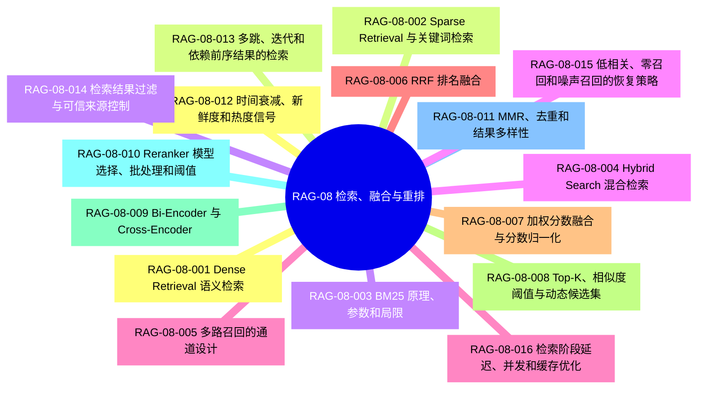

# RAG-08 检索、融合与重排（审计草案）

> 图中每个叶子节点对应原子目录中的一个独立知识点；只有完全同义的来源表述才会合并到同一节点。

```mermaid
mindmap
  root(("RAG-08 检索、融合与重排"))
    RAG_08_001["RAG-08-001 Dense Retrieval 语义检索"]
    RAG_08_002["RAG-08-002 Sparse Retrieval 与关键词检索"]
    RAG_08_003["RAG-08-003 BM25 原理、参数和局限"]
    RAG_08_004["RAG-08-004 Hybrid Search 混合检索"]
    RAG_08_005["RAG-08-005 多路召回的通道设计"]
    RAG_08_006["RAG-08-006 RRF 排名融合"]
    RAG_08_007["RAG-08-007 加权分数融合与分数归一化"]
    RAG_08_008["RAG-08-008 Top-K、相似度阈值与动态候选集"]
    RAG_08_009["RAG-08-009 Bi-Encoder 与 Cross-Encoder"]
    RAG_08_010["RAG-08-010 Reranker 模型选择、批处理和阈值"]
    RAG_08_011["RAG-08-011 MMR、去重和结果多样性"]
    RAG_08_012["RAG-08-012 时间衰减、新鲜度和热度信号"]
    RAG_08_013["RAG-08-013 多跳、迭代和依赖前序结果的检索"]
    RAG_08_014["RAG-08-014 检索结果过滤与可信来源控制"]
    RAG_08_015["RAG-08-015 低相关、零召回和噪声召回的恢复策略"]
    RAG_08_016["RAG-08-016 检索阶段延迟、并发和缓存优化"]
```

共 **16** 个原子知识点。来源映射和事实核验状态以 `audits/rag/` 为准。
