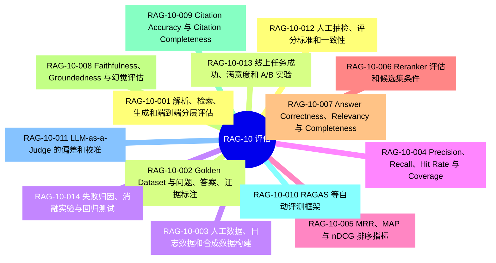

# RAG-10 评估（审计草案）

> 图中每个叶子节点对应原子目录中的一个独立知识点；只有完全同义的来源表述才会合并到同一节点。

```mermaid
mindmap
  root(("RAG-10 评估"))
    RAG_10_001["RAG-10-001 解析、检索、生成和端到端分层评估"]
    RAG_10_002["RAG-10-002 Golden Dataset 与问题、答案、证据标注"]
    RAG_10_003["RAG-10-003 人工数据、日志数据和合成数据构建"]
    RAG_10_004["RAG-10-004 Precision、Recall、Hit Rate 与 Coverage"]
    RAG_10_005["RAG-10-005 MRR、MAP 与 nDCG 排序指标"]
    RAG_10_006["RAG-10-006 Reranker 评估和候选集条件"]
    RAG_10_007["RAG-10-007 Answer Correctness、Relevancy 与 Completeness"]
    RAG_10_008["RAG-10-008 Faithfulness、Groundedness 与幻觉评估"]
    RAG_10_009["RAG-10-009 Citation Accuracy 与 Citation Completeness"]
    RAG_10_010["RAG-10-010 RAGAS 等自动评测框架"]
    RAG_10_011["RAG-10-011 LLM-as-a-Judge 的偏差和校准"]
    RAG_10_012["RAG-10-012 人工抽检、评分标准和一致性"]
    RAG_10_013["RAG-10-013 线上任务成功、满意度和 A/B 实验"]
    RAG_10_014["RAG-10-014 失败归因、消融实验与回归测试"]
```

共 **14** 个原子知识点。来源映射和事实核验状态以 `audits/rag/` 为准。
