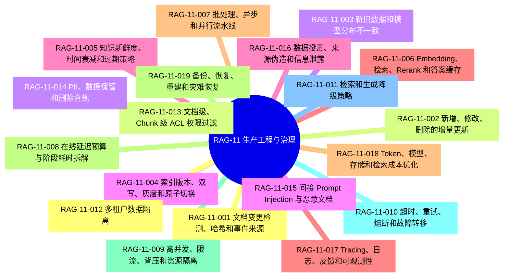

# RAG-11 生产工程与治理（审计草案）

> 图中每个叶子节点对应原子目录中的一个独立知识点；只有完全同义的来源表述才会合并到同一节点。

```mermaid
mindmap
  root(("RAG-11 生产工程与治理"))
    RAG_11_001["RAG-11-001 文档变更检测、哈希和事件来源"]
    RAG_11_002["RAG-11-002 新增、修改、删除的增量更新"]
    RAG_11_003["RAG-11-003 新旧数据和模型分布不一致"]
    RAG_11_004["RAG-11-004 索引版本、双写、灰度和原子切换"]
    RAG_11_005["RAG-11-005 知识新鲜度、时间衰减和过期策略"]
    RAG_11_006["RAG-11-006 Embedding、检索、Rerank 和答案缓存"]
    RAG_11_007["RAG-11-007 批处理、异步和并行流水线"]
    RAG_11_008["RAG-11-008 在线延迟预算与阶段耗时拆解"]
    RAG_11_009["RAG-11-009 高并发、限流、背压和资源隔离"]
    RAG_11_010["RAG-11-010 超时、重试、熔断和故障转移"]
    RAG_11_011["RAG-11-011 检索和生成降级策略"]
    RAG_11_012["RAG-11-012 多租户数据隔离"]
    RAG_11_013["RAG-11-013 文档级、Chunk 级 ACL 权限过滤"]
    RAG_11_014["RAG-11-014 PII、数据保留和删除合规"]
    RAG_11_015["RAG-11-015 间接 Prompt Injection 与恶意文档"]
    RAG_11_016["RAG-11-016 数据投毒、来源伪造和信息泄露"]
    RAG_11_017["RAG-11-017 Tracing、日志、反馈和可观测性"]
    RAG_11_018["RAG-11-018 Token、模型、存储和检索成本优化"]
    RAG_11_019["RAG-11-019 备份、恢复、重建和灾难恢复"]
```

共 **19** 个原子知识点。来源映射和事实核验状态以 `audits/rag/` 为准。
