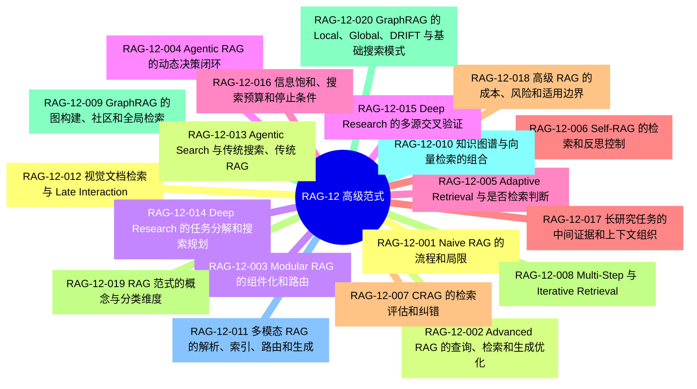

# RAG-12 高级范式（审计草案）

> 图中每个叶子节点对应原子目录中的一个独立知识点；只有完全同义的来源表述才会合并到同一节点。

```mermaid
mindmap
  root(("RAG-12 高级范式"))
    RAG_12_001["RAG-12-001 Naive RAG 的流程和局限"]
    RAG_12_002["RAG-12-002 Advanced RAG 的查询、检索和生成优化"]
    RAG_12_003["RAG-12-003 Modular RAG 的组件化和路由"]
    RAG_12_004["RAG-12-004 Agentic RAG 的动态决策闭环"]
    RAG_12_005["RAG-12-005 Adaptive Retrieval 与是否检索判断"]
    RAG_12_006["RAG-12-006 Self-RAG 的检索和反思控制"]
    RAG_12_007["RAG-12-007 CRAG 的检索评估和纠错"]
    RAG_12_008["RAG-12-008 Multi-Step 与 Iterative Retrieval"]
    RAG_12_009["RAG-12-009 GraphRAG 的图构建、社区和全局检索"]
    RAG_12_010["RAG-12-010 知识图谱与向量检索的组合"]
    RAG_12_011["RAG-12-011 多模态 RAG 的解析、索引、路由和生成"]
    RAG_12_012["RAG-12-012 视觉文档检索与 Late Interaction"]
    RAG_12_013["RAG-12-013 Agentic Search 与传统搜索、传统 RAG"]
    RAG_12_014["RAG-12-014 Deep Research 的任务分解和搜索规划"]
    RAG_12_015["RAG-12-015 Deep Research 的多源交叉验证"]
    RAG_12_016["RAG-12-016 信息饱和、搜索预算和停止条件"]
    RAG_12_017["RAG-12-017 长研究任务的中间证据和上下文组织"]
    RAG_12_018["RAG-12-018 高级 RAG 的成本、风险和适用边界"]
    RAG_12_019["RAG-12-019 RAG 范式的概念与分类维度"]
    RAG_12_020["RAG-12-020 GraphRAG 的 Local、Global、DRIFT 与基础搜索模式"]
```

共 **20** 个原子知识点。来源映射和事实核验状态以 `audits/rag/` 为准。
