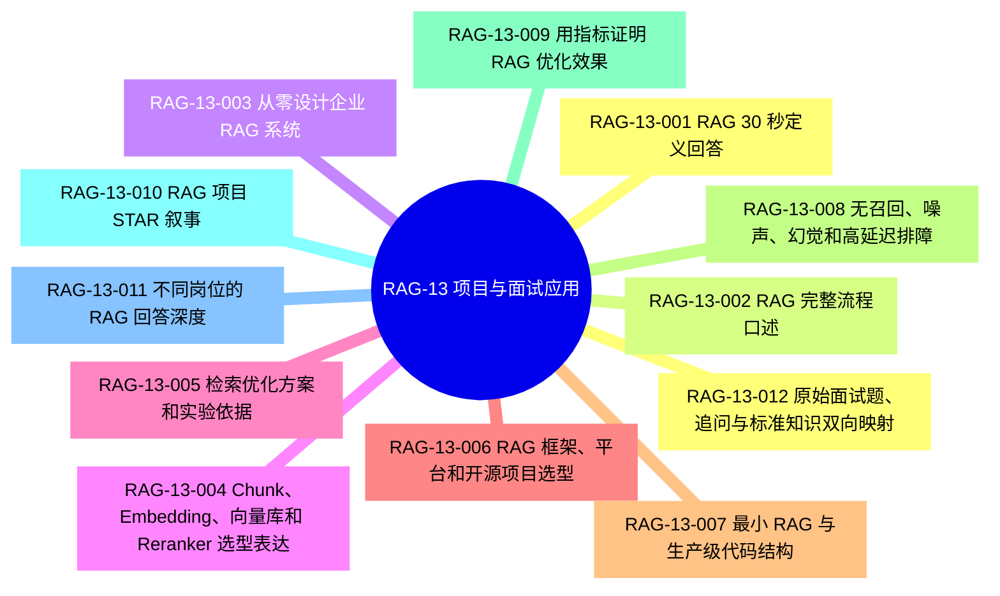

# RAG-13 项目与面试应用（审计草案）

> 图中每个叶子节点对应原子目录中的一个独立知识点；只有完全同义的来源表述才会合并到同一节点。

```mermaid
mindmap
  root(("RAG-13 项目与面试应用"))
    RAG_13_001["RAG-13-001 RAG 30 秒定义回答"]
    RAG_13_002["RAG-13-002 RAG 完整流程口述"]
    RAG_13_003["RAG-13-003 从零设计企业 RAG 系统"]
    RAG_13_004["RAG-13-004 Chunk、Embedding、向量库和 Reranker 选型表达"]
    RAG_13_005["RAG-13-005 检索优化方案和实验依据"]
    RAG_13_006["RAG-13-006 RAG 框架、平台和开源项目选型"]
    RAG_13_007["RAG-13-007 最小 RAG 与生产级代码结构"]
    RAG_13_008["RAG-13-008 无召回、噪声、幻觉和高延迟排障"]
    RAG_13_009["RAG-13-009 用指标证明 RAG 优化效果"]
    RAG_13_010["RAG-13-010 RAG 项目 STAR 叙事"]
    RAG_13_011["RAG-13-011 不同岗位的 RAG 回答深度"]
    RAG_13_012["RAG-13-012 原始面试题、追问与标准知识双向映射"]
```

共 **12** 个原子知识点。来源映射和事实核验状态以 `audits/rag/` 为准。
