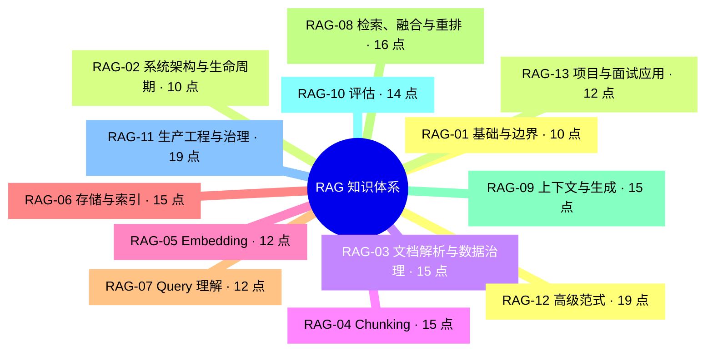

# RAG 全景思维导图（审计草案）

> 本图由原子知识目录自动生成。它保证分类骨架不漏项，但在严格验收通过前不代表正文已经完备。

## 建议学习顺序

1. 先掌握基础、系统流程和数据入口：`RAG-01` → `RAG-04`。
2. 再掌握检索核心：`RAG-05` → `RAG-08`。
3. 然后掌握答案质量与评估：`RAG-09` → `RAG-10`。
4. 再进入生产、安全与高级范式：`RAG-11` → `RAG-12`。
5. 最后用项目设计和面试表达闭环：`RAG-13`。

## 模块子图

- [`RAG-01` 基础与边界](draft-modules/rag-01.md)
- [`RAG-02` 系统架构与生命周期](draft-modules/rag-02.md)
- [`RAG-03` 文档解析与数据治理](draft-modules/rag-03.md)
- [`RAG-04` Chunking](draft-modules/rag-04.md)
- [`RAG-05` Embedding](draft-modules/rag-05.md)
- [`RAG-06` 存储与索引](draft-modules/rag-06.md)
- [`RAG-07` Query 理解](draft-modules/rag-07.md)
- [`RAG-08` 检索、融合与重排](draft-modules/rag-08.md)
- [`RAG-09` 上下文与生成](draft-modules/rag-09.md)
- [`RAG-10` 评估](draft-modules/rag-10.md)
- [`RAG-11` 生产工程与治理](draft-modules/rag-11.md)
- [`RAG-12` 高级范式](draft-modules/rag-12.md)
- [`RAG-13` 项目与面试应用](draft-modules/rag-13.md)
